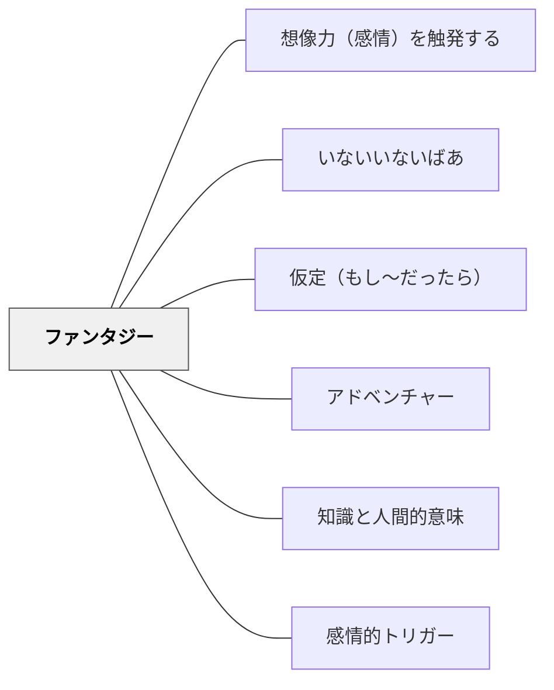

# ファンタジー

> 空想世界への没入が、想像力と認知的道具としての思考力を育てる

## 背景（Context）

イーガンの教育理論において、ファンタジー（空想・幻想）は単なる娯楽ではなく、認知的道具として機能する。子どもが空想世界に没入するとき、そこでは現実の制約を超えた可能性の思考、感情移入、因果の想像が働いている。

## 問題（Problem）

「ファンタジーは非現実的で非教育的だ」という先入観から、学習の場で空想的な思考が排除されることがある。しかし現実的・合理的な学習だけでは、想像力・共感・可能性の思考が育ちにくい。

## 力のかたち（Forces）

- ファンタジーは「現実とは異なるかもしれない」という可能性の思考を活性化する
- 空想世界では、現実では試せない仮定・変形・逆転が自由に行える
- 感情的没入がファンタジーを動かし、学習者のエネルギーを引き出す
- しかしファンタジーと現実の区別がつかなくなることへの配慮も必要である

## 解決（Solution）

カリキュラムの中にファンタジー的要素を意図的に組み込む。歴史学習で「もしあの出来事が別の展開をたどっていたら」と問う。科学学習で「もし重力がなかったら」という思考実験を行う。数学で物語世界の中に数学的問題を埋め込む。

イーガンが提案する「認知的道具」としてのファンタジーを活用し、空想の中でこそ育つ思考力・想像力を、現実の学びへと接続する橋渡しを設計する。

## 結果（Consequences）

学習者の感情的関与と想像力が高まる。「ありえない」可能性を考える力（可能性思考）が育つ。批判的・創造的思考の基礎となる柔軟な発想が促される。ただし、ファンタジーを楽しむことと、そこから現実への学びを引き出すことの両方を意識した設計が必要である。

## 関連パタン

- [[パタン/想像力（感情）を触発する]]
- [[パタン/いないいないばあ]]
- [[パタン/仮定（もし〜だったら）]]
- [[パタン/アドベンチャー]]
- [[パタン/知識と人間的意味]]
- [[パタン/感情的トリガー]]

## クラスター図

## Actionable Insight

- 社会・歴史の授業で「もしあの出来事が別の展開をたどっていたら、今はどうなっていたか？」と問う——仮想の可能性を考える経験が因果関係と歴史的文脈への理解を深める
- 科学の単元で「もし重力がなかったら、地球上ではどんなことが起きる？」という思考実験を5分間行う——制約なく考えるファンタジー的思考が原理への理解を体感的に育てる
- 数学の問題を「魔法の世界の〇〇が困っています」という物語に埋め込んで出す——ファンタジーの文脈が学習への感情的関与を高め問題への取り組みを引き出す

## 出典

キアラン・イーガン（2010）『想像力を触発する教育――認知的道具を活かした授業づくり』北大路書房
