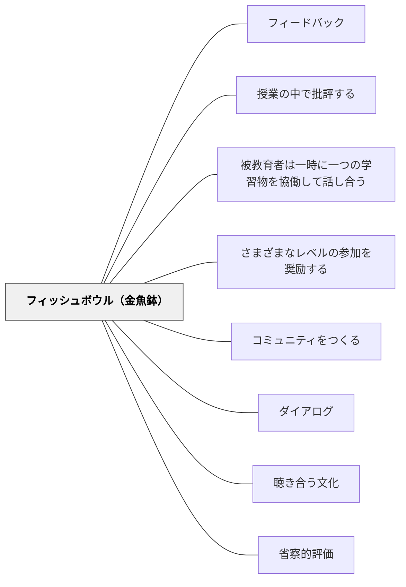

# フィッシュボウル（金魚鉢）

> 内側の魚たちが泳ぐのを、外から見ることで、自分の泳ぎ方を学ぶ。

## 背景（Context）

フィッシュボウル（金魚鉢）は、学習者を内側のグループと外側のグループに分け、内側のグループが対話・議論・作業を行っている間、外側のグループが観察者として学ぶ形式だ。金魚鉢を外から眺めるというメタファーから、この名前がついている。

観察学習（バンデューラのモデリング）の観点からは、実際に行為を行うだけでなく、他者が行為している様子を観察することも、同等かそれ以上の学習効果をもたらすことが示されている。フィッシュボウルはこの原理を活用した構造的な学習形式だ。

## 問題（Problem）

議論や批評・フィードバックのセッションに全員が同時に参加すると、人数が多い場合に参加の機会が均等に行き渡らない。また、参加者全員が同時に「実践者」の立場にいると、「観察者」として俯瞰的に学ぶ機会が失われる。

特に複雑なスキル（フィードバックの与え方・議論の進め方・問題解決のプロセス）を学ぶ際、実際にやってみることと、他者がやっているのを注意深く観察することの両方が必要だ。

## 力のかたち（Forces）

- 内側にいる学習者は観察されていることで緊張を感じることがある
- 外側の観察者が受動的になると学習効果が低下する（観察の指針が必要）
- 役割を交代することで全員が実践者と観察者の両方を経験できる

## 解決（Solution）

クラスを内側の小グループ（4〜6名程度）と外側の観察者に分ける。内側のグループが対話・批評・問題解決などを行っている間、外側の学習者は観察シートを使って特定の側面（「誰がどのようなフィードバックを与えたか」「議論のどの瞬間に突破口が開けたか」）に注目して観察する。

セッション終了後、観察者から気づきを共有する時間を設け、内側のグループへのフィードバックを行う。役割を交代して同じセッションを繰り返すことで、全員が両方の経験を得る。フィッシュボウルは対話のモデリング、フィードバックの実践見学、批評文化の導入など多様な目的に応用できる。

## 結果（Consequences）

- 学習者が実践者と観察者の両方の視点をもつことで、メタ認知的な学びが深まる
- 複雑な対話・批評スキルが具体的なモデルとして共有される
- 小グループの深い議論と全体への共有が両立する

## 関連パタン

- [[パタン/フィードバック]] — 親パタン
- [[パタン/授業の中で批評する]] — フィッシュボウル形式で批評を実施する応用
- [[パタン/被教育者は一時に一つの学習物を協働して話し合う]] — 集中した議論の形式として関連
- [[パタン/さまざまなレベルの参加を奨励する]] — 観察という参加形式を認める文化

- [[パタン/コミュニティをつくる]] — 観察・対話の文化を育てるコミュニティの土台
- [[パタン/ダイアログ]] — 内側の対話を深めるためのダイアログの構造
- [[パタン/聴き合う文化]] — 外側の観察者が内側の対話を注意深く聴く文化
- [[パタン/省察的評価]] — 観察後の振り返りがメタ認知的学習を深める
## クラスター図

## Actionable Insight

- 小グループ（4〜6名）が議論している様子を他のメンバーが「観察シート」に記録しながら見る——観察の焦点を決めることで外側の学習者も能動的に学べる
- 役割を交代して同じ活動を繰り返す——実践者と観察者の両方を経験することで多角的な学びが生まれる
- フィッシュボウル後に観察者から「一番印象に残ったやり取り」を共有する——観察の言語化が複雑なスキルを全体の学習資源にする

## 出典

Brookfield, S. D. & Preskill, S. (1999). *Discussion as a Way of Teaching*. Jossey-Bass.
Barkley, E. F., Cross, K. P., & Major, C. H. (2005). *Collaborative Learning Techniques*. Jossey-Bass.
