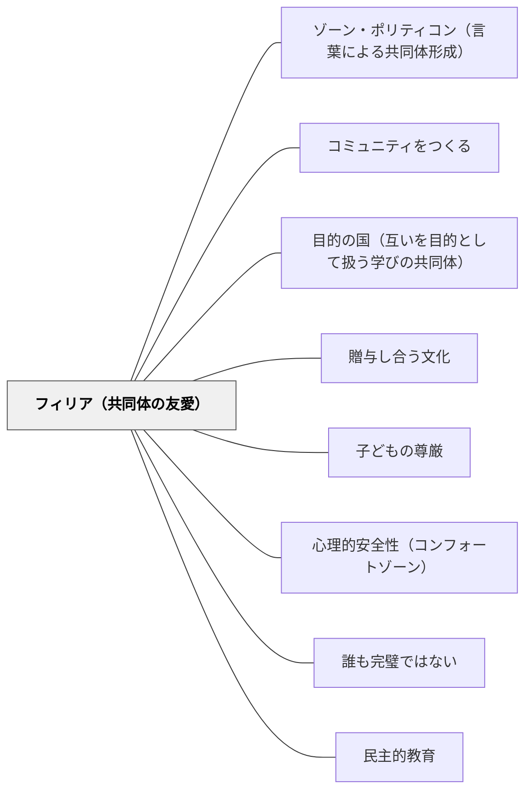

# フィリア（共同体の友愛）

> 共同体というものは友愛によって成立するからである。——アリストテレス（第4巻第11章）

## Pattern Connection

### アリストテレス（前335年頃）——政治学 第4巻第11章

> 「共同体というものは友愛によって成立するからである。」

アリストテレスによれば、**立法者にとって正義よりも友愛（フィリア）の方が重要**である。友愛がある共同体では、正義は自ずと守られる。しかし正義だけを制度化しようとしても、友愛がなければ共同体は成立しない。

フィリアは「好き嫌い」の感情的な友情（personal friendship）とは区別される。アリストテレスは **市民的友愛（civic φιλία）** ——同じ共同体の成員として互いに善を望む態度——をポリスの基盤と見る。

- **既存パタンとの関連**：[[パタン/コミュニティをつくる]] のウェンガーの「共同事業・相互交流・共有の実践」という構造に対し、本パタンはその構造が成立するための前提条件——フィリア（互いの善への関心）——を提供する。[[パタン/目的の国（互いを目的として扱う学びの共同体）]] のカント的「目的として扱う」は、フィリアの哲学的翻訳でもある。
- **補強された点**：「学級崩壊」は規則の不徹底ではなく、フィリアの欠落として理解できる——友愛なき共同体には正義も成立しない。逆に言えば、フィリアを育てることが最も根本的な学級経営である。
- **他のパタンへの波及**：[[パタン/贈与し合う文化]]（贈与はフィリアの実践形態）・[[パタン/子どもの尊厳]]（尊厳への尊重がフィリアの条件）

### アリストテレス（前335年頃）——ニコマコス倫理学 下巻第八・九巻（予告）

ニコマコス倫理学では上巻（第一〜五巻）でフィリアは断片的にしか登場しないが、下巻（第八・九巻）が全面展開する。上巻の解説では重要な予告がある：

> 「じつは人柄の徳一般も高潔さという正義の徳も、小さな頃からの親しい人々のあいだでの相互的な愛（フィリア）のなかで、しだいに発達できるものだということがそこで確認されます」（解説）

- **政治学との接続の深化**：政治学では「共同体はフィリアによって成立する」と言い、立法者にとってフィリアが正義より重要と論じた。ニコマコス倫理学はその根拠を示す——人柄の徳そのものが「親しい人々のあいだの相互的な愛」の中で育つ。フィリアは徳の形成の**媒体**でもある。
- **エソスとの連動**：[[パタン/エソスと習慣形成]] が「行為の反復が性向を形成する」と言うとき、その反復はフィリアのある関係性の中でこそ安全に行われる。フィリアは習慣形成の**環境条件**を提供する。

[[文献/ニコマコス倫理学（上）（アリストテレス）]]

---

## 背景（Context）

学級は「同じ教室にいる子どもたちの集まり」として始まる。そこに関係性を育て、共同体を作るのは教師の重要な仕事である。ルール・役割分担・目標設定など、様々な構造が共同体形成に使われる。しかし構造だけでは共同体は成立しない。

アリストテレスは政治哲学の古典で「共同体は友愛によって成立する」と言い、立法者（教師）にとって正義（ルール）より友愛の方が重要だと主張した。

## 問題（Problem）

学級経営がルール・ペナルティ・ポイント制度といった「正義の制度化」に偏ると、子どもたちが互いに対して友愛（互いの善を望む関心）を持たなくても機能する仕組みが出来上がる。この構造は短期的には秩序を作るが、フィリアなき学級は、制度が崩れたとき（または制度の外にあるとき）に共同体として機能しない。

## 力のかたち（Forces）

- フィリアは制度より根本的——友愛がある共同体では正義（ルール）は自ずと守られる
- しかしフィリアは自然には生まれない——意図的な設計と時間が必要
- 「仲良し」という情緒的友情（個人的フィリア）と「市民的友愛」は異なる——全員が好き同士でなくても市民的友愛は育つ
- 競争・比較・序列の制度はフィリアを侵食する——「あなたの失敗が私の得点」という構造がある学級でフィリアは育ちにくい
- フィリアは対等性を必要とする——極端な権力差（教師-児童の非対称性を超えた支配）はフィリアを妨げる

## 解決（Solution）

**学級の構造（ルール・役割・制度）を設計する前に、フィリア（互いの善を望む市民的友愛）が育つ条件を作る。互いを「競争相手」ではなく「共同体の成員」として経験できる場を繰り返し設ける。**

### フィリアを育てる三つの設計

**① 互いの成功を喜ぶ構造**

競争（一人の成功が他者の相対的失敗）を意図的に避け、「一人の成功が全体の喜び」になる構造を作る。クラス全体のゴール・仲間の努力への拍手・他者の作品への賞賛の文化。

> 実践：「今日一番成長したと思う人を一人挙げてください」——他者の成長を見つけ・喜ぶ習慣がフィリアを育てる。

**② 弱さ・苦手を安全に見せられる文化**

フィリアは「この人が困っているとき、自分が何かできることがある」という経験から育つ。できないこと・苦手なことを「恥」ではなく「仲間が助ける機会」として扱う設計。

> 実践：「わからなくなった人が先生になれる」——つまずきを仲間に助けを求める入口として再定義。

**③ 対話による価値共有**

同じ価値（善い・正しい）を共有した経験がフィリアを強化する。議論・振り返り・物語の共有が「私たちは同じことを大切にしている」という感覚を作る。[[パタン/ゾーン・ポリティコン（言葉による共同体形成）]] との連携。

## 結果（Consequences）

- 規則への依存度が下がる——フィリアがある学級ではルールを言い続けなくても守られる
- 「困ったことを言える」文化が育ち、問題が早期に見えるようになる
- 競争ではなく協働が自然な選択になる
- ただし、フィリアは「全員が仲良し」ではない——意見が衝突しても互いの善を望む関係は維持できる
- フィリアを育てる時間・活動への投資が、後の「管理コスト」を大幅に下げる

## 関連パタン
- [[パタン/政体の原理と教育目標]]
- [[パタン/副次的学習]]

- [[パタン/ゾーン・ポリティコン（言葉による共同体形成）]] — ロゴスによる価値共有がフィリアを深める
- [[パタン/コミュニティをつくる]] — フィリアがコミュニティの感情的基盤
- [[パタン/目的の国（互いを目的として扱う学びの共同体）]] — 互いを目的として扱う＝フィリアの哲学的表現
- [[パタン/贈与し合う文化]] — 贈与（自発的な善意の行為）はフィリアの実践形態
- [[パタン/子どもの尊厳]] — 尊厳への尊重がフィリアの必要条件
- [[パタン/心理的安全性（コンフォートゾーン）]] — 心理的安全性はフィリアが成立している証
- [[パタン/誰も完璧ではない]] — 弱さを見せ合える関係がフィリアを育てる
- [[パタン/民主的教育]] — フィリアに基づく共同体の政治的表現
- [[文献/政治学（上）（アリストテレス）]] — 本パタンの出典

## クラスター図

<!-- cluster: manual -->

## Actionable Insight

- **他者の成長を見つける習慣**：週に一度、「今週のクラスメートの成長を一人選んで一文書く」を続ける——互いの善に関心を向ける習慣がフィリアの基礎
- **困っていることを言える安全**：「わからない」「難しかった」を学習ログに書かせ、教師が価値を認めてフィードバックする——弱さを見せ合える文化の種まき
- **規則の前にフィリアを問う**：新しいルールを作りたくなったとき「このルールがなくても友愛でうまくいく場合は何か」を先に考える——フィリアを優先させる思考習慣

## 出典

アリストテレス、三浦洋一訳（2023）『政治学（上）』光文社古典新訳文庫. 第4巻第11章.

[[文献/政治学（上）（アリストテレス）]]

> 「共同体というものは友愛によって成立するからである。」（第4巻第11章）
