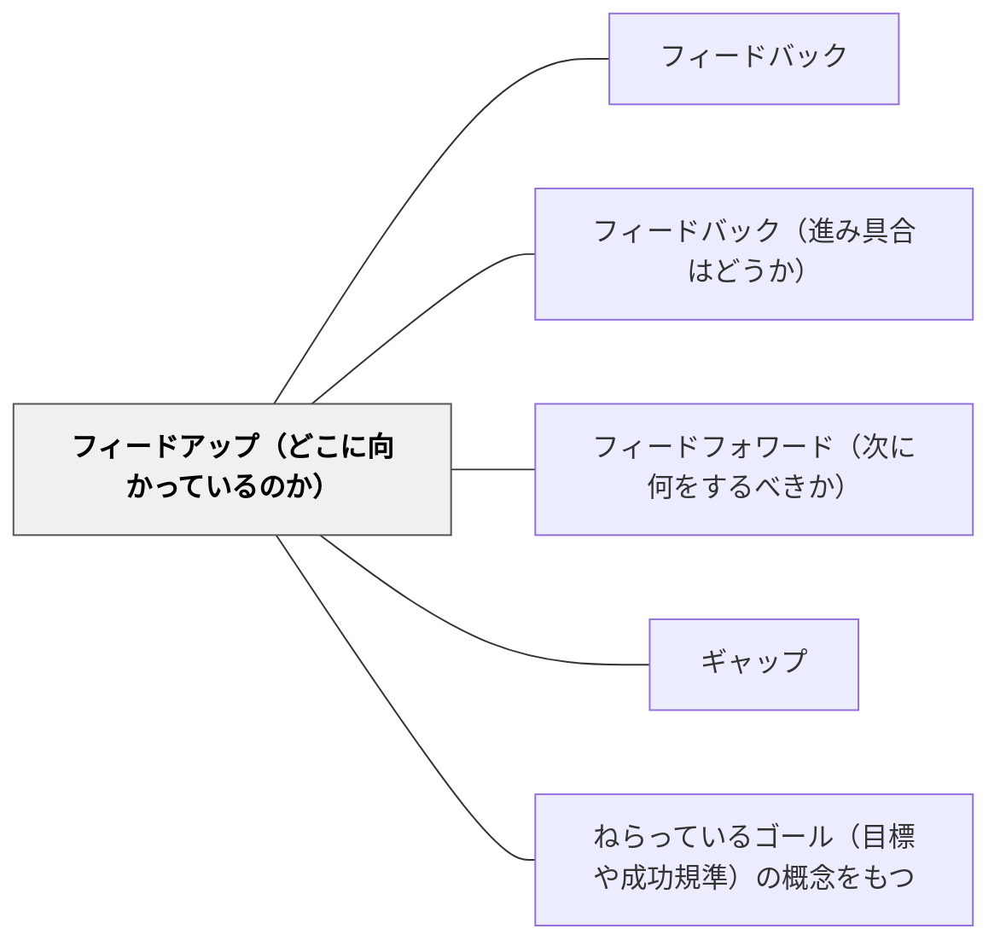

# フィードアップ（どこに向かっているのか）

> フィードバックの前提は「どこへ向かっているか」を知ることである。— ハッティ

## 背景（Context）

ハッティはフィードバックを3方向に分類した。「フィードアップ（Feed Up）」はその最初の方向で、「このタスク・学習はどこへ向かっているのか」（目標・ゴール・達成規準の明確化）を指す。

## 問題（Problem）

目標が不明確なまま学習が進むと、フィードバックを受け取っても「何のために」かが理解できない。フィードアップなき学習は、地図なき旅になる。

## 力のかたち（Forces）

- 目標を共有するだけでなく、学習者が「理解した」かを確認する必要がある
- 目標の粒度（大きすぎる・小さすぎる）がフィードアップの効果を左右する
- 「今日のゴール」と「長期的なゴール」の両方が必要

## 解決（Solution）

**学習の前・途中に「このタスクのゴールは何か」「何ができれば達成か」を学習者と共有・確認する。**

ハッティの3問いの第一：
- 「どこへ向かっているのか？」→ 学習目標・達成規準の明確化
- 「何のためにやっているのか？」→ 目的の共有
- 「どうなれば達成と言えるか？」→ 成功規準の共有

## 結果（Consequences）

- 学習者が学習の方向性を理解した上で取り組むようになる
- フィードバックとフィードフォワードが機能する土台が整う

## 関連パタン

- [[パタン/フィードバック]] — 親パタン
- [[パタン/フィードバック（進み具合はどうか）]] — 第二の方向
- [[パタン/フィードフォワード（次に何をするべきか）]] — 第三の方向
- [[パタン/ギャップ]] — ゴールがあってこそギャップが生まれる
- [[パタン/ねらっているゴール（目標や成功規準）の概念をもつ]] — 同じ概念の別側面

## クラスター図

## Actionable Insight

- 授業の最初に「今日のゴールは○○できるようになること」を板書し、授業の最後に「達成できたか」を1文確認させる——フィードアップが先にあることでその後のフィードバック全体が機能する
- 「今日何ができれば達成と言えるか」を学習者に問い、自分の言葉で答えさせる——ゴールの概念を教師だけでなく学習者が持つことが重要
- 長期的なゴールと「今日のゴール」の両方を教室に掲示する——「今日の一歩がどこにつながるか」が見えることで学習の方向感が持続する

## 出典

- Hattie, J. (2009). *Visible Learning: A Synthesis of Over 800 Meta-Analyses Relating to Achievement*. Routledge.（邦訳：原田信之訳（2018）『教育の効果―メタ分析による学力に影響を与える要因の効果の可視化』図書文化社）
