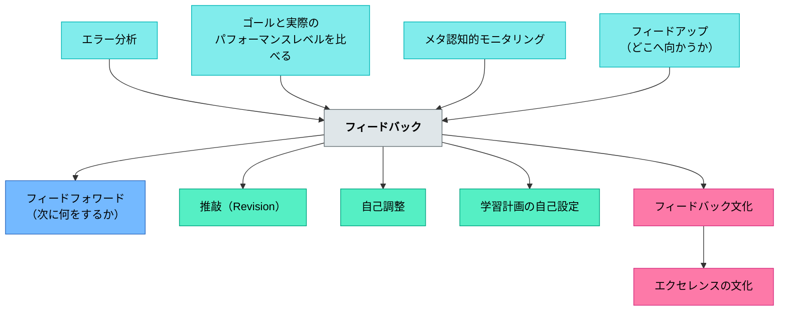

# フィードバック

**一文でいうと**：ゴール、現在地、次の一手を伝え、学習者が改善できる情報を返す。

## 使いどころ・使いすぎ注意

| 観点         | 内容                                 |
| ------------ | ------------------------------------ |
| 使いどころ   | 次の改善行動を明確にしたいとき。     |
| 使いすぎ注意 | 返しすぎると、自己判断の機会を奪う。 |

> 教育者は自らが非教育者へ適切なフィードバックを心がけるとともに、多様なフィードバックを組織せよ。また非教育者や非教育者の作品からのフィードバックを解釈し、教育を修正し続けよ。

## [Pattern Connection]

### プラトン『プロタゴラス』（前387年頃）——罰の目的論：未来のための指導

プラトン『プロタゴラス』（324b〜c）でプロタゴラスは、罰の目的を哲学的に定式化する：

> 「合理的な人間が誰かを罰するとき、それは過去に起きた不正のためではない——なされてしまったことを取り消しはできないのだから——未来のためである。不正を犯した者自身も、それを目撃した者も、再び不正を犯さないようにするために。」（324b〜c）

| 罰の種類 | 目的 | フィードバックとしての性格 |
|--------|------|------------|
| 報復的罰（アンティティモリア） | 過去への返報 | 情報を持たない（改善に使えない） |
| 目的的罰（コラシス） | 未来の改善 | 次の行動を変えるフィードバック |

**既存パタンとの関連**：本パタンの核心「ゴール・現在地・次の一手を伝える」は、プロタゴラスの罰の目的論と同じ構造を持つ——「過去の誤りを責める（報復的）」ではなく「未来の改善のための情報を与える（目的的）」。優れたフィードバックは本質的に「目的的罰（コラシス）」の論理で動いている。

**補強された点**：フィードバックが「指摘・批判・叱責」と混同される場面で、「これは未来の改善のためか、それとも過去の返報か」という問い直しが有効になる。教師が誤りを指摘するとき「この子が将来よりよくなるために何を伝えるか」が出発点になる——これは2400年前の哲学的定式化である。

**波及するパタン**：[[パタン/計量術（メトレーティケー）]] — 誤りを「悪い性格」でなく「計量の誤り（無知）」として扱う視点はフィードバックの設計に直結する；[[文献/プロタゴラス（プラトン）]] — 本統合の出典

---

## 背景（Context）

※旧パタン「評価（フィードバック）」を本ページに統合（2026-06-13）

教育は「意図的に、目的的に、設計・構造化された経験」である。そこには必ず介入があり、介入には反応がある。学習者の作品・声・表情・行動、授業後のアンケート——これらはすべてフィードバックである。ハッティの研究では、フィードバックは学習に最も影響を与える要因の一つとして示されている。

**フィードバックは教育者にも非教育者にも重要な情報を与える。**

非教育者にとって：自信がない・どこへ向かっているのかわからない・どれだけできているか自己評価できない・次に何をすれば良いか新しい目標が分からない——そういう状況を解決する。

教育者にとって：自分の課題を知るきっかけとなり、教育を改善することの助けとなる。

## 問題（Problem）

フィードバックがない、または機能しないと、学習者はどこへ向かっているかも、今どこにいるかも、次に何をすべきかもわからないまま繰り返す。教師も改善の手がかりを得られず、同じ指導を繰り返す。

## 力のかたち（Forces）

- フィードバックの効果は「与えられ方」より「受け取られ方」で決まる（ハッティ）
- 自己レベルへのフィードバック（褒め）はパフォーマンスに対するフィードバックより効果が低い
- 適切な文化的土台（安全・成長マインドセット）がなければフィードバックは機能しない
- フィードバックは他のパタンと組み合わせることで効果が高まる
- フィードバックは「与えられれば終わり」ではない——受け止められたかまで見届ける必要がある

## 解決（Solution）

**ギャップ原則**（サドラー）に基づき、ゴール・現状・次のステップを明確にすることでフィードバックを機能させる。

---

### フィードバックとは何か——ハッティとバルターの定義

**ハッティによる定義**：

> 「フィードバックとは、学習者に関わりを持つ人々——例えば教師・仲間・本・保護者・学習者自身の経験など——から与えられる、学習者の到達状況や理解の程度に関する情報である。」

**ハッティが引用したバルターの定義**：

> 「フィードバックとは、学習者が自身の記憶に保持されている知識を確認し、またその知識に追加したり上書きしたり調整したり再構築したりするために用いられる情報のことである。」

フィードバックは非教育者が**構想を立て・計画し・調整し・再考し**、その結果として現実的でバランスの取れた方法で**自己調整することを助ける**。

---

### 最も効果の高いフィードバック（ハッティ）

ハッティによると、最も効果の高いフィードバックは：

1. **コンピューターによって与えられるもの**（即時性・正確さ）
2. **達成目標と照らし合わせて与えられるもの**（到達基準が明確）
3. **学習者に対して学習を喚起し維持するもの**（動機づけ機能）

→ フィードバックは**学習目標・到達基準が明らかになる時に効果的**だ。

---

### 類推的学習との組み合わせ——アトウェルの実践例

類推的学習を組み合わせることでフィードバックはより効果的になる。類推的学習では非教育者が評価基準を自ら構成し、自己調整を促す。

**ナンシー・アトウェルのライティングワークショップの例**：

優れた物語を読み比べることで、優れた書き手がどのようなことをしているのか、その特徴を生徒たちと構成する。その特徴が生徒が目指す**到達基準**になる。

- その到達基準に照らし合わせて教育者がフィードバックする
- 非教育者は同じ到達基準で**自己評価**もする
- ピアフィードバックの時にも、その到達基準に照らし合わせてフィードバックし合う

到達基準を生徒と共に構成することで、フィードバックが一方向の評価ではなく、学習者自身の自己調整のツールになる。

---

### テストもフィードバックの一つ

テストは多様なフィードバックの一つであり、学習経験だ。非教育者はテストを繰り返すことで到達基準や自分の課題がより明らかになる。エラー分析をして練習することで学習内容をよく理解し、自己修正することができる。

---

### ポートフォリオによるフィードバック

ポートフォリオは元々美術大学で学生が自分の作品をまとめるファイルのことだったと言われている。そこから他の教育にも応用されるようになった。ポートフォリオとして作品をまとめることで非教育者の振り返りを促し、自己評価を助けることができる。**ポートフォリオ評価は類推的学習と合わせることでさらに効果的**になる。

---

### フィードバックは受け止められたかまで見届ける

フィードバックは多様にあれば終わりではない。**フィードバックがどう受け止められたかまで見届け、解釈し、教育を修正し続ける必要がある。**

**教師への教育改善フィードバックの例**：中学校などで1組→2組→3組の順で同じ授業を行う場合、1組でうまくいかなかったところを情報（フィードバック）として受け取り、2組・3組での授業を修正していくことができる。授業がうまくいかなかった経験そのものが次の設計へのフィードバックになる。

---

### ギャップ原則の3要素

| 問い                     | パタン                                              |
| ------------------------ | --------------------------------------------------- |
| どこに向かっているのか？ | [[パタン/フィードアップ（どこに向かっているのか）]] |
| 進み具合はどうか？       | [[パタン/フィードバック（進み具合はどうか）]]       |
| 次に何をするべきか？     | [[パタン/フィードフォワード（次に何をするべきか）]] |

### 達成規準の構築

| パタン                                  | 内容                                 |
| --------------------------------------- | ------------------------------------ |
| [[パタン/達成規準の共同構築]]           | 教育者と被教育者が一緒に規準をつくる |
| [[パタン/脱文脈化された達成規準]]       | 転移できる汎用的な規準               |
| [[パタン/おきまりの学習のねらい]]       | 全員が達成すべき必須目標             |
| [[パタン/多様に想定される学習のねらい]] | 多様な表現が現れる目標               |
| [[パタン/実例を比べて分析する]]         | 作品比較で基準を共同構築する         |
| [[パタン/技術やスキルの実演を分析する]] | 実演分析で何ができれば良いかを可視化 |
| [[パタン/間違ったやり方をする]]         | 対比から基準を浮かび上がらせる       |
| [[パタン/悪い実例を示す]]               | 悪例から基準を引き出す               |
| [[パタン/不備のある実例を示す]]         | 改善点を考えることで基準を構築       |
| [[パタン/振り返りでのねらいの共同構築]] | 学習後の振り返りで達成規準を更新     |
| [[パタン/ジグソーパズル]]               | 優れた実例を分解して組み立て直す     |
| [[パタン/間違いがある達成規準を示す]]   | 誤りを含む規準で批評的思考を育てる   |
| [[パタン/最初から良い例を見て分析する]] | ポジティブな出発点で基準を形成       |

### フィードバックのレベル（ハッティ）

| パタン                                                                                | 内容                                 |
| ------------------------------------------------------------------------------------- | ------------------------------------ |
| [[パタン/自己レベルのフィードバック]]                                                 | 人格・自己への評価（効果が最も低い） |
| [[パタン/パフォーマンスレベルのフィードバック（課題とプロセスと自己調整）]]           | 課題・プロセス・自己調整への評価     |
| [[パタン/自己レベルのフィードバックとパフォーマンスレベルのフィードバックを混ぜない]] | 二つのレベルを分離する               |

### フィードバックの方向性

| パタン                                                          | 内容                                   |
| --------------------------------------------------------------- | -------------------------------------- |
| [[パタン/被教育者からフィードバックを得る]]                     | 学習者の声・作品を情報として活用       |
| [[パタン/被教育者からのフィードバックを利用して教育改善をする]] | 得た情報を授業改善に繋げる             |
| [[パタン/被教育者にフィードバックを提供し理解できるようにする]] | 理解可能な形でフィードバックを届ける   |
| [[パタン/授業後の被教育者から教育者へのフィードバック]]         | 授業後に学習者が教師へ評価する         |
| [[パタン/外部からのフィードバック]]                             | 地域・専門家・コンクールなど外部の基準 |
| [[パタン/ピアフィードバック]]                                   | 仲間同士のフィードバック               |
| [[パタン/ピアコーチング]]                                       | 仲間が継続的にコーチする               |
| [[パタン/全体へのフィードバック]]                               | クラス全体に向けたフィードバック       |
| [[パタン/保護者と他の学校協力者のフィードバック]]               | 保護者・地域からのフィードバック       |

### フィードバック文化の土台

| パタン                                                | 内容                                     |
| ----------------------------------------------------- | ---------------------------------------- |
| [[パタン/共通概念やキャラクター（ナラティブ）の共有]] | フィードバックのための共通言語           |
| [[パタン/達成レベルの役割]]                           | 達成レベルを学習者が理解・内面化する     |
| [[パタン/エクセレンスの文化]]                         | 高い基準への志向                         |
| [[パタン/間違いや失敗から学ぶ文化]]                   | 失敗をフィードバックとして受け取る文化   |
| [[パタン/成長マインドセット]]                         | フィードバックを成長の情報として受け取る |

### 評価・記録ツール

| パタン                            | 内容                               |
| --------------------------------- | ---------------------------------- |
| [[パタン/形成的評価]]             | 学習過程での継続的な評価           |
| [[パタン/総括的評価]]             | 学習終了後の評価                   |
| [[パタン/ルーブリック]]           | 達成規準を多次元で記述した評価表   |
| [[パタン/ポートフォリオファイル]] | 学習成長を記録する作品集           |
| [[パタン/到達レベルの自己評価]]   | 学習者が自分の達成度を評価する     |
| [[パタン/ドキュメンテーション]]   | 学習過程の記録・可視化             |
| [[パタン/作品例を集める]]         | 参照できる作品集をつくる           |
| [[パタン/テストを繰り返す]]       | 想起練習としてのテスト             |
| [[パタン/フィードバックシステム]] | フィードバックを循環させる仕組み   |
| [[パタン/評定（成績評価）]]       | 評定による総括的フィードバック     |
| [[パタン/記述式フィードバック]]   | コメント・文章によるフィードバック |

### 授業中の実践

| パタン                                                                          | 内容                             |
| ------------------------------------------------------------------------------- | -------------------------------- |
| [[パタン/授業中の学習のストップ（批評）]]                                       | 途中で立ち止まり批評する         |
| [[パタン/授業の中で批評する]]                                                   | 学習物を全体で批評する           |
| [[パタン/授業中に学習パートナーが協働して成功を確認し改善案を示す]]             | パートナーと協働で確認・改善     |
| [[パタン/被教育者は一時に一つの学習物を協働して話し合う]]                       | 全員で一つの作品を協働で話し合う |
| [[パタン/無作為の学習物による改善のモデルを示す]]                               | 匿名の作品で改善モデルを見せる   |
| [[パタン/一つ又はそれ以上の成功規準に焦点化し最も良い学習物を探し改善案を示す]] | 最良作を探し改善案を示す         |
| [[パタン/自分の学習物が学級で批評される]]                                       | 本人の作品がクラスで批評される   |
| [[パタン/フィッシュボウル（金魚鉢）]]                                           | 内側の対話を外側が観察する       |
| [[パタン/1対1の面談]]                                                           | 個別カンファランス               |

### フィードバックの形式

| パタン                                          | 内容                                       |
| ----------------------------------------------- | ------------------------------------------ |
| [[パタン/サンドウィッチフィードバック]]         | 良い点→改善点→良い点の順                   |
| [[パタン/大切な友だち（クリティカルフレンド）]] | 批評的な友人として改善を促す               |
| [[パタン/Iメッセージ]]                          | 一人称で感じたことを伝える                 |
| [[パタン/近接賞賛]]                             | 隣の行動を褒めることで誘導する             |
| [[パタン/非随伴的な賞賛]]                       | 行動と無関係な賞賛（効果が低い）           |
| [[パタン/確証フィードバック]]                   | 正しいことを確認するフィードバック         |
| [[パタン/非確証フィードバック]]                 | 誤りを指摘するフィードバック               |
| [[パタン/誤りフィードバック]]                   | 誤りの種類を特定し修正を促す               |
| [[パタン/即時的なフィードバック]]               | タイムリーに与えるフィードバック           |
| [[パタン/意味のある具体的なフィードバック]]     | 漠然とせず具体的で行動可能なフィードバック |

### 誘発・支援

| パタン                      | 内容                             |
| --------------------------- | -------------------------------- |
| [[パタン/想起させる誘発]]   | 既習事項と繋げて解決へ向かわせる |
| [[パタン/足場がけへの誘発]] | ヒント・足場へ誘導する           |
| [[パタン/例示による誘発]]   | 参照できる情報・例を示す         |
| [[パタン/ノートの余白]]     | 話し合いでメモできる余白         |

## 結果（Consequences）

- 学習者が自分の学習を自己調整できるようになる
- 教師が介入の効果を情報として受け取り授業を改善できる
- フィードバックの文化が形成されることで、学習共同体として機能し始める

## このパタンが働く実践
- [[実践/リテラチャー・サークルの起動]]
- [[実践/2列メモ（シンクシート）]]
- [[実践/BDA読解授業の設計]]
- [[実践/ライティング・ワークショップ年度初め]]
- [[実践/リーダーズ・ノートの起動]]

| 実践                                                    | どのように働くか                                               |
| ------------------------------------------------------- | -------------------------------------------------------------- |
| [[実践/カンファリング（読書会議）]]                     | 1対1の対話で、読みの現在地と次の一手を短く返す                 |
| [[実践/ローベルみたいな物語を書こう]]                   | 構想メモや交流会を通して、書き手が次に直す場所を見つける       |
| [[実践/詩を紹介する・詩を創作する]]                     | 付箋コメントや共有で、読み手の反応を次の表現に生かす           |
| [[実践/ノート指導（読み書きハンドブック・ノート検定）]] | 基準を見える形にし、自己評価・教師評価でノートを改善する       |
| [[実践/学習科学の6方略]]                                | 検索練習やエグジットチケットを、理解の状態を返す情報として使う |

## 関連パタン
- [[パタン/コラケイア（おべっか）]]
- [[学級経営/学級経営で使えるパタン]]
- [[教科/算数]]
- [[パタン/1対1の面談]]
- [[パタン/ドキュメンテーション]]
- [[パタン/ピアフィードバック]]
- [[パタン/ポートフォリオファイル]]
- [[パタン/大切な友だち（クリティカルフレンド）]]
- [[パタン/到達レベルの自己評価]]
- [[パタン/問いをもつ視点を指導する]]
- [[教科/国語]]
- [[パタン/S3.公平な待遇（公平感）]]
- [[パタン/おきまりの学習のねらい]]
- [[パタン/ジグソーパズル]]
- [[パタン/ネガティブフィードバック]]
- [[パタン/フィードバックの要請]]
- [[パタン/悪い実例を示す]]
- [[パタン/間違いがある達成規準を示す]]
- [[パタン/間違ったやり方をする]]
- [[パタン/帰属志向性]]
- [[パタン/技術やスキルの実演を分析する]]
- [[パタン/行動を評価する]]
- [[パタン/最初から良い例を見て分析する]]
- [[パタン/最適化]]
- [[パタン/実例を比べて分析する]]
- [[パタン/振り返りでのねらいの共同構築]]
- [[パタン/多様に想定される学習のねらい]]
- [[パタン/脱文脈化された達成規準]]
- [[パタン/被教育者からのフィードバックを利用して教育改善をする]]
- [[パタン/被教育者からフィードバックを得る]]
- [[パタン/不備のある実例を示す]]
- [[パタン/Iメッセージ]]
- [[パタン/アドベンチャー]]
- [[パタン/ギャップ]]
- [[パタン/ゴールドスター]]
- [[パタン/サンドウィッチフィードバック]]
- [[パタン/スタミナを育てる]]
- [[パタン/ソーシャル]]
- [[パタン/テストを繰り返す]]
- [[パタン/ノートの余白]]
- [[パタン/パタンは、フッサールの言う本質と言えるのだろうか。]]
- [[パタン/パフォーマンスレベルのフィードバック（課題とプロセスと自己調整）]]
- [[パタン/ピアコーチング]]
- [[パタン/フィードアップ（どこに向かっているのか）]]
- [[パタン/フィードバック（進み具合はどうか）]]
- [[パタン/フィードバックシステム]]
- [[パタン/フィードフォワード（次に何をするべきか）]]
- [[パタン/フィッシュボウル（金魚鉢）]]
- [[パタン/ポジティブフィードバック]]
- [[パタン/ルーブリック]]
- [[パタン/意味のある具体的なフィードバック]]
- [[パタン/一つ又はそれ以上の成功規準に焦点化し最も良い学習物を探し改善案を示す]]
- [[パタン/外部からのフィードバック]]
- [[パタン/概念型の目標]]
- [[パタン/確証フィードバック]]
- [[パタン/学習のための評価（A4L）]]
- [[パタン/環境調整]]
- [[パタン/間隔学習]]
- [[パタン/記述式フィードバック]]
- [[パタン/共通概念やキャラクター（ナラティブ）の共有]]
- [[パタン/近接賞賛]]
- [[パタン/形成的評価]]
- [[パタン/誤りフィードバック]]
- [[パタン/作品例を集める]]
- [[パタン/自己レベルのフィードバック]]
- [[パタン/自己レベルのフィードバックとパフォーマンスレベルのフィードバックを混ぜない]]
- [[パタン/自己内フィードバック]]
- [[パタン/自分の学習物が学級で批評される]]
- [[パタン/失敗（インストラクション）]]
- [[パタン/主要概念で評価する]]
- [[パタン/授業の中で批評する]]
- [[パタン/授業後の被教育者から教育者へのフィードバック]]
- [[パタン/授業中に学習パートナーが協働して成功を確認し改善案を示す]]
- [[パタン/授業中の学習のストップ（批評）]]
- [[パタン/修正を受け入れる]]
- [[パタン/熟慮的インストラクション]]
- [[パタン/熟慮的動機づけ]]
- [[パタン/熟慮的問い]]
- [[パタン/省察的評価]]
- [[パタン/全体へのフィードバック]]
- [[パタン/想起させる誘発]]
- [[パタン/早期警告]]
- [[パタン/総括的評価]]
- [[パタン/即時的なフィードバック]]
- [[パタン/足場がけへの誘発]]
- [[パタン/達成レベルの役割]]
- [[パタン/達成規準の共同構築]]
- [[パタン/段階的手放し]]
- [[パタン/被教育者にフィードバックを提供し理解できるようにする]]
- [[パタン/被教育者は一時に一つの学習物を協働して話し合う]]
- [[パタン/非確証フィードバック]]
- [[パタン/非随伴的な賞賛]]
- [[パタン/評定（成績評価）]]
- [[パタン/文化をつくる]]
- [[パタン/保護者と他の学校協力者のフィードバック]]
- [[パタン/無作為の学習物による改善のモデルを示す]]
- [[パタン/例示による誘発]]

- [[パタン/自己調整]] — フィードバックを活用した自己調整学習
- [[パタン/可視化]] — フィードバックを可視化する実践
- [[パタン/フィードバック文化]] — フィードバックを支える文化的土台
- [[パタン/エクセレンスの文化]] — 高い基準がフィードバックを意味あるものにする
- [[パタン/類推的学習①]] — 到達基準を共に構成することでフィードバックが機能する
- [[パタン/エラー分析]] — エラーを分析することで次の改善を具体化する
- [[パタン/推敲（Revision）]] — フィードバックを受けて書き直すプロセス
- [[パタン/リーディング・ワークショップ]] — カンファランスでの個別フィードバックが読書の成長を支える
- [[パタン/ライティング・カンファリング]] — 書き手へのフィードバックを個別対話で行う実践
- [[パタン/内発的動機づけ]] — フィードバックの質が内発的動機を高めるか損なうかを左右する
- [[パタン/問い返しのデザイン]] — 問い返しは評価でなく思考を深めるフィードバック
- [[パタン/メタ認知的モニタリング]] — 自分の理解状態を監視することがフィードバックの受け取りを可能にする
- [[パタン/学習計画の自己設定]] — フィードバックを次の計画に組み込む自己調整サイクル
- [[パタン/計量術（メトレーティケー）]] — 誤りを「悪い性格」でなく「計量の誤り（無知）」として扱い直す——フィードバックを報復でなく計量補正として設計する
- [[パタン/フィールドワークの段取り]] — 専門家のツッコミが研究をさらに深める外部フィードバックの典型
- [[パタン/精緻化]] — フィードバックを受けて新旧知識を結びつける精緻化が起きることで定着が深まる
- [[パタン/質問]] — 問いへの応答としてフィードバックが機能する
- [[パタン/テストを作成する]] — 評価設計とフィードバック設計は一体
- [[パタン/教材を改善する]] — フィードバックに基づく教材の継続的改善
- [[パタン/熟慮的教材教具]] — 教材の内容要素としてフィードバックを組み込む親パタン

## クラスター図
<!-- cluster: manual -->

## Actionable Insight

- 授業の最後に「今日の自分の学び：○○ができた / まだできていないのは○○」を1行書かせる——自己フィードバックの習慣が内発的調整を育てる
- 生徒の作品を1つ選び（匿名で）「良いところ1つ・改善点1つ」をクラスで話し合う——ピアフィードバックの入門として最もハードルが低い
- 1組で試した指示・活動がうまくいかなかったら、次のクラスに向けて何を変えるかを一言メモする——教師にとって最もシンプルな形成的フィードバックの活用

## 出典
- [[文献/一つの教育のパタン・ランゲージ]]
- [[文献/みるみる（個別最適な学び）]]

Hattie, J. (2009). _Visible Learning: A Synthesis of Over 800 Meta-Analyses Relating to Achievement_. Routledge.（邦訳：原田信之訳（2018）『教育の効果―メタ分析による学力に影響を与える要因の効果の可視化』図書文化社）  
Sadler, D. R. (1989). Formative assessment and the design of instructional systems. _Instructional Science_, 18(2), 119–144.  
Butler, D. L., & Winne, P. H. (1994). Feedback and self-regulated learning: A theoretical synthesis. _Review of Educational Research_, 65(3), 245–281.（ハッティによる引用）  
Nancie Atwell（ライティングワークショップ・ジャンル学習）  
動画記録：[[文献/フィードバックのパターンリスト（動画記録）]]  
岩井輝久「パタン　フィードバック（動画記録）」https://youtu.be/aUlIgZD7FQI

---

## 下位パタン一覧

| パタン                                                                                | サマリー                                                                                                       |
| ------------------------------------------------------------------------------------- | -------------------------------------------------------------------------------------------------------------- |
| [[パタン/1対1の面談]]                                                                 | 一人ひとりへの言葉だけが、その人の核心に届く。                                                                 |
| [[パタン/おきまりの学習のねらい]]                                                     | 全員が達成すべき、ゆるがぬ基礎的な目標。                                                                       |
| [[パタン/ギャップ]]                                                                   | 効果的なフィードバックの核心は、ゴールと現状のギャップを認識し、埋めることである。— サドラー                   |
| [[パタン/サンドウィッチフィードバック]]                                               | 「よかった点→改善点→よかった点」という順序でフィードバックを構造化する。批評を受け入れやすくする工夫だ…        |
| [[パタン/ジグソーパズル]]                                                             | 優れた作品を切り刻んで組み立てることで、その構造が見えてくる。                                                 |
| [[パタン/テストを繰り返す]]                                                           | テストは学習の終わりではなく、記憶を強化する最良の練習だ。                                                     |
| [[パタン/ノートの余白]]                                                               | ノートに余白を設けることで、学習パートナーとの対話やフィードバックのメモが書き込めるようになる。フィード…      |
| [[パタン/パフォーマンスレベルのフィードバック（課題とプロセスと自己調整）]]           | 課題・プロセス・自己調整への具体的なフィードバックが最も学習改善に効く。— ハッティ                             |
| [[パタン/ピアコーチング]]                                                             | 一回のフィードバック交換を超えて、学習者同士が継続的に互いを支え観察し励ます関係を築く。                       |
| [[パタン/フィッシュボウル（金魚鉢）]]                                                 | 内側の魚たちが泳ぐのを、外から見ることで、自分の泳ぎ方を学ぶ。                                                 |
| [[パタン/フィードバックシステム]]                                                     | 一度のフィードバックは贈り物だ。仕組みとしてのフィードバックは文化だ。                                         |
| [[パタン/ポジティブフィードバック]]                                                   | うまくいっていることを認め、それを強化するフィードバック。改善を求めるフィードバックとの適切なバランスが…      |
| [[パタン/一つ又はそれ以上の成功規準に焦点化し最も良い学習物を探し改善案を示す]]       | すべてを同時に見ようとすると、何も見えない。一つに絞ることで、本質が見えてくる。                               |
| [[パタン/不備のある実例を示す]]                                                       | 「ほぼ良いが、何かが足りない」例が、改善の視点を育てる。                                                       |
| [[パタン/作品例を集める]]                                                             | 「こういうものを作りたい」という憧れは、実物を見るところから始まる。                                           |
| [[パタン/例示による誘発]]                                                             | 「こういう例があるよ」——直接教えるのではなく、参照できる事例・モデルを示すことで、学習者が自分で考えな…        |
| [[パタン/保護者と他の学校協力者のフィードバック]]                                     | 保護者・地域・他の教員・専門家という外部の視点が、学習を内側からでは見えない角度から豊かにする。               |
| [[パタン/全体へのフィードバック]]                                                     | 個人ではなくクラス全体に向けてフィードバックする。共通の傾向・パターンを一度に扱うことで、全員に届く効率…      |
| [[パタン/共通概念やキャラクター（ナラティブ）の共有]]                                 | 安全に批評できるのは、みんなが同じ言葉と物語を共有しているからだ。                                             |
| [[パタン/到達レベルの自己評価]]                                                       | 自分の現在地を知る者だけが、次の一歩を選べる。                                                                 |
| [[パタン/即時的なフィードバック]]                                                     | 行動の直後にフィードバックが届くほど、その情報は学習に活きる。時間が経つほど文脈と記憶が薄れ、フィードバ…      |
| [[パタン/外部からのフィードバック]]                                                   | 学校の内側だけで閉じた評価を超え、コンクール・地域・専門家・保護者といった外部の視点が学習の水準を引き上げる。 |
| [[パタン/多様に想定される学習のねらい]]                                               | 「書き出しを工夫する」という目標に対して、正解は一つではない。                                                 |
| [[パタン/実例を比べて分析する]]                                                       | 良い作品と比較することで、言葉にできない「よさ」が見えてくる。                                                 |
| [[パタン/悪い実例を示す]]                                                             | 「昔おじいさんとおばあさんがいました。終わり。」これはいい物語か？                                             |
| [[パタン/想起させる誘発]]                                                             | 「前に似た問題をやったよね」——答えを教えるのではなく、既習の知識・経験を思い出すことで、学習者が自ら解…        |
| [[パタン/意味のある具体的なフィードバック]]                                           | 「よかった」「もっと頑張れ」ではなく、「この段落の根拠が弱い。具体例を一つ加えると説得力が増す」——行動…        |
| [[パタン/技術やスキルの実演を分析する]]                                               | 「こうやってみせる」ことで、スキルの要素が見えてくる。                                                         |
| [[パタン/授業の中で批評する]]                                                         | 批評は個人を傷つけるためにあるのではなく、作品をより良くするためにある。                                       |
| [[パタン/授業中に学習パートナーが協働して成功を確認し改善案を示す]]                   | 友人から受けるフィードバックは、教師からのそれとは違う温度と説得力がある。                                     |
| [[パタン/授業中の学習のストップ（批評）]]                                             | 学びを止めることで、学びが加速する。                                                                           |
| [[パタン/授業後の被教育者から教育者へのフィードバック]]                               | 教師も学習者である。そして学習者からのフィードバックだけが、授業を内側から変えられる。                         |
| [[パタン/最初から良い例を見て分析する]]                                               | 「これが目指すべき姿」というポジティブなビジョンから始める。                                                   |
| [[パタン/無作為の学習物による改善のモデルを示す]]                                     | 誰のものかを隠すことで、作品だけが語れるようになる。                                                           |
| [[パタン/確証フィードバック]]                                                         | 「その理解で合っています」「そのやり方は正しい方向です」——学習者の方向性と自信を確認するフィードバック。       |
| [[パタン/総括的評価]]                                                                 | 学習の旅が終わったとき、どこまで到達したかを確かめる。                                                         |
| [[パタン/脱文脈化された達成規準]]                                                     | 特定の問題だけに使える規準ではなく、どこでも使える規準を目指す。                                               |
| [[パタン/自分の学習物が学級で批評される]]                                             | 自分の作品がクラスの目にさらされるとき、それが傷つきではなく誇りになるなら、その教室は本物の学習共同体だ。     |
| [[パタン/自己レベルのフィードバック]]                                                 | 「すごいね！」は気持ちを高めるが、学習を改善しない。— ハッティ                                                 |
| [[パタン/自己レベルのフィードバックとパフォーマンスレベルのフィードバックを混ぜない]] | 「すごいね、でもここが…」という組み合わせは、どちらの効果も薄める。                                            |
| [[パタン/被教育者からのフィードバックを利用して教育改善をする]]                       | 学習者から得た情報を使って授業を変えることが、真の双方向フィードバックである。                                 |
| [[パタン/被教育者からフィードバックを得る]]                                           | 学習者の反応・声・作品はすべてフィードバックである。                                                           |
| [[パタン/被教育者にフィードバックを提供し理解できるようにする]]                       | フィードバックは届いてはじめて意味をもつ。理解されないフィードバックは存在しないも同然だ。                     |
| [[パタン/被教育者は一時に一つの学習物を協働して話し合う]]                             | 一つのことに全員が集中するとき、議論の深さはどんな個別学習も超える。                                           |
| [[パタン/ネガティブフィードバック]]                                                   | 改善すべき点を伝えることも、誠実な贈り物である。                                                               |
| [[パタン/主要概念で評価する]]                                                         | 配点の重みで「何が大切か」を示す——最重要の概念を最も高く評価することで学習の優先順位を明示する。               |
| [[パタン/記述式フィードバック]]                                                       | 「B+」ではなく、「この段落の主張は明確だが、根拠が一例しかない。もう一つ追加するとより説得力が増す」と書く。   |
| [[パタン/評定（成績評価）]]                                                           | AやBや1〜5という数値・記号で学習の到達度を表すことは、認定や序列化には便利だが、学習改善の情報として…          |
| [[パタン/誤りフィードバック]]                                                         | 誤りを「悪いもの」としてではなく学習データとして扱い、誤りの種類を特定して種類に応じた修正を促す。             |
| [[パタン/足場がけへの誘発]]                                                           | 答えを与えるのではなく、「ヒントカードを見てみて」「この資料を参考にして」と解決の道具を示す。学習者が自…      |
| [[パタン/近接賞賛]]                                                                   | 目的の行動をしていない学習者を直接注意するのではなく、隣でその行動をしている学習者を褒めることで、間接的…      |
| [[パタン/達成レベルの役割]]                                                           | 「今の自分はどこにいるか」がわかれば、「次にどこへ向かうか」が見える。                                         |
| [[パタン/達成規準の共同構築]]                                                         | 達成規準（成功規準）は、教育者と被教育者が一緒に作ることが望ましい。                                           |
| [[パタン/間違いがある達成規準を示す]]                                                 | 誤りを含む規準を批評することで、批評的思考力と規準の理解が深まる。                                             |
| [[パタン/間違ったやり方をする]]                                                       | わざと間違えることで、正しいやり方との違いが際立つ。                                                           |
| [[パタン/非確証フィードバック]]                                                       | 「そこは間違っています」——誤りを指摘するフィードバック。単なる否定ではなく、修正の方向と組み合わせるこ…        |
| [[パタン/非随伴的な賞賛]]                                                             | 「いつもよくやっているね」という言葉は温かいが、学習改善の情報を持たない。賞賛は行動・パフォーマンスに随…      |
