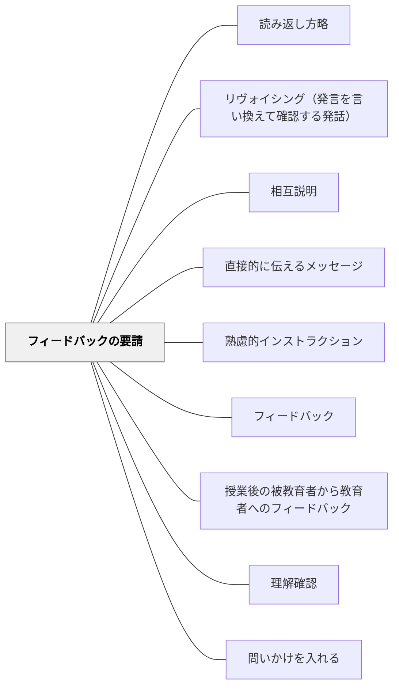

# フィードバックの要請

> 受け手の状態を積極的に把握するために、フィードバックを意図的に求める。

## 背景（Context）
指示や説明を一方的に発するだけでは、受け手が理解したか・困っているかを教師は知ることができない。受け手からのフィードバックを意図的に設計することで、指示・説明の質を動的に改善できる。教育コミュニケーションにおいて、受け手の状態の把握は不可欠な要素である。

## 問題（Problem）
「分かりましたか？」と聞いても「分からない」と言える空気がなければ意味がない。また、受け手から自発的にフィードバックが来ることを待っていては、問題が表面化するのが遅れる。教師が意図的にフィードバックを引き出す仕組みを設計しなければ、理解のずれが積み重なる。

## 力のかたち（Forces）
- フィードバックを求める文化がないと、学習者は「分からない」を言い出せない
- 匿名性が確保されると率直なフィードバックが集まりやすい
- フィードバックを活用する姿を見せることで次のフィードバックが増える
- 求めるフィードバックの形式（口頭・記述・挙手・デジタルなど）で情報の質が変わる

## 解決（Solution）
**「分からなかった人は教えてください」「質問がある人は後で来てください」「今日の授業でもやもやしたことをカードに書いてください」という形で、受け手からのフィードバックを意図的に要請する仕組みを設ける。**
出口カード（Exit Ticket）・挙手・グループでの共有・デジタルツールなど形式を選ぶことで、受け手が参加しやすい方法を使う。フィードバックを受け取ったら必ず次回の指示・説明に反映させ、フィードバックが活かされていることを学習者に伝える。

## 結果（Consequences）
- 教師が学習者の理解状況をリアルタイムに把握できる
- 学習者が「自分の声が届く」という感覚を持ち、参加への動機が高まる
- 指示・説明の質が継続的に改善されるサイクルが生まれる

## クラスター図

## Actionable Insight

- 授業末尾に「今日の授業でもやもやしたことをカードに書いてください」という出口カード（Exit Ticket）を設ける——教師が学習者の理解状況をリアルタイムに把握できる
- 「分からなかった人は後で来てください」という形で率直なフィードバックを引き出す仕組みを作る——学習者が「自分の声が届く」という感覚を持ち参加への動機が高まる
- フィードバックを受け取ったら必ず次回の指示・説明に反映させ学習者に活かされていることを伝える——フィードバックが活かされるサイクルが次のフィードバックを促す

## 出典

- 一つの教育のパタン・ランゲージ（岩井輝久）

## 関連パタン
- [[パタン/読み返し方略]]
- [[実践/ローベルみたいな物語を書こう]]
- [[パタン/リヴォイシング（発言を言い換えて確認する発話）]]
- [[パタン/相互説明]]
- [[パタン/直接的に伝えるメッセージ]]
- [[パタン/熟慮的インストラクション]] — 親パタン
- [[パタン/フィードバック]] — フィードバック全般のパタン
- [[パタン/授業後の被教育者から教育者へのフィードバック]] — 授業後のフィードバック形式
- [[パタン/理解確認]] — 理解を確認する関連パタン
- [[パタン/問いかけを入れる]] — 問いかけによる状態把握
