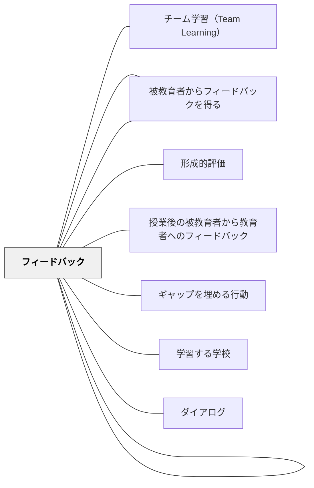

# フィードバックシステム

> 一度のフィードバックは贈り物だ。仕組みとしてのフィードバックは文化だ。

## [Pattern Connection]

**深田浩嗣（2012）再統合（2026-05-20）**：

深田（2012）の「チューニング」（LEVEL 4）は、フィードバックシステムを「理論」から「日次・週次の運用実践」に引き下ろす。

- **既存パタンとの関連**：SengeのフィードバックループはFORCE（なぜ機能するか）を説明する。深田のチューニングはHOW（どう日々実装するか）を提供する。「なぜ」と「どうやって」が揃う。
- **補強された点**：チューニングの3ステップ（①KPIを定める→②データ蓄積・分析→③施策実施→①に戻る）が、形成的評価の実践的な運用モデルになる。怪盗ロワイヤルが**1日平均3回**チューニングを実施するという事実は、「授業後の振り返り」を「次の授業の設計変更」に直結させる感度を教師に要求する。
- **修正・拡張された点**：「一度設計すれば終わり」という思い込みへの対抗。フィードバックシステムは「設計する」のではなく「運用し続けながら育てる」もの。
- **教育版KPIの考え方**：測定する指標が改善の方向を決める。「テストの平均点」を測る教室と「自律的に次の問題に進んだ子の数」「修正した作文の数」を測る教室では、改善の向かう先が根本的に違う。鈴木敏文（セブンイレブン）：「POSデータを見るときは、売れた時間と残った在庫から時間軸で売れ足を読み、顧客の心理を読み取って初めて生きた数字になる」——教室版は「テスト後のデータを時間軸で読み、どこで詰まったかを仮説立てること」。
- **他のパタンへの波及**：[[パタン/可視化]] の「何を可視化するか」がKPI設定と直結する。[[パタン/おもてなし]] のマインドで「なぜここで離脱したか」を問うことが、チューニングの観察眼を育てる。

**授業改善のチューニング3ステップ（深田, 2012 の教育版）**：

```
① KPIを定める
   （何を成功の指標とするか——点数・参加率・自律的な行動・対話の質）
        ↓
② データを蓄積し「なぜ離脱したか」を分析する
   （形成的評価・観察・カンファランス記録が素材）
        ↓
③ 仮説を立て次の授業で施策を実施する
   （小さな変更——指示の言葉・課題の粒度・グループ構成・時間配分）
        ↓（①に戻る）
```

---

**Senge et al.（2000/2012）再統合（2026-05-19）**：

Sengeのシステム思考論は「フィードバックループ」を複雑系を理解する根幹ツールとして位置づける。教育の文脈でのフィードバックシステムに、Sengeのシステム思考的な視点を追加する。

- **補強された点**：教室のフィードバックを「強化ループ（R）」と「バランスループ（B）」という2種類の動的構造として見ることで、フィードバックが「なぜ機能しないか」「なぜスパイラルするか」が構造的に理解できる
- **他のパタンへの波及**：[[パタン/学習する学校]] のシステム・アーキタイプとの接続が明確になる

---

**岩井輝久（2023）——学級は悪循環と善循環がせめぎ合っている**

> 「システム思考というのは、善循環（善いことのループ）をつくるということ。個人でも学級でも学校でも悪循環と善循環がせめぎ合っていることを感じる。悪いことのループを断ち切って、善いことのループを作っていく。それに限るな。パタン・ランゲージはそのために役立つ考え方、方法の一つ。」（岩井輝久、2023）

> 「どのような状況であれ、悪い循環を見定めてそれができるだけ小さくなるように環境調整やら関わりやらしたり、善い循環を増やすために環境調整やら関わりやらする（ここらへんはシステム思考）。学級は悪循環と善循環がせめぎ合っている。少しずつ、少しずつ悪循環を減らし、善循環を増やしていく。どのような状況であれ一貫したものが自分の中にあるというのは大切。その一貫したものが自分の中ではパタン・ランゲージの哲学です。」（岩井輝久、2023）

- **既存パタンとの関連**：SengeのR（強化ループ）とB（バランスループ）という構造的な概念を、教育者の日常的な実践感覚——「学級は悪循環と善循環がせめぎ合っている」——として翻訳している。理論的な枠組みに、教師が毎日感じているリアルな感覚が接続された
- **補強された点**：フィードバックシステムの設計という技術的な問題が、「悪循環を見定め、善循環を増やす」という実践的な方針として整理された。「どのような状況であれ」という普遍性の主張が、フィードバックシステムをすべての学級状況に適用できる大パタンとして位置づける
- **他のパタンへの波及**：[[パタン/環境調整]]（悪循環を小さくし善循環を増やすための具体的手段）・[[自分のパタンを作る]]（パタン・ランゲージの哲学が「どのような状況でも一貫したもの」として機能する基盤）

---

**岩井輝久（2023）——自己ループ：学習者の内部フィードバックシステム**

> 「人には、自分から発して自分に戻ってくる射がある、つまり自己ループがある。教育は、その自己ループの中でも良いものを増やせたり、その良い自己ループとなっている対象を強めたりできる。」（岩井輝久、2023）

- **既存パタンとの関連**：Sengeの強化ループ（R）を個人の内部に適用したのが「自己ループ」だ。外部からのフィードバックが「教師→学習者」という方向を持つのに対して、自己ループは学習者の内側で完結する——「やってみた→振り返った→また試みる」というループが自発的に回り始めると、教師の介入なしに学習が継続する
- **補強された点**：フィードバックシステムの設計目的が明確になった。一時的な外部フィードバックよりも、学習者自身の「自己ループ」を育てることが長期的な目標である。良い自己ループ（成功体験→自己効力感→さらなる挑戦）の対象を特定し、それを強化する環境を作ることが教師の役割だ
- **他のパタンへの波及**：[[パタン/自己調整]]（自己ループが安定することで自己調整サイクルが自走する）・[[パタン/内発的動機付け]]（良い自己ループの中核には内発的動機がある）

---

**岩井輝久（2023）——係活動のフィードバックシステム性**

> 「係活動っていうのは、子どもたちにとって大切なフィードバックシステムなんだな。子どもたちが力を思い切り自分らしく発揮できる場であるからこそ、想定以上に自分の仕事に熱心に取り組むのだと思う。」（岩井輝久、2023）

- **既存パタンとの関連**：係活動は「収集→解釈→改善行動→再評価」というフィードバックサイクルが自然に組み込まれた実践例だ。クラスの仲間の反応（笑った・楽しんだ・困った）が即時のフィードバックとなり、次の活動の改善に直結する
- **補強された点**：なぜ係活動が機能するのかの構造説明が加わった。「自分らしく力を発揮できる」という心理的安全の場で、フィードバックの受け取りやすさが最大化する。想定以上の熱心さは、内発的動機とフィードバックの循環が自走し始めた状態を指している
- **他のパタンへの波及**：[[パタン/ソーシャル]]（係活動は間接的インタラクション——仲間への見せ合いと評価——の典型）・[[パタン/内発的動機付け]]（自分らしく発揮できる場が動機の源泉）・[[パタン/自己調整]]（係活動の継続が自己調整ループを育てる）

---

## 背景（Context）

フィードバックは単発のイベントとして行われるのではなく、収集・解釈・活用・再フィードバックという循環として設計されるとき、最大の効果を発揮する。個々のフィードバックの質も重要だが、それ以上に「フィードバックが継続的に機能する仕組み」があるかどうかが、組織や教室の学習文化を決定づける。

サイバネティクス・システム理論の観点からは、フィードバックループは自己調整システムの根幹であり、学習組織もこの原理で動く。教室を「フィードバックが循環する有機的なシステム」として設計することが、持続的な学習改善を可能にする。

**Sengeのシステム思考における2種類のフィードバックループ**：

**強化ループ（Reinforcing loop / R）**——スノーボール的な増幅。良い方向にも悪い方向にも加速する。
- 例：成功体験 → 自信増加 → チャレンジ → さらなる成功（正のスパイラル）
- 例：失敗体験 → 自信低下 → 回避行動 → さらなる機会損失（負のスパイラル）

**バランスループ（Balancing loop / B）**——目標に向かって揺れながら安定する。サーモスタットと同じ原理。
- 例：目標とのギャップ → フィードバック → 行動修正 → ギャップ縮小

**遅れ（Delay）**——フィードバックが行動に反映されるまでの時間的なズレ。遅れがあると過剰修正が生じ、システムが振動する（フィードバックを与えたのに変化が見えない→さらにフィードバックを増やす→過剰になる）。

## 問題（Problem）

フィードバックが「教師から学習者への一方向の情報伝達」として機能している場合、そのフィードバックが実際に学習改善に活用されたかどうかが確認されない。フィードバックを与えることが目的化し、その後の変化が見えない。

また、教師自身も授業の質を継続的に改善するためのフィードバックを受け取る仕組みがないと、指導の改善が属人的・感覚的なものに留まる。フィードバックが「一回きりの評価」に終わると、システムとしての機能が生まれない。

## 力のかたち（Forces）

- 循環的なフィードバックシステムは設計と維持に時間とエネルギーが必要
- フィードバックが多すぎると学習者が処理しきれず、システムが過負荷になる
- フィードバックの質とタイミングのバランスが、システムの持続性を決める

## 解決（Solution）

フィードバックを「収集→解釈→改善行動→再評価」というサイクルとして設計する。授業レベルでは、学習者の作業の途中でフィードバックを収集し、そのフィードバックを踏まえて改善し、改善後の状態を再評価するというサイクルを組み込む。

単元・学期レベルでは、定期的な形成的評価の結果を記録・分析し、指導の修正に反映させる仕組みをつくる。また、学習者からのフィードバック（授業評価・質問・困り感の共有）が教師の指導改善につながるという双方向のフィードバックループも重要だ。フィードバックの記録を蓄積することで、「以前と比べてどう変わったか」が可視化される。

---

### 因果ループ図（CLD: Causal Loop Diagram）の読み方・作り方（Senge et al.）

CLDは「何がどう影響するか」を矢印と記号で描く、システム構造の可視化ツールである。

**基本要素**：
- **矢印（→）**：原因→結果の関係を示す
- **＋（同方向）**：原因が増えると結果も増える、原因が減ると結果も減る
- **−（逆方向）**：原因が増えると結果は減る、原因が減ると結果は増える
- **R（Reinforcing）**：ループ内に矢印が一回りして戻るとき、強化ループ
- **B（Balancing）**：目標とのギャップを縮めようとする修正ループ

**教室の強化ループの例（正のスパイラル）**：
```
学習成功体験 →＋ 自己効力感 →＋ 挑戦行動 →＋ 学習成功体験
                                                   ↑_____________|
```
（R）このループが動き始めると、一度の成功体験がさらなる挑戦を生む加速が起きる。

**教室の強化ループの例（負のスパイラル）**：
```
学習失敗体験 →＋ 自信低下 →＋ 回避行動 →＋ 機会損失 →＋ 学習失敗体験
```
（R）同じ構造が逆方向に働くと、失敗が回避を生みさらなる失敗を招く悪循環になる。

**教室のバランスループの例（フィードバックによる修正）**：
```
目標とのギャップ →＋ 教師のフィードバック →＋ 学習者の修正行動 →− ギャップ
```
（B）ギャップが大きいほどフィードバックが増え、修正が進み、ギャップが縮む。サーモスタットと同じ構造。

**遅れ（Delay）の問題**：バランスループに「遅れ」が加わると過剰修正が生じる。
- フィードバックを与えたのに変化が見えない → さらにフィードバックを増やす → 過剰になる
- 遅れのあるシステムでは「待つ」判断が重要になる

---

### BOT グラフ（Behavior Over Time）の使い方

BOTグラフはCLDを補完する「時間軸での変化の可視化」ツールである。

- **横軸**：時間
- **縦軸**：注目する変数（学習意欲・テストスコア・欠席率など）
- **目的**：「この変数は過去10年でどう動いたか」「どのタイミングでターニングポイントがあったか」を明らかにする

BOTグラフの使い方（学校・学級での実践）：
1. 「困っていること」を変数として名前をつける（例：「算数の学習意欲」）
2. 「この変数はいつから、どんな形で変化してきたか」を時間軸で描く
3. 別の変数と重ねると因果関係の仮説が見えてくる（例：「学習意欲の低下」と「スモールステップ授業の減少」が同時に起きていないか）

BOTグラフは会議・チームでの問題分析にも使える。「問題の行動（problem behavior）を時間軸で描く」というだけで、問題を構造として見る視点が生まれる。

---

### 学校アーキタイプのCLD例（Senge et al.）

システム思考には繰り返し現れる「構造パターン＝アーキタイプ」がある。

**「応急措置の繰り返し」（Fixes That Fail）**：
- 問題が起きる → 応急措置 → 一時的な解決 → 根本原因は悪化 → 問題が再発・悪化
- 学校例：授業中の荒れ → 叱責 → 一時的鎮静 → 関係悪化 → さらなる荒れ
- CLDで描くと：応急措置（B）と意図しない副作用ループ（R）が絡み合う構造が見える

**「課題のすり替え」（Shifting the Burden）**：
- 根本問題 → 症状 → 応急措置（B）→ 症状の改善 → 根本解決への動機低下（R）→ 根本問題の放置
- 学校例：学力不振（根本問題）→ 授業中の居眠り（症状）→ 補習（応急措置）→ 補習依存の定着 → 自己調整学習力の未発達
- CLDで描くと「本当に解くべき問題がどこにあるか」が見えてくる

**「成功したものがさらに成功する」（Success to the Successful）——教育格差の構造**：

このアーキタイプは、教育の文脈で最も深刻な強化ループを説明する。

構造：
- 2つのグループ（または個人）が同じ限られた資源（教師の注目・難しい課題・機会）を共有する
- どちらか一方がわずかな初期優位（偶然・時期・環境）を得る
- 優位なグループ → より多くの資源 → よりよいパフォーマンス → さらに多くの資源（R）
- 劣位なグループ → より少ない資源 → パフォーマンス低下 → さらに少ない資源（R）
- 結果：2つのグループの差が、個人の努力とは無関係に構造的に拡大し続ける

学校での具体的な現れ方：
- 手を挙げる子どもが教師の問いかけを多く受ける → 発言機会がさらに増える → 思考力の差が広がる
- 「習熟度が高い」と分類された子どもが、より刺激的な課題・より高い期待・より深い対話を得る → 差が固定・拡大する
- 学習遅れが生じた子どもは基礎反復に時間を使い、概念的理解の機会が減る → さらに差が広がる

このアーキタイプの重要な洞察：**格差は「努力しなかった子のせい」ではなく、資源配分の構造によって生み出される**。

修正の方向：Fixes That Fail（努力している側への個別支援）ではなく、資源配分の構造自体を変える。全員が同等にアクセスできる課題設計（[[パタン/算数の公平性]]・[[パタン/複雑指導（Complex Instruction）]]）、意図的なランダム化、ステータス介入（[[パタン/脱トラッキング（De-tracking）]]）がこの構造への介入策になる。

---

### CLDの授業・教師会議での活用

**生徒とのCLD作成**：
- 「なぜ算数が嫌いになるのか？」をクラスで一緒にCLDとして描く
- 「自信のなさ」と「挑戦の回避」が強化ループを作っていることを図で見せる
- 「このループのどこに介入できるか？」を議論する

**教師チームでのCLD活用**：
- 学年・クラスの問題状況をBOTグラフで描いてから会議を始める（「いつから？」「どんな変化？」）
- CLDを描くことで「誰かのせい」でなく「構造のせい」という視点が生まれ、建設的な対話が可能になる
- [[パタン/ダイアログ]] のチェックインと組み合わせると、会議全体がシステム思考的になる

## 結果（Consequences）

- フィードバックが一時的なイベントではなく、持続的な学習改善の仕組みとして機能する
- 教師・学習者双方がフィードバックの送り手と受け手の両方を経験し、評価リテラシーが高まる
- 学習コミュニティ全体がフィードバック文化を育み、組織学習が進む

## 関連パタン
- [[パタン/チーム学習（Team Learning）]]
- [[パタン/被教育者からのフィードバックを利用して教育改善をする]]
- [[パタン/被教育者からフィードバックを得る]]

- [[パタン/フィードバック]] — 親パタン
- [[パタン/形成的評価]] — フィードバックシステムの主要な情報収集手段
- [[パタン/授業後の被教育者から教育者へのフィードバック]] — 双方向フィードバックの実践
- [[パタン/ギャップを埋める行動]] — フィードバックを改善行動に転換する
- [[パタン/学習する学校]] — システム・アーキタイプとCLDの理論的基盤
- [[パタン/ダイアログ]] — CLDを使った問題分析と会議での組み合わせ

## クラスター図



## Actionable Insight

- フィードバックを渡した後に「改善する時間」を授業に組み込む——受け取った情報を行動に転換するサイクルを設計することがフィードバックをシステムにする
- 形成的評価の結果を記録し、翌週の授業で「前回の困り感」を取り上げる——情報が改善に使われるという経験がシステムを文化に変える
- 学習者からの授業フィードバック（エグジットチケット）を分析し、次の授業の最初に「反映した点」を伝える——双方向ループが機能するという実感が教師と学習者の信頼を育てる
- **CLDを試す入口として**：クラスで繰り返している問題（例：授業中の私語が止まらない）を取り上げ、「何が何を増やしているか」を矢印と＋/−で図に描く。構造が見えると「誰かのせい」から「仕組みを変える」への視点の転換が起きる
- **BOTグラフを会議で使う**：次の学年・学級会議の最初に「この1ヶ月で一番変化した変数は何か？」を問い、その変化を時間軸で描く——問題を語る前に「どんな動きをしてきたか」を共有することで、分析が具体的になる

## 出典

Sadler, D. R. (1989). Formative Assessment and the Design of Instructional Systems. *Instructional Science*, 18(2), 119–144.
Wiliam, D. (2011). *Embedded Formative Assessment*. Solution Tree.
Senge, P., Cambron-McCabe, N., Lucas, T., Smith, B., Dutton, J., & Kleiner, A. (2000/2012). *Schools That Learn* (Updated and Revised ed.). Crown Business.

> 「システムは自分の行動について、自分の予測通りの結果を生み出すように設計されている——意図していない結果も含めて」——Senge et al.（2000/2012）
