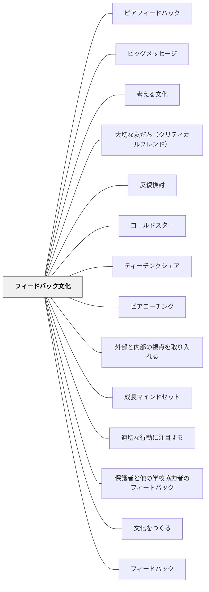

# フィードバック文化

> フィードバックは学習に最も強い影響を与える要因の一つである。しかし、与えられ方よりも受け取られ方の方が、学習の結果に大きく影響する。— ジョン・ハッティ

## 背景（Context）

フィードバックは情報である。「何がうまくいったか」「何をどう改善するか」が伝わることで、学習者は次の一手を知ることができる。しかし、フィードバックは関係性と文化の中で生きる。安全でない文化では、フィードバックは批判として受け取られ、萎縮を生む。

## 問題（Problem）

フィードバックがない文化では、学習者は自分のどこを変えればいいかわからないまま繰り返す。逆にフィードバックが脅威として機能する文化では、学習者は防衛的になり成長が止まる。

## 力のかたち（Forces）

- ハッティの研究：フィードバックの効果は質・タイミング・受け取られ方によって大きく異なる
- フィードバックには4つのレベルがある：タスク・プロセス・自己調整・個人（最後は最も効果が低い）
- 批評文化と羞恥文化は表面上似ているが、学習者に与える影響がまったく異なる

## 解決（Solution）

**フィードバックを「贈り物」として機能させる関係性と規範を育て、定期的なフィードバックのサイクルをルーティン化する。**

ハッティのフィードバックの3つの問い：
1. どこへ向かっているのか？（ゴールの明確化）
2. 今どこにいるのか？（現状の把握）
3. 次はどこへ行けばいいのか？（次のステップ）

実践例：
- 「温かく、具体的で、役立つ批評」のプロトコル
- ピア・フィードバックのルーティン化
- 教師のフィードバックを「直し」ではなく「問い」で与える

## 結果（Consequences）

- 学習者が自分の学習を客観的に見られるようになる（メタ認知）
- 「直してもらう」から「自分で改善する」へシフトする
- フィードバックを求めることが「強さの証」として文化化される

## 関連パタン
- [[学級経営/文化をつくる]]
- [[パタン/ピアフィードバック]]
- [[パタン/ビッグメッセージ]]
- [[パタン/考える文化]]
- [[パタン/大切な友だち（クリティカルフレンド）]]
- [[パタン/反復検討]]
- [[パタン/ゴールドスター]]
- [[パタン/ティーチングシェア]]
- [[パタン/ピアコーチング]]
- [[パタン/内部と外部それぞれの視点を取り入れる]]
- [[パタン/成長マインドセット]]
- [[パタン/適切な行動に注目する]]
- [[パタン/保護者と他の学校協力者のフィードバック]]

- [[パタン/文化をつくる]] — 親パタン
- [[パタン/フィードバック]] — フィードバックの具体的実践
- [[パタン/エクセレンスの文化]] — フィードバックによる作品の改善
- [[パタン/間違いや失敗から学ぶ文化]] — フィードバックの前提としての失敗の受容
- [[パタン/自己調整]] — フィードバックを使った自己調整学習
- [[パタン/レターエッセイ（Letter-Essay）]] — 読んでいる本について教師・友人へ手紙を書き、返事を受け取る往復書簡。フィードバック文化を読書指導の中に日常的に実装した具体例（Atwell, 2016）

## クラスター図

## Actionable Insight

- 批評の前に「温かく・具体的で・役立つ」の3条件を1回クラスで確認する——フィードバックが批判でなく贈り物として機能する文化の出発点
- 教師から学習者へのフィードバックを「直し」でなく「問い」にする——「ここはどうすれば良くなる？」が自己調整を育てるフィードバックの形
- 「フィードバックをもらえた」ことを感謝する規範を作る——求めることが強さの証という文化が育つと学習者の自己開示が増える

## 出典

- ジョン・ハッティ（2009）"Visible Learning"
- 動画記録：[[文献/コミュニティオブプラクティスと文化をつくるパタン（動画記録）]]
