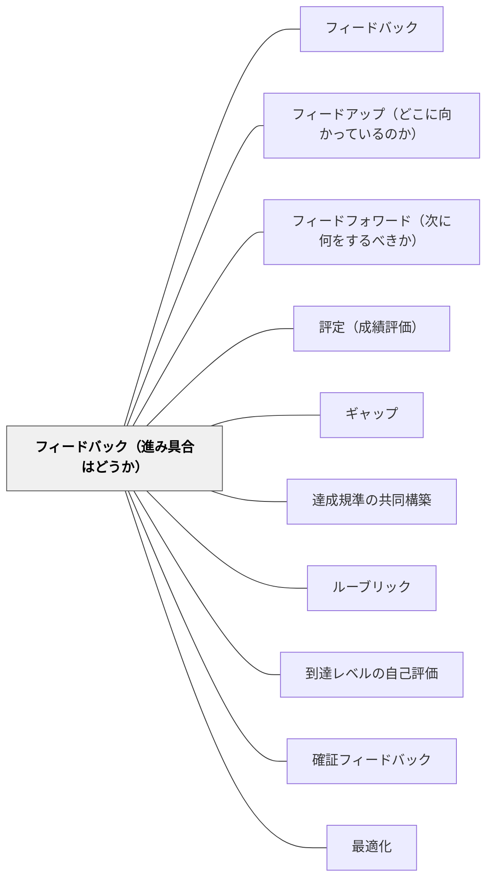

# フィードバック（進み具合はどうか）

> 「今どこにいるか」を知ることで、学習者は自分の位置を把握できる。— ハッティ

## [Pattern Connection]

サドラー（Sadler, 1989）は形成的評価の核を「ゴール・現状・両者のギャップ・ギャップを埋める行動」の4要素モデルで定式化した。ハッティ＆ティンパリー（2007）の3問構成（フィードアップ／フィードバック／フィードフォワード）の中で、本パタン「フィードバック（進み具合はどうか）」が担うのは**「現状の把握」**と、ゴールとの**「比較によるギャップの可視化」**である。

- 単独で「現状」を意識するだけではギャップは生まれない——ゴールと現状を **並べて比較する動作** によって初めてギャップが情報として立ち上がる
- ギャップは [[パタン/ギャップ]] パタンで「学習の駆動力」として扱われる。本パタンはギャップ生成の前段（情報収集と比較）を担う
- 比較の基準（達成規準・ルーブリック・モデル・過去の自分）が用意されていなければ、現状把握は曖昧な「できた気がする」に留まる

## 背景（Context）

※旧パタン「ゴールと実際のパフォーマンスレベルを比べる」を本ページに統合（2026-06-13）

ハッティのフィードバック3方向の第二が「フィードバック（Feed Back）」——「今の進み具合はどうか」という現状確認である。ゴール（フィードアップ）がわかった上で「今どこにいるか」を知ることで、ギャップが明確になる。ゴールの概念を持った学習者は、次に「今の自分はどこにいるか」を把握する必要があり、ゴールと現状を並べて比較することで、ギャップが明確になり、改善のための具体的な情報が生まれる。

## 問題（Problem）

学習者は自分の現状を客観的に把握するのが難しい。「できている気がする」「わかったつもり」という認知の歪みが起きやすく、現状把握のための情報（フィードバック）が必要である。さらに、現状が見えていないと何を改善すべきかわからず、ゴールと現状を別々に意識するだけではギャップは生まれない。二つを「比べる」動作が要る。

## 力のかたち（Forces）

- 現状把握には外部からの情報（教師・仲間・自己評価）が必要
- 自分のパフォーマンスを客観視することは難しく、支援が必要
- 評価の形（テスト・観察・ポートフォリオ）によって見えるものが異なる
- 比較は「批判」になりやすい——「情報」として扱う文化的土台が必要
- ゴールと現状の比較は、過去の自分との比較でも機能する

## 解決（Solution）

**学習者の現在地を様々な方法（自己評価・観察・ルーブリック・テスト・作品確認）で把握し、ゴール（達成規準）と並べて見ることで、ギャップを可視化する。**

具体例：
- 授業中の「わかった？」ハンドシグナル
- 達成規準チェックリストと自分の作品を照合する
- ルーブリックで自己の現在地を確認する
- テストやクイズで現状を測定する
- 優れた実例（モデル）と自分の作品を並べる
- 以前の自分の作品と現在を比べる（ポートフォリオ）

## 結果（Consequences）

- 学習者が自分の現在地を意識して学習を調整できるようになる
- 学習者が改善すべき点を自分で特定できるようになる
- 自己評価の精度が上がり、メタ認知が育つ
- 教師も学習者の状況を把握し、指導を調整できる

## 関連パタン

- [[パタン/フィードバック]] — 親パタン
- [[パタン/フィードアップ（どこに向かっているのか）]] — 第一の方向
- [[パタン/フィードフォワード（次に何をするべきか）]] — 第三の方向
- [[パタン/評定（成績評価）]] — 現状把握を評価として制度化する場面
- [[パタン/ギャップ]] — 比較によって生まれるギャップ
- [[パタン/達成規準の共同構築]] — 比較の基準を作る
- [[パタン/ルーブリック]] — 比較を構造化するツール
- [[パタン/到達レベルの自己評価]] — 比較に基づく自己評価
- [[パタン/確証フィードバック]] — 正しさを確認するための基準
- [[パタン/最適化]] — ギャップ縮小の方向としての最適化

## クラスター図

## Actionable Insight

- 授業の途中で「今日学んだことで一番わかったこと・まだわからないことを1文ずつ書く」時間を2分設ける——現在地の可視化が学習者自身の自己調整を助ける
- 達成規準を黒板に貼り、授業後に「自分は今どのレベルにいるか」を指で指させる——ハンドシグナルや簡単な自己評価で現在地を即座に把握できる
- 達成規準チェックリストを配布し、自分の作品と照合して「できている・まだ」を自分でチェックさせる——二つを並べる動作が「比較」としてギャップを可視化する
- 優れた実例（モデル）と自分の作品を物理的に隣に置き「一番違うところはどこか」と問う——モデルとの比較が批判でなく情報として機能する比較の経験になる
- 以前の自分の作品と現在の作品を並べて「どこが変わったか」を言語化させる——過去の自分との比較がギャップを「批判」でなく「成長」として捉える自己評価の文化をつくる

## 出典

- Hattie, J. (2009). *Visible Learning: A Synthesis of Over 800 Meta-Analyses Relating to Achievement*. Routledge.（邦訳：原田信之訳（2018）『教育の効果―メタ分析による学力に影響を与える要因の効果の可視化』図書文化社）
- Hattie, J., & Timperley, H. (2007). The power of feedback. *Review of Educational Research*, 77(1), 81–112.
- Sadler, D. R. (1989). Formative assessment and the design of instructional systems. *Instructional Science*, 18(2), 119–144.
- 岩井輝久. 一つの教育のパタン・ランゲージ.
