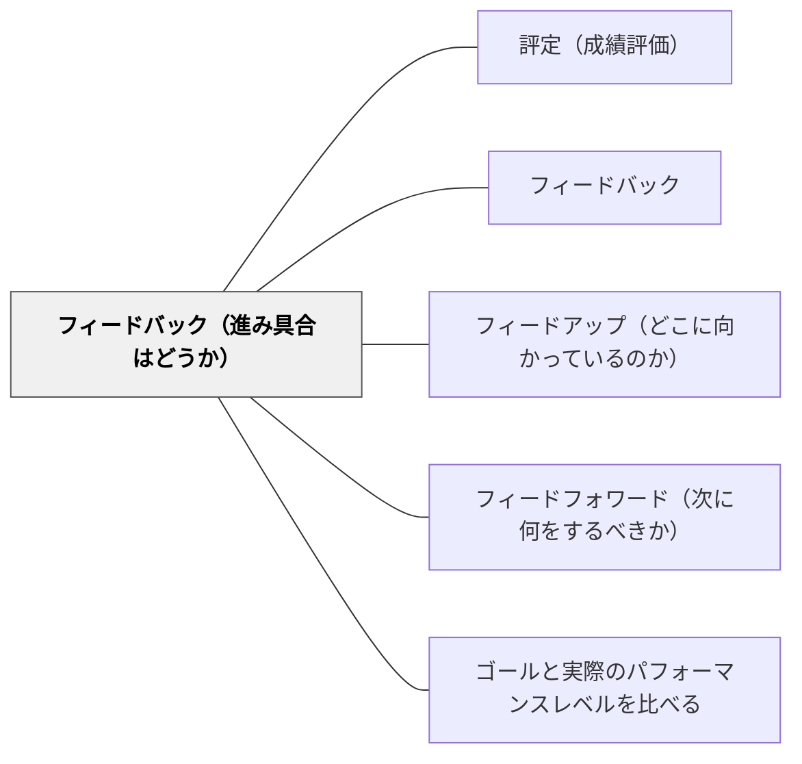

# フィードバック（進み具合はどうか）

> 「今どこにいるか」を知ることで、学習者は自分の位置を把握できる。— ハッティ

## 背景（Context）

ハッティのフィードバック3方向の第二が「フィードバック（Feed Back）」——「今の進み具合はどうか」という現状確認である。ゴール（フィードアップ）がわかった上で「今どこにいるか」を知ることで、ギャップが明確になる。

## 問題（Problem）

学習者は自分の現状を客観的に把握するのが難しい。「できている気がする」「わかったつもり」という認知の歪みが起きやすく、現状把握のための情報（フィードバック）が必要である。

## 力のかたち（Forces）

- 現状把握には外部からの情報（教師・仲間・自己評価）が必要
- 評価の形（テスト・観察・ポートフォリオ）によって見えるものが異なる
- 現状把握が「批判」でなく「情報」として受け取られる文化が必要

## 解決（Solution）

**学習者の現在地を様々な方法（自己評価・観察・ルーブリック・テスト・作品確認）で把握し、その情報を学習者と共有する。**

具体例：
- 授業中の「わかった？」ハンドシグナル
- 作品を達成規準と照合する
- ルーブリックで自己の現在地を確認する
- テストやクイズで現状を測定する

## 結果（Consequences）

- 学習者が自分の現在地を意識して学習を調整できるようになる
- 教師も学習者の状況を把握し、指導を調整できる

## 関連パタン
- [[パタン/評定（成績評価）]]

- [[パタン/フィードバック]] — 親パタン
- [[パタン/フィードアップ（どこに向かっているのか）]] — 第一の方向
- [[パタン/フィードフォワード（次に何をするべきか）]] — 第三の方向
- [[パタン/ゴールと実際のパフォーマンスレベルを比べる]] — 現状把握の実践

## クラスター図

## Actionable Insight

- 授業の途中で「今日学んだことで一番わかったこと・まだわからないことを1文ずつ書く」時間を2分設ける——現在地の可視化が学習者自身の自己調整を助ける
- 達成規準を黒板に貼り、授業後に「自分は今どのレベルにいるか」を指で指させる——ハンドシグナルや簡単な自己評価で現在地を即座に把握できる
- 作品を達成規準と照合させる時間を提出前に1分設ける——自分の作品を基準と比べる習慣がメタ認知と改善志向を育てる

## 出典

- Hattie, J. (2009). *Visible Learning: A Synthesis of Over 800 Meta-Analyses Relating to Achievement*. Routledge.（邦訳：原田信之訳（2018）『教育の効果―メタ分析による学力に影響を与える要因の効果の可視化』図書文化社）
