# フィードフォワード（次に何をするべきか）

> 「次に何をすれば良いか」を示すことが、最も行動変容に繋がるフィードバックである。— ハッティ

## [Pattern Connection]

サドラー（Sadler, 1989）は形成的評価の核を「ゴール・現状・両者のギャップ・**ギャップを埋める行動**」の4要素モデルで定式化した。ハッティ＆ティンパリー（2007）の3問構成（フィードアップ／フィードバック／フィードフォワード）の中で、本パタン「フィードフォワード」が担うのは、サドラーの4要素のうち最後の「ギャップを埋める行動」である。

すなわち、現状とゴールの差を学習者が認識しても、「次に何をすれば良いか」が見えなければ前進できない。フィードフォワードはこのギャップを具体的な改善行動へ転換するための情報であり、形成的評価が機能するための論理的必要条件である。

## 背景（Context）

※旧パタン「ギャップを埋める行動」を本ページに統合（2026-06-13）

ハッティのフィードバック3方向の第三が「フィードフォワード（Feed Forward）」——「次に何をするべきか」という改善への具体的な道筋を示すことである。過去の評価から離れ、未来の行動へ向けることで、フィードバックが改善行動に繋がる。

ギャップを認識しても、何をすれば良いかわからなければ前進できない。効果的なフィードバックは、「こうすれば良くなる」という具体的な行動へのヒントを含んでいる。

## 問題（Problem）

「ここが良くなかった」という評価（フィードバック）だけでは、次に何をすれば良いかが不明確なままになる。学習者が実際に行動を変えるためには、「次にどうするか」という具体的な方向性が必要である。

フィードバックが「ここが悪い」という指摘で終わると、学習者はギャップを認識しても改善に向かえない。批判としてのフィードバックは情報として機能しない。

## 力のかたち（Forces）

- フィードフォワードは具体的で実行可能である必要がある
- 「もっと頑張れ」ではなく「次はここを試してみよう」という形が効果的
- フィードフォワードは学習者が自分で考えることが最も効果的
- 行動は具体的で実現可能でなければ動機づけにならない
- 自己調整能力が高い学習者ほど、フィードバックから行動への変換が速い

## 解決（Solution）

**フィードバックを「次に何をするか」という具体的な行動提案として締めくくる。可能であれば、学習者自身に次のステップを考えさせる。**

形式例：
- 「次は○○を試してみよう」
- 「今度は△△に注目して書いてみて」
- 「この部分をどう改善するか、3つ方法を考えてみよう」

---

実践例（ギャップを行動に変える具体的な手立て）：
- フィードバックを「次のアクション」として言語化する
- リトライ・再提出の機会を保証する
- ペアで改善計画を立てる
- 「一つだけ直すとしたら？」と焦点を絞る

## 結果（Consequences）

- フィードバックが評価から行動変容へ繋がる
- 学習者がフィードバックを「次への情報」として受け取るようになる
- フィードバックが「情報」から「行動」へ転換される
- リビジョン（改訂）の文化が育つ
- 学習者が自分の学習を積極的にコントロールするようになる

## 関連パタン
- [[パタン/ギャップ]] — 埋めるべきギャップ
- [[パタン/意味のある具体的なフィードバック]]
- [[パタン/フィードバック]] — 親パタン
- [[パタン/フィードアップ（どこに向かっているのか）]] — 第一の方向
- [[パタン/フィードバック（進み具合はどうか）]] — 第二の方向
- [[パタン/自己調整]] — フィードフォワードを自分で行う能力／フィードバックを行動に変える能力
- [[パタン/再提出を許す（リトライ・サイクル）]] — 「次に何をするか」の助言を実行できる機会の側。情報と機会の対
- [[パタン/1対1の面談]] — 面談で明らかになったギャップを次の行動につなげる
- [[パタン/テストを繰り返す]] — テスト結果が明らかにしたギャップへの対応
- [[パタン/フィードバックシステム]] — フィードバックを改善行動に転換する
- [[パタン/形成的評価]] — 形成的評価が明らかにしたギャップを行動に転換する
- [[パタン/達成レベルの役割]] — 現在レベルと目標レベルの差を行動に転換する
- [[パタン/被教育者にフィードバックを提供し理解できるようにする]] — 「次に何をすべきか」を具体化することが核心
- [[パタン/間違いや失敗から学ぶ文化]] — リトライを当然とする文化
- [[パタン/AIフィードバックと教師の二重ループ]] — AIの即時フィードバックを「次の一歩」につなぐ。返すだけで終わらせない
- [[パタン/最適なギャップ（願望水準の交渉）]] — 距離が適切であって初めて、次の一手の提案が意味を持つ（Sadler, 1989）

## クラスター図

```mermaid
flowchart LR
    ne38395e382a3e383bce38389e38395e382a9e383afe383bce38389efbc88e6aca1e381abe4bd95e38292e38199e3828be381b9e3818de3818befbc89["フィードフォワード（次に何をするべきか）"]
    ne382aee383a3e38383e38397["ギャップ"]
    ne6848fe591b3e381aee38182e3828be585b7e4bd93e79a84e381aae38395e382a3e383bce38389e38390e38383e382af["意味のある具体的なフィードバック"]
    ne38395e382a3e383bce38389e38390e38383e382af["フィードバック"]
    ne38395e382a3e383bce38389e382a2e38383e38397efbc88e381a9e38193e381abe59091e3818be381a3e381a6e38184e3828be381aee3818befbc89["フィードアップ（どこに向かっているのか）"]
    ne38395e382a3e383bce38389e38390e38383e382afefbc88e980b2e381bfe585b7e59088e381afe381a9e38186e3818befbc89["フィードバック（進み具合はどうか）"]
    ne887aae5b7b1e8aabfe695b4["自己調整"]
    ne5868de68f90e587bae38292e8a8b1e38199efbc88e383aae38388e383a9e382a4e383bbe382b5e382a4e382afe383abefbc89["再提出を許す（リトライ・サイクル）"]
    n31e5afbe31e381aee99da2e8ab87["1対1の面談"]
    ne38386e382b9e38388e38292e7b9b0e3828ae8bf94e38199["テストを繰り返す"]
    ne38395e382a3e383bce38389e38390e38383e382afe382b7e382b9e38386e383a0["フィードバックシステム"]
    ne5bda2e68890e79a84e8a995e4bea1["形成的評価"]
    ne98194e68890e383ace38399e383abe381aee5bdb9e589b2["達成レベルの役割"]
    ne8a2abe69599e882b2e88085e381abe38395e382a3e383bce38389e38390e38383e382afe38292e68f90e4be9be38197e79086e8a7a3e381a7e3818de3828be38288e38186e381abe38199e3828b["被教育者にフィードバックを提供し理解できるようにする"]
    ne99693e98195e38184e38284e5a4b1e69597e3818be38289e5ada6e381b6e69687e58c96["間違いや失敗から学ぶ文化"]

    ne38395e382a3e383bce38389e38395e382a9e383afe383bce38389efbc88e6aca1e381abe4bd95e38292e38199e3828be381b9e3818de3818befbc89 --- ne382aee383a3e38383e38397
    ne38395e382a3e383bce38389e38395e382a9e383afe383bce38389efbc88e6aca1e381abe4bd95e38292e38199e3828be381b9e3818de3818befbc89 --- ne6848fe591b3e381aee38182e3828be585b7e4bd93e79a84e381aae38395e382a3e383bce38389e38390e38383e382af
    ne38395e382a3e383bce38389e38395e382a9e383afe383bce38389efbc88e6aca1e381abe4bd95e38292e38199e3828be381b9e3818de3818befbc89 --- ne38395e382a3e383bce38389e38390e38383e382af
    ne38395e382a3e383bce38389e38395e382a9e383afe383bce38389efbc88e6aca1e381abe4bd95e38292e38199e3828be381b9e3818de3818befbc89 --- ne38395e382a3e383bce38389e382a2e38383e38397efbc88e381a9e38193e381abe59091e3818be381a3e381a6e38184e3828be381aee3818befbc89
    ne38395e382a3e383bce38389e38395e382a9e383afe383bce38389efbc88e6aca1e381abe4bd95e38292e38199e3828be381b9e3818de3818befbc89 --- ne38395e382a3e383bce38389e38390e38383e382afefbc88e980b2e381bfe585b7e59088e381afe381a9e38186e3818befbc89
    ne38395e382a3e383bce38389e38395e382a9e383afe383bce38389efbc88e6aca1e381abe4bd95e38292e38199e3828be381b9e3818de3818befbc89 --- ne887aae5b7b1e8aabfe695b4
    ne38395e382a3e383bce38389e38395e382a9e383afe383bce38389efbc88e6aca1e381abe4bd95e38292e38199e3828be381b9e3818de3818befbc89 --- ne5868de68f90e587bae38292e8a8b1e38199efbc88e383aae38388e383a9e382a4e383bbe382b5e382a4e382afe383abefbc89
    ne38395e382a3e383bce38389e38395e382a9e383afe383bce38389efbc88e6aca1e381abe4bd95e38292e38199e3828be381b9e3818de3818befbc89 --- n31e5afbe31e381aee99da2e8ab87
    ne38395e382a3e383bce38389e38395e382a9e383afe383bce38389efbc88e6aca1e381abe4bd95e38292e38199e3828be381b9e3818de3818befbc89 --- ne38386e382b9e38388e38292e7b9b0e3828ae8bf94e38199
    ne38395e382a3e383bce38389e38395e382a9e383afe383bce38389efbc88e6aca1e381abe4bd95e38292e38199e3828be381b9e3818de3818befbc89 --- ne38395e382a3e383bce38389e38390e38383e382afe382b7e382b9e38386e383a0
    ne38395e382a3e383bce38389e38395e382a9e383afe383bce38389efbc88e6aca1e381abe4bd95e38292e38199e3828be381b9e3818de3818befbc89 --- ne5bda2e68890e79a84e8a995e4bea1
    ne38395e382a3e383bce38389e38395e382a9e383afe383bce38389efbc88e6aca1e381abe4bd95e38292e38199e3828be381b9e3818de3818befbc89 --- ne98194e68890e383ace38399e383abe381aee5bdb9e589b2
    ne38395e382a3e383bce38389e38395e382a9e383afe383bce38389efbc88e6aca1e381abe4bd95e38292e38199e3828be381b9e3818de3818befbc89 --- ne8a2abe69599e882b2e88085e381abe38395e382a3e383bce38389e38390e38383e382afe38292e68f90e4be9be38197e79086e8a7a3e381a7e3818de3828be38288e38186e381abe38199e3828b
    ne38395e382a3e383bce38389e38395e382a9e383afe383bce38389efbc88e6aca1e381abe4bd95e38292e38199e3828be381b9e3818de3818befbc89 --- ne99693e98195e38184e38284e5a4b1e69597e3818be38289e5ada6e381b6e69687e58c96

    classDef hub fill:#f0f0f0,stroke:#555,color:#000,font-weight:bold
    class ne38395e382a3e383bce38389e38395e382a9e383afe383bce38389efbc88e6aca1e381abe4bd95e38292e38199e3828be381b9e3818de3818befbc89 hub
```

## Actionable Insight

- フィードバックの最後を必ず「次は○○を試してみよう」という一文で締める——評価で終わらず行動提案で終わることで、学習者が具体的に動き出せる
- 作品返却時に「次のドラフトで一つだけ改善するとしたら何か」を学習者自身に書かせる——フィードフォワードを自分で考える習慣が自己調整の力を育てる
- 「もっとよくしよう」ではなく「△△の部分を□□のようにしてみよう」と具体的に言い換える——行動可能な提案はフィードバックを行動変容に変える
- 提出物に「再提出OK」を設計し、フィードバックを受けた後に改善版を出す機会を保証する——リトライの文化がフィードバックを「終わり」でなく「始まり」として機能させる
- 「一つだけ直すとしたら？」と学習者自身に焦点を絞らせる——行動を自分で特定する経験が自己調整能力を育てる

## 出典

- Hattie, J. (2009). *Visible Learning: A Synthesis of Over 800 Meta-Analyses Relating to Achievement*. Routledge.（邦訳：原田信之訳（2018）『教育の効果―メタ分析による学力に影響を与える要因の効果の可視化』図書文化社）
- Sadler, D. R. (1989). Formative assessment and the design of instructional systems. *Instructional Science*, 18(2), 119–144.
- 一つの教育のパタン・ランゲージ（岩井輝久）
