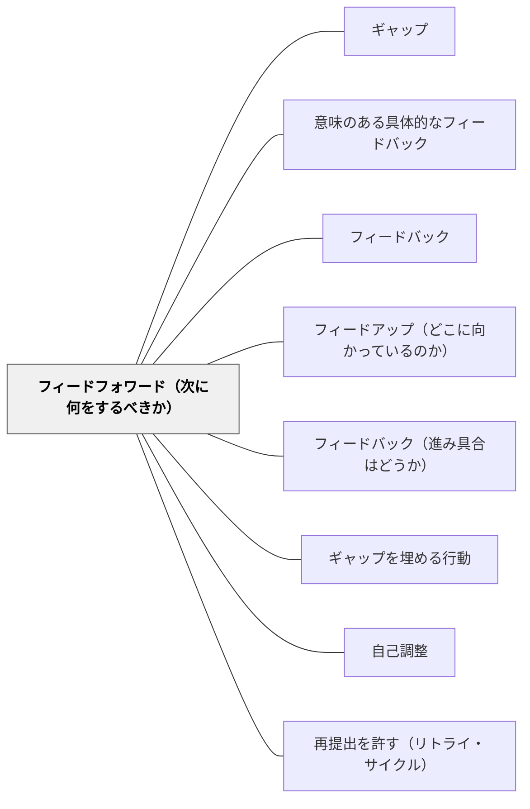

# フィードフォワード（次に何をするべきか）

> 「次に何をすれば良いか」を示すことが、最も行動変容に繋がるフィードバックである。— ハッティ

## 背景（Context）

ハッティのフィードバック3方向の第三が「フィードフォワード（Feed Forward）」——「次に何をするべきか」という改善への具体的な道筋を示すことである。過去の評価から離れ、未来の行動へ向けることで、フィードバックが改善行動に繋がる。

## 問題（Problem）

「ここが良くなかった」という評価（フィードバック）だけでは、次に何をすれば良いかが不明確なままになる。学習者が実際に行動を変えるためには、「次にどうするか」という具体的な方向性が必要である。

## 力のかたち（Forces）

- フィードフォワードは具体的で実行可能である必要がある
- 「もっと頑張れ」ではなく「次はここを試してみよう」という形が効果的
- フィードフォワードは学習者が自分で考えることが最も効果的

## 解決（Solution）

**フィードバックを「次に何をするか」という具体的な行動提案として締めくくる。可能であれば、学習者自身に次のステップを考えさせる。**

形式例：
- 「次は○○を試してみよう」
- 「今度は△△に注目して書いてみて」
- 「この部分をどう改善するか、3つ方法を考えてみよう」

## 結果（Consequences）

- フィードバックが評価から行動変容へ繋がる
- 学習者がフィードバックを「次への情報」として受け取るようになる

## 関連パタン
- [[パタン/ギャップ]]
- [[パタン/意味のある具体的なフィードバック]]

- [[パタン/フィードバック]] — 親パタン
- [[パタン/フィードアップ（どこに向かっているのか）]] — 第一の方向
- [[パタン/フィードバック（進み具合はどうか）]] — 第二の方向
- [[パタン/ギャップを埋める行動]] — フィードフォワードが促す行動
- [[パタン/自己調整]] — フィードフォワードを自分で行う能力
- [[パタン/再提出を許す（リトライ・サイクル）]] — 「次に何をするか」の助言を実行できる機会の側。情報と機会の対

## クラスター図

## Actionable Insight

- フィードバックの最後を必ず「次は○○を試してみよう」という一文で締める——評価で終わらず行動提案で終わることで、学習者が具体的に動き出せる
- 作品返却時に「次のドラフトで一つだけ改善するとしたら何か」を学習者自身に書かせる——フィードフォワードを自分で考える習慣が自己調整の力を育てる
- 「もっとよくしよう」ではなく「△△の部分を□□のようにしてみよう」と具体的に言い換える——行動可能な提案はフィードバックを行動変容に変える

## 出典

- Hattie, J. (2009). *Visible Learning: A Synthesis of Over 800 Meta-Analyses Relating to Achievement*. Routledge.（邦訳：原田信之訳（2018）『教育の効果―メタ分析による学力に影響を与える要因の効果の可視化』図書文化社）
