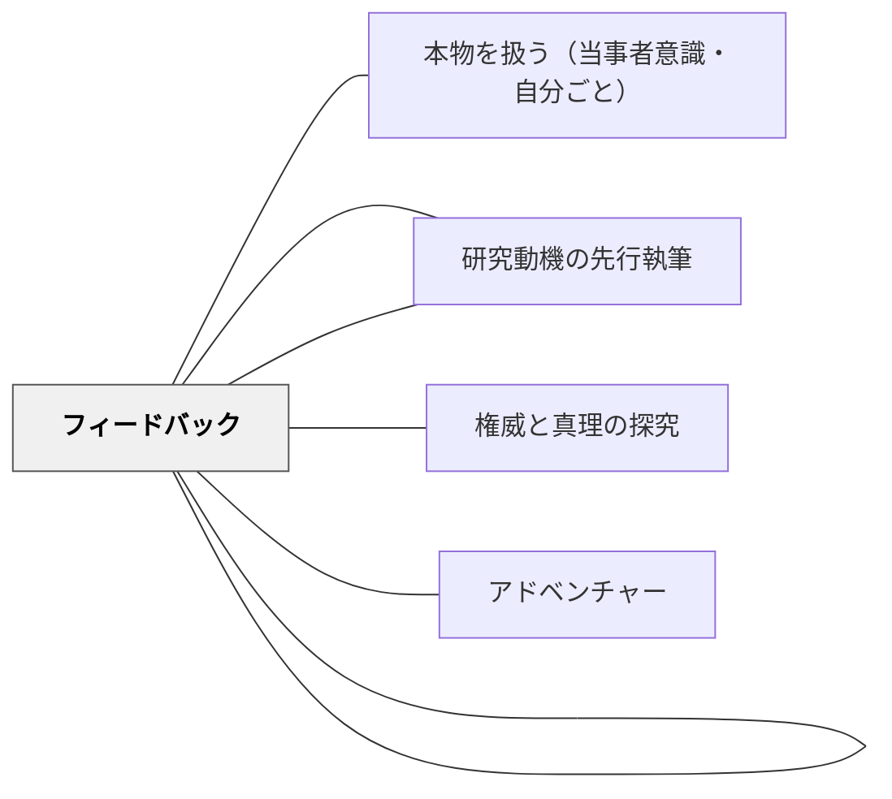

# フィールドワークの段取り

> 専門家に取材するには、「学ぶ→連絡→申込→実施→記録→感謝」の6ステップを踏む。段取りを知ることで、子どもでも本物の現場にアクセスできる。

---

## Pattern Connection

**卒業論文のデザイン（片岡則夫, 2025）統合（2026-05-27）：**

清教学園中学校の論文指導ガイドブック第4章「フィールドワーク」より統合する。

- **既存パタンとの関連**：[[パタン/本物を扱う（当事者意識・自分ごと）]] の「本物に触れることで学びが変わる」という原則を、専門家取材という具体的な手続きで実現するパタン
- **補強された点**：[[パタン/権威と真理の探究]] の「権威ある人物から直接学ぶ」という営みを、子どもが実行できるよう段取り化した形
- **他のパタンへの波及**：[[パタン/研究ピース]] — FWの記録もピース形式（まくら＋引用（インタビュー記録）＋コメント）で論文に統合される

---

## 背景（Context）

探究学習では「現地調査・専門家取材をしてみましょう」と言われても、何から始めればいいかわからない子どもが多い。「連絡先は？」「手紙って何を書くの？」「インタビューはどうやって記録するの？」という不安が、フィールドワークへの参加を妨げる。

一方、専門家取材は図書館の本にはない「生きた情報」を得られる唯一の方法であり、論文の独自性を生む核心だ。清教学園では、取材を「6ステップの段取り」として明示することで、中学生でも実際に専門家の研究室や施設を訪問できるようになった。

## 問題（Problem）

大人でさえ初めての取材は難しい。子どもが「専門家に手紙を書いて取材申込をする」などの行為は、手順を知らなければ「無礼になりそうで怖い」という心理障壁がある。

また、取材ができても記録の仕方が不十分だと、論文に統合できないまま終わってしまう（「楽しかった」だけの経験になる）。

## 力のかたち（Forces）

- 取材前に「その専門家の分野について学ぶ」ことが礼儀であり、学ぶことで良い質問ができるようになる
- 手紙には「誰が・なぜ取材したいか・いつ頃・どんな方法で」を明記することで、返信率が上がる
- インタビュー記録は「Q&A形式」ではなく「雑誌のインタビュー記事」を模範にする——会話の雰囲気・場の描写も含めて記録する
- 記録したFWはピース形式（まくら＋インタビュー引用＋コメント）で論文に組み込む

## 解決（Solution）

**専門家取材を「学ぶ→連絡先調査→申込手紙→取材実施→記録→お礼」の6ステップとして段取り化し、各ステップの具体的な手順を知ることで、子どもでもフィールドワークを完遂できるようにする。**

---

### 専門家取材6ステップ

#### Step 1：取材先を決め、事前に学ぶ

- テーマに関連する「分野の専門家・現場の担当者」を探す（本の著者・施設・研究機関など）
- 先に本や資料で「その人の研究・仕事」について学んでおく——学ぶことで良い質問が生まれ、取材当日の会話が深まる

#### Step 2：連絡先を調べる

- 機関のWebサイト・本の奥付・学校図書館のリブラリアンに相談する
- 個人の自宅住所は不可。機関（大学・研究所・施設）の住所を使う

#### Step 3：取材申込の手紙を送る

取材申込手紙には以下の要素を含める：

| 要素 | 内容 |
|------|------|
| 宛名 | 〇〇大学〇〇学部 〇〇先生（フルネーム）|
| 自己紹介 | 学校名・学年・自分の名前 |
| 論文テーマ | 何についての研究か |
| 取材を申し込む理由 | なぜこの方に聞きたいか（具体的な理由） |
| 取材したい内容（質問リスト） | 3〜5個の事前質問 |
| 希望の取材方法 | 訪問・メール・オンラインのどれか |
| 希望の時期 | ○月中 など |
| 連絡先 | 学校のメールアドレス または 保護者連絡先 |
| 著者サイン | 自筆のサイン |

**ポイント**：「この研究をするきっかけ」「先生の著書（〇〇）を読んで気になった点」を具体的に書くと返信率が上がる。

#### Step 4：取材方法を決める

- 訪問取材：施設見学＋インタビュー（最も情報が得られる）
- メール取材：往復で質問する
- オンライン取材：ビデオ通話

#### Step 5：記録する

- **インタビューは録音し、逐語録を起こしてから編集する**——「Q&A」形式ではなく、雑誌のインタビュー記事（会話の雰囲気・場の描写も含む）を模範にする
- 写真を撮る（許可を得てから）。施設の様子・取材相手との記念写真
- インタビュー後に「コメント（自分の気づき・考察）」を書いておく——これがピースのコメント層になる

**インタビュー記録の書き方**：
- インタビューが始まるまでの雰囲気・感想（緊張）も含めて書く
- 会話だけでなく、雰囲気・建物・部屋・服装・においなども記録する
- 話題ごとに小見出しを入れ、各区切りに「※コメント」を書く

#### Step 6：お礼を送る

- 取材後は速やかにお礼状（またはメール）を送る
- 論文完成後に論文（のコピー）を送ると、取材相手との信頼関係が深まる

---

### FW記録の論文への統合

FWの記録はピース（[[パタン/研究ピース]]）形式で論文に組み込む：

```
章マクラ（なぜこのFWを行ったか）
↓
取材概要（日時・場所・取材相手の肩書き・フルネーム）
↓
場所の紹介ピース（施設の説明・取材相手の紹介）
↓
インタビュー記録ピース（小見出し＋会話＋コメント）
↓
FWまとめ（考察）
```

---

## 結果（Consequences）

- 「怖くて連絡できない」という心理障壁が、段取りを知ることで「手順通りにやれば大丈夫」に変わる
- 事前学習が充実したFWは、専門家から「よく勉強してきている」と評価され、より深い情報を引き出せる
- FWの経験が、本の引用だけでは得られない論文の独自性をつくり出す
- FW後のお礼や論文送付が、子どもと専門家の長期的な関係（メンター関係）のきっかけになることもある

## 関連パタン

- [[パタン/本物を扱う（当事者意識・自分ごと）]] — FWは「本物」に触れる典型的な経験
- [[パタン/研究ピース]] — FWの記録はピース形式で論文に統合される
- [[パタン/研究動機の先行執筆]] — 動機が明確だからこそ「なぜこの人に取材したいか」を書ける
- [[パタン/権威と真理の探究]] — 専門家から直接学ぶ姿勢
- [[パタン/フィードバック]] — 専門家のツッコミが研究をさらに深める
- [[パタン/アドベンチャー]] — 未知の専門家への訪問は子どもにとってのアドベンチャー

## クラスター図



## Actionable Insight

- 学校での「インタビュー活動」の前に「取材申込の手紙を書く」時間を設ける——誰に・なぜ聞きたいかを書くことで、インタビューの質が上がる
- 「取材前に本を読む」を習慣づける——「○○について調べてから聞きにくる」という姿勢は、相手への敬意を示し、かつ子どもの学習を深める
- FW後に「コメントを書く時間」を必ず設ける——「楽しかった」で終わらせず、「気づいたこと・驚いたこと・もっと調べたいこと」を書かせる

---

## 出典

山崎勇気・片岡則夫・南百合絵（2025）『卒業論文のデザイン：「なんでやねん」2025』清教学園中学校, pp.76-109

[[文献/卒業論文のデザイン（片岡則夫）]]
