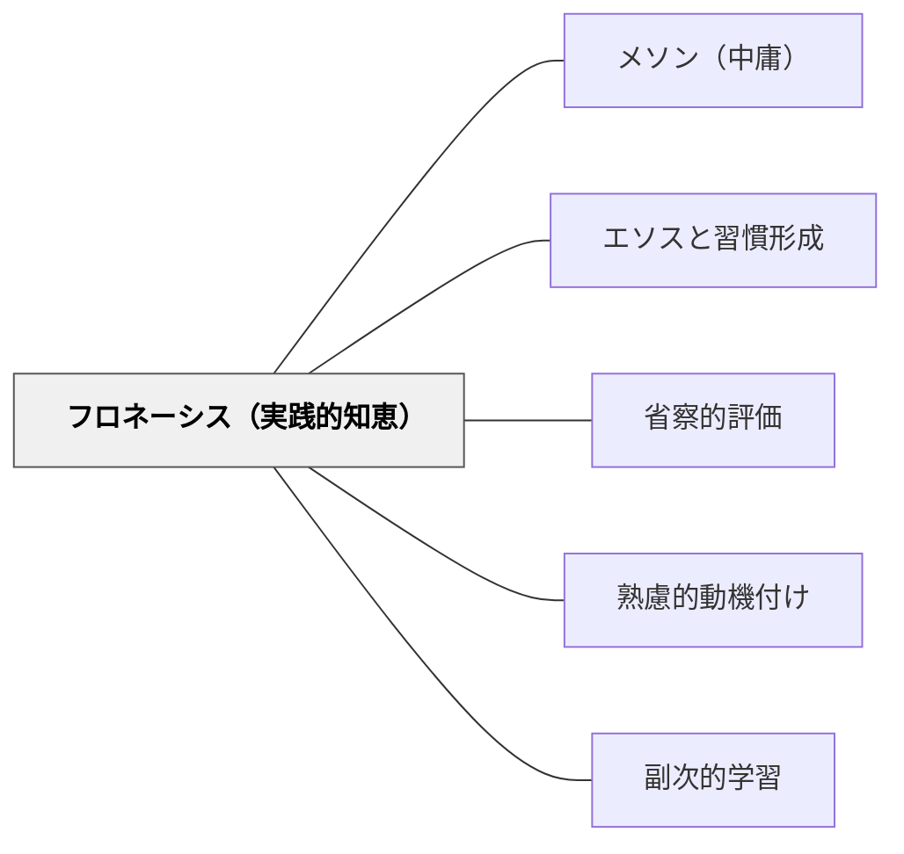

# フロネーシス（実践的知恵）

> 「思慮深い人ならば中間性と定めるような定め方において定まるものである。」——アリストテレス（第二巻第六章）

## Pattern Connection

### アリストテレス（前335年頃）——ニコマコス倫理学 第一巻第十三章・第二巻第六章

アリストテレスは知的な徳を知恵（ソフィア）・物わかり（スネシス）・**思慮深さ（フロネーシス）**に分ける。フロネーシスは「もろもろの人柄の徳が行為の習慣により身につくことに応じて、それと同時に人にそなわるような、**行動を支える知的な徳**」（第二巻第一章注）。

技術（テクネー）との本質的な違い（第二巻第四章）：
- **技術**の卓越性は作品（成果物）に宿る——立派な作品が生まれれば技術は発揮された
- **徳（フロネーシス含む）**の卓越性は行為者の**性向**に宿る——①知っていること ②選択に基づいていること ③確固たる性向から為されること の三条件を行為者が満たさなければならない

フロネーシスを持つ人（思慮深い人・phronimos）が中庸の基準となる：
「[その人の]分別によって中間性と定まり、かつ思慮深い人ならば中間性と定めるような定め方において定まるものである」（第二巻第六章）

この思慮深い人が基準になること自体が重要な主張——中庸は「マニュアル」や「平均値」ではなく、**実践的知恵を持つ人の判断**によってのみ定まる。

- **既存パタンとの関連**：[[メタパタン/経験から出発する]] が「具体的経験から出発する」という方法論を示すのに対し、本パタンはその経験の積み重ねの中で何が育つか（フロネーシス）を示す。[[パタン/省察的評価]] が「行為を振り返る」実践として、フロネーシスの形成経路となる。
- **補強された点**：[[パタン/メソン（中庸）]] は「ちょうどしかるべき中間」という目標を示すが、その判断力がフロネーシスであることで、二つのパタンが一体になる。
- **他のパタンへの波及**：教師の専門性の哲学的基盤——教師の「勘」「経験知」「実践的判断力」はフロネーシスとして概念化できる

---

## 背景（Context）

教育には「マニュアル化できる部分」と「どうしても判断が必要な部分」がある。同じ子どもへの同じ言葉が、ある日は有効でも翌日は無効になる。同じ課題設計が、あるクラスでは機能してもあるクラスでは機能しない。「最適なパタンの適用」を判断するのは、マニュアルではなく教師の実践的知恵である。

アリストテレスはこの「実践の知」を哲学的に整理した。フロネーシスは「何が正しいかを知ること（理論）」でも「正しいことを実行できる技術（テクネー）」でも「何を行うかを知的に構想すること（知恵）」でもない。「この具体的な状況で何がちょうどしかるべきかを判断する能力」である。

## 問題（Problem）

「知識は豊富だが現場では使えない」「理論は分かるが応用できない」という現象が教育現場でも起きる。知識（エピステーメー）や技術（テクネー）の習得だけでは、刻々と変化する教室の実践場面に対応できない。この「実践の知」の空白を埋めるものが、フロネーシスである。

## 力のかたち（Forces）

- フロネーシスは「行為の実践」なしには育たない——理論を学んでも実践なしにフロネーシスは形成されない
- フロネーシスは「特定の状況での判断」を扱う——普遍的規則を演繹的に適用する能力ではない
- 思慮深い人（phronimos）が基準になる——規則書や平均値ではなく、経験ある実践者の判断が中庸を定める
- フロネーシスは[[パタン/エソスと習慣形成]] と表裏一体——行為の習慣と同時に育つ知的な徳
- テクネー（技術）は「知らなくて失敗した」が許容されるが、フロネーシスの欠如は「知っていたのに判断を誤った」という構造になる

## 解決（Solution）

**「どうすべきか」を規則から引き出そうとするのをやめ、「この状況でのちょうどしかるべき」を判断できる実践的知恵の形成を目指す。そのためには、実際の判断場面の経験と振り返りの積み重ねが不可欠である。**

### フロネーシスの形成経路

フロネーシスは「教えられる」のではなく「経験と省察の積み重ね」から育つ：

1. **豊富な実践経験**：多様な状況での教育的判断の機会（授業・関係性・問題場面）
2. **省察（振り返り）**：「あの判断は何が良かったか・何がずれていたか」を思索する習慣
3. **思慮深い人とのかかわり**：フロネーシスを持つ先輩教師・メンターの判断を間近で見て学ぶ
4. **判断の言語化**：「なぜそうしたか」を説明できるようにすることで、暗黙知が明示知になる

### 子どもへのフロネーシス教育

子ども自身のフロネーシスを育てることも教育目標：

- 「どうすれば良いか」を外から与えず、「どうすれば良いと思うか・なぜそう思うか」を問う
- 選択の機会を豊富に設け、その選択の結果を振り返る経験を積む
- [[パタン/メソン（中庸）]] の「ちょうどしかるべき」を実際に選択する練習——「やりすぎ・やらなすぎ」を自分で診断する習慣

### パタン・ランゲージとの接続

パタン・ランゲージを「使う」とは、フロネーシスを働かせることである：
「このパタンを使うべきか」「この文脈でこのパタンはどう機能するか」という判断は、マニュアルから出てこない——実践的知恵によって「このパタンが今この状況で適切か」を見極める。

## 結果（Consequences）

- 「どうすべきか」という問いが「規則検索」から「状況判断」へシフトする
- 教師の経験知・実践知が「フロネーシス」として概念化され、専門性として語れるようになる
- 「経験があるから分かる」という暗黙知を、言語化・伝承可能な実践知として扱えるようになる
- 子どもが「正しい答えを探す」のではなく「ちょうどしかるべきを判断する」姿勢を育てる

## 関連パタン

- [[パタン/メソン（中庸）]] — フロネーシスが見極める「ちょうどしかるべき中間」
- [[パタン/エソスと習慣形成]] — 習慣形成と同時に育つ知的な徳
- [[パタン/省察的評価]] — フロネーシスの形成経路としての振り返り
- [[パタン/熟慮的動機付け]] — 熟慮（deliberation）はフロネーシスの働きの一形態
- [[メタパタン/経験から出発する]] — フロネーシスは経験の蓄積から生まれる
- [[パタン/副次的学習]] — フロネーシスの多くは副次的学習として形成される
- [[文献/ニコマコス倫理学（上）（アリストテレス）]] — 本パタンの出典

## クラスター図

## Actionable Insight

- 今週の授業で「なぜそうしたか」を一度言語化してみる——「なんとなく」から「こういう状況でこれがちょうどしかるべきだと判断した」へ
- 難しい判断を迫られた場面を一つ選び、「超過・不足・中間」の三択で自分の判断を位置づけてみる（[[パタン/メソン（中庸）]] との組み合わせ）
- 子どもに「どうしたらよかったと思う？なぜ？」を問う——正解を教えるのではなく、判断力を引き出す問い
- フロネーシスを持つ先輩教師の「判断の根拠」を聞く機会を作る——「なぜそうしたのか」という問いが暗黙知を引き出す

## 出典

- アリストテレス（渡辺邦夫・立花幸司訳）（2015/2018）『ニコマコス倫理学（上）』光文社古典新訳文庫（第一巻第十三章・第二巻第一・四・六章）
- [[文献/ニコマコス倫理学（上）（アリストテレス）]]
