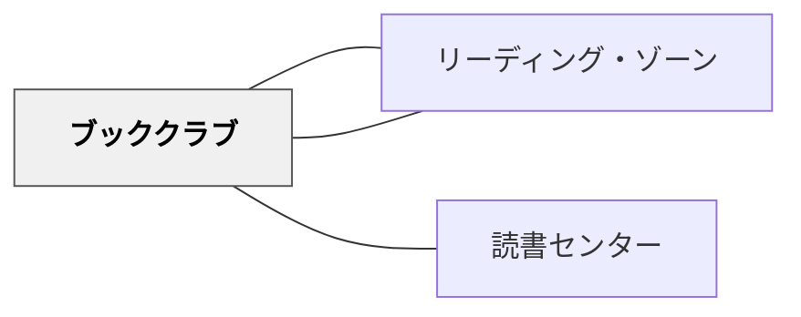

# ブッククラブ

> 一冊の本をグループで読み、語り合う——この読書会の中に、読み書きの文化、聴き合う文化、協同学習、アドベンチャーなど複数のパタンが重なっている。

---

## Pattern Connection

**出典**: Daniels, H.（2002）*Literature Circles: Voice and Choice in Book Clubs & Reading Groups*（2nd ed.）. Stenhouse. / Daniels, H., & Bizar, M.（2005）*Teaching the Best Practice Way*. Stenhouse.

- **既存パタンとの関連**: [[パタン/リテラチャー・サークル]] はブッククラブの特定実装形式として位置づけられる。ブッククラブが「本を読んで語り合う学習活動の総体」を扱うのに対して、リテラチャー・サークルは「役割シートによる足場かけ→段階的消去」「本の自由選択」「教師が対話の外に出る」という3つの固有設計を持つ。このパタンはその上位パタンとして機能する
- **補強された点**: 「よくある失敗と対処」（あらすじ確認で終わる・発言が偏る）に対して、役割シートが構造的な解決策を提供することが明確になった——「討議リーダーの問い」「コネクターのつながり」などの役割が「どの子も準備して来る」個人的アカウンタビリティを保証する
- **修正・拡張された点**: 役割シートは「永続的な構造」ではなく段階的に消すべきもの（Daniels の最重要原則）——導入期（全役割）→練習期（役割選択）→移行期（準備メモ）→自律期（役割なし）という段階が「よい読書会」の到達点を具体化した。これは [[パタン/段階的手放し]] の観点をブッククラブに加える
- **他のパタンへの波及**: [[パタン/リテラチャー・サークル]] — ブッククラブの具体的実装（役割・消去・選択）。[[パタン/自己選択自己決定]] — 本の選択が生徒主導の前提。[[パタン/聴き合う文化]] — 役割が消えた後の自然な対話を支える

---

## 背景（Context）

ブッククラブ（読書会）は、同じ本を読んだ学習者がグループで語り合い、読みを深める学習活動である。リテラチャーサークルなど近い実践もあるが、ここでは細かな違いよりも「本を読んで語り合う学習活動」として捉える。

岩井輝久（2018）は、ブッククラブを「パタンを重ねていくこと」を考えるための実践として記述している。よい教育には、複数のパタンが小さな活動の中に重なり、圧縮されている。ブッククラブはその典型である。

一冊の本を一人で読むだけでは、読みは個人の内側に閉じやすい。しかし、同じ本を読んだ仲間と語り合うと、登場人物の見方、場面の意味、作品全体のテーマが他者の言葉によって開かれていく。

## 問題（Problem）

読書指導が、あらすじの確認や教師の発問への応答だけになると、学習者は本を「自分たちで意味づける」経験を持ちにくい。読む力を伸ばしたいのに、読書が受け身の活動になってしまう。

また、話し合いだけを先に置いても、読む準備がなければ対話は浅くなる。逆に、一人で読むだけでは、多様な解釈や読みの深まりに出会いにくい。

## 力のかたち（Forces）

- 読書には一人で沈潜する時間と、他者と語り合う時間の両方が必要である
- 同じ本を読んでいても、心に残る場面や解釈は一人ひとり異なる
- 語り合うためには、事前に読んで考えを準備する個人の責任が必要になる
- 読み応えのある本は挑戦になるが、その挑戦が読書の力と楽しさを育てる
- グループで読むと、互恵的な協力、参加の平等性、活動の同時性が生まれやすい
- よい読書会は、複数の教育パタンが重なってはじめて成立する

## 解決（Solution）

**一冊の本を小グループで読み、事前に考えを準備してから語り合うブッククラブを設計する。**

本は、子どもたちにとって読み応えがあり、語り合う価値のあるものを選ぶ。グループは3〜4人程度を基本にし、全員が読んで考えを持ち寄れるようにする。読みを何回かに分けてもよいし、一冊を読んでから語り合ってもよい。

---

### 基本的な進め方

1. **本を選ぶ**——読み応えがあり、複数の解釈や感想が生まれる本を用意する
2. **グループを作る**——同じ本を読む3〜4人程度のグループにする
3. **読む範囲を決める**——一冊を分けて読むか、全体を読んでから話すかを決める
4. **考えを準備する**——印象に残った場面、疑問、語りたいことをメモする
5. **語り合う**——一人ずつ考えを出し、仲間の言葉を聴きながら読みを深める
6. **振り返る**——話し合いで考えが変わったこと、深まったことを書く

---

### 最初の1回の台本

初回は「正解を探す時間」ではなく「読みを持ち寄る時間」であることを明確にする。

1. 「今日は、一冊の本について、同じ本を読んだ人同士で話します」
2. 「正しい答えを一つに決める時間ではありません」
3. 「自分が気になった場面、疑問に思ったこと、誰かに聞いてみたいことを持ってきます」
4. 「話す人は、本のどこからそう思ったのかを伝えます」
5. 「聴く人は、同じところ・違うところ・もっと聞きたいところを探します」
6. 「最後に、話し合いで自分の読みがどう変わったかを書きます」

### 話し合いの入口になる問い

| 問い | ねらい |
|------|--------|
| 一番心に残った場面はどこか | 読みの入口を作る |
| 登場人物の行動で気になったところはどこか | 人物理解を深める |
| 自分ならどうしたか | 自分の経験と結びつける |
| この本が問いかけていることは何か | 作品のテーマへ向かう |
| 友だちの話を聞いて、読みが変わったところはあるか | 対話による変化を振り返る |

### よくある失敗と対処

| 起きやすいこと | 対処 |
|----------------|------|
| あらすじ確認だけで終わる | 「どこでそう思った？」と根拠になる場面へ戻す |
| 発言する子が偏る | 最初に一人ずつ「話したいこと」を出す時間を置く |
| 読んでこない子が出る | 読む範囲を小さくし、授業内にも読む時間を確保する |
| 感想の言い合いで深まらない | 「友だちの読みで変わったところ」を最後に書かせる |
| 本が易しすぎて語ることがない | 葛藤、多視点、曖昧さのある本を選ぶ |
| 本が難しすぎて止まる | 範囲を分ける、読み語りを入れる、問いの入口を絞る |

### 発展パターン

| 発展 | 進め方 | つながるパタン |
|------|--------|----------------|
| テーマで集まる | 話し合いたいテーマごとにグループを組み直す | [[パタン/概念型の目標]]、[[パタン/可視化]] |
| 役になりきる | 登場人物の立場から問いに答える | [[パタン/ごっこ遊び]] |
| 読書記録を残す | 読書会で考えが変わったことを蓄積する | [[パタン/ポートフォリオファイル]] |
| 友だちに問い返す | 仲間の発言を受けて、さらに考えが続く問いを返す | [[パタン/問い返しのデザイン]] |
| 次の本を選ぶ | 読書会後に次に読みたい本を自分たちで選ぶ | [[パタン/自己選択自己決定]] |

## 結果（Consequences）

- 一人で読むよりも、多様な視点から作品を理解できる
- 本について語る経験が、読書を共同体の文化にする
- 読んで考えを準備する個人の責任が生まれる
- 仲間の言葉によって、自分の読みが変化する経験が積み重なる
- 読み応えのある本に挑戦することで、読む力と読書への意欲が育つ
- 複数のパタンを重ねることで、教育の経済性が高まる

## パタンのつながり
- [[パタン/リーディング・ゾーン]]
- [[パタン/リテラチャー・サークル]]
- [[パタン/作業活動の時間]]
- [[パタン/深い理解（3水準の読解）]]
- [[パタン/読書センター]]
- [[パタン/物語①]]
- [[パタン/文学討論グループ]]
- [[パタン/類推的学習①]]

### 圧縮されているパタン

ブッククラブは一つの読書活動だが、その中に複数のパタンが圧縮されている。だから、単に「グループで本の感想を話す」だけではなく、読む・聴く・考える・問い返す・挑戦する・振り返るという複数の学習が同時に起きる。

| ブッククラブの場面 | 圧縮されているパタン | 何が起きているか |
|--------------------|----------------------|------------------|
| 同じ本を読む仲間で集まる | [[パタン/ソーシャル]] | 一人の読書を、共同で意味を作る読書へ変える |
| 読んで考えを準備する | [[パタン/能動的関与]] | 読み手が受け身でなく、自分の問いや考えを持つ |
| 語り合う | [[パタン/聴き合う文化]]、[[パタン/考える文化]] | 他者の読みを聴き、自分の読みを考え直す |
| 読み応えのある本に挑戦する | [[パタン/アドベンチャー]] | 少し難しい本が、挑戦と成長の機会になる |
| 友だちの発言に応答する | [[パタン/大切な友だち（クリティカルフレンド）]]、[[パタン/ピアフィードバック]] | 仲間の読みを大切にしながら、互いに深め合う |
| テーマや進行状況を見えるようにする | [[パタン/可視化]] | 何について話しているか、どこまで深まったかが共有される |
| 読書会後に振り返る | [[パタン/精緻化]] | 読みと対話を自分の言葉で再構成する |
| 読書が共同体の習慣になる | [[パタン/読み書きの文化]] | 本を読むこと・語ることがクラスの文化になる |

この意味で、ブッククラブは「一冊の本をグループで読む実践」であると同時に、パタンを重ね、圧縮することそのものを学ぶ実践パタンでもある。

### 関連パタン

- [[パタン/リーディング・ワークショップ]] — ブッククラブを組み込む親構造
- [[パタン/読書センター]] — センター活動の発展形としてのブッククラブ
- [[パタン/リーディング・ゾーン]] — 一人読みからグループへの移行

## このパタンが働く教材

| 教材 | どのようにブッククラブを支えるか |
|------|----------------------------------|
| [[教材/リーディング・ワークショップの小さい付箋]] | 読書会で話したい箇所に印をつけ、対話の入口を準備する |
| [[教材/読書反応の書き出しの手引き]] | 読書会の前に、自分の考えと理由を短く準備する |
| [[教材/読書会の質問（テーマ）集]] | 読む前・読んでいる途中・読み終えた後・話し合い中の問いを用意し、読書会の焦点と問い返しを支える |
| [[教材/読書の道具棚]] | ブッククラブをリーディング・ワークショップ全体の流れの中に位置づける |

- [[パタン/読み書きの文化]] — 読書をコミュニティの文化として育てる
- [[パタン/聴き合う文化]] — 読書会を対話として成立させる
- [[パタン/考える文化]] — 読みを考えとして共有する
- [[パタン/ソーシャル]] — 他者との相互作用を学びの資源にする
- [[パタン/アドベンチャー]] — 読み応えのある本への挑戦を設計する
- [[パタン/可視化]] — テーマ、進行状況、読みの変化を見えるようにする
- [[パタン/類推的学習①]] — 読み比べや対話から作品理解を深める
- [[文献/リーディング・ワークショップの研究と実践（第５版）]] — 読書指導全体の枠組み

## クラスター図

## Actionable Insight

- 3〜4人グループで1冊の本を読んで話し合うブッククラブを1回試してみる——まずは「一番心に残った場面」から始める
- 読書会の前に、印象に残った場面・疑問・話したいことを1つずつメモさせる——準備があることで個人の責任が生まれる
- 読書会後に「友だちの話で読みが変わったところ」を一文で書かせる——対話による読みの変化が見えるようになる

## 出典
- [[文献/教育のパタン・ランゲージ入門]]
- [[文献/一つの教育のパタン・ランゲージ]]

岩井輝久（2018）「パタン　ブッククラブ −パタンを重ねていくことについてー」『一つの教育のパタン・ランゲージ』あんどん出版  
[[文献/リーディング・ワークショップの研究と実践（第５版）]]
Daniels, H., & Bizar, M. (2005). *Teaching the Best Practice Way: Methods That Matter, K-12*. Stenhouse Publishers. → [[文献/Teaching the Best Practice Way（Daniels & Bizar）]]
