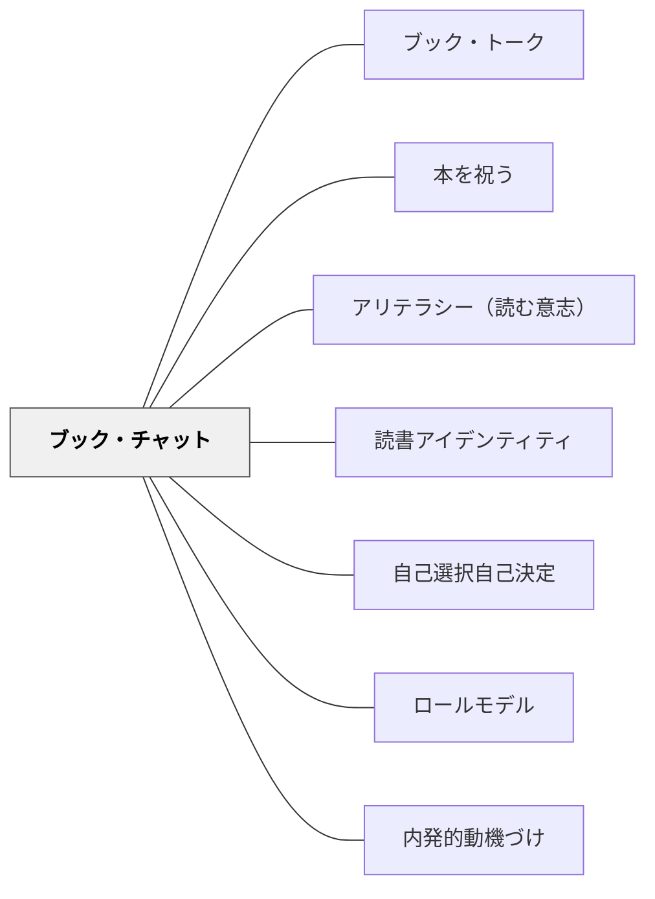

# ブック・チャット

> 「この本、あなたに合いそう」——評価なし、感想の義務なし、ただの熱烈な一言。これが読む意志（WILL）に火をつける最も単純な点火装置だ。

---

## Pattern Connection

**出典**: Layne, S. L.（2009）*Igniting a Passion for Reading: Successful Strategies for Building Lifetime Readers*. Stenhouse.（統合：2026-05-15）

- **既存パタンとの関連**：[[パタン/読書アイデンティティ]] の「Book Matching（本のマッチング）」として言及はされているが、それを実現する**行為としての会話**のパタンは独立していなかった。本パタンはその実践的行為を詳細化する
- **ブック・トークとの区別**：[[パタン/ブック・トーク]]（リテラチャー・サークルで使われる1〜2分の構造化された本の紹介）とは別物——ブック・チャットは非公式・個別・熱量ベースで起きる会話であり、構造を持たない。なお Layne（2009）自身の book chat は、教師がクラス全体の前で行う6〜8分ほどの本の紹介を指す。このページの「一人ひとりへの手渡し」は、Layne の book chat の熱量を個別の場面に移した形である
- **補強された点**：選書支援を「教師が本を並べて待つ」受動的な場面設計から、「教師が一人ひとりに話しかける」能動的な接続行為として位置づけ直した
- **他のパタンへの波及**：[[パタン/アリテラシー（読む意志）]] — ブック・チャットはWILLを育てる最も直接的な介入として機能する。[[実践/読書への情熱を育てる実践集]] — ブック・チャットを日常的なルーティンとして設計する

**Layne（2009）OCR全文統合（2026-05-18）：**

- **Book Chat Binder の追加**：教師がブック・チャットの準備のために一冊一枚で書きためた用紙のバインダーを、生徒がいつでも参照できるようにする——ブック・チャットを「教師が来てから起きること」から「生徒が自分で始めること」へと拡張する
- **生徒によるブック・チャット発表**：Layne は Chapter 6 で、生徒自身がブック・チャットを行う形式を紹介する（教師のブック・チャットを何度も聞いたあとで、ルーブリックを使って書き方と話し方を一部分ずつ教えてから。時間は8分以内）。教師のインフォーマルな推薦と、生徒のフォーマルな発表は**目的が異なる**——前者はWILLへの点火、後者はプレゼンテーション技術と読書コミュニティの育成
- **ナラティブの視点**：1人称・2人称・3人称の選択が発表に個性を加える
- **Miss Callahan の教訓**：メモより熱意——教育実習生の Miss Callahan がインデックスカードを読み上げてロボットのようになったとき、Layne はカードを取り上げ、その本が好きな理由を話すよう促した。自分の言葉で好きな本を語りはじめると、見違えるようなブック・チャットになった

---

## 背景（Context）

たとえば、こんな場面がある——教師が廊下を歩いていると、独立読書の本を持っていない子どもが目に入る。教師はその場で「ねえ、これ読んだ？絶対好きだと思うんだけど」と本を一冊渡す。それだけだ。感想を聞かない。記録しない。評価しない。

**ブック・チャット（Book Chat）**——教師が子どもに対して、個人的な熱量をもって本を推薦する非公式の会話。

Layne（2009）の book chat は、これとは形が違い、教師がクラス全体の前で行う短い本の「コマーシャル」である。Layne は長さを6〜8分ほどにしている（"I try to keep them six to eight minutes in length"）。本ページは、その「教師が本について熱をこめて話す」ことを、一人ひとりへの手渡しの場面で扱う。

これは「ブック・トーク（Book Talk）」とは異なる：

| ブック・チャット | ブック・トーク |
|---|---|
| 非公式・いつでもどこでも | 計画された授業内の活動 |
| 個別——この子にこの本を | 全体・グループ向け |
| 1〜2文の熱烈な一言 | 1〜2分の構造化した紹介 |
| 評価・感想なし | 聴衆の反応を見る |
| 廊下・給食・休み時間 | ミニレッスン・リテラチャー・サークルの起動 |

ブック・チャットは教室の構造の外で起きる——それが価値の源泉だ。「先生が私のために選んでくれた」という感覚は、授業の形式の中では生まれにくい。

## 問題（Problem）

選書支援の多くは「本棚を充実させる」「本を紹介するコーナーを作る」という環境設計に留まる。

しかし、アリテラシー（読む意志がない子）にとって、環境は通り抜けるものでしかない。どれだけよい本が棚にあっても、「自分に関係ない」と感じている子は手を伸ばさない。

読む意志（WILL）に火をつけるのは**個別の接続**だ——「この本は、あなたのことを知っている私が、あなたのために選んだ」というメッセージを持つ推薦。

## 力のかたち（Forces）

- 「先生が私に薦めてくれた」という個別性が、本への関心を起動する
- 義務・評価がないため、読まなくても関係が傷つかない——低リスクな試みになる
- 廊下・給食・休み時間という非公式な文脈が、教師と子どもの「対等な会話」を生む
- 教師が本を「楽しい」と思っていることが言葉ににじむ——熱量は伝わる
- 子どもの興味（スポーツ・ゲーム・ペット・趣味）を知っていることが接続の精度を上げる
- 一冊の「大当たり」体験が、読む意志の転換点になることがある

## 解決（Solution）

**子どもを知り、その子に合う本を「この本あなたにぴったりだと思う」と熱量をもって非公式に渡す。感想を求めず、返却期限も決めず、ただ接続をつくる。**

---

### ブック・チャットの実践

**ステップ1：子どもの興味を知る**

年度初めの**興味調査（Interest Inventory）**で、読書の好みではなく生活全体を聞く：

- 好きなスポーツ・趣味・テレビ・映画
- 将来の夢・好きな科目・嫌いな科目
- 家族構成・ペット・最近ハマっていること

この情報が「接続の地図」になる。「サッカーが好きな子」には「熱血サッカー漫画」を。「恐竜が好きな子」には「恐竜の科学絵本」を。

**ステップ2：本の在庫を知る**

自分が薦められる本のリストを持っておく——読んだ本・薦められた本・子どもが熱狂した本のリスト。

「この本はどんな子に合う？」という視点で本を読んでおく。

**ステップ3：機会を作る**

ブック・チャットは教室の外でも起きる：

- **朝の準備時間**：「先週、○○読んでた？終わった？ならこれどうぞ」
- **独立読書の開始直前**：「まだ本が決まってない子、ちょっと来て」
- **廊下で会った瞬間**：「ねえ、この本持ってる？絶対好きだと思う」
- **給食の片付け中**：「これ先週読んでてすごくよかった。○○ちゃん好きかも」

**ステップ4：熱量を持って一言で言う**

構造は要らない。次の形で十分だ：

```
「この本、先生先週読んでて面白かった。○○が好きな人絶対ハマると思う。よかったら読んでみて」
「この本の主人公、○○ちゃんみたいな感じで、絶対共感できると思う」
「最初の3ページだけ読んでみて。面白くなかったら返してくれていい」
```

**ステップ5：感想を求めない**

ブック・チャットは「本を渡す」で完結する。感想を聞かない・記録しない・評価しない。

「どうだった？」と聞いた瞬間、それは評価になり、WILLに水をかける。

ただし、子どもの方から「面白かった！」と言いに来たら、その会話は全力で受け取る——「そうでしょ！じゃあ次はこれ」とブック・チャットのチェーンが始まる。

---

### ブック・チャットと興味調査のサイクル

```
興味調査（年度初め）
    ↓
子どもの興味の地図を作る
    ↓
ブック・チャット（日常的に、一人ひとりに）
    ↓
子どもの「読んだ本」「面白かった本」が分かる
    ↓
次のブック・チャットの精度が上がる
    ↓
「先生は私の好みを知っている」という信頼が育つ
```

---

### ブック・チャットの効果が出にくい場面

| 状況 | 対処 |
|---|---|
| 子どもの興味を知らずに薦める | まず興味調査か雑談で「この子は何が好きか」を知る |
| 薦めた後に感想を求める | 感想なし・評価なしを徹底する |
| 教師が本を楽しんでいない | 自分が本当に面白いと思った本しか薦めない |
| 毎回同じ子にしか薦めない | 「今週は誰にブック・チャットしていないか」を意識する |
| 図書コーナーがない | 教室に「先生のおすすめ棚」を小さくても作る |

---

### Book Chat Binder（生徒が参照できる本の目録）

Layne（2009）は、ブック・チャットの準備のために、読んだ本を一冊につき一枚の用紙（Book Chat Preparation Sheet）に書きとめている。まず聞き手の心をつかむ「フック」を書き、次にあらすじの短いメモ、そして同じ作者のほかの本を書く。この用紙を綴じたバインダーを、Layne は初め自分の机の後ろに置いていたが、ある日、一人の生徒がそれを勝手に探っているのを見つけ、「こんなところに置いておかなければ、この本のことがもっと分かるのに」と言われた。Layne は、それが「私の」バインダーではなく「私たちの」バインダーであるべきだったと気づき、翌日から生徒が見られるようにした。すると生徒が集まり、バインダーで見つけた本について「チャットをしてほしい」と頼むようになった。

**目的**：
- 「読む本がない」という状況を解消する
- 教師がいない時間（休み時間・放課後）でも、生徒が自分で「合いそうな本」を探せる
- ブック・チャットを「教師が直接話しかける場面」だけに限定しない

**運用**：本を読むたびに1枚追加する。題名・著者と、フック・あらすじのメモ・同じ作者のほかの本を書く。

---

### 生徒によるブック・チャット発表（Student-Delivered Book Chat）

教師が発表のモデルを重ねることで、生徒自身も Book Chat を発表するようになる。ただし「ただの感想発表」にならないよう、**構造とルーブリックが必要**——型は教えるためにあり、後で手放す。

**基本形式**：
- **長さ**：8分以内（ルーブリックの時間配分）
- **本の読み聞かせ**：劇的な一節を選び、必要な背景を伝えてから読み上げる（Layne 自身のブック・チャットでは、6〜8分のうち4分ほどが抜粋の読み上げ）——「本の声で語る」ことが一番の説得力
- **視点（Narrative Voice）の選択**：1人称・2人称・3人称のいずれかで語る（Layne が教師自身のブック・チャットの工夫として挙げるもの）
  - 1人称：「この本の主人公は僕です。ある日——」
  - 2人称：「もしあなたが砂漠のど真ん中に置き去りにされたら……」
  - 3人称：「ある少年が、思いがけない冒険の始まりに立っていた」
- **フック（Hook）の種類**：質問で始める・外国語のアクセントや方言・衣装・小道具（プロップ）（同じく、Layne が教師自身のブック・チャットについて挙げる例）

**Miss Callahan のエピソード**（教師のブック・チャットの例）：Layne が指導した教育実習生 Miss Callahan は、大学の授業では見事なブック・チャットをしていたのに、教室の子どもたちの前ではインデックスカードを読み上げ、ロボットのようになってしまった。Layne は授業に割って入ってカードをすべて取り上げ、「その本が好きな理由を話して」と言った。二文ほど話すうちに彼女は我を忘れて大好きな物語を語りだし、読み上げた抜粋に子どもたちが歓声をあげ、紹介した本はその日のうちに学校と教室の図書からすべて借り出された——メモを読むのではなく、本への熱意が自分の言葉で伝わるかどうかが問題だ、という教訓。

**評価の考え方**：Layne は、生徒のブック・チャットを、話し方や発表のしかた（delivery）も見るルーブリックで評価する。そのため、書き方と話し方を一部分ずつ教えてから発表に進む。Layne は、よく書けてうまく話されたブック・チャットのほうが、従来の読書感想の報告よりも、読んだかどうかを確かめるずっとよい手立てになると言う。

---

## 結果（Consequences）

- 「先生が私のために選んでくれた」という個別の関係性が、読む意志（WILL）に火をつける
- 読まなかった子が一冊の「大当たり」で読書の楽しさを発見することがある
- 教師と子どもの間に「本の話ができる」という新しい関係ができる
- 子どもの興味を知ることで、他の指導場面でも個別化が起きやすくなる
- ただし、すべての子に即効果があるわけではない——体験の累積が必要

## 関連パタン
- [[パタン/ブック・トーク]]
- [[パタン/本を祝う]]

- [[パタン/アリテラシー（読む意志）]] — ブック・チャットはWILLを育てる最も直接的な介入
- [[パタン/読書アイデンティティ]] — 個別の本との接続が「自分は読む人間だ」を育てる
- [[パタン/自己選択自己決定]] — 「先生に薦められた」から「自分で選ぶ」へと移行する橋
- [[パタン/ロールモデル]] — 教師が楽しんでいる本を薦めることでモデリングが起きる
- [[パタン/内発的動機づけ]] — 評価なしのブック・チャットが内発的動機を守る
- [[実践/読書への情熱を育てる実践集]] — ブック・チャットを年間の情熱計画に位置づける

---

## クラスター図



## Actionable Insight

- **今日一人だけに「この本好きだと思う」と渡す**——一人から始める。全員に薦めようとしなくていい
- **給食か休み時間に「最近ハマってること何？」と聞く**——興味調査がなくても今日から雑談で始められる
- **「先週読んでてよかった本」を机の上に置いておく**——「先生、何読んでるんですか？」という問いがブック・チャットの入口になる
- **薦めた後に感想を聞かないルールを自分に課す**——「どうだった？」の一言が内発的動機を外発的に転換する

---

## 出典

Layne, S. L. (2009). *Igniting a Passion for Reading: Successful Strategies for Building Lifetime Readers*. Stenhouse Publishers.
