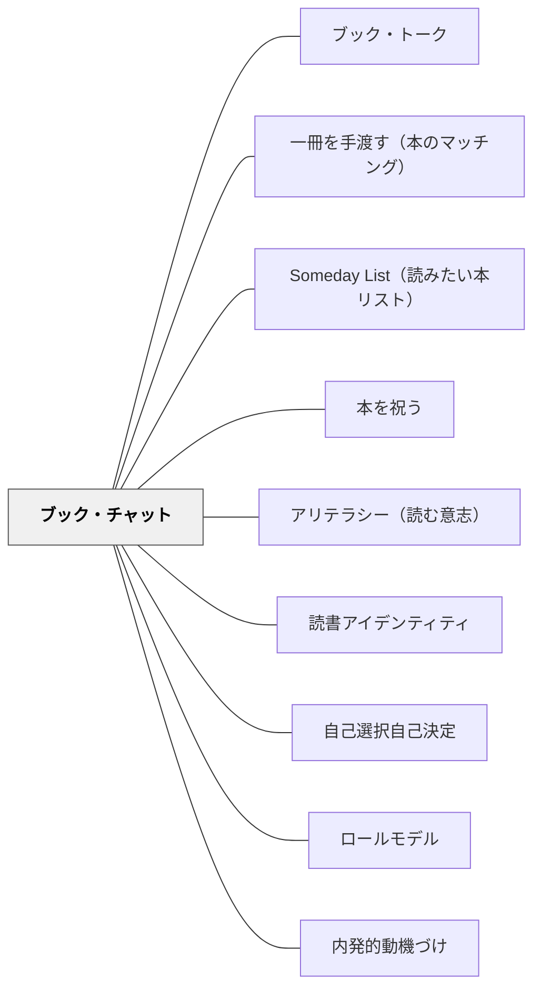

# ブック・チャット

> 教師がクラス全体の前で、一冊の本を数分かけて熱をこめて紹介する。聞き終えた子どもたちが、その本を借りに走る。

---

## Pattern Connection

**出典**: Layne, S. L.（2009）*Igniting a Passion for Reading: Successful Strategies for Building Lifetime Readers*. Stenhouse. Chapter 3 "I Didn't Know They Still Wrote Books for Adults: Igniting a Passion Through Book Chats"・Chapter 6 "Can We Talk?"（統合：2026-05-15／2026-05-18、改訂：2026-09-27）

- **このパタンの形**：Layne の book chat は、教師がクラス全体の前で行う、本の短い「コマーシャル」である。長さについて決まりはないとしたうえで、Layne は6〜8分ほどにしている（"I try to keep them six to eight minutes in length"）。そのうち4分ほどが、本の抜粋の読み上げになる
- **ブック・トークとの関係**：[[パタン/ブック・トーク]]（Atwell：1〜2分）と同じく「クラス全体の前での本の紹介」の仲間である。ブック・チャットはそれより長く、抜粋の読み上げに時間を割く
- **一冊を手渡すとの区別**：教師が一人の子に「この本、あなたに合いそう」と本を手渡す個別の場面は、[[パタン/一冊を手渡す（本のマッチング）]] で扱う。ブック・チャットはクラスの誰かに届くことをねらう公開の紹介、手渡しは特定の一人のために選んだ本を届ける接続である。二つは組み合わせて使える
- **補強された点**：Layne は、読むことへの態度・関心・動機・関与を高める方法の中で、book chat を筆頭に置く（"On my list of all-time best ways to stimulate a positive attitude, interest, motivation, and engagement in text with readers, providing book chats is at the top."）
- **他のパタンへの波及**：[[パタン/アリテラシー（読む意志）]] — 全体への紹介は、読めるのに読まない子に本との出会いを差し出す手立ての一つ。[[パタン/Someday List（読みたい本リスト）]] — 聞いた本を書きとめる用紙を、book chat の時間に机に置く。[[実践/読書への情熱を育てる実践集]] — book chat を年間の計画に位置づける

---

## 背景（Context）

Layne は教職の最初の八年間、たくさんの本をクラスで読み聞かせていたが、子どもが楽しめそうな本について子どもに語ることはしていなかった。教員養成でも大学院でも、「担当する年齢の子ども向けの本を読み、その本について子どもに話しなさい」と言われたことはなかったという（"nobody ever told me to deliver short (five- to eight-minute) commercials for books to my students"）。

転機は偶然だった。前の晩に夢中で読み終えた Gary Paulsen の *The Transall Saga* を、翌朝、何気なく机の端に立てておいた。一人の生徒が「これ何？」と尋ね、質問が次々に続き、始業のベルが鳴るころにはクラス全員が机のまわりに半円をつくって話を聞いていた。次の学年のクラスでも同じことが起きた。まもなく司書から、図書館のその本はすべて貸し出され、順番待ちのリストができていると知らされた。

その後 Layne は、小学校と高校のクラスで book chat を行った。取り上げた本はすべて借り出され、どの本にも順番待ちができた。自分の話し方のせいではないことを確かめるため、同僚にも好きな子どもの本についてクラスで話してもらったが、結果は同じだった。

ブック・チャットは、この「教師が読んだ本について、クラスの前で語る」ことを、授業の決まった一部にする形である。

## 問題（Problem）

教師が本を読み聞かせても、教室に本を並べても、子どもが「次に読みたい本」に出会えるとは限らない。棚に並んだ背表紙からは中身が分からず、本との出会いは偶然にまかされる。

一方、子ども向けの本をよく読んでいる教師でも、その本を子どもに語る時間を授業の中に持っていないことが多い。

教師の読書を、どうすれば子どもたちの「読みたい」に変えられるか。

## 力のかたち（Forces）

- 本の中身を少しは知らなければ、読みたいとは思えない——けれども話しすぎると「もう読まなくていい」になる
- 本そのものの声は、紹介者のことばより強い——抜粋の読み上げが聞き手を引き込む
- 抜粋は選び方しだい——説明がたくさん要る場面や、登場人物を何人も紹介しなければならない場面は、短い時間では使えない
- メモを読み上げると熱が消える——準備は要るが、語るのは自分のことばで
- 紹介を待つ子どもがいると、教師の側にも読む時間をつくる理由が生まれる（"Their motivation motivates us!"）
- 子どもにも発表させたくなる——しかし、教えずに任せると、聞き手は退屈し、発表は本の些末な場面をなぞるだけになる

## 解決（Solution）

**教師は子ども向けの本を読み、一冊ずつ準備用紙にまとめ、クラス全体の前で6〜8分ほどの本の紹介を定期的に行う。準備用紙は綴じて子どもに開く。子どもが発表するのは、教師の紹介を何度も聞いたあとで、ルーブリックを使って書き方と話し方を一部分ずつ教えてから。**

---

### 教師の book chat の組み立て

- **長さ**：6〜8分ほど。そのうち抜粋の読み上げが4分ほど
- **フック**：聞き手の注意をつかむ入口。レッスンの導入と同じ役目で、必須ではないが、熱意と好奇心をかきたてる。Layne が挙げる例は、筋に関わる問いで始める、なまりやアクセントをつけて話す、衣装や簡単な小道具を使う、など
- **抜粋の選び方**：劇的な一節を選び、聞き手に必要な背景を先に伝えてから読む。説明が多く要る「おいしい場面」は使わない。うまくいく場所は、子どもの前で何か所か試して決める
- **語り手（Narrative Voice）**：いちばん多く、いちばん易しいのは三人称で、教師として本について話す形。慣れた紹介なら、一人称（主人公として語る）や二人称（聞き手を主人公にして語る）に切り替えると変化が出る

語り手の三つの例（Layne が *Among the Hidden* で示すもの）：

- 一人称："My name is Luke Garner. I've never been to a birthday party, I've never gone to school, and I've never had a friend."
- 二人称："Your name is Luke Garner. ..."
- 三人称："His name is Luke Garner. ..."

---

### 準備用紙とバインダー（Book Chat Binder）

Layne（2009）は、ブック・チャットの準備のために、読んだ本を一冊につき一枚の用紙（Book Chat Preparation Sheet）に書きとめている。まず聞き手の心をつかむ「フック」を書き、次にあらすじの短いメモ、そして同じ作者のほかの本を書く。手元に本がないときでも、紹介の前に見直せる。

この用紙を綴じたバインダーを、Layne は初め自分の机の後ろに置いていたが、ある日、一人の生徒がそれを勝手に探っているのを見つけ、「こんなところに置いておかなければ、この本のことがもっと分かるのに」と言われた。Layne は、それが「私の」バインダーではなく「私たちの」バインダーであるべきだったと気づき（"I had been thinking they were my binders when all along they should have been our binders"）、翌日から生徒が見られるようにした。すると生徒が集まり、バインダーで見つけた本について「チャットをしてほしい」と頼むようになった。

**運用**：本を読むたびに1枚追加する。題名・著者と、フック・あらすじのメモ・同じ作者のほかの本を書く。バインダーは子どもの手の届くところに置く。

---

### 聞く側の用意

Layne は、誰かの book chat を聞くとき、子どもの机に「いつか読む本」の用紙（低学年では Someday Book List、中学年以上では Books to Consider）を出しておくようにしている。書かなくてもよいが、用紙は机の上に置く。いつか読みたい本を聞いたら、用紙のブック・チャットの欄に書きとめるよう促す。→ [[パタン/Someday List（読みたい本リスト）]]

---

### 生徒による book chat（Chapter 6）

子どもにも book chat をさせるべきかと聞かれると、Layne はいつも「うまくできるように教えるなら」と答える。話し方を教え、練習の機会を与え、評価にも話し方と発表のしかた（delivery）を含むルーブリックを使う、ということである。教えないまま発表させた教室で、子どもが本の些末な場面を単調な声で延々と話し、聞き手がみなそわそわしていた場面を見たことが、その理由として語られる。

- **始める時期**：教師の book chat を何度も聞いたあとで（"I never ask kids to begin preparing book chats that would be presented to their peers before they have heard me give many, many book chats in class."）
- **ルーブリックは一度に全部教えない**：一日目に配って質問を受け、二日目に、ルーブリックに沿って書かれた見本を読んで長所と短所を話し合い、三日目に、フックの部分だけを見本と照らして採点する。次に教師が四つの book chat の出だしを演じてみせ、子どもがグループで教師を採点する。そのあと子どもが自分の出だしを書き、翌日ルーブリックを使ってピア・カンファレンスをする。ほかの部分も同じように一つずつ進める
- **ルーブリックの主な項目**（Figure 6.3）：抜粋の読み上げ・フック・本を見せる・主人公（三人まで）・脇役（四人まで）・プロット（設定・大きな問題・展開・クライマックス…の順に、その語を口に出して）・話し方（声量・速さ・発音・アイコンタクト・ステージでの存在感）・結び・原稿・時間（8分以内）
- **一日に四人まで**：よく準備された発表でも、子どもは熟練した話し手ではない。長く聞かせすぎると、後の発表者のときに聞き手が離れる（"I still know enough not to schedule more than four per day."）
- **型は後で手放す**：Layne は、自分の book chat は必ずしもルーブリックの型どおりではないと言い、上達すれば最初の支えは要らなくなる、それを子どもが聞くのはよいことだとする

**評価の考え方**：Layne は、生徒のブック・チャットを、話し方や発表のしかた（delivery）も見るルーブリックで評価する。そのため、書き方と話し方を一部分ずつ教えてから発表に進む。Layne は、よく書けてうまく話されたブック・チャットのほうが、従来の読書感想の報告よりも、読んだかどうかを確かめるずっとよい手立てになると言う（"A well-written and successfully delivered book chat is a far better measure"）。

---

### Miss Callahan の話（教師の book chat の例）

Layne が指導した教育実習生 Miss Callahan は、大学の授業では見事なブック・チャットをしていたのに、教室の子どもたちの前ではインデックスカードを読み上げ、ロボットのようになってしまった。Layne は授業に割って入ってカードをすべて取り上げ、「その本が好きな理由を話して」と言った。二文ほど話すうちに彼女は我を忘れて大好きな物語を語りだし、読み上げた抜粋に子どもたちが歓声をあげ、紹介した本はその日のうちに学校と教室の図書からすべて借り出された。数日後には、子どもたちが次のブック・チャットはいつかと尋ねていた。

メモを読むのではなく、本への熱意が自分の言葉で伝わるかどうかが問題だ、という教訓である。

---

## 結果（Consequences）

- 紹介された本が借り出され、順番待ちができる——Layne が小学校・高校・同僚のクラスで繰り返し見た結果
- 教師の側に「読む理由」が生まれる。紹介を待つ子どもがいるので、読む時間をつくるようになる
- 準備用紙のバインダーを開くと、子どもがそこで見つけた本について「チャットをしてほしい」と頼みに来る
- 子どもの book chat は、読んだかどうかを確かめる手立てとして従来の読書感想の報告よりよく、書く・話す力も同時に使う
- **注意**：メモを読み上げると熱が消える。準備することと、自分のことばで語ることは別の仕事である
- **注意**：子どもの発表を教えずに任せると、聞き手が離れる。一日に詰めこむと、後の発表者に不公平になる（"That is not productive, not fair, and not fun."）
- **注意**：全体への紹介は、特定の一人に向けた選書ではない。「自分に関係ない」と感じている子には届きにくいこともある。その子には [[パタン/一冊を手渡す（本のマッチング）]] を組み合わせる

## 関連パタン

- [[パタン/ブック・トーク]] — 同じ「クラス全体の前での本の紹介」。Atwell は1〜2分、ブック・チャットは6〜8分で抜粋の読み上げが長い
- [[パタン/一冊を手渡す（本のマッチング）]] — 全体への紹介に対し、教師が一人の子に合う本を個別に手渡す
- [[パタン/Someday List（読みたい本リスト）]] — book chat で聞いた本を、机の上の用紙に書きとめる
- [[パタン/本を祝う]] — 本を話題にし、本を喜び合う教室の文化を一緒につくる
- [[パタン/アリテラシー（読む意志）]] — Layne が読む意志を高める方法の筆頭に挙げる手立て
- [[パタン/読書アイデンティティ]] — 教師が本を語る姿と、子ども自身が本を語る経験が、読む人としての自己像を支える
- [[パタン/自己選択自己決定]] — 紹介は選ぶ材料を増やす。どの本を読むかは子どもが決める
- [[パタン/ロールモデル]] — 教師が読み、読んだ本を語る姿そのものがモデルになる
- [[パタン/内発的動機づけ]] — 本の中身そのものの面白さで「読みたい」を起こす
- [[実践/読書への情熱を育てる実践集]] — ブック・チャットを年間の情熱計画に位置づける

---

## クラスター図

## Actionable Insight

- **今週読んだ子ども向けの本を一冊選び、準備用紙を一枚書く**——フック・あらすじのメモ・同じ作者のほかの本の三つだけでいい
- **抜粋を一か所選び、その前に要る背景を一、二文で言えるか確かめる**——言えなければ別の場所を探す
- **クラスの前で6〜8分の紹介をしてみる**——メモは見返すためのもので、読み上げない。「この本が好きな理由」から話しはじめる
- **紹介の前に、図書館の担当に書名を知らせておく**——借りに来る子が重なっても本を回せるようにする
- **準備用紙を綴じたファイルを、子どもの手の届くところに置く**
- **子どもに発表を任せる前に、教師の紹介を何度も聞く期間をとる**——ルーブリックは一度に全部配らず、フックの部分から一つずつ教える

---

## 出典

Layne, S. L. (2009). *Igniting a Passion for Reading: Successful Strategies for Building Lifetime Readers*. Stenhouse Publishers.

> "There are no hard and fast rules on the overall length of a book chat, but I try to keep them six to eight minutes in length, which means that my excerpt is likely to be around four minutes long."
> — Layne（2009）Chapter 3

> "I never ask kids to begin preparing book chats that would be presented to their peers before they have heard me give many, many book chats in class."
> — Layne（2009）Chapter 6

[[文献/Igniting a Passion for Reading（Layne）]]
