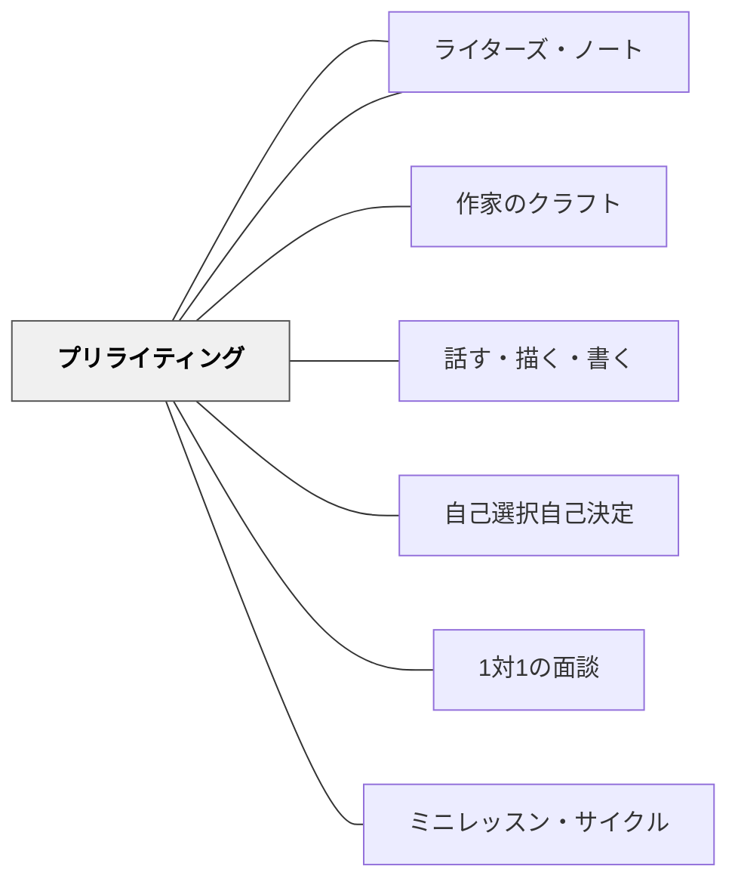

# プリライティング

> 書くことへの最初の壁は「何を書けばいいかわからない」である。プリライティングは、その壁を13の戦略で乗り越えることで、書き手が自分のトピックと出会う場を設計する。

---

## Pattern Connection

**出典**: Muschla, G. R.（2006）*Writing Workshop Survival Kit* (2nd ed.). Jossey-Bass.（統合：2026-05-19）

- **既存パタンとの関連**：[[パタン/ライティング・ワークショップ]] の「独立書き」の前段階として、プリライティングはトピックを準備する活動である。[[パタン/ライターズ・ノート]] のノート活用はプリライティングの一形態でもある。[[パタン/作家のクラフト]] の「Try Ten」（書き出しを10通りに書き直す）もプリライティング的なリビジョン戦略として機能する
- **補強された点**：「何を書けばいいかわからない」という問題に対し、「プリライティングが足りなかった」という診断を可能にする。トピックが「ない」のではなく「集めていなかった」「準備していなかった」だけという気づきが、書くことへの態度を変える
- **拡張された点**：Muschlaは13の戦略を列挙しているが、それぞれを「視覚的なタイプ・言語的なタイプ・社会的なタイプ」の3軸で分類することで、書き手の特性に応じた戦略選択が可能になる
- **他のパタンへの波及**：[[パタン/話す・描く・書く]]（幼年版のリハーサル）・[[パタン/1対1の面談]]（カンファリングでトピックが見つかることも多い）

---

## 背景（Context）

ライティング・ワークショップにおいて、「書く時間」の前に「書くことを準備する時間」がある。Muschla（2006）はこの段階を **プリライティング（Prewriting）** と呼び、書くことへの抵抗を減らし、書き手が自分のトピックを発見・明確化するための13の戦略を体系化した。

「書く前に何もしない」と、白紙を前にした子どもたちが「何を書けばいいか分からない」状態に陥りやすい。これは意欲の問題ではなく、**準備の問題**である。プリライティングは、書き手の中に既にあるアイデアを表面に引き出す手続きである。

## 問題（Problem）

「自由に書いていいよ」と言われた子どもたちが書けない最大の原因は、トピックの不在ではなく、トピックを「発見するプロセス」の不在である。

- 「何を書けばいいか分からない」と止まる
- ありきたりなトピック（運動会・遠足）しか出てこない
- 書き始めたが、途中で止まる（書くことがなくなった）
- プリライティングなしに起草（Draft）に入ると、内容が薄くなる

## 力のかたち（Forces）

- プリライティングに使う時間は「書く時間を減らす」ではなく「書く内容を増やす」——後の起草が速く深くなる
- 人によって「視覚的に考える」「話しながら考える」「書きながら考える」の差がある——一つの戦略が全員に合うわけではない
- プリライティングはしばしば「評価されない作業」として軽視されやすいが、最終作品の質を最も左右する段階の一つ
- ジャーナルとプリライティングの違い：ジャーナルは習慣的な記録、プリライティングは特定の作品のための準備

## 解決（Solution）

**複数のプリライティング戦略を学習者が選べるように教え、書く前に「自分に合った方法でトピックと素材を準備する」習慣を育てる。**

---

### 13のプリライティング戦略

#### 1. フリーライティング（Freewriting）

タイマーを5分にセットし、止まらずに書き続ける。文法・誤字・一貫性を気にしない。「書くことがない」なら「書くことがない」と書き続ける。書き終えたら読み返し、「最もエネルギーを感じる部分」に印をつける。

**ループ（Loop）**：印をつけた部分を新たなテーマにして、もう一度フリーライティングを繰り返す。2〜3回ループすることでトピックが絞り込まれる。

> "Freewriting eliminates excuses not to write. It provides a no-risk atmosphere for the most reluctant of your writers."

#### 2. クラスタリング（Clustering / Mapping / Webbing）

紙の中央にテーマを書き、そこから連想する言葉を枝分かれさせる。連想は次の連想を呼ぶ。最終的に「最もクラスターが密な部分」がトピックの候補になる。

視覚的に考えるタイプの書き手に特に有効。テーマが決まっている場合は「内容の整理」にも使える。

#### 3. アイデアリスト（Idea Listing）

箇条書き形式でアイデアを高速に列挙する。クラスタリングの「直線版」。批判なしに書ける量を書き、後で選ぶ。最終的に「一番書いてみたい」1〜2個に印をつける。

#### 4. ブレインストーミング（Brainstorming）

グループで行う発散的思考。4つの役割を設定することで機能する：

| 役割 | 機能 |
|------|------|
| **記録係** | 出たアイデアをすべてリストに書く |
| **時間係** | 時間を管理し、スピードを保つ |
| **ノイズ係** | 批判・評価を禁止する（「それは違う」を止める） |
| **司会** | 全員が参加できるよう促す |

**3つのルール**：①全てのアイデアを記録する（批判しない）・②他のアイデアを発展させる・③全員が参加する

#### 5. リハーサル（Rehearsing / Talking Before Writing）

書く前にペアで話す。聞き手は以下の役割を担う：①話し手の話を要約して確認する・②「もっと知りたいこと」を1〜2個質問する・③役割を交代する。話した後の「書くことがある感覚」が起草を速くする。

幼年版は [[パタン/話す・描く・書く]] として実践されているが、中高学年でも「話す→書く」の順序は有効。

#### 6. ロールプレイ（Role Playing）

対立のある場面・立場の異なる登場人物を想定し、実際に演じることでトピックや対立を具体化する。フィクション執筆のプリライティングとして特に有効。

#### 7. リサーチ（Researching）

説明文・レポート・意見文のプリライティングとして、情報収集を行う。書く前にどんな情報が必要かを問い（5W+1H）で整理し、収集先（本・インターネット・インタビュー）を特定する。

#### 8. ジャーナル（Journals）

毎日5〜10分、思ったことを書く習慣。プリライティングの長期的な形態。

**重要なルール**：①プライバシーを尊重する（読まない・採点しない）・②内容で評価しない・③ジャーナルから選んだ内容を正式な作品にすることはできる

#### 9. アイデアフォルダー（Idea Folders）

気になった記事の切り抜き・写真・引用・疑問のメモを一つのフォルダーに蓄積する。[[パタン/ライターズ・ノート]] の「紙版」。フォルダーを開くことがトピック探しの起点になる。

#### 10. 個人的体験の棚卸し（Personal Experience Inventory）

「私が興味を持っていることは？」「私が得意なことは？」「私が経験したことで他の人に伝えたいことは？」系の問いに対して箇条書きで答える。書き手が「自分の書けることの地図」を作る。

#### 11. 観察（Observation）

観察するテーマを決めて（人・場所・もの・出来事）、五感と関係性の視点で記録する。「見える」だけでなく「聞こえる」「においがする」「感じる」を含む。観察メモが説明文・物語の素材になる。

#### 12. 視点を変える（Angles / Viewpoints）

同じテーマを複数の視点・立場から考える。「反対意見は何か？」「少数意見は？」「別の文化・時代では？」という問いがトピックを深める。特に意見文・エッセイのプリライティングで有効。

#### 13. テーマを探索する問い（Using Questions）

5W+1H（Who, What, When, Where, Why, How）をテーマに対して問う。答えながらトピックが絞り込まれ、起草の方向が決まる。最後に「どんな読者に向けて書くか（オーディエンス）」を確認することで、文体・形式が定まる。

---

### 戦略の選択ガイド

| 書き手のタイプ | 推奨戦略 |
|--------------|---------|
| 視覚的に考えるタイプ | クラスタリング・アイデアフォルダー |
| 話すことが得意なタイプ | リハーサル・ブレインストーミング |
| 書きながら考えるタイプ | フリーライティング・ジャーナル |
| トピックが決まっているが内容が薄い | フリーライティング・ループ・テーマを探索する問い |
| フィクションを書く | ロールプレイ・登場人物の棚卸し・視点を変える |
| 説明文・報告を書く | リサーチ・テーマを探索する問い・観察 |

---

### プリライティングを年間計画に位置づける

| 学期 | 推奨するプリライティング導入 |
|------|--------------------------|
| 1学期はじめ | フリーライティング＋個人的体験の棚卸し（書けるトピックは自分の中にあると気づかせる） |
| 1学期後半 | クラスタリング・リハーサル（視覚タイプ・口頭タイプへの分岐） |
| 2学期以降 | ジャーナル・アイデアフォルダーの習慣化・テーマを探索する問い |

---

## 結果（Consequences）

- プリライティングを行った書き手は、起草（Draft）のスピードと内容の密度が上がる
- 「何を書けばいいか分からない」が「どれを書くか選べない」に変わる
- 書き手が「トピックは自分の中にある」という確信を持ちやすくなる
- プリライティングを「評価されない時間」として経験すると、実験的な発想が出やすくなる
- ただしプリライティングが「手続きのためのプリライティング」（先生に提出するためのクラスタリング）になると形骸化する

## 関連パタン

- [[パタン/ライティング・ワークショップ]] — プリライティングが機能する授業構造
- [[パタン/ライターズ・ノート]] — 長期的なプリライティングの蓄積の場
- [[パタン/作家のクラフト]] — 技芸要素を意識したプリライティング（Try Ten はプリライティング的なリビジョン）
- [[パタン/話す・描く・書く]] — 幼年版のリハーサル（話す→描く→書く）
- [[パタン/自己選択自己決定]] — プリライティングはトピック選択のオーナーシップを支える
- [[パタン/1対1の面談]] — カンファリングでプリライティングを支援することがある
- [[パタン/ミニレッスン・サイクル]] — プリライティング戦略は年間の最初に体系的に教える
- [[文献/Writing Workshop Survival Kit（Muschla）]] — 本パタンの一次資料

---

## クラスター図

## Actionable Insight

- **今週の作文授業の前に「3分フリーライティング」を入れる**——「書いていいよ」と言う前に「まず3分、書きたいことを何でも書いてみよう」と言うだけで、白紙を前に止まる子どもが減る。止まっても「止まっている、と書いてみて」と一言添える
- **「クラスタリング」を1回教えてみる**——黒板の中央に「最近のこと」と書き、クラス全体でクラスタリングをモデリングする。5分後には「書ける気がしてきた」子どもが増える。次の授業から各自のノートでできるようになる
- **「ジャーナルは採点しない」を先に宣言する**——「このジャーナルは私しか読みません。内容で評価することはありません。書いたかどうかだけを見ます」と言うことで、書き手が実験的になれる
- **プリライティングの戦略選択を子どもに渡す**——「今日は自分に合ったプリライティングを選んでいい。クラスタリング・フリーライティング・リハーサルの3つから選んで」——選択そのものが自己理解を促す
- **「話す→書く」のペアを試す**——「今日のトピックについて、隣の人に2分話してから書き始めてください」——話した後は書くことが「ある状態」になっている

---

## 出典

Muschla, G. R. (2006). *Writing Workshop Survival Kit* (2nd ed.). Jossey-Bass (J-B Ed: Survival Guides, Book 166).

> "The value of prewriting is not in adherence to a specific plan, but in the concentrating of the writer's attention on the piece."

> "Freewriting eliminates excuses not to write. It provides a no-risk atmosphere for the most reluctant of your writers."
