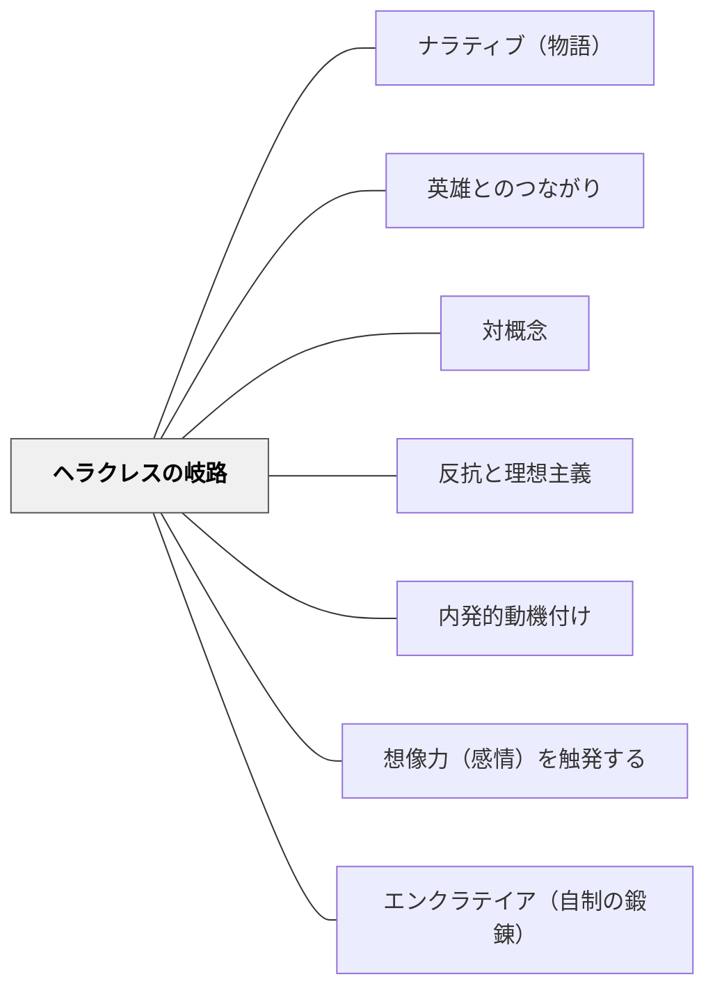

# ヘラクレスの岐路

> 神々は美にして善なるものの何一つとして、労苦と精進を抜きにしては人間にお与えにならないのです。——プロディコス（クセノフォン第一巻一章より）

## Pattern Connection

### クセノフォン（前370年代）——プロディコスのヘラクレス物語

クセノフォン『ソクラテスの思い出』第一巻第一章二一〜三四節において、ソクラテスはプロディコスの物語「ヘラクレスについて」を語る。これは物語（ナラティブ）を通じて人生の選択の構造を可視化し、学習者自身の選択意識を呼び起こす教育技法の最古の実例の一つである。

- **既存パタンとの関連**：[[パタン/ナラティブ（物語）]] が「物語で感情を動かす」ことを論じるなら、本パタンは「二つの対照的な人生を物語として提示し、学習者が選択する」という特定の構造を持つ。[[パタン/英雄とのつながり]] の英雄への憧れに、「どちらの道を選ぶか」という実存的な選択の次元が加わる。
- **補強された点**：[[パタン/内発的動機づけ]] の「外から押し付けない」という原理は、ヘラクレスの岐路において最も純粋な形で実現される——物語は提示するが、選択は学習者自身に委ねられる。
- **対比の構造**：カキア（悪徳・容易な道）とアレテー（徳・労苦の道）の対比は、[[パタン/対概念]] の教育的実例であり、[[パタン/反抗と理想主義]] の「理想に向かう衝動」を呼び起こす装置でもある。

---

## 背景（Context）

「善い生き方をしなさい」という直接的な道徳的指示は、特に若者には無効である。外から与えられた価値観は行動に結びつかない。一方、学習者が自ら「この道を行きたい」と選択するとき、その選択は自律的な行動の源泉になる。

クセノフォンのソクラテスは、若きヘラクレスが人生の岐路に立つ物語（プロディコス作）を語ることで、聞き手に「ヘラクレスならどちらを選ぶか」ではなく「自分はどちらの道を行くのか」という問いを内面に生じさせた。

## 問題（Problem）

「努力は大切だ」「目先の快楽を追わずに長期的な目標を見よ」と教えても、学習者の行動は変わらない。道徳的命令は防衛を生む。しかし人生の選択肢を物語として提示され、「あなたはどちらを選ぶか」と問われたとき、学習者は自分の問題として考え始める。

## 力のかたち（Forces）

- 物語への感情的な同一化は、抽象的な命令よりも強く行動に影響する
- 二つの対照的な道を並列に提示することで、どちらも「選べる」という現実感が生まれる
- ヘラクレスという英雄（卓越性の象徴）との同一化が「自分もそうありたい」という憧れを活性化する
- 選択は学習者に委ねられるため、強制感なく価値観への問いが生じる
- 「労苦の道」が最終的に豊かな報酬をもたらすという構造が、先延ばしの合理性を示す

## 解決（Solution）

**二つの人生の道を対照的な物語として提示し、学習者自身に「どちらを選ぶか」を考えさせる。選択は強要せず、問いとして開く。**

### プロディコスの物語の構造

| 登場 | 悪徳（カキア） | 徳（アレテー） |
|---|---|---|
| 外見の提示 | 「容易さ・快楽・安逸を約束する美しい女性」 | 「高潔さと労苦を示す別の女性」 |
| 約束の内容 | 苦労なしに最高の幸福・最上の食事・最上の愛 | 神々の愛・永続する評判・友人の尊敬 |
| 代償の明示 | 「労苦なしに享楽を得る方法を知っている」 | 「神々は美にして善なるものを、労苦と精進なしにはお与えにならない」 |
| ヘラクレスの選択 | （拒否する） | （徳の道を選ぶ） |

### 授業への変換

1. **対照的な二人の人物の物語**：同じ状況（例：算数が難しい場面）で、「諦めて違うことをした子」と「粘り強く取り組み続けた子」の1ヶ月後を短い物語として語る
2. **歴史上の人物の選択場面**：「このとき、この人はどちらを選ぶこともできた」という岐路を史実とともに提示する
3. **「もしヘラクレスなら」という問い**：困難な課題に直面した時「ヘラクレスならどうするだろう」という仮定の問いを置く（[[パタン/英雄とのつながり]] の実践）
4. **未来の自分の二つのシナリオ**：「今日練習を続けた自分」と「やめた自分」の1年後を具体的に描かせる

## 結果（Consequences）

- 学習者が価値選択を自分の問題として考え始める
- 「努力するのが正しい」という外的規範でなく、「努力した先に見えるものを自分が望む」という内的選択に変わる
- 英雄（卓越した人物）への同一化が自己理想形成を促す
- 困難な道を「選んだ」という自覚が、継続的な取り組みを支える
- ただし、物語の提示だけでは不十分——選択の後に実際の「労苦の第一歩」の支援が必要

## 関連パタン
- [[パタン/産婆役としての教師]]

- [[パタン/ナラティブ（物語）]] — 物語を感情の媒介として使う基本パタン
- [[パタン/英雄とのつながり]] — 卓越した人物との心理的同一化
- [[パタン/対概念]] — 二項の対比で構造を理解させる
- [[パタン/反抗と理想主義]] — 理想の生への衝動を活性化する
- [[パタン/内発的動機づけ]] — 外的強制でなく内的選択を育てる
- [[パタン/想像力（感情）を触発する]] — 感情と想像力を通じた学習の入口
- [[パタン/エンクラテイア（自制の鍛錬）]] — 徳の道を選んだ後に必要な自制の実践
- [[パタン/副次的学習]] — 物語を通じて形成される態度
- [[文献/ソクラテスの思い出（クセノフォン）]] — 本パタンの出典

## クラスター図

<!-- cluster: manual -->

## Actionable Insight

- **今週の「岐路の物語」**：単元の導入で、同じ課題に対して「すぐ諦めた人」と「労苦を引き受けた人」の1ヶ月後を1分間で語る——抽象的な「努力しよう」より、選択の物語の方が学習者の心に残る
- **「ヘラクレスなら？」を口癖にする**：困難な場面で「ヘラクレスの岐路を思い出して——どちらを選ぶ？」と問う。強制せず、選択を意識させる
- **二つのシナリオを書かせる**：「今日この困難に向き合った自分の3ヶ月後」と「避けた自分の3ヶ月後」を書く活動を週に1回置く——未来の自分像が現在の選択を変える

## 出典

クセノフォン（前370年代）『ソクラテスの思い出』第一巻第一章二一〜三四節（相澤 拓訳）光文社古典新訳文庫、2022年

> 「神々は美にして善なるものの何一つとして、労苦と精進を抜きにしては人間にお与えにならないのです」——プロディコス（クセノフォン第一巻より）
