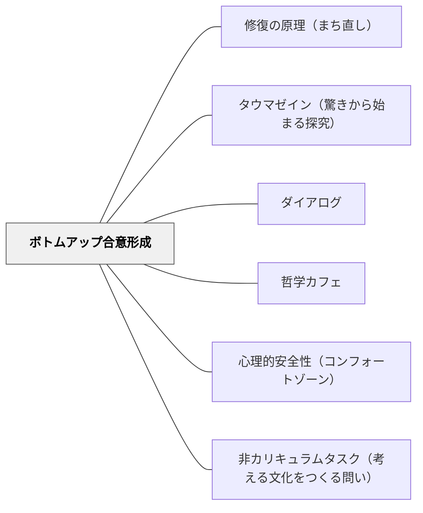

# ボトムアップ合意形成

> 「何が嫌か」ではなく「何に心が動かされたか」から問いを立て直す。個々の感動を出発点に、「なぜ？ではどうする？」の連鎖追求で全体の方針へと収束させる——これが「下から積み上げる合意」の作り方だ。

## [Pattern Connection]

### 中菊博（2009/2015）パタンランゲージと合意形成プロセスルール

**補強点**：
- パタン・ランゲージの「問題→解決」の記述形式が、住民参加の合意形成プロセスそのものに使われる実例を提供する。アレグザンダーの概念を教育・組織の文脈に転用できることを裏付ける。

**拡張点**：
- パタン（Pattern）＝「基本方針」という行政翻訳により、パタン・ランゲージが「記述ツール」から「合意形成ツール」へと機能を拡張する。結果・合意を「基本方針」として明文化し、それをもとに事業の優先順位を決めるマトリックス（戦略マップ）が生まれる。

**波及するパタン**：
- [[パタン/タウマゼイン（驚きから始まる探究）]] — 「感動ポイント」収集は、タウマゼインの合意形成版
- [[パタン/ダイアログ]] — ワークショップ型の対話と、Bohmのダイアログの構造的共通点
- [[パタン/哲学カフェ]] — 専門知識なしに対等に参加できる場の設計
- [[概念/パタン・ランゲージ概論]] — パタン＝基本方針の行政翻訳

---

## 背景（Context）

学校・地域・組織の改善場面で、人々が一堂に集まる機会がある。校内研修、保護者会、まちづくり会議——それぞれに「何かを変えよう」という動機がある。しかし集まった人々は異なる立場・価値観・経験を持ち、「誰かが正しくて誰かが間違っている」という単純な構図では語れない。

アレグザンダーの『パタン・ランゲージ』は個々の環境設計の知恵として生まれたが、まちづくり実践家の中菊博は、パタンを「基本方針」と翻訳することで、市民・行政・専門家が共通の言葉で議論できる合意形成ツールとして展開した。

## 問題（Problem）

多くの合意形成の場では、**トップダウン（専門家・行政・声の大きい人が既成案を提示する）**の構造が隠れており、多数の参加者の「本当に気になること」が反映されない。

さらに「問題点を挙げてください」という問いで始まる会議は、不満・批判の列挙になりやすい。感情的な対立が生まれ、解決より紛糾が先に来る。専門知識のある人だけが発言でき、多くの人が沈黙する。

## 力のかたち（Forces）

- 人は「良いと感じること」の理由を言語化する習慣がなく、「悪いことを言う方が言葉にしやすい」
- 多人数の議論では、最初に声の大きい人・専門家の意見が場を支配しやすい
- 「正解を出さなければならない」という圧力が、意見の表明を抑制する
- 抽象的な議論は空転しやすく、具体性がないと合意が実感されない
- 個人の感動・経験は「主観的すぎる」として排除されがち
- 全員が同意しないと動けない「全会一致幻想」が議論を硬直させる

## 解決（Solution）

**「感動ポイント」から始め、「芋づる方式（連鎖追求）」で問いを深め、KJ法でグルーピングし、「基本方針（パタン）」へと結晶化する——個々の声を収束させる、ボトムアップの合意形成プロセスを設計する。**

### 感動ポイント収集——「好き」から始める

参加者が現場に出て（または現場を思い浮かべて）「心が動かされたこと」を先に書き出す。

- 「何が嫌いか」ではなく「何が好きか」「なぜかここが気になる」という感動を先に拾う
- クレヨンスケッチ（粗い絵でよい）で「見えたもの・感じたもの」を記録する
- 「なぜ好きか？」の理由を掘ることで、阻害条件が自ずと見えてくる

この順序が重要だ——良さを先に発見することで、「良さを守るために何が必要か」という建設的な問いが生まれる。

### 芋づる方式（連鎖追求）——「なぜ？」の連鎖で問いを深める

感動ポイント・問題点について、ファシリテーターが「なぜ？」「ならばどうする？」「そのためには？」を繰り返し問いかける。

```
感動ポイント（「この角が気持ちいい」）
  → なぜ? （「日当たりがいいから」「人通りが見える安心感がある」）
    → それを阻害しているものは? （「新しい建物の影で陰になる」「車が多い」）
      → 仮の解決案は? （「高さ制限のルール」「歩道拡幅」）
        → その解決案の問題点は? （「費用」「既得権」「誰が管理する?」）
          → さらなる解決策は? ……
```

この「芋づる」を視覚的に図解（ファシリテーショングラフィック）しながら会議を進める。箇条書きでなく、矢印・囲み・対立関係を使って「連鎖の地図」を描く。

### KJ法の応用——個人の声をグルーピングする

ポストイットに一つずつ「切実に気になること」を書き出し、大・中・小（まち全体/建物規模/人・小物規模）の3分類でグルーピング。

1. 各人がポストイットに書く（1枚1アイデア・最大5枚）
2. 大中小のスケールで分類（グルーピング）
3. 各グループにタイトルをつける
4. グループ間の関係を矢印・囲みで図解化
5. 全体ストーリーとして文章化・まとめ発表

「一匹オオカミ（どのグループにも入らない意見）」は無理に分類せず、後で全体の中での位置を考える。

### 基本方針（パタン）の結晶化

グルーピングと連鎖追求の結果から、「何度も出てきた言葉・価値・関係性」を取り出し、「基本方針（パタン）」として命名する。

- 良い基本方針は「動詞的」で「行為に結びつく」——「緑を守る」より「緑を活かすイベントを月1回開く」
- 複数の事業を束ねられる方針が良い方針（事業の複合化が可能）
- 基本方針は一つに絞らず、目的ごとに3〜5個あってよい

### 戦略マップ＋マトリックス——合意の「見える化」

| | 具体的事業A | 具体的事業B | 具体的事業C |
|---|---|---|---|
| **基本方針1** | ○ | △ | |
| **基本方針2** | | ○ | ○ |
| **基本方針3** | △ | | ○ |

縦軸に基本方針（パタン）、横軸に具体的事業を並べ、交差点にコメントを書き込む。複数の基本方針に貢献する事業が優先順位として浮かび上がる。

---

### 具体例1——学校の保護者会での応用

従来型：「本校の問題点について意見をお聞きします」→ 不満の列挙・対立。

ボトムアップ型：「この学校で、あなたが『いいな』と思った場面を一つ教えてください」から始め、参加者が各自ポストイットに記入。グルーピングして「私たちが大切にしたいこと」を基本方針として整理する。そこから「課題は何か」「できることから何を始めるか」へと展開する。

### 具体例2——教室での問題解決学習への応用

「この地域のどこが好き？ なぜ？」という問いから始め、子どもたちが感動ポイントをスケッチ。「なぜ好きか？」「じゃあ困っていることは？」と芋づるでつなぎ、学習課題を生成する。子ども自身が「自分の感動から生まれた問い」を持つことで、学習の動機が変わる。

### 具体例3——北九州K市のまちづくりワークショップ実践

中菊博が報告する実践。住民ワークショップで目的6つ・基本方針26・戦略プロジェクト11を生成。マップ上に事業を落とし込み、市民版マスタープランとして行政に提出。行政側は「既存事業との対照・住民の声のベース」として尊重する根拠を得た。

---

## 結果（Consequences）

- 声の大きい人・専門家だけでなく、参加者全員の「切実な感動・困り」が議論の素材になる
- 「感動から始まる問い」は当事者意識を生み、「どうせ決まっている」という不信を減らす
- 複数の基本方針×複数の事業のマトリックスが生まれ、行政縦割りを超えた複合的な提案が自然に生まれる
- 逐次的に合意を積み重ねるので、最終的な合意がより多くの人に「自分たちの合意」として実感される
- アレグザンダーの言う「有機的秩序」——環境の部分と全体の均衡——が、プロセスの結果として自然に現れる

## 関連パタン

- [[概念/パタン・ランゲージ概論]] — パタン＝基本方針の行政翻訳。本パタンの理論的背景
- [[パタン/修復の原理（まち直し）]] — ボトムアップ合意形成の目的：「まち直し（修復）」のための合意形成
- [[パタン/タウマゼイン（驚きから始まる探究）]] — 感動ポイントと驚き・不思議から問いが生まれる構造
- [[パタン/ダイアログ]] — ボトムアップ合意形成の対話的側面。Bohmのダイアログとの異同
- [[パタン/哲学カフェ]] — 専門知識なしに市民が対等に参加できる場の設計
- [[パタン/心理的安全性（コンフォートゾーン）]] — 感動ポイントを安心して出せる場の条件
- [[パタン/非カリキュラムタスク（考える文化をつくる問い）]] — 「余白」での問いが感動ポイントを生む
- [[文献/パタンランゲージと合意形成プロセスルール（中菊博）]] — 本パタンの主要出典

---

## クラスター図



## Actionable Insight

- **「問題点は？」を「感動した場面は？」に変えてみる**: 今週の保護者会・職員会議の冒頭の問い方を変えて、どれだけ場が変わるか観察する
- **芋づる方式を1対1でやってみる**: 子どもの困り事を聞くとき「なぜ？ではどうする？」を3回繰り返すだけで、解決策の質が変わるか試す
- **クラスの「感動スケッチ」を授業に取り入れる**: 社会・生活・理科の単元の入口で、「現場に行ってクレヨンで気になったものを描く」という活動を設け、そこから問いを立てる授業設計を試みる
- **小さな合意の積み重ね**: 学級会や委員会で「今日決められる一番小さなこと」から始め、大きな議題を一度で解決しようとしない会議設計を意識する

---

## 出典

中菊博（2009/2015）『パタンランゲージと合意形成プロセスルール』やわらかいパタンランゲージ ブックレット（2009年PDFとして発表、2015年Kindle版）

> 「パタン（Pattern）というのは、合意形成の言語では、行政の基本方針と同じです」——中菊博
