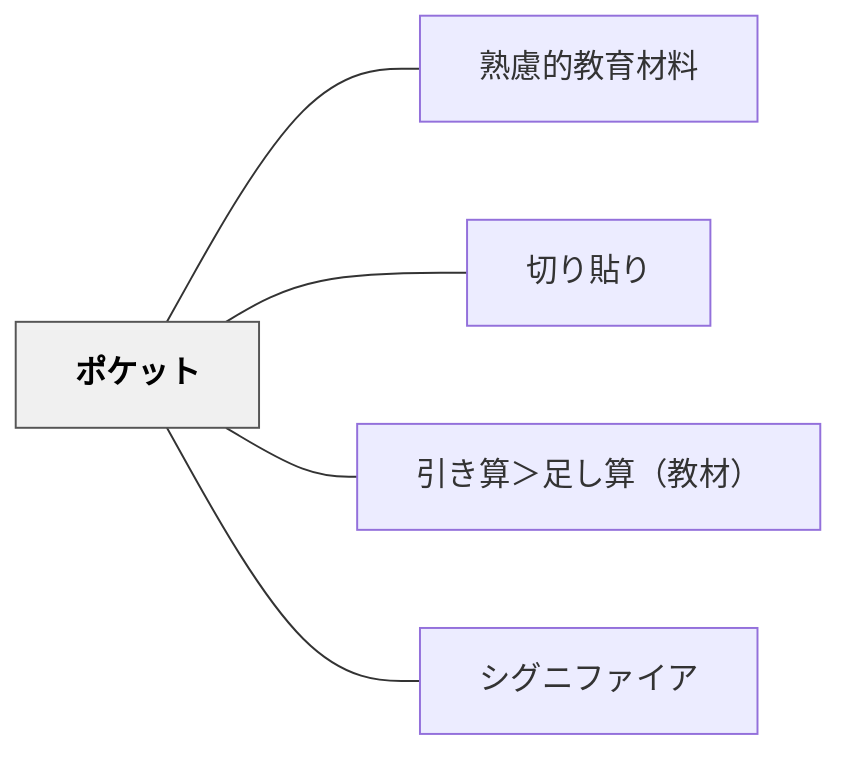

# ポケット

> 教材に「ポケット」を設けてカード・付箋・資料を収納できるようにし、教材を活性化する。

## 背景（Context）

アナログ実装技法の一つ。ノート・ファイル・冊子にポケットやエンベロープを設けてカード・資料を収納する手法。動画記録では「ポケット付き教材」の実例として、学習カードや参照資料を入れられる工夫が紹介された。情報が必要なときに取り出せる設計が学習を支援する。

## 問題（Problem）

参照資料や補足情報が本文に埋め込まれると、必要でないときにも目に入り認知負荷を高める。

## 力のかたち（Forces）

- 必要なときだけ取り出せる設計が認知負荷を管理する
- 収納・取り出しの操作が学習への能動的関与を促す
- 物理的なポケットが学習者に教材への愛着を生む

## 解決（Solution）

**教材にポケット・エンベロープ・収納スペースを設け、補足カード・参照資料・ヒントカードなどを収納できるようにする。必要に応じて取り出して使う設計にする。**

## 結果（Consequences）

- 認知負荷が適切に管理される
- 学習者が教材を自分なりに使いこなせる

## 関連パタン

- [[パタン/熟慮的教材教具]] — 親パタン
- [[パタン/切り貼り]] — 操作的教材技法
- [[パタン/引き算＞足し算（教材）]] — 情報量の管理
- [[パタン/シグニファイア]] — 使い方の明示

## クラスター図

## Actionable Insight

- ワークシートにポケットを設けて「必要なときだけ開けるヒントカード」を入れる——必要なときにだけ取り出す設計が認知負荷を管理し自律的な学習を促す
- ノートや冊子の裏表紙に封筒を貼り付けて参照カード・語彙カードを収納できるようにする——教材への能動的な操作が学習者の愛着と主体的な活用を生む
- 補足情報・発展内容をカードにして「気になった人だけ読む」形で別添えにする——メインの学習を妨げずに個別の好奇心を満たす設計が多様な学習者に対応する

## 出典

- 鈴木克明（2002）『教材設計マニュアル――独学を支援するために』北大路書房
