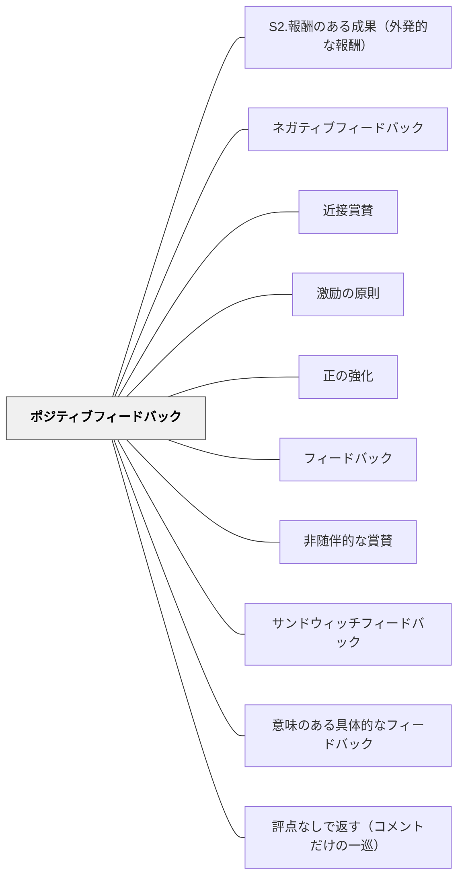

# ポジティブフィードバック

> うまくいっていることを認め、それを強化するフィードバック。改善を求めるフィードバックとの適切なバランスが、学習者の意欲と成長を支える。

## 背景（Context）

フィードバックというと「改善すべき点を伝えること」というイメージが強いが、うまくいっていることを認め強化するポジティブフィードバックも同様に重要である。行動分析の知見は、強化が行動の継続・定着に効果的であることを示しており、学習においても「何がうまくいっているか」を知ることは次の行動を方向づける重要な情報となる。

ポジティブフィードバックは、[[パタン/非随伴的な賞賛]]（行動と無関係の称賛）とは区別される。具体的な行動・成果・プロセスに随伴した「何がなぜ良いか」を伝えるフィードバックである。

## 問題（Problem）

改善点の指摘ばかりを受け続けると、学習者は「自分は常に不十分だ」という感覚を持ちやすく、自信の喪失・意欲の低下・失敗への恐れにつながることがある。特に学習の初期段階では、うまくいっていることを認識することが次のステップへの動機づけになる。

一方で、ポジティブフィードバックだけでは改善が促されない。批判を避けるためにポジティブのみを伝えると、学習者は問題点に気づかず停滞することもある。ポジティブとネガティブ（改善）のバランスの設計が問われる。

## 力のかたち（Forces）

- うまくいっていることを伝えることで、その行動・方法が強化され継続・定着しやすくなる
- ポジティブフィードバックは学習者の自信と意欲を支え、批評を受け取る土台となる
- ポジティブだけでは改善に向かわず、ネガティブ（改善点）との適切な比率が必要

## 解決（Solution）

フィードバックの設計において、ポジティブ（何がうまくいっているか）と改善（何が課題か）の両方を意識的に含める。ポジティブフィードバックは具体的に「何が・なぜ良いか」を述べる。「この構成の工夫は説得力を高めている」「この問いの設定が独創的で探究の方向を切り開いた」という形である。

研究が示すポジティブ：ネガティブの比率（例：ビジネス文脈での5:1など）は文脈依存であり、固定的なルールではないが、特に学習の初期・困難な課題・自信が揺らいでいる場面ではポジティブの比重を高めることが有効である。[[パタン/サンドウィッチフィードバック]]とは異なり、ポジティブフィードバックは「批評を包む形式」ではなく、それ自体が独立した学習情報として機能させる。

---

### 反対証拠——称賛が学びを止めるとき（Black & Wiliam, 1998）

このパタンには、正面から向き合うべき強い反対証拠がある。ブラックとウィリアム（1998）がレビューした一群の研究は、**称賛が遂行に対してしばしば負の効果をもつ**ことを示している。

- **Butler（1987）**：コメント／評点／**称賛**／なしの4条件で、コメント群だけが他の3群より1標準偏差高かった。**称賛群は「自分はうまくいった」という感覚が最も高かったのに、実際にはコメント群より有意に成功していなかった**。称賛は成功感だけを上げ、成果を上げなかった。
- **注意の三水準**：フィードバックは注意を**自己**に向けるか（メタ課題過程）、**課題**に向けるか（課題動機づけ過程）で効果が分かれる。「称賛は、自尊心に注意を向け課題から注意を逸らす他の手がかりと同様、一般に**負の**効果をもつ」（p.49）。
- **Good & Grouws（1975）ほか**：**最も効果的な教師は、むしろ平均より称賛が少ない**。
- **Kluger & DeNisi（1996）**：フィードバック全般の大規模メタ分析（131報告・607効果量・12,652名）で平均効果量は0.40だが、**5件に2件は負の効果**だった。負の効果は設計の粗さの産物ではなく実在する。

**このパタンを捨てる必要はない。区別すべきなのは「誰をほめるか」である。**

この Wiki がすでに置いている区別——[[パタン/非随伴的な賞賛]] との対比、そして「『すばらしい』ではなく『この段落の論理の展開が明確で、主張が読者に伝わりやすい』と書く」という Actionable——は、まさにこの反対証拠が要求する線引きと一致している。Butler の実験で効いた「コメント」とは、本パタンが推奨する**行動に随伴した具体的な記述**そのものである。逆に効かなかった「称賛」とは、**人に向かう抽象的な承認**である。

したがって実務上の帰結はこうなる。

- 「がんばったね」「すばらしい」を減らし、**作業の何がどう効いたか**を述べる（「ここで前の段落と言葉をそろえたから、読み手が迷わなくなった」）
- ほめる対象を**人（あなたは優秀だ）から作業（この手が効いた）へ**移す
- 称賛の**量**を増やすことを目標にしない。比率の議論（5:1など）は文脈依存であり、質の問題を量で代替できない

なお日本の教室では、称賛が学級経営の道具でもあるという事情がある。全体の場での承認が集団の規範を作る機能は、学習情報としての機能とは別に評価する必要がある。両者を混ぜて「称賛は有害」と単純化しないこと。詳しくは [[概念/自我関与と課題関与（フィードバックが向ける先）]]。

---

## 結果（Consequences）

- 強みが認識されることで、その強みを意識的に活用できるようになる
- 自信と意欲が支えられ、批評を受け取る余地（心理的安全）が生まれる
- 行動に随伴したポジティブフィードバックは、良い学習習慣の定着を促す

⚖ **緊張関係**: [[緊張関係マップ]] — [[パタン/内発的動機づけ]]・[[パタン/非随伴的な賞賛]]・[[パタン/アリテラシー（読む意志）]]・[[パタン/利己愛の罠（比較が内発的動機を壊す）]] と拮抗する。判断軸：〈プロセスへの情報か操作かで選ぶ〉

## 関連パタン
- [[学級経営/学級経営で使えるパタン]]
- [[特別支援/特別支援で使えるパタン]]
- [[パタン/S2.報酬のある成果（外発的な報酬）]]
- [[パタン/ネガティブフィードバック]]
- [[パタン/近接賞賛]]
- [[パタン/激励の原則]]
- [[パタン/正の強化]]

- [[パタン/フィードバック]] — 親パタン
- [[パタン/非随伴的な賞賛]] — 行動と切り離された称賛との対比
- [[パタン/サンドウィッチフィードバック]] — ポジティブと改善を組み合わせる形式的手法
- [[パタン/意味のある具体的なフィードバック]] — ポジティブフィードバックにも求められる具体性
- [[概念/自我関与と課題関与（フィードバックが向ける先）]] — 称賛が注意を自己へ向け、課題から逸らす機序。本パタンの適用限界を定める軸
- [[パタン/評点なしで返す（コメントだけの一巡）]] — Butler の実験で唯一効いた「コメント」の実装。称賛でも評点でもない返し方
- [[文献/Assessment and Classroom Learning（Black & Wiliam）]] — 称賛が遂行に負の効果をもちうるという反対証拠の出所（Black & Wiliam, 1998）

## クラスター図

## Actionable Insight

- フィードバックを書くとき「何がうまくいっているか・なぜ良いか」を具体的に一文述べてから改善点を添える——具体的なポジティブが学習者の強みを意識化させ次の行動を方向づける
- 特に学習の初期段階や困難な課題では、ポジティブの比重を意識的に高める——「できている部分がある」という認識が批評を受け取る心理的安全の土台になる
- 「すばらしい」ではなく「この段落の論理の展開が明確で、主張が読者に伝わりやすい」と書く——行動に随伴した賞賛のみが学習情報として機能する

## 出典

Hattie, J. & Timperley, H. (2007). The Power of Feedback. *Review of Educational Research*, 77(1), 81–112.
Black, P., & Wiliam, D. (1998). Assessment and classroom learning. *Assessment in Education: Principles, Policy & Practice, 5*(1), 7–74.
Butler, R. (1987). Task-involving and ego-involving properties of evaluation. *Journal of Educational Psychology, 79*, 474–482.
Kluger, A. N., & DeNisi, A. (1996). The effects of feedback interventions on performance. *Psychological Bulletin, 119*, 254–284.
Losada, M. & Heaphy, E. (2004). The Role of Positivity and Connectivity in the Performance of Business Teams. *American Behavioral Scientist*, 47(6), 740–765.
