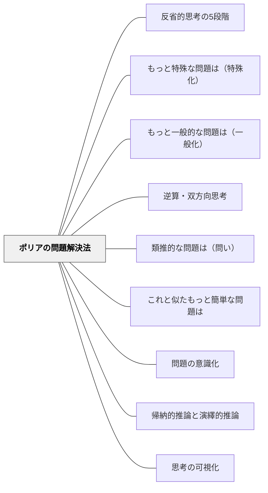

# ポリアの問題解決法

> 「答えを出すこと」ではなく「どう考えたか」を可視化する4段階の枠組みが、思考するクラスを作る。

---

## [Pattern Connection]

**数学ガールの物理ノート／ニュートン力学（結城浩, 2024）統合：**

ミルカの問い方がポリアの4段階の生きた実践として機能する。第4章「力学的エネルギー保存則」で、ミルカは「知らないふりゲーム」を提案し、テトラとの対話の中で「求めるものは何か」「与えられているものは何か」「どこからスタートすればテトラは納得するか」と問い続ける。これはポリアのStep 1（問題を理解する）を「相手の理解に立って」実行する高度な応用である。

あとがきで結城浩は、ポリア『いかにして問題をとくか』を参考文献として明示的に紹介している。ミルカの問い方はポリアの4段階を「対話の中で自然に実践するモデル」として読める。

**ポリアとミルカの対応：**

| ポリア（1945） | ミルカの実践（結城, 2024） |
|---|---|
| Step 1: 与えられているものは何か | 「運動方程式だけから何が使えるか？」 |
| Step 2: 計画を立てる | 「知らないふりゲーム——使える道具を最小化する」 |
| Step 3: 実行する | テトラと一歩ずつ導出を進める |
| Step 4: 振り返る | 「なぜ½m倍なのか、言えるか？（証明より発見）」 |

- **補強された点**:
  - Step 1「与えられているものは何か」の重要性が、「知らないふりゲーム」（使えるものを最小化する）として具体的に実装される——「使えないものを除いたとき何が残るか」の意識的操作。
  - Step 4「振り返り」の深さが、テトラの「証明より発見」問題として示される——「別の方法でも解けるか」だけでなく「なぜこの形になるのか」まで問うのが真の振り返り。これは [[パタン/発見を委ねる（自分で見つけたものこそ燃え上がる）]] の「燃え上がり」と接続する。

- **他のパタンへの波及**:
  - [[パタン/知らないふりゲーム（既知を問い直す）]] — ポリアの問い方を「知らないふり」として実践することで、Step 1が「既知を保留する」行為として体験できる。

→ [[文献/数学ガールの物理ノート・ニュートン力学（結城浩）]]

### 数学ガールの秘密ノート・丸い三角関数（結城浩, 2014）——「《持っているもの》から《求めるもの》を作る」と自問自答の内面化

本書では、テトラがポリアの問いかけを実際に使い、最終的に「自問自答する習慣」として内面化する軌跡が描かれる。

**第3章での初使用（第一歩）：**
語り手が「《求めるものは何か》」「《与えられているものは何か》」と問いかけると、テトラが:
> 「先輩の《問いかけ》です。あたし、いかに自分がぼんやりしているかわかりました。問題をふわふわ考えて、図を適当に描いているんだよくわかりました！」

Step 1「問題を理解する」が「図を描かず・求めるものを書かずに進む」という「ふわふわした状態」の自覚として機能している。

**第5章での発展（言い換えの発見）：**
> テトラ「《持っているもの》から《求めるもの》を作る……！」

「与えられているもの→求めるもの」という順序の言い換えが、テトラの言葉で生まれる。この言い換えが「求めるもの＝ゴール、持っているもの＝スタート地点」という問題解決の地図を作る。

**習慣化の宣言（本書の最重要場面）：**
> テトラ「先輩はていねいに《ポリアさんの問いかけ》をしてくださいました」
> 「うん、そうだね。僕自身、難しい問題に取り組むときは自問自答するよ」
> テトラ「そうやって自分に問いかけるというのを意識してやったことがありませんでした。**先輩がやっている良いことを、あたし、もっと身につけたいです。それが——それが、あたしのいまの《求めるもの》ですっ！**」

「ポリアの問いかけを自分に問いかける習慣を身につけること」がテトラ自身の「求めるもの」になる——ポリアの問いかけが完全に内面化された瞬間。

- **補強された点**:
  - Step 2「計画を立てる」の中で「《変数への代入による特殊化》」が具体的に実装される——x軸上(a,0)→y軸上(0,b)→一般点(a,b)という順序が「より単純な問題を解く」ストラテジーの生きた実例。
  - Step 4「振り返り」が「《三角関数は円関数》といってもいいくらい」という再定義として現れる——「この解法は他に何を教えているか」という問いがここで生まれる。

→ [[パタン/空白のノートで再現する（知識をおもちゃにする）]]（ポリアの問いかけを「自問自答」として白紙ノートでも使う）
→ [[文献/数学ガールの秘密ノート・丸い三角関数（結城浩）]]

### 数学ガールの秘密ノート・整数で遊ぼう（結城浩, 2014）——「こうだったらいいのになあ」という理想化の思考とメタ戦略の明示化

**「こうだったらいいのになあ」——理想化・単純化がStep 2の手がかりになる：**

第5章で3個の時計（2の時計・3の時計・5の時計）という複雑な問題に直面したとき、「時計が1個なら話は簡単なのに」というユーリの発言を語り手は問題解決の資源として扱う。

> 「《こうだったらいいのになあ》と願うのはとてもいいことなんだよ。それが問題を解く《手がかり》になるからだよ。考えを進める方向が少し見えたことになる。ミステリーと同じだよ」

ポリアのStep 2「計画を立てる」の「より単純な問題を解く」ストラテジーは、技術として提示されることが多い。本書はそれを**態度**として再定義する——「できたらいいのに、という願いは問題解決の戦略である」という言い換えが、学習者にとって壁を下げる。「3個の時計→1個の時計」という理想化が「3個を1個ずつ合わせる」という構成的解法の手がかりになり、最終的に中国剰余定理の構成に相当する手順を発見することになる。

**本書の索引に現れるメタ戦略キーワード群——思考の道具の言語化：**

本書は問題解決の「メタ戦略」に明示的な名前を与え、索引に収録している。ポリアの「問題解決ストラテジー」（Step 2の計画ツール）に対応する日本語の言語化として機能する。

| 結城のキーワード | ポリアのストラテジー対応 |
|---|---|
| 《当たり前のことから始める》 | より単純な問題を解く |
| 《極端なことを考える》 | より単純な問題を解く（極端化） |
| 《こうだったらいいのになあ》 | より単純な問題を解く（理想化） |
| 《小さな数で試す》 | 表・リストを作る |
| 《パターンの発見》 | パターンを探す |
| 《表で考える》 | 表・リストを作る |
| 《文字の導入による一般化》 | 方程式を使う |
| 《例示は理解の試金石》 | Step 1「問題を理解する」の深化 |

これらを板書・掲示しておくことで「今どのストラテジーを使っているか」の自覚が生まれ、Step 2が「技法の選択」として機能しやすくなる。

→ [[パタン/例示は理解の試金石（具体例で理解を確かめる）]]（新規）
→ [[文献/数学ガールの秘密ノート・整数で遊ぼう（結城浩）]]

---

### Nappo & Valente（2026）——「より簡単な問題を探す」は類推的推論の科学的拡張

本書はポリアの次の一文で始まる：

> "If you can't solve a problem, there is an easier problem you can solve: find it." — Pólya (1957: 114)

著者たちはこの助言を「類推的推論の本質を最も端的に言い表した言葉」として提示する。見知らぬ問題・未知の対象（target）に直面したとき、記憶の中から類似する親しみのある問題・対象（source）を探し出し、その対応構造を転用する——これが類推的推論であり、数学の外でも「研究の初期段階で科学者が一般に使う戦略」である（p.1）。

**Step 2「計画を立てる」のストラテジーの中心に類推が置かれる構造：**

| ポリアのストラテジー | 類推的推論の観点 |
|---|---|
| **「関連した問題を知っているか？」** | source system を記憶から探すプロセスそのもの |
| **「より単純な問題を解く」** | 認識論的に困難な target を、扱いやすい source に置き換える |
| **「特殊なケースを考える」** | cross-type から within-type 類似へ絞り込む |
| **「パターンを探す」** | 関係マッピング（relational mapping）の発動 |

- **補強された点**：既存パタンは数学的問題解決の枠組みとしてポリアを扱っているが、Nappo & Valente により「ポリアの問いかけは類推的推論の発見的役割（heuristic role）の普遍的実装」という位置づけが与えられる。数学に留まらず物理・生物・経済・考古学まで同じ構造で働く。
- **新たな示唆**：「類推は仮説生成ツールであって正解の保証ではない（heuristic view）」という観点から、Step 2 のストラテジーを「アイデアを出すための道具」として心理的に安全に使える文脈が生まれる——探索的に試す許可。
- **波及するパタン**：[[パタン/類推（アナロジー）]]（Step 2 と類推の接続）・[[パタン/知らないふりゲーム（既知を問い直す）]]（source を一旦括弧に入れて再発見する）

→ [[文献/Analogical Reasoning in Science（Nappo & Valente）]]

---

## 背景（Context）

ジョージ・ポリア（George Polya, 1887–1985）はスタンフォード大学の数学者で、その著書 *How to Solve It*（1945）は100万部以上を売り上げ、25以上の言語に翻訳された。ポリアの4段階は数学教育における問題解決指導の基礎として世界的に定着している。

Blitzer（2014）は *Thinking Mathematically* の冒頭（Chapter 1, Section 3）でこの4段階を提示し、「これは問題解決のすべての手順を機械的に踏むための硬直したレシピではなく、問題解決のプロセスを整理するための柔軟な枠組みである」と明記している。

## 問題（Problem）

授業で「どう考えたか」が見えないまま「答えは〇〇です」で終わると、子どもは「解き方を覚える」以上のことを学ばない。また、問題を前にしたとき「何から始めればいいかわからない」という状態になる子が多い——これは「問題解決の入り口」を知らないためである。

## 力のかたち（Forces）

- 問題解決は直線的ではなく、行き来しながら進む——だからこそ「今どのステップにいるか」の意識が助けになる
- 「わからない」「詰まった」という状態は失敗ではなく、問題解決のプロセスの中の正常な状態
- 答えを確認した後に「別の方法はあるか」を問う経験が数学的柔軟性を育てる
- メタ認知的な声かけは、このフレームを持っている教師でないとできない

## 解決（Solution）

**ポリアの4段階問題解決法**（Polya, 1945; Blitzer, 2014）：

---

### Step 1: Understand the Problem（問題を理解する）

問題文を少なくとも2回読む。
- 1回目：全体の把握
- 2回目：「何を求められているか」「与えられている情報は何か」「足りない情報はないか」「余分な情報はないか」を明確化

**問いかけの例**：「この問題は何を聞いていますか？」「わかっていることを箇条書きにしてみよう」

---

### Step 2: Devise a Plan（計画を立てる）

以下の問題解決ストラテジーから1つ以上を選ぶ：

| ストラテジー | 使いどころ |
|------------|----------|
| 図・絵を描く | 空間的・構造的な問題 |
| 表・リストを作る | 組み合わせ・数え上げ |
| パターンを探す | 数列・規則性 |
| 逆算する（Work Backward） | 最終値→初期条件を求める |
| 類似した問題を考える | 複雑な問題の構造を単純版で把握 |
| より単純な問題を解く | 小さな数・少ない変数で試す |
| 消去法を使う | 可能性を絞り込む |
| 方程式・系統図を使う | 関係を形式化する |

**問いかけの例**：「これと似た問題を解いたことがある？」「どんな方法で始められそう？」

---

### Step 3: Carry Out the Plan（計画を実行する）

選んだストラテジーを実行する。途中で詰まったら別のストラテジーに切り替える。

**問いかけの例**：「今どこまでわかった？」「詰まったのはどこ？」

---

### Step 4: Look Back（振り返る）

- 答えは問題の条件を満たしているか
- 計算は正しいか
- **別の方法でも解けるか**（最重要）
- この解法は似た問題に応用できるか

**問いかけの例**：「この答えで本当に合っているか確認できる？」「他の方法で解くとしたらどうする？」

---

### Dewey の反省的思考との対応

| Dewey（1916）反省的思考 | Polya の4段階 |
|----------------------|--------------|
| ①困惑・疑問 | Step 1: 問題を理解する |
| ②問題の知的化 | Step 1〜2: 理解→計画 |
| ③仮説・提案 | Step 2: 計画を立てる |
| ④推論による精緻化 | Step 3: 計画を実行する |
| ⑤検証 | Step 4: 振り返る |

ポリアの4段階は Dewey の反省的思考を**数学問題解決に特化**させたもの。Dewey が「思考の質」を強調するように、ポリアも「答えよりプロセス」を重視する。

---

## 結果（Consequences）

- 「詰まること」が失敗でなく「問題解決中の正常な状態」として受け入れられる
- Step 4「振り返り」が習慣になると、一つの問題から複数の解法・一般化への視点が生まれる
- 教師が「今どのStep？」と問うだけで、子どもの思考プロセスが可視化される
- 問題解決ストラテジーの名前（「逆算」「類似問題」等）を学ぶことで、メタ認知語彙が増える

## 関連パタン
- [[教科/算数・数学で使うパタン]]

- [[パタン/反省的思考の5段階]] — Dewey の反省的思考との対応関係（上表参照）
- [[パタン/もっと特殊な問題は（特殊化）]] — Polya の「より単純な問題を解く」ストラテジー
- [[パタン/もっと一般的な問題は（一般化）]] — Step 4「振り返り」で「この方法はどこまで使える？」
- [[パタン/逆算・双方向思考]] — Polya の「Work Backward」ストラテジー
- [[パタン/類推的な問題は（問い）]] — 「類似した問題を考える」ストラテジー
- [[パタン/これと似たもっと簡単な問題は]] — 「より単純な問題を解く」の具体形
- [[パタン/問題の意識化]] — Step 1「問題を理解する」の深化
- [[パタン/帰納的推論と演繹的推論]] — ポリアが使う両方の推論スタイル
- [[パタン/思考の可視化]] — 4段階を板書・掲示してクラスで共有する

---

## クラスター図

## Actionable Insight

- 授業で問題を提示したあと、「Step 1: 問題に書いてある情報を箇条書きにしよう」と一行分の時間を作る——この一手間が「なんとなく解き始める」から「理解して解き始める」への転換をもたらす
- 解答後に必ず「別の方法は？」を問う30秒を加える——これがStep 4（振り返り）の文化を作る起点になる
- 「詰まった人？」と手を挙げさせ、「詰まった場所を教えて」と聞く——詰まりは思考の証拠であり、クラスの学びのリソースになる
- ストラテジーの名前（「図を描こう」「逆算してみよう」等）を板書し、子どもが自分でストラテジーを選べる状態を作る——選択肢が見えると「何もできない」状態から脱出しやすい

---

## 出典

Polya, G.（1945）*How to Solve It*. Princeton University Press.（邦訳：G. ポリア著、柿内賢信訳（1954）『いかにして問題をとくか』丸善出版）
Blitzer, R. F.（2014）*Thinking Mathematically* (5th ed., Ch.1, Sec.3). Pearson Education Limited. → [[文献/Thinking Mathematically（Blitzer）]]

> "Use Polya's four steps as a guide to help you solve problems. These steps are not a rigid recipe that must be followed exactly. Rather, they serve as a flexible framework for organizing your thinking." ——Blitzer（2014）
