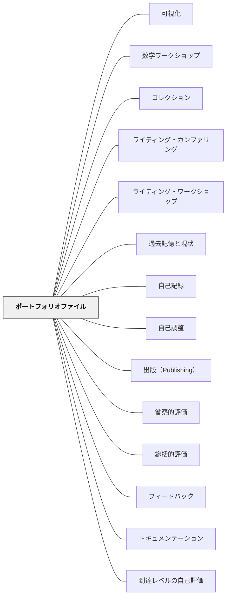

# ポートフォリオファイル

**一文でいうと**：作品・振り返り・成長の記録を蓄積し、学びの変化を見えるようにする。

## 使いどころ・使いすぎ注意

| 観点         | 内容                                       |
| ------------ | ------------------------------------------ |
| 使いどころ   | 成長や作品の蓄積を見たいとき。             |
| 使いすぎ注意 | 溜めるだけになると、振り返りに使われない。 |

> 昨日の自分と今日の自分を並べたとき、成長ははじめて見えるものになる。

## 背景（Context）

学習の成長は、多くの場合ゆっくりと積み重なるため、渦中にいる学習者自身にはその変化が見えにくい。ポートフォリオは、学習の成果物を時系列で蓄積・整理したコレクションであり、学習の軌跡と成長を可視化するためのツールだ。

単なる作品の保管庫ではなく、「自分がどのように学んできたか」を語るナラティブを含むものとして設計されるとき、ポートフォリオは深いメタ認知の実践となる。

## 問題（Problem）

学習の成果物が使い捨てになっている環境では、学習者は「学んだこと」が手元に残らない。過去の作品と現在の作品を比較する機会がなければ、成長を実感することも、自分の学びのパターンを振り返ることもできない。

また、一時点の評価（テストや提出課題の点数）だけでは、学習者の成長の過程や学び方の特徴が見えてこない。保護者や次の教師も、学習者の全体像を把握しにくい。

## 力のかたち（Forces）

- ポートフォリオは蓄積に時間がかかり、維持管理に労力が必要
- 選択・整理・振り返りの過程こそがポートフォリオの学習価値であり、単なる保管では効果が薄い
- デジタルポートフォリオは管理が容易だが、物理的なポートフォリオには手で触れる実感がある

## 解決（Solution）

学習者が定期的に自分の作品を振り返り、「この作品を選んだ理由」「この時期の自分の状態」「現在との違い」を言語化する機会を設ける。時系列で作品を並べることで、学習の軌跡が一目でわかるようになる。

ポートフォリオには、「最もよくできた作品」だけでなく「最も成長を感じた作品」「最も苦労した作品」なども含めることで、多様な学びの側面が記録される。定期的なポートフォリオ発表（保護者向け・クラス内）を行うと、振り返りの動機と共有の喜びが生まれる。デジタルツール（ブログ・専用アプリ・フォルダ管理）と物理的なファイルの両方が有効な形式として機能する。

## 結果（Consequences）

- 学習者が自分の成長を具体的に認識し、学習意欲が高まる
- 学習の過程と思考の深まりが可視化され、総括的評価の補完情報として機能する
- 学習者がメタ認知を育て、「自分はどのように学ぶか」を語れるようになる

## 関連パタン
- [[パタン/可視化]]
- [[パタン/数学ワークショップ]]
- [[パタン/コレクションと趣味]]
- [[パタン/ライティング・カンファリング]]
- [[パタン/ライティング・ワークショップ]]
- [[パタン/過去記憶と現状]]
- [[パタン/自己記録]]
- [[パタン/自己調整]]
- [[パタン/出版（Publishing）]]
- [[パタン/省察的評価]]
- [[パタン/総括的評価]]

- [[パタン/フィードバック]] — 親パタン
- [[パタン/ドキュメンテーション]] — 学習過程の記録という共通の方向性をもつ
- [[パタン/到達レベルの自己評価]] — ポートフォリオを通じた自己評価が深まる
- [[パタン/作品例を集める]] — ポートフォリオの蓄積が将来の学習者のモデルになる

## このパタンが働く実践

| 実践パタン                              | どのようにポートフォリオが働くか                                                 |
| --------------------------------------- | -------------------------------------------------------------------------------- |
| [[パタン/リーディング・ワークショップ]] | 読書記録、ブックレビュー、読書目標を蓄積し、読書家としての成長を見えるようにする |
| [[パタン/ブッククラブ]]                 | 読書会後の読みの変化や話し合いの記録を残す                                       |

## このパタンが働く教材

| 教材                        | どのようにポートフォリオが働くか                                             |
| --------------------------- | ---------------------------------------------------------------------------- |
| [[教材/増える算数辞典]]     | 算数語彙を単元ごとに書き足し、自分の算数の言葉の蓄積として見返せるようにする |
| [[教材/20冊チャレンジ]]     | 読んだ本の履歴を蓄積し、読書家としての成長や選書の広がりを見返せるようにする |
| [[教材/読むことの振り返り]] | 読書記録や一年間の読書経験を見返し、読者としての成長を総括する               |

## クラスター図

## Actionable Insight

- 学期ごとに「最も成長を感じた作品」と「最も苦労した作品」を選び選んだ理由を書かせる——選択と言語化のプロセスがメタ認知を育てる核心
- 学期末にポートフォリオを学習者が保護者に説明する発表の場を設ける——「自分の成長を語る」経験が学習意欲と帰属感を強化する
- 過去の作品を現在の作品と並べて見せる機会を単元末に1回設ける——比較によって成長が具体的に見えることが次の学習への動機になる

## 出典

Paulson, F. L., Paulson, P. R., & Meyer, C. A. (1991). What Makes a Portfolio a Portfolio? _Educational Leadership_, 48(5), 60–63.
Barrett, H. C. (2007). Researching Electronic Portfolios and Learner Engagement. _Journal of Adolescent & Adult Literacy_, 50(6), 436–449.
