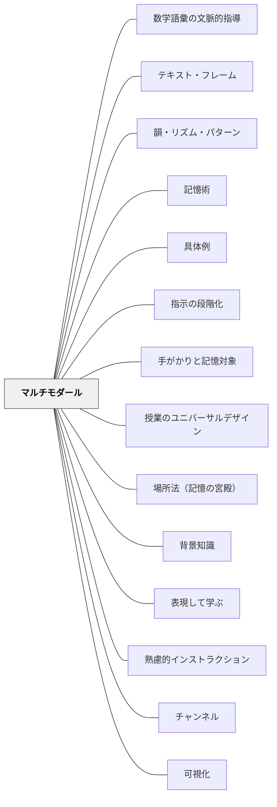

# マルチモダール

**一文でいうと**：言葉・図・音・身体・操作など複数のチャンネルで理解への入口を作る。

## 使いどころ・使いすぎ注意

| 観点         | 内容                                         |
| ------------ | -------------------------------------------- |
| 使いどころ   | 言葉だけでは届きにくいとき。                 |
| 使いすぎ注意 | 表現手段を増やしすぎると、認知負荷が上がる。 |

> 音声・視覚・身体など複数のモードを組み合わせることで、理解が深まり記憶に残る。

---

## Pattern Connection

**Weinstein & Sumeracki（2018）統合（2026-05-14）：**

_Understanding How We Learn_（東京書籍, 2022）は、二重符号化（Dual Coding）を6つの学習方略の1つとして体系化している。言語記憶系と視覚記憶系の2つの経路に同時に記録を作ることで、どちらかからでも想起できる記憶が形成される。

- **補強された点**：本パタンで「二重符号化理論」として言及されていた根拠が、Weinstein & Sumeracki（2018）によって授業実装まで整理された。「概念を表す図（装飾的な絵ではない）」が最も効果的という具体的な指針が加わった。
- **接続した概念**：「学習スタイル神話の否定」——「視覚型だから図で教える」は根拠がない。すべての学習者が言語＋視覚の組み合わせから恩恵を受けられる。二重符号化は学習スタイルではなく普遍的なメカニズム。
- **他のパタンへの波及**：[[実践/学習科学の6方略]] で6方略の文脈に位置づけられた。ノート・ワークシート・板書設計に直接対応する。
- **再統合（2026-05-20）：パイビオ（1971）の詳細と「二重符号化が効かないケース」**：
  - **パイビオの二重符号化理論（Paivio, 1971）**：人間の記憶システムには独立した「言語チャネル（verbal system）」と「非言語チャネル（imaginal system）」が存在する。両チャネルで処理された情報は「どちらかが思い出せなくても、もう一方から想起できる」ため、どちらか一方のみで処理された情報より強く記憶される。
  - **二重符号化が効果的な条件**：①テキストと図が同じ情報を別の形式で表現している（補完的関係）②テキストと図が近接している③図が「説明的（explanatory）」であり「装飾的（decorative）」でない
  - **二重符号化が効果的でない条件（落とし穴）**：①装飾的な図（概念と無関係な写真）は注意を散漫にするだけ——むしろ外在的認知負荷を増やす②音声ナレーションとテキストを**同時に**提示——「音声を聞く」と「テキストを読む」が同じ音韻ループに干渉する（**冗長性効果**）③図と説明文が離れた場所にある（**分割注意効果**）——詳細は [[概念/認知負荷理論]]
  - **実践への含意**：「スライドに文字を書いて読み上げる」は冗長性効果で逆効果。「図を見せながら口頭で説明する」は有効。装飾的な背景画像を除く。図は説明の近くに置く。

---

## 背景（Context）

山本博樹（2019）『教師のための説明実践の心理学』ナカニシヤ出版に示されるマルチモダール（多様式）の原則は、単一の表現形式（話す・書くなど）だけでなく、複数の表現形式を組み合わせることで認知的な理解が深まることを示す。チャンネル（ワーマン）の多様化とも対応する概念である。

## 問題（Problem）

言葉だけで説明しても、頭の中でイメージが描けない受け手には届かない。逆に図だけ見せても、言語的に説明がないと意味が読み取れない場合がある。一つの表現形式に依存した指示・説明は、特定の認知スタイルの受け手にしか届かない。

## 力のかたち（Forces）

- 音声と視覚を組み合わせると記憶への定着が高まる（二重符号化理論）
- モードが増えすぎると情報過負荷になり逆効果になる
- モードを切り替えるタイミングが重要であり、同時提示と順次提示を使い分ける必要がある

## 解決（Solution）

**話す（音声）・書く（文字）・描く（図）・見せる（実物・映像）・動く（ジェスチャー・実演）を組み合わせてインストラクションを構成する。**

口頭で説明しながら黒板に図を描く、実際にやってみせてから言葉で説明する、文字で書いた指示を掲示しながら口頭でも伝えるなど、複数のモードが互いを補う形で使う。どのモードを主にするかを意識して設計する。

### 教室での使い方

**例①（算数・概念説明）**：  
「分数÷分数」を説明するとき、口頭で言いながら黒板に図（面積モデル）を描き、実物のピザや紙を切ってみせ、最後に「隣の人に言葉で説明してみよう」と促す——聴覚・視覚・触覚・言語の4モードが同じ概念を支える。

**例②（指示の出し方）**：  
「作業手順を口頭で言いながら黒板に番号で書く」「書いた指示を指差しながらもう一度確認する」——聴覚と視覚を同時に使うことで指示が抜けにくくなる。特別支援が必要な子には実演も加える。

**例③（国語・詩の授業）**：  
詩を「声で読む→リズムを体で感じる→絵で表す」と順番に体験させる。文字情報だけでなく音・動き・視覚イメージが詩の理解を多層化する。

## 結果（Consequences）

- 多様な受け手のニーズに応えられるインストラクションが実現する
- 理解の深さ・記憶への定着が高まる
- 受け手が自分に合ったモードで情報を受け取れる

## このパタンが働く教材

| 教材                    | どのように複数のモードを使うか                                       |
| ----------------------- | -------------------------------------------------------------------- |
| [[教材/増える算数辞典]] | 算数語彙を言葉だけでなく、図・絵・例・生活場面と組み合わせて整理する |

## クラスター図

## Actionable Insight

- 口頭で説明しながら黒板に図を描く——音声と視覚を組み合わせることで記憶への定着が高まる（二重符号化理論）
- 実際にやってみせてから言葉で説明する——実演＋言語の組み合わせが多様な受け手のニーズに応える
- 文字で書いた指示を掲示しながら口頭でも伝える——複数のモードが互いを補い合い理解が深まる
- 「今日学んだことを絵や図で表してみよう」と子どもにやらせる——描く行為が視覚的符号化になり記憶に残る
- ジェスチャーや体の動きを言葉に添える——身体動作が言語記憶を補完し、低学年・特別支援の子に特に有効
- 板書に「言葉だけ」の箇所を1つ見つけ、図や絵を1つ加える——何の追加が一番効くかを試す小実験として

## 出典

- 一つの教育のパタン・ランゲージ（岩井輝久）/ Weinstein, Y. & Sumeracki, M.（2018）Understanding How We Learn. Routledge.

## 関連パタン
- [[パタン/数学語彙の文脈的指導]]
- [[特別支援/インクルーシブ教育]]
- [[実践/インクルーシブ授業の設計]]
- [[パタン/テキスト・フレーム]]
- [[パタン/韻・リズム・パターン]]
- [[パタン/記憶術]]
- [[パタン/具体例]]
- [[パタン/指示の段階化]]
- [[パタン/手がかりと記憶対象]]
- [[パタン/授業のユニバーサルデザイン]]
- [[パタン/場所法（記憶の宮殿）]]
- [[パタン/背景知識]]
- [[パタン/表現して学ぶ]]

- [[パタン/熟慮的インストラクション]] — 親パタン
- [[パタン/チャンネル]] — マルチモダールの理論的基盤
- [[パタン/可視化]] — 視覚モードの具体的な展開
- [[パタン/ジェスチャー学習]] — 身体モードの活用
- [[パタン/無言の提示]] — 非言語モードのみを使う極端なケース
- [[概念/認知負荷理論]] — 冗長性効果・分割注意効果のメカニズム
- [[パタン/望ましい困難]] — 二重符号化は認知負荷を適切に管理した上での望ましい困難
- [[実践/学習科学の6方略]] — 6方略の一つ（二重符号化）として位置づけ
- [[パタン/余計な難しさを外す（構成概念に無関係な分散）]] — 複数の様式で表せることが、特定の様式に由来する無関係な難しさを外す

