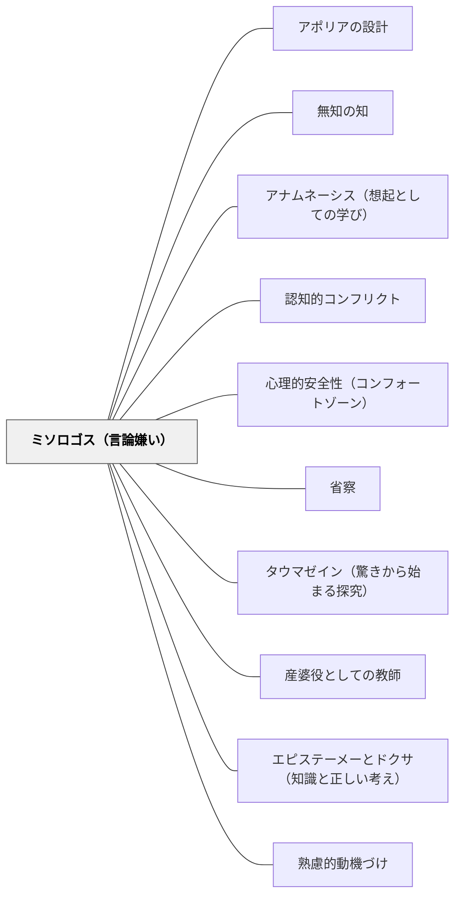

# ミソロゴス（言論嫌い）

> 一つの議論が崩れたとき、「すべての議論は信じられない」という一般化をしてはならない。言論への不信の責任は言論そのものでなく、判断者自身の技術の未熟さにある。

## [Pattern Connection]

### プラトン『パイドン』（前380年頃）——ミソロゴスの心理構造と処方箋（88c–91c）

魂の不死の議論をめぐって、シミアスとケベスがそれぞれ強力な反論を提出したとき（84c〜88b）、聴衆の弟子たちは深い動揺に陥った——「ソクラテスが以前示した議論が崩された」。ソクラテスはこの危機的な心理状態を「ミソロゴス（言論嫌い）」と名付け、その構造を分析する。

**ミソロゴスの五段階崩壊過程（88c〜91c）：**

| 段階 | 心理状態 |
|---|---|
| 1 | 特定の言論への不信（「この議論は嘘だった」） |
| 2 | 以前の言論すべてへの不信（「前も同じだった」） |
| 3 | 言論一般への不信（「どんな言論も信じられない」） |
| 4 | 判定者への不信（「私自身が信頼できない」） |
| 5 | 対象への不信（「世界そのものが不確かだ」） |

> 「言論嫌いにならないように、ということだ。ちょうど、人間嫌いになるのに似てね。そう言うのも、人には言論を嫌うよりも大きな害悪を寝ることはないのだから。」（89d）

**人間嫌いとの類比（89e〜90c）：**
人間嫌いは「特定の人が信用できなかった」→「すべての人間が信用できない」という過度の一般化によって生じる。同じ過度の一般化がミソロゴスを生む：「特定の議論が崩れた」→「すべての言論が信用できない」。

**「大多数は中間にいる」（90c〜91c）：**
極端に良い（正しい）言論も極端に悪い（誤った）言論も稀であり、多くは中間にある——ちょうど、極端に善い人も悪い人も稀で、大多数は中間にいるように。言論への評価も「良いか悪いか」のゼロサムではなく、程度の問題である。

**処方箋（91c）：**
> 「責めは議論する者自身にあることを自覚して、さらに探究を進めることが哲学者の態度である。」

→ 言論が崩れた「責任」は言論そのものや世界ではなく、判定者（自分）の評価技術の未熟さにある。言論を評価する技術（ロゴスのバサニゼイン）を磨くことで、個々の言論の真偽を判定し続けることができる。

**補強点**：アポリア体験が連続したり強すぎたりしたとき、学習者がミソロゴスに陥るリスクが生じる。このパタンは「探究への入り口としてのアポリア」の裏側——アポリアを設計する際にミソロゴスへの対策も同時に設計する必要がある。

**波及するパタン**：[[パタン/アポリアの設計]] — アポリアが連続するとミソロゴスになりうる；[[パタン/無知の知]] — ミソロゴスの対極：不知を認め続けることを学ぶ；[[パタン/アナムネーシス（想起としての学び）]] — 想起の失敗体験がミソロゴスを誘発する；[[文献/パイドン（プラトン）]] — 本統合の出典

---

## 背景（Context）

探究的な学習は失敗を含む。仮説が崩れる、議論が覆る、「わかった」と思った直後に矛盾を指摘される——これらは探究の健全な過程である。しかし、学習者がこうした失敗を重ねたとき、「考えることそのものへの不信」に陥ることがある。

プラトン『パイドン』（88c〜91c）でソクラテスは、この現象を「ミソロゴス（言論嫌い）」と名付け、探究の場で起こりうる最大の危険のひとつとして警告した。一つの議論が崩れた経験が、議論一般・さらには「考えること」や「世界」そのものへの不信に広がる心理的崩壊過程である。

## 問題（Problem）

探究的な学習では、子供が「自分の考えが間違っていた」という経験をする。この経験は学びの核心であるが、繰り返されると「どうせ考えても意味がない」「先生の言う通りにしていればいい」という態度が育つ。「考えること」への意欲の喪失——これがミソロゴスが教育場面に現れる形である。

## 力のかたち（Forces）

- 「間違い→修正」が繰り返されると、学習者は「考える→結局間違い」というパターンを学習してしまう
- アポリア（困惑）体験が連続・蓄積すると、探究の入り口から探究への嫌悪に転化する
- 「失敗した議論」の責任が明示されないと、学習者は「考えること自体が無意味」と結論する
- 心理的安全性のない環境では、ミソロゴスは表に出ずに沈黙という形で現れる
- 「先生の答えに合わせればいい」という戦略が成功体験として積み重なると、ミソロゴスが強化される

## 解決（Solution）

**「言論（考え）が崩れた」という経験を、「言論一般への不信」ではなく「自分の評価技術の成長機会」として受け取れるよう、教師が責任の所在を明示し、一つひとつの言論の評価技術を育てる。**

ミソロゴスへの対処の手順：

1. **ミソロゴスに気づく**——「どうせ考えても」「誰が言っても同じ」「何が正しいかわからない」という言葉・態度がミソロゴスのサイン
2. **責任の所在を問い直す**——「この考えが崩れたのは、この考え（言論）が悪かったのか、それともこの考えを評価する技術がまだ十分でなかったのか？」と問う
3. **「大多数は中間にいる」を示す**——「正しい考えも間違いの考えも、どちらも極端に純粋なものは少ない。多くは中間で、少し正しくて少し不十分」という感覚を育てる
4. **評価技術を教える**——「どんな問いを立てれば、この考えをより正確に評価できるか」という具体的なスキルを一緒に練習する
5. **失敗の履歴を誇りにする**——「この考えが崩れたから、次の考えがより良くなった」という探究の系譜として失敗を位置づける

---

**具体例1：算数の議論が崩れた場面**

「この分数の割り算は〇〇で計算できる」という子供の説明が間違っていたとき。「この方法は間違いだね」とだけ言うのでなく、「この方法はここまでうまく機能していた。どこからうまくいかなくなったの？」と問い、失敗が部分的な前進であることを示す。「算数の答えはわからない」という一般化を防ぐ。

**具体例2：話し合いの意見が全員に否定された場面**

発表した意見が否定されて「もう発言したくない」と沈黙する子供に。「その意見のどの部分が問題だったか」を一緒に特定し、「この部分は鋭かった」「この部分が少し違った」と分析する。意見全体の「良い/悪い」判断ではなく、部分的な評価技術を育てる。

**具体例3：科学的仮説が崩れた場面**

「植物は光があれば育つ」という仮説が反例（暗所でも育つ植物）で崩れた場面。「仮説が崩れた」のは「仮説を立てる力がなかった」のではなく、「次の精密な仮説を立てるための情報が得られた」こととして位置づける。

## 結果（Consequences）

- 失敗体験が「考えることへの不信」でなく「評価技術の向上機会」として機能するようになる
- 議論が崩れることを「探究の失敗」でなく「探究の前進」として受け取る文化が育つ
- 「一つの考えが間違いでも、考えること自体は意味がある」という認識が安定する
- 教師が「答えを示す人」でなく「評価技術を一緒に鍛える人」として立てるようになる
- ミソロゴスの予防として、「失敗の語り方」への意識が授業設計に組み込まれる

## 関連パタン
- [[パタン/アポリアの設計]] — アポリア体験の裏側；アポリアが連続するとミソロゴスになりうる
- [[パタン/無知の知]] — ミソロゴスの対極：不知を自覚し続けることへの積極的態度
- [[パタン/アナムネーシス（想起としての学び）]] — 想起が連続して失敗するとミソロゴスへの入り口になる
- [[パタン/認知的コンフリクト]] — 認知的コンフリクトが解決されないまま積み重なるとミソロゴスになる
- [[パタン/心理的安全性（コンフォートゾーン）]] — ミソロゴスが安全に表現できる場が必要
- [[パタン/省察]] — 「なぜこの考えが崩れたのか」の省察がミソロゴス予防
- [[パタン/タウマゼイン（驚きから始まる探究）]] — タウマゼインがあればミソロゴスを乗り越えられる
- [[パタン/産婆役としての教師]] — 産婆役はミソロゴスに陥った学習者を最小の介入で救う
- [[パタン/エピステーメーとドクサ（知識と正しい考え）]] — ミソロゴスを乗り越えた先にエピステーメーがある
- [[パタン/熟慮的動機づけ]] — 親パタン

## クラスター図

## Actionable Insight

- 子供が「もう考えたくない」「どうせわからない」と言ったとき、「考えることが嫌になった」のか「この問いが嫌になった」のかを区別して聞く——ミソロゴスの初期段階を早期に発見する
- 「この仮説は間違いだった。なぜ間違いだったのかを説明できる？」——失敗の分析を明示的に行うことで、失敗が「言論一般への不信」でなく「この言論の特定の欠陥への理解」として終わる
- 授業の末尾に「今日壊れた考えは何？代わりに何が育った？」を問う——失敗を「前進の証拠」として明示的に位置づける文化をつくる

## 出典

プラトン（納富信留訳）（2019）『パイドン——魂について』光文社古典新訳文庫（Bフ 2-6），pp.88c–91c.

> 「言論嫌いにならないように、ということだ。ちょうど、人間嫌いになるのに似てね。そう言うのも、人には言論を嫌うよりも大きな害悪を寝ることはないのだから。」——ソクラテス（パイドン 89d）
