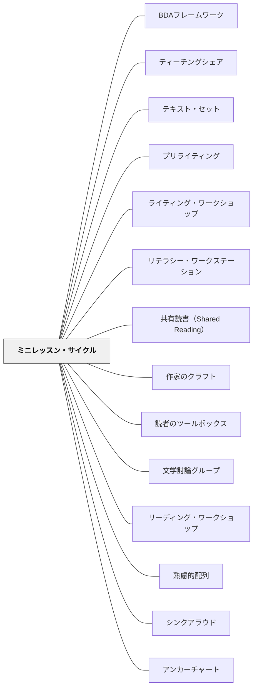

# ミニレッスン・サイクル

> ミニレッスンを「今日何を教えるか」で計画せず、「この3〜6時間で何ができるようになるか」という傘の下に束ねることで、単発の活動が読者を育てる積み上げになる。

---

## Pattern Connection

**出典**: Sibberson, F.（2012）*The Joy of Planning: Designing Minilesson Cycles in Grades 3-6*. Choice Literacy.（統合：2026-05-13）

- **既存パタンとの関連**：[[パタン/リーディング・ワークショップ]] はミニ・レッスン・独立読書・カンファランスの3部構造を定義しているが、「ミニレッスンをどのように計画するか」については詳述していない。本パタンはその空白を埋める計画論として機能する
- **補強された点**：[[パタン/熟慮的配列]] の「どの順序で学習経験を並べるか」を、読書ワークショップのミニレッスン文脈に具体化した。3〜6時間を一単位とするサイクル設計は、熟慮的配列のミクロ実装である
- **修正・拡張された点**：[[パタン/シンクアラウド]] が「1回のモデリング」として機能するだけでなく、サイクル全体を通じて段階的に足場を外していく構造（Gradual Release）の骨格を担うことが明確になる
- **他のパタンへの波及**：[[パタン/アンカーチャート]] は1回の授業ではなく、サイクルを通じて子どもの言葉が蓄積されることで「育つ」地図であることが強調される

**Sibberson（2012）再統合（2026-05-18 OCR全文照合）：**

OCR全文照合により、以下の内容を追加・明確化した：

- **「どのサイクルも単独では成立しない（No cycle stands alone）」（Ch.4）**：以前うまくいったサイクルも、現在の子どもに同じように機能するとは限らない。ノンフィクションのサイクルでも、子どもはフィクションを読んできた自分を持ち込む。年度・学年・クラスを越えて「このサイクルがうまくいったから今年も同じで」という惰性設計への批判
- **3種類のサイクルバランス（年間設計）**：content（literary element）/ behaviors（選書・記録）/ strategies（推論・つながり）の3種をバランスよく配置する。一種類に偏ると読者としての成長が一面的になる
- **「messy planning」の肯定（Ch.5）**：計画は常に「学生→カリキュラム→リソース」の順で進むわけではない。観察・直感・リソースの発見からどこでも始まれる。「きれいな計画書」ではなく「問いと信念」が計画の核心
- **Figure 3「以前からやってきたサイクルを見直す」**：5問の自己診断（なぜこのサイクルを続けているか・何がうまくいっていないか・大きな目標との整合性・評価の一致・足場の設計）でサイクルを問い直す反省的ツール
- **literary vocabulary の戦略的導入（Ch.2）**：protagonist/antagonist/dynamic/static character などの文学用語は「正しい答えを出させるため」ではなく「キャラクターについてより深く考える手がかり」として導入する。学年前倒しの目的は評価でなく読者の思考拡張

**Dorn & Soffos（2005）再統合（2026-05-19 全文照合）：**

*Teaching for Deep Comprehension*（Ch.8）は、個々のミニレッスンの**5ステップ構造**と、ミニレッスンに対する3つの批評的問いを提供する：

- **追加された点（5ステップ構造）**：Sibberson（2012）が「サイクルの計画論」を扱うのに対して、Dorn & Soffos は「1回のミニレッスンをどう構造化するか」を5ステップで詳述する。両者は補完関係にある——サイクルは「何回分のミニレッスンをどう束ねるか」、5ステップは「1回のミニレッスンの中の流れ」

| ステップ | 時間 | 内容 |
|---|---|---|
| 1. アンカーチャートのレビュー | 2〜3分 | 既存の読解ストラテジー一覧を確認し、今日追加する内容を示す |
| 2. プロセスのモデリング（Think-Aloud） | 8〜10分 | メンター・テキストを使った思考の声出し。3〜4箇所で立ち止まり思考過程を見せる |
| 3. ガイデッド・プラクティス | 10分 | 子どもが教師の支援のもとにストラテジーを自分の本で試す |
| 4. 独立練習 | 読書ワークショップ中 | ストラテジーを自分の本で転移・適用。教師はカンファリング |
| 5. シェア・タイム | 10分 | 全体で気づきを共有し、教師が非公式アセスメント |

**5種類のミニレッスン（Dorn & Soffos）**：①手順と組織、②読解ストラテジー（10の行動）、③戦略的行動（観察可能な読解行動）、④言語ストラテジー（10の言語行動）、⑤読解スキル（推論・文字通り・批判的思考）

- **補強された点（3つの批評的問い）**：Sibberson（2012）が「傘テーマの下に束ねるサイクル計画」を提供するのに対して、Dorn & Soffos は「そのミニレッスンが本当に理解を深めているか」という目的の問いを加える
  - **「道具はいつ読書の目的になるか？」**——グラフィック・オーガナイザーやポスト・イットが「完成させる目標」にすり替わっていないか
  - **「モデルはどのように理解の障壁になるか？」**——Think-Aloud や思考フレームが足場として機能しているか、それとも「そのフレームに当てはめること」が目的になっていないか
  - **「理解は教えることができるか？」**——ストラテジーの手順を教えることと、理解を深める支援をすることは別物
- **他のパタンへの波及**：[[パタン/深い理解（3水準の読解）]] — ミニレッスンで第3水準（応用的理解）を目指す問いの設計。[[パタン/共有読書（Shared Reading）]] — ミニレッスンのモデリング場として機能。[[パタン/文学討論グループ]] — 討論の技法はミニレッスンで明示的に指導する

**Collins（2004）統合（2026-05-24）：**

*Growing Readers* はミニレッスンの**個別授業の4部構造**を最も具体的に示す。Sibberson（2012）がサイクル（複数授業の束）を扱うのに対して、Collinsは1本のミニレッスンの内部構造を記述する。両者は補完関係にある。

- **補強された点（4部構造）**：Collins のミニレッスンはすべて**Connection → Teaching Point → Active Engagement → Link** の4部構造で進む。これはCalkins/TCRWPの標準形式。
  - **Connection**：前の学習と今日の学習をつなぐ（「昨日〜しましたね。今日は…」）
  - **Teaching Point**：今日の1点を教師がデモンストレーションで示す（10分以内に収める）
  - **Active Engagement**：子どもがパートナーと練習する短い時間（2〜3分）
  - **Link**：「今日学んだことを読書のときに使ってみよう」と送り出す
- **補強された点（デモとアナロジーの効果）**：Collinsのミニレッスン例は「用務員のレンチ交換」「マラソン仲間」「映画館」など具体的なアナロジーを使う。抽象的なストラテジー名を「生きた場面」として子どもに手渡す技法
- **拡張された点（Acquisition vs Maintenance）**：全体ミニレッスンでは「今日多くの子に必要なこと（習得）」を扱い、既に習得した子には「維持学習」になる——これはJoe Yukish（TCRWP）の概念。ミニレッスンの対象は「クラス全体にとって次の一歩」を選ぶという設計原則
- **他のパタンへの波及**：[[パタン/読書パートナーシップ]] — Active Engagement でパートナーと練習する構造が、長期パートナーシップを授業の中心に置く

---

## 背景（Context）

リーディング・ワークショップのミニレッスンは、5〜10分で行う短い全体指導である。教師はカンファリングで子どもたちの読書状態を観察しながら、「次に何を教えるか」を毎日決める。

しかしこの「毎日一つのミニレッスン」という単位で計画すると、授業が孤立した活動の羅列になりやすい。月曜日は「推論」、火曜日は「キャラクター」、水曜日は「選書」——それぞれの授業は成立しても、子どもたちが学んだことを自分の独立読書に持ち込む転移が起きにくい。

Sibberson（2012）はこの問題を「個々の授業として計画することで、ビジョンのない計画を招く」と表現した。授業が積み上がらない理由は教師の技量ではなく、計画の単位にあると彼女は言う。

## 問題（Problem）

ミニレッスンを1回ずつ計画すると、次の問題が起きる：

- 各授業が独立した活動（Activity）になり、より大きな目標に向かう積み上げ（Building Blocks）にならない
- 教師が「今日何を教えるか」を問い続け、「この子たちに今週何ができるようになってほしいか」を問わなくなる
- 子どもたちが学んだストラテジーを、自分で選んだ本を読む独立読書の場面で使わない
- 一冊の本に依存した授業設計になり、本が変わると学びも変わってしまう（「本を教える」）

## 力のかたち（Forces）

- 概念の深い理解は、一度の接触ではなく繰り返しの露出を必要とする
- 子どもたちが概念を「自力で発見」するには、アクセシビリティの高い本（難しすぎず易しすぎず、その概念を自ら考えられる本）が必要
- しかし、アクセシビリティの高い本は必ずしも教師が好きな本・名作リストの本ではない
- 5〜10分のミニレッスンは短く、一つの授業で概念を「完成」させることはできない
- 子どもたちによってエントリーポイント（すでに知っていること）が違うため、一つの授業で全員が転移するとは限らない
- 日本の授業では45分の中でミニレッスンに使える時間はさらに限られる

## 解決（Solution）

**3〜6時間のミニレッスンを「傘となるテーマ（Umbrella Topic）」のもとに束ね、子ども・カリキュラム・リソースの3つの視点から計画する。**

---

### サイクル計画の手順

1. **傘テーマを決める**——「キャラクター」「テーマ」「ノンフィクションの読み方」など、この週・この単元で育てたい大きな概念を一つ選ぶ
2. **3つのカテゴリーで計画する**

| カテゴリー | 問い |
|-----------|------|
| **子ども（Students）** | 今何ができるか。どんな行動が必要か。エントリーポイントをどう設けるか |
| **カリキュラム・学習基準（Curriculum & Standards）** | 何が求められているか。どう評価するか |
| **リソース（Resources）** | どんな本が足場になるか。どの順序で使うか |

3. **本の山（Menu of Resources）を準備する**——使う予定の本と予備の本を事前に揃える。子どもの反応次第で使い分けるために、メインの本だけでなく代替テキストも用意する
4. **レッスンの順序を設計する**——最初は教師が多くモデリングし、徐々に子どもが考える割合を増やす（段階的手放し）
5. **アセスメントを目標と一致させる**——「このサイクルの最後に、子どもは独立読書の中で何ができているか」を先に決め、それをゴールとして設計する

---

### アクセシビリティの基準

本を選ぶとき、「好きな本・名作リスト」ではなく次の問いで選ぶ：

> 「ほとんど助けなくても、子どもたちがこのミニレッスンの目標を自分で考えられるか」

アクセシビリティが高い本とは、その本を読むことで子どもが**自力でその概念に気づける**本である。絵本・短いノンフィクション・Wonderopolisの記事などが、概念の初期学習には特に有効なことが多い。

---

### 具体例①：年度初め「思考の記録サイクル」（Ch.1より）

傘テーマ：「読みながら考えることを記録する」

| レッスン | テーマ | 主なアクセシビリティテキスト | 子どもが考えること |
|---------|------|--------------------------|------------------|
| 1 | 読者はさまざまな方法で考える | 論争を呼ぶ短い記事（Ron Clark's Essential 55 など） | 読みながら自分の中で何が起きているか |
| 2 | 考えを記録する多様な方法がある | Wonderopolisの記事2本（ペアで使う） | 付箋・鉛筆・ハイライターのどれが合うか |
| 3 | 思考ツールを使う | テキストと図が両方ある記事（National Geographic for Kids など） | どの道具を使うか選ぶ |
| 4 | 自分の本で試す（転移） | 自分で選んだ本 | 一人で読みながら考えを記録する |

→ 詳細な実践手順は [[実践/思考の記録サイクル]] を参照

---

### 具体例②：キャラクターサイクル（Ch.2より）——スタンダードを「分解」する

傘テーマ：「キャラクターを多様な方法で思考・対話する」

Common Core Standard RL.4.3「キャラクターを深く描写できる（characters' words, thoughts, actions）」を子どもの学習経験に分解すると：

| 分解されたゴール | レッスン | アンカーテキスト |
|---------------|--------|----------------|
| キャラクターの関係から性格を読む | Lesson 1 | Elephant and Piggie（*Today I Will Fly*） |
| 知識を使って行動を予測する | Lesson 2 | Fancy Nancy, Scaredy Squirrel（シリーズ既読を使う） |
| キャラクターの声（話し方）に注目する | Lesson 3 | *There's a Wolf at the Door*（5話のグラフィックノベル） |
| キャラクターの変化を追う | Lesson 4 | *Scaredy Squirrel*（少し変化するキャラクター） |
| 視点の違いを理解する | Lesson 5 | *Willow*, *Voices in the Park* |
| 文学的語彙を使って話す | Lesson 6 | サイクル中に使った本すべてを再訪 |

**literary vocabulary 導入の原則**（Sibberson から）：
- protagonist/antagonist/dynamic character/static character などの語を「テストのために覚えさせる」のではなく、「より深く考える手がかりとして非公式に渡す」
- 言葉は壁に貼り続け、子どもが自然に使い始めるのを待つ
- ピクチャーブック → 独立読書への転移：「Max and Ruby の話し方と Harry Potter の話し方は同じ」

---

### 具体例③：ノンフィクションスタミナサイクル（Ch.4より）——観察から計画を始め直す

「以前からやってきたサイクル（テキスト特徴の名前を教える）」を見直した実例：

**観察で発見した根本問題**：子どもはテキスト特徴の名前は言えるが使えない。混乱すると「でっち上げ」をする。ノンフィクションを最後まで読むスタミナがない。

→ スタミナが基盤問題と判断し、2週間・8レッスンのスタミナ育成サイクルを設計（内容は [[文献/The Joy of Planning（Sibberson）]] Ch.4 参照）

**Figure 3「以前からやってきたサイクルを見直す」5つの問い**：
1. これはどんなサイクルか
2. 何がうまくいっていないか
3. なぜこれを教えるか——大きな目標は何か
4. その目標をどう評価するか——評価は目標と一致しているか
5. 子どもに必要な足場は何か・どんなリソースが助けになるか

---

### 計画は「messy」でよい（Ch.5より）

Sibberson は完成した計画の例しか見せていないことへの正直な告白：「私の計画プロセスは混乱している（messy）。毎回同じ順序で問いに答えるわけではない。子どもから出発することも、リソースから出発することも、基準文書から出発することもある」

**変わらないのは**：信念（10の信念）と問いである——順序ではない。

→ 計画の「正しい手順」を踏もうとする教師へのメッセージ：プロセスの混乱を恐れなくてよい。計画の質は順序の正確さではなく、子どもへの問いの深さで決まる。

---

### サイクル設計の問い（Figure 2 より）

- このサイクルの大きな目標は何か
- どんな本を使うか・なぜか（アクセシビリティ基準で選ぶ）
- どのようにエントリーポイントを設けるか
- アセスメントは大きな目標と一致しているか

---

### 計画は「橋」である

> "I plan best when I think about planning as a bridge between standards, curriculum, and student learning." —Sibberson（2012）

ミニレッスン・サイクルの計画は、学習基準・カリキュラム・子どもの学習者の状態を**つなぐ橋**として機能する。教師が自ら計画することで、毎日の授業が孤立した活動でなく、より大きな目標に向かう積み上げになる。

---

### 誰が考えているか

Sibberson はサイクルの各授業の後に、次の問いを自問することを勧める：

「この時間、誰が一番話していたか。誰が一番考えていたか。」

ミニレッスンは**対話的（Interactive）**でなければならない——教師が伝える時間ではなく、子どもが考える時間として設計する。

## 結果（Consequences）

- 3〜6時間が一つの目標に向かうため、子どもが概念を深めるための「繰り返しの接触」が保証される
- 傘テーマが明確なため、教師は毎日「何を教えるか」を一から考える疲弊から解放される
- 子どもが学んだストラテジーを独立読書に持ち込む転移が起きやすくなる
- 「本を教える」から「読者を育てる」への転換が、計画の段階で実現できる
- ただし、傘テーマの選択・本のアクセシビリティ判断・エントリーポイントの設計に教師の観察眼（カンファリングの記録）が必要である

## 関連パタン
- [[実践/BDA読解授業の設計]]
- [[実践/ライティング・ワークショップ年度初め]]
- [[実践/リテラシー・ワークステーションの起動]]
- [[実践/書き出しのクラフト]]
- [[パタン/BDAフレームワーク]]
- [[パタン/ティーチングシェア]]
- [[パタン/テキスト・セット]]
- [[パタン/プリライティング]]
- [[パタン/ライティング・ワークショップ]]
- [[パタン/リテラシー・ワークステーション]]
- [[パタン/共有読書（Shared Reading）]]
- [[パタン/作家のクラフト]]
- [[パタン/読者のツールボックス]]
- [[パタン/文学討論グループ]]

- [[パタン/リーディング・ワークショップ]] — サイクルが機能する授業の3部構造
- [[パタン/熟慮的配列]] — 学習経験をどの順序で並べるかの設計原理
- [[パタン/シンクアラウド]] — サイクルの指導形態（段階的手放しのモデリング）
- [[パタン/アンカーチャート]] — サイクルを通じて育つ思考の地図
- [[パタン/不思議を育てる]] — 問いを持つことをサイクルの目標として位置づける
- [[パタン/推論する（インファリング）]] — サイクルで扱う読解ストラテジーの一例
- [[パタン/読みとつながる]] — サイクルで扱う読解ストラテジーの一例
- [[実践/カンファリング（読書会議）]] — サイクルで育てた読者を個別に確認する
- [[実践/思考の記録サイクル]] — 年度初めの具体的サイクル実践

---

## クラスター図

## Actionable Insight

- **今週のミニレッスンを「サイクル」として計画し直す**——「今日何を教えるか」を問う前に「今週の3〜5時間で子どもに何ができるようになってほしいか」を先に決める。傘テーマを一つ選び、そこから逆算する
- **本の選び方を変える**——「好きな本・名作リスト」ではなく「この子たちが自力でその概念に気づける本か」を問う。授業直前ではなく、週の計画段階で「本の山（メイン＋予備）」を用意する
- **「誰が考えているか」を毎回確認する**——ミニレッスンの後に自問：「この時間、誰が一番話していたか。誰が一番考えていたか。」子どもが考えていなければ、次のレッスンで問いかけの時間を増やす
- **アセスメントをサイクルの冒頭で決める**——「このサイクルの最後に、独立読書でどんな行動が変わっていたら成功か」を先に設定し、毎日のカンファリングでその変化を観察する
- **年間でサイクルの種類をバランスする**——今年度に計画したサイクル一覧を見て、content（literary element）・behaviors（選書・記録）・strategies（推論・つながり）の3種類がバランスよく並んでいるか確認する
- **「以前からやってきたサイクル」を一つ選び Figure 3 の問いで問い直す**——「なぜこれを続けているか」「今の子どもに本当に必要か」「評価は目標と一致しているか」の5問で確認する。特に「子どもの観察から出発し直す」ことが鍵
- **Regie Routman の「24時間読書リスト」を試す**——昨日の24時間に自分が読んだものをすべて書き出す（ウェブ・メール・ニュース・本・レシピ・説明書…）。子どもも同じことをすることで「私たちは普段ほぼノンフィクションを読んでいる」という認識から授業が始まる

---

## 出典
- [[文献/Teaching for Deep Comprehension（Dorn & Soffos）]]

Sibberson, F. (2012). *The Joy of Planning: Designing Minilesson Cycles in Grades 3-6*. Choice Literacy.

> "Learning is not about one great lesson or one great activity teachers design for students to do. It is about the little things teachers ask students to do every day like read, write, and talk, that add up to the big things like making meaning from text and adding meaning and purpose to life." —Samantha Bennett, *That Workshop Book*（Sibberson, 2012 より引用）

> "Minilesson planning really begins with knowing where your students are, and moving from there." —Sibberson（2012）
