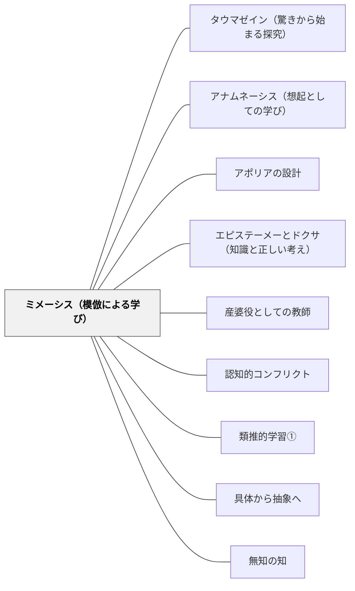

# ミメーシス（模倣による学び）

> 学ぶことは真似ることから始まる——そしてわかることは快い。人間は幼少期から模倣によって学び、模倣することで喜ぶ。

## [Pattern Connection]

### アリストテレス『詩学』（前335年頃）——ミメーシス：人間本性的学習メカニズムの哲学的基盤

アリストテレス（前384–322 BCE）は『詩学』第4章で、人間の学習能力の根本としてミメーシス（模倣）を位置づける。

**プラトンとの根本対立：**

プラトン（師）は「詩＝模倣は本物のイデアから二重に遠い影にすぎない」として詩人を理想国家から追放した（『国家』第10巻）。アリストテレス（弟子）はこれに正面から応答する：

> 「模倣することが人間には幼少期から自然本性的に備わっている。そして模倣を通じて最初の知識を得ることでも、人間は他の動物と異なる。」（第4章）

| | プラトン | アリストテレス |
|---|---|---|
| ミメーシスの評価 | 「真実から遠い影」——認識を歪める | 「人間本性に根ざす」——最初の知識の経路 |
| 感情への評価 | 理性を乱す、危険 | カタルシスをもたらす、浄化的 |
| 詩の哲学的価値 | なし（追放） | 高い（歴史より哲学的） |

**「わかることの快」——ミメーシスの認知的メカニズム（第4章）：**

アリストテレスはミメーシスの快楽の根拠を精密に分析する：

> 「模倣による像を見ることが最も快い理由は、それを見ながら、推論しわかること——たとえば、これはあの人だ——が起きるからである。もし偶然にそれを以前見ていないなら、像が生む喜びは模倣によるものではなく、仕上げや色や同様の理由からのものになる。」（第4章）

ミメーシスの快は「美的な快楽（形・色・仕上げ）」ではない——「**これが○○のパターンだ**」という**推論による認識の喜び**である。

これが教育への核心的示唆：学習者が「あ、これが○○のことだ」「この問題はあのパターンだ」と推論し気づく体験が、最も根本的な学習の快楽をもたらす。

**「わかることの快」と「学習してわかることの快」：**

> 「学習してわかることが最も快いのは、哲学者にとってばかりでなく、ほかの人々にとっても同様である。」（第4章）

- ミメーシスの快（像を見る快）：「これが○○のパターンだ」という推論
- 学習の快（学んでわかる快）：未知のものが「知ったもの」として認識される瞬間
- 両者は同根：「推論し、認識し、わかる」という認知的プロセスが快の源泉

**補強点**：[[パタン/タウマゼイン（驚きから始まる探究）]] が「驚き」を探究の唯一の入り口として示すとすれば、ミメーシスは「わかる（アナグノーリシス＝再認）」という探究の**結果**が持つ快楽を示す。タウマゼイン（驚き）→探究→ミメーシス（わかる快）という学習サイクルの全体が見える。

**波及するパタン**：[[パタン/タウマゼイン（驚きから始まる探究）]] — タウマゼインがミメーシス的学習の入り口；[[パタン/アナムネーシス（想起としての学び）]] — アナグノーリシス（再認）はアナムネーシスの一形態；[[パタン/アポリアの設計]] — カタルシスはアポリア設計の感情的完成形；[[文献/詩学（アリストテレス）]] — 本統合の出典

---

## 背景（Context）

プラトン以来、「模倣（ミメーシス）」は教育において否定的に語られてきた。「真似させるだけの学習は本物の理解をもたらさない」「手本を見せれば本物の力は育たない」——これらはすべて模倣を「劣った認識」として扱う見方を前提にしている。

一方、アリストテレスは模倣を人間の認知の根本と見た。子どもが言語を習得するのは規則を教えられるからではなく、周囲の言語を模倣することで「このような状況ではこの言葉を使う」というパターンを内在化するからだ。

「真似ること」と「わかること」は対立しない——「これが○○のパターンだ」と気づく認識こそが模倣の快楽の核心である。

## 問題（Problem）

授業が「正しい答えを記憶すること」に終始するとき、ミメーシス的な「わかることの快」が失われる。

- 「正しい答えを教えてもらう」と「なぜそうなるか推論して気づく」は根本的に異なる
- 「模倣」が「本物の理解の代替品」として扱われると、模倣が生む認識の喜びが遮断される
- 「手本通りやる」と「手本のパターンを認識する」は同じ行動でも認知的に全く異なる

授業設計において「わかる体験」でなく「答えを確認する体験」が繰り返されると、ミメーシス的な学習の快楽が失われ、学習が苦役になる。

## 力のかたち（Forces）

- ミメーシスの快は「推論しわかる」ことから生まれる——答えを「渡される」だけでは快は生まれない
- 「これは○○のパターンだ」という認識には、認識すべきパターン（手本・事例・モデル）が必要
- 手本が「真似るだけのもの」として提示されると、パターン認識の喜びが失われる
- 「真似る」と「わかる」を一体として設計することで、学習の快楽が生まれる
- ミメーシスは模倣から始まるが、模倣に終わらない——「なぜこのパターンなのか」を問うと、模倣がエピステーメーへ向かう

## 解決（Solution）

**「このパターンは○○だ」と学習者自身が推論し気づく体験を設計する。模倣を「手本の再現」でなく「パターン認識の喜び」として位置づける。**

---

**ステップ1：パターンが見えるモデル（手本）を提示する**

「これが正しい」を見せるのでなく、「このような状況にはこのようなパターンがある」ということが見えるモデルを提示する。手本は「正解のコピー元」ではなく「パターン認識の材料」として機能させる。

**ステップ2：「これは○○のパターンだ」と気づく問いを設計する**

「これと似ているものはどれ？」「前にやったあれと同じ？ 違う？」「このパターンに名前をつけるとしたら？」——推論しわかることを促す問いが、ミメーシスの快を引き出す。

**ステップ3：わかった瞬間を価値づける**

「あ、これがそういうことか！」という気づきの瞬間を止めて価値づける——「その気づき、書いておいて」「今何がわかった？」とわかる瞬間を可視化する。

**ステップ4：模倣からエピステーメーへ**

「なぜこのパターンが働くのか」を問うことで、ミメーシス（パターン認識）をエピステーメー（原因の推論で縛られた知識）へと深化させる。

---

**具体例1：算数「足し算のパターン認識」**

「8+5=13」「18+5=23」「28+5=33」を並べて見せた後、「これらに共通するパターンは何？」と問う。「一の位が3になる」「十の位が1増える」「5を足すと一の位が変わる」——パターンを「発見」する喜びが、ミメーシスの快楽である。

**具体例2：国語「物語のパターン認識」**

昔話（桃太郎・かぐや姫・浦島太郎）を読んだ後、「これらに共通するパターンは何？」と問う。「異界から来た・異界へ去る」「試練がある」「仲間がいる」——「物語ってこういうパターンなんだ」という認識がミメーシスの快を生む。

**具体例3：理科「摩擦のパターン」**

「つるつる→すべりやすい」「ざらざら→すべりにくい」という複数の事例を見た後、「このパターンに名前をつけるとしたら？」と問う。「摩擦」という言葉を教える前に「パターンの発見」がある——この順序がミメーシスの快を活かす。

## 結果（Consequences）

- 「答えを記憶する」から「パターンを認識する」へと学習の質が変わる
- 模倣が「劣った学習」でなく「認識の喜び」として価値づけられる
- 「わかった！」という体験が繰り返されると、学習への内発的動機が育つ
- ミメーシス的な学習は転移しやすい——「このパターン、あそこでも使える」という応用が生まれる
- ただし、「パターンを認識する」だけでは「なぜそうなるか」（エピステーメー）には至らない——ミメーシスの後に「なぜ？」を問う設計が必要

## 関連パタン
- [[パタン/タウマゼイン（驚きから始まる探究）]] — 「わかることの快」はタウマゼインと同根の認知的喜び
- [[パタン/アナムネーシス（想起としての学び）]] — アナグノーリシス（再認）はアナムネーシスの一形態
- [[パタン/アポリアの設計]] — カタルシス（苦が快を生む）はアポリア後の解き体験の感情的構造
- [[パタン/エピステーメーとドクサ（知識と正しい考え）]] — 「このパターンだ」（ミメーシス）の後に「なぜこのパターンか」（エピステーメー）を問う
- [[パタン/産婆役としての教師]] — 「わかることの快」を産む過程を助ける産婆役
- [[パタン/認知的コンフリクト]] — パターンが崩れる「反例」がコンフリクトとなり、より深いミメーシスを起こす
- [[パタン/類推的学習①]] — 類推はミメーシス的パターン認識の高度形態
- [[パタン/具体から抽象へ]] — 具体的な模倣から抽象的なパターン把握へというミメーシスの運動
- [[パタン/無知の知]] — 「わかった」という快の直前には「わからない」があった——再認の前の無知
- [[文献/詩学（アリストテレス）]] — 本パタンの主要出典

## クラスター図

## Actionable Insight

- 授業の導入で「これと似ているものを前に見た気がする——なんだっけ？」と問う——「これがあのパターンだ」という再認の快を意図的に設計する
- 複数の事例（3〜4つ）を並べて「共通するパターンは何だろう？」と問う——答えを教える前に、学習者が自分でパターンを「発見」する時間を作る
- 「あ、これが○○ってことか！」と学習者が言ったとき、止まって「今わかったこと、言ってみて」と促す——「わかる瞬間」を可視化し価値づけることで、学習文化としてのミメーシスを育てる

---

## 出典

アリストテレス（三浦洋訳）（2019）『詩学』光文社古典新訳文庫 Bア 2-3, pp. 第4章・第6章・第9章・第11章・第16章・第18章.
→ [[文献/詩学（アリストテレス）]]

> 「模倣することが人間には幼少期から自然本性的に備わっている。そして模倣を通じて最初の知識を得ることでも、人間は他の動物と異なる。」——アリストテレス『詩学』第4章
