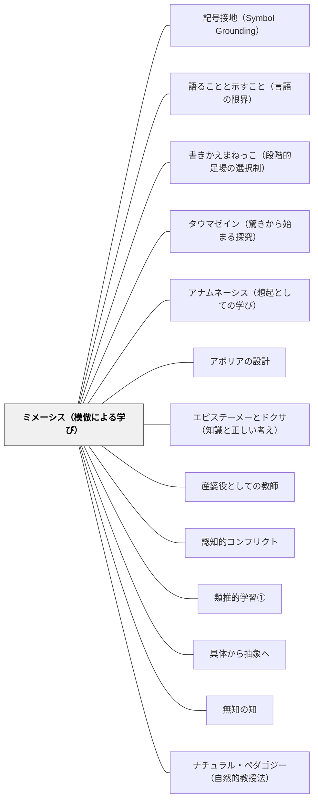

# ミメーシス（模倣による学び）

> 学ぶことは真似ることから始まる——そしてわかることは快い。人間は幼少期から模倣によって学び、模倣することで喜ぶ。

## [Pattern Connection]

### アリストテレス『詩学』（前335年頃）——ミメーシス：人間本性的学習メカニズムの哲学的基盤

アリストテレス（前384–322 BCE）は『詩学』第4章で、人間の学習能力の根本としてミメーシス（模倣）を位置づける。

**プラトンとの根本対立：**

プラトン（師）は「詩＝模倣は本物のイデアから二重に遠い影にすぎない」として詩人を理想国家から追放した（『国家』第10巻）。アリストテレス（弟子）はこれに正面から応答する：

> 「模倣することが人間には幼少期から自然本性的に備わっている。そして模倣を通じて最初の知識を得ることでも、人間は他の動物と異なる。」（第4章）

| | プラトン | アリストテレス |
|---|---|---|
| ミメーシスの評価 | 「真実から遠い影」——認識を歪める | 「人間本性に根ざす」——最初の知識の経路 |
| 感情への評価 | 理性を乱す、危険 | カタルシスをもたらす、浄化的 |
| 詩の哲学的価値 | なし（追放） | 高い（歴史より哲学的） |

**「わかることの快」——ミメーシスの認知的メカニズム（第4章）：**

アリストテレスはミメーシスの快楽の根拠を精密に分析する：

> 「模倣による像を見ることが最も快い理由は、それを見ながら、推論しわかること——たとえば、これはあの人だ——が起きるからである。もし偶然にそれを以前見ていないなら、像が生む喜びは模倣によるものではなく、仕上げや色や同様の理由からのものになる。」（第4章）

ミメーシスの快は「美的な快楽（形・色・仕上げ）」ではない——「**これが○○のパターンだ**」という**推論による認識の喜び**である。

これが教育への核心的示唆：学習者が「あ、これが○○のことだ」「この問題はあのパターンだ」と推論し気づく体験が、最も根本的な学習の快楽をもたらす。

**「わかることの快」と「学習してわかることの快」：**

> 「学習してわかることが最も快いのは、哲学者にとってばかりでなく、ほかの人々にとっても同様である。」（第4章）

- ミメーシスの快（像を見る快）：「これが○○のパターンだ」という推論
- 学習の快（学んでわかる快）：未知のものが「知ったもの」として認識される瞬間
- 両者は同根：「推論し、認識し、わかる」という認知的プロセスが快の源泉

**補強点**：[[パタン/タウマゼイン（驚きから始まる探究）]] が「驚き」を探究の唯一の入り口として示すとすれば、ミメーシスは「わかる（アナグノーリシス＝再認）」という探究の**結果**が持つ快楽を示す。タウマゼイン（驚き）→探究→ミメーシス（わかる快）という学習サイクルの全体が見える。

**波及するパタン**：[[パタン/タウマゼイン（驚きから始まる探究）]] — タウマゼインがミメーシス的学習の入り口；[[パタン/アナムネーシス（想起としての学び）]] — アナグノーリシス（再認）はアナムネーシスの一形態；[[パタン/アポリアの設計]] — カタルシスはアポリア設計の感情的完成形；[[文献/詩学（アリストテレス）]] — 本統合の出典

---

### 岩井輝久実践（2025-01-16）——視写の肯定とモデルの自然な吸収

澤田英輔による授業観察記録（2025年1月16日）は、ミメーシス（模倣による学び）が2年生の物語創作においてどのように機能するかを示す実践的証拠を提供する。

**視写の肯定：**
授業中、C児が三藤恭弘のプリントを視写していた。見つかったときに隠すような様子があったが、視写は明示的に許可された行動であった。

> 「全く一緒なので、視写もありなんだ、と思う。ちょっとやりとりしたときに隠すような雰囲気があったけど、もっと堂々と視写してていいのにと思った。でも、視写が許されているのはいいなあ。」——澤田英輔（観察記録, 2025-01-16）

視写を「ズルをしている」と感じて隠してしまう学習者がいることは、模倣をネガティブに捉える学習文化の反映である。「視写していいんだよ」という明示的な許可と、視写から始まった作品が認められる経験の積み重ねが、模倣文化の形成に必要。

**モデルの自然な吸収——「広い海のどこかに→広い森のどこかに」：**
教師がスイミーを参照するよう促したB児は、「ある日、広い森のどこかに…」という書き出しを書いた。これはスイミーの「広い海のどこかに、ちいさなさかなのきょうだいたちが…」からの有機的な転用である。語句を置き換えながら構造を保つという模倣の形は、アリストテレスの「パターン認識の喜び」——「これがあのパターンだ」という推論——の実践形態である。B児は意識的に「真似ている」のではなく、モデルのパターンを自分の文脈に引き込むことで書き始めていた。

**模倣文化の定着：**
> 「これまでの岩井さんの指導で、真似する意識が定着してるのがいいな。」——澤田英輔（観察記録, 2025-01-16）

桃太郎のモデル文から「りんごたろう」を書いている学習者もいた。「ある方が書きやすい」という感覚が定着しており、モデルへの参照が学習者の中で自然なものになっていた。これはクラス全体にミメーシスの文化が形成されていることを示す。

- **既存パタンとの関連**：アリストテレスの「模倣は人間本性的」という哲学的基盤を、教室実践が裏付ける。「わかることの快」——「このパターンが使える」と気づく喜び——が書くことへの動機として機能している
- **補強された点**：視写（完全な模倣）・書きかえまねっこ（部分的な模倣）・構造的参照（オリジナルコース）の三段階が、連続したミメーシスの実践形態として明確になる
- **他のパタンへの波及**：[[パタン/書きかえまねっこ（段階的足場の選択制）]] — ミメーシスの実践的制度化；[[パタン/作家のように読む]] — モデル文の構造分析がミメーシスの素地を作る；[[実践/作家の時間（2年生）]] — 本統合の出典実践

---

### 今井むつみ・秋田喜美（2023）言語の本質——「模倣を超える推論」：ミメーシスの次段階

本書は、言語習得において「模倣（オノマトペ的音模写）」が出発点であることを実証しながら、「模倣から推論（アブダクション）への飛躍」こそが本質だと論じる。これはミメーシス（模倣による学び）パタンの第二段階を示す。

**オノマトペ（音模写）＝ミメーシスの言語的形態：**
オノマトペの音が感覚イメージを写し取ること（「ぴちぴち」「どろどろ」）は、ミメーシスの言語版である。乳幼児がまず身に付ける語がオノマトペである理由は、模倣による学びが最初の言語習得の足場になっているから。

**「しかしその先がある」——模倣から推論への飛躍：**
今井・秋田（2023）は、純粋な模倣（音の写し取り）は「言語の前段階」であり、真の言語習得はそこから「アブダクション推論による体系化・一般化」へと進む必要があると論じる。

- 「もこもこ」と発音できても「柔らかくて大きなもの」という意味概念への一般化が起きなければ語彙習得ではない
- 動詞「ノスノスしている」を聞いて同じ動作に一般化できるのは、音の模倣を超えた推論があるから
- ヘレン・ケラーが「water」の体験で行ったのは、模倣（水をつつく感覚→手のひらへのサイン）から「名づけの洞察」（すべてのものには名前がある）というアブダクション推論への飛躍

**「模倣はエベレストのベースキャンプ」：**
オノマトペ（模倣的言語）が「ベースキャンプまでの道案内」をするとすれば、ミメーシス的な視写・写し書き・書きかえまねっこも「登山の出発点」として理解できる。しかしその先の「登頂」——創造的な表現・概念の体系化——は模倣を超えた推論（アブダクション）によって起きる。

**補強点**：アリストテレスが「模倣は人間本性的」「わかることの快」として示したミメーシスの積極的価値が、認知科学的に補強される。「推論による気づき（アナグノーリシス）の快」は、アブダクション推論が起きたときの認知的な快楽として説明できる。

**修正・拡張点**：ミメーシスを「単純な真似」として終わらせず、「模倣→パターン抽出→アブダクション推論→一般化」という学習サイクルの第一段階として位置づけ直す。「視写したら終わり」でなく「視写からアブダクションへ」の誘発が教師の仕事になる。

**波及するパタン**：[[メタパタン/アブダクション（仮説形成）]] — ミメーシスの先にあるアブダクション；[[パタン/記号接地（Symbol Grounding）]] — 音模写（ミメーシス）は記号接地の出発点；[[文献/言語の本質（今井むつみ・秋田喜美）]] — 本統合の出典

---

### ドゥルーズ（1990）記号と事件——生成変化（devenir）：ミメーシスを超える「なっていくこと」

ドゥルーズは「模倣すること」と「生成変化（devenir）」を根本的に区別する。この区別は、ミメーシス（模倣による学び）パタンの限界と可能性を同時に照らす。

> 「マイノリティとは、測られることのできないもの、公理系の外に立つものだ。ヨーロッパ人の白人男性成人は多数者だ。しかし彼も女性-になること、子ども-になること、黒人-になること、動物-になることで、生成変化へ入ることができる。」——ドゥルーズ（記号と事件, 管理と生成変化）

**模倣（ミメーシス）と生成変化（devenir）の対比：**

| | ミメーシス（模倣） | 生成変化（devenir） |
|---|---|---|
| 関係 | モデル→模倣者 | 二者が相互に変化する運動 |
| 方向 | 既成のモデルへの近接 | 既成のモデルを超えた変化 |
| 結果 | モデルの再現 | 誰も予測しなかった新たな形 |
| 教育の含意 | 「正解・手本に近づく」 | 「手本を踏み台に何者かになる」 |

「女性を模倣することと女性-になることは異なる」——模倣は既存のモデルへの近接であり、生成変化は「両者が変化する相互的な運動」。教育において：

- 視写・書きかえまねっこは「モデルへの近接（ミメーシス）」として価値がある
- しかしそれは「手本に似た作品を作る」ゴールでなく「生成変化への入り口」であるべき
- 教師が「スイミーのような文を書けた」と喜ぶのではなく、「その子が何かに-なっていく」ことを喜ぶ感受性が必要

**「歴史」ではなく「生成変化」としての学習：**
> 「歴史とは現在の条件の組み合わせを説明するものだ。生成変化は、歴史とは別の何かだ。生成変化は歴史外のものだ。」——ドゥルーズ

「○月○日にこのスキルができるようになった」という記録が「歴史」ならば、「書くことを通じて何者かになっていく過程」が「生成変化」。到達目標の確認だけで授業を設計すると、生成変化の次元が失われる。

**補強点**：アリストテレスの「模倣は人間本性的・わかることの快」という積極評価に加え、ドゥルーズが「模倣を超えて何者かになっていく」生成変化の次元を追加する。ミメーシスは「生成変化の入り口」として位置づく。

**修正点**：「視写・模倣は良いことだ」という以上に、「模倣はどこへ向かう足場か」を問う視点を追加する。生成変化の目標は「よりよい模倣」ではなく「モデルを超えた何かへのなっていくこと」。

**波及するパタン**：[[パタン/授業と情報の区別]] — 生成変化が起きる授業と、モデルの確認で終わる「情報」の違い；[[パタン/書きかえまねっこ（段階的足場の選択制）]] — 段階的選択制が生成変化への入り口として機能する条件；[[文献/記号と事件（ドゥルーズ）]] — 本統合の出典

---

### ベンヤミン（1900–1936）——身体的ミメーシス（Mumerehen）：事物と一体になる先認知的模倣

ヴァルター・ベンヤミンにとってミメーシスは、アリストテレスの「パターン認識の喜び（アナグノーリシス）」よりはるかに手前にある、事物に**なる（werden）**能力である。

**「ムメレーレン（Mumerehen）」——言葉の奥に宿れる経験：**

ベンヤミンは幼年時代を回想した『一九〇〇年頃のベルリンの幼年時代』の「ムメレーレン」と題した章で、こう語っている：

> 「早い時期に私は、実は雲だった言葉に身を包み、雲れる術を体得していた。（中略）私は、身の回りにあったあらゆるものに似ることによって、歪んでしまっていた。貝殻を住み処とする軟体動物さながら、私は十九世紀に棲んでいた。」——『一九〇〇年頃のベルリンの幼年時代』

また、せむしの小人が見ている室内で隠れん坊をしていた経験を「家具と一体になるようだった」と表現し、「事物との一体化に限りなく近づきながら、あるいは言葉そのものの響きに耳をそばだてながら、事物の内奥に、言葉の髪に別の世界が開かれているのを感知する経験」を「ミメーシス的経験」と呼んだ。

**アリストテレス的ミメーシスとベンヤミン的ミメーシスの対比：**

| 次元 | アリストテレス的ミメーシス | ベンヤミン的ミメーシス |
|---|---|---|
| 主要機能 | パターン認識の喜び（「これが○○だ」） | 事物に**なること**・一体化 |
| 認知の段階 | 表象的・言語的 | 先認知的・身体的 |
| 快楽の源泉 | アナグノーリシス（再認） | 事物の内奥への参入 |
| 教育的含意 | 「パターンを見つけさせる」 | 「事物に近づかせる・なかに入らせる」 |

**「模倣の才覚」を生涯保ち続けた思想家：**

アドルノはベンヤミンの思考を「子どもが持っているような事物や言葉との親密な関係を生涯保ち続けた」と評した。ベンヤミンは「最小の細胞でさえ、残りの世界全体に釣り合う」という原則を実践するために、まず事物との身体的な一体化から思考を始める。

**教育実践への含意：**

アリストテレスの「わかることの快」がミメーシスの**出口**を示すなら、ベンヤミンの身体的ミメーシスはその**入り口**を示す。子どもが「これが○○のパターンだ」と気づく前に、まず「この問題の中に入り込む」「この素材と一体になる」プロセスがある。

- 粘土をこねながら立体を理解する先認知的経験
- 詩を音読しながら言葉の「肌触り」を感じる前言語的体験
- 算数で試行錯誤しながら「問題の中に住む」時間

これらはアリストテレス的な「パターン認識」の前段階であり、ベンヤミン的ミメーシスが働く局面である。

- **補強された点**：アリストテレスの「わかることの快（認識的ミメーシス）」と、ベンヤミンの「事物との一体化（身体的ミメーシス）」の二段階構造が見えてきた。模倣による学びは「なる（body）→わかる（mind）」の順に進む
- **波及するパタン**：[[パタン/経験と語りの質（ErfahrungとErlebnis）]] — 身体的ミメーシスはErfahrungの身体的起点；[[パタン/タウマゼイン（驚きから始まる探究）]] — 事物との一体化から驚きが生まれる；[[文献/闇を歩く批評（ベンヤミン・柿木伸之）]] — 本統合の出典

---

### プラトン『国家』（前380年頃）——「習慣化する危険」：ミメーシス批判の教育的核心

プラトンはアリストテレスの師であり、ミメーシスをめぐる二人の対立は教育思想史の基本的な緊張関係をなす。

- **模倣は魂の本性に「定着してしまう」（第3巻）——アリストテレスへの批判の起点**：「真似というものは、若いときからあまりいつまでもつづけていると、身体や声の面でも、精神的な面でも、その人の習慣と本性の中にすっかり定着してしまうもの」（第3巻）。これはアリストテレスの「模倣は人間本性的・わかることの快」という積極評価と正面から対立する——アリストテレスがミメーシスを擁護したのは、このプラトン批判への応答として読める
- **批判の対象は「悪しき模倣の習慣化」**：プラトンの批判は「模倣そのもの」でなく「悪しき人物・卑しい性格の模倣が長く続くと魂に定着してしまうこと」への警告である。演劇でのロールプレイが「習慣に定着する」危険がある——これはミメーシスの二面性（出発点としての価値 vs 何を模倣するかによる魂の形成）を明確にする
- **ポジティブなミメーシス——「美しい土地に住む」比喩（第3巻）**：「若者たちがいわば健康な土地に住むように……美しい作品からの影響が彼らの視覚や聴覚にやってきて働きかけ、こうして彼らを早く子供のころから、知らず知らずのうちに、美しい言葉に相似た人間……へと、導いて行くために」——美しいモデルへの自然な曝露が「知らず知らずのうちに」魂を形成する。これはミメーシスを教育設計の道具として積極的に活用する視点
- **「習慣が先、理性が後」——発達論的洞察**：守護者教育では理性（ロゴス）が発達する前に、音楽・リズムによる感情的・身体的な模倣的習慣形成が先行する。「理が来たときに歓び迎える素地」を作るのが審美的・模倣的な前教育——アリストテレスの「わかることの快」より発達論的に深い視点を加える
- **修正・拡張点**：視写・書きかえまねっこという教室実践における問いが精緻化される——「何を模倣させるか」と「どの段階まで模倣に留まらせるか」は、単なる技術論でなく魂の形成論として問われる。「良いモデルを意図的に選ぶ」という教師の設計責任がここから生まれる
- **波及するパタン**：[[パタン/審美的交渉]] — 美しいモデルへの曝露が「知らず知らずのうちに」魂を形成する；[[パタン/環境調整]] — 「美しい土地に住む」比喩は教室環境設計の古代的根拠；[[概念/魂の三区分]] — 模倣による習慣形成が魂の三部分に及ぼす影響；[[文献/国家（プラトン）]] — 本統合の出典

---

## 背景（Context）

プラトン以来、「模倣（ミメーシス）」は教育において否定的に語られてきた。「真似させるだけの学習は本物の理解をもたらさない」「手本を見せれば本物の力は育たない」——これらはすべて模倣を「劣った認識」として扱う見方を前提にしている。

一方、アリストテレスは模倣を人間の認知の根本と見た。子どもが言語を習得するのは規則を教えられるからではなく、周囲の言語を模倣することで「このような状況ではこの言葉を使う」というパターンを内在化するからだ。

「真似ること」と「わかること」は対立しない——「これが○○のパターンだ」と気づく認識こそが模倣の快楽の核心である。

## 問題（Problem）

授業が「正しい答えを記憶すること」に終始するとき、ミメーシス的な「わかることの快」が失われる。

- 「正しい答えを教えてもらう」と「なぜそうなるか推論して気づく」は根本的に異なる
- 「模倣」が「本物の理解の代替品」として扱われると、模倣が生む認識の喜びが遮断される
- 「手本通りやる」と「手本のパターンを認識する」は同じ行動でも認知的に全く異なる

授業設計において「わかる体験」でなく「答えを確認する体験」が繰り返されると、ミメーシス的な学習の快楽が失われ、学習が苦役になる。

## 力のかたち（Forces）

- ミメーシスの快は「推論しわかる」ことから生まれる——答えを「渡される」だけでは快は生まれない
- 「これは○○のパターンだ」という認識には、認識すべきパターン（手本・事例・モデル）が必要
- 手本が「真似るだけのもの」として提示されると、パターン認識の喜びが失われる
- 「真似る」と「わかる」を一体として設計することで、学習の快楽が生まれる
- ミメーシスは模倣から始まるが、模倣に終わらない——「なぜこのパターンなのか」を問うと、模倣がエピステーメーへ向かう

## 解決（Solution）

**「このパターンは○○だ」と学習者自身が推論し気づく体験を設計する。模倣を「手本の再現」でなく「パターン認識の喜び」として位置づける。**

---

**ステップ1：パターンが見えるモデル（手本）を提示する**

「これが正しい」を見せるのでなく、「このような状況にはこのようなパターンがある」ということが見えるモデルを提示する。手本は「正解のコピー元」ではなく「パターン認識の材料」として機能させる。

**ステップ2：「これは○○のパターンだ」と気づく問いを設計する**

「これと似ているものはどれ？」「前にやったあれと同じ？ 違う？」「このパターンに名前をつけるとしたら？」——推論しわかることを促す問いが、ミメーシスの快を引き出す。

**ステップ3：わかった瞬間を価値づける**

「あ、これがそういうことか！」という気づきの瞬間を止めて価値づける——「その気づき、書いておいて」「今何がわかった？」とわかる瞬間を可視化する。

**ステップ4：模倣からエピステーメーへ**

「なぜこのパターンが働くのか」を問うことで、ミメーシス（パターン認識）をエピステーメー（原因の推論で縛られた知識）へと深化させる。

---

**具体例1：算数「足し算のパターン認識」**

「8+5=13」「18+5=23」「28+5=33」を並べて見せた後、「これらに共通するパターンは何？」と問う。「一の位が3になる」「十の位が1増える」「5を足すと一の位が変わる」——パターンを「発見」する喜びが、ミメーシスの快楽である。

**具体例2：国語「物語のパターン認識」**

昔話（桃太郎・かぐや姫・浦島太郎）を読んだ後、「これらに共通するパターンは何？」と問う。「異界から来た・異界へ去る」「試練がある」「仲間がいる」——「物語ってこういうパターンなんだ」という認識がミメーシスの快を生む。

**具体例3：理科「摩擦のパターン」**

「つるつる→すべりやすい」「ざらざら→すべりにくい」という複数の事例を見た後、「このパターンに名前をつけるとしたら？」と問う。「摩擦」という言葉を教える前に「パターンの発見」がある——この順序がミメーシスの快を活かす。

## 結果（Consequences）

- 「答えを記憶する」から「パターンを認識する」へと学習の質が変わる
- 模倣が「劣った学習」でなく「認識の喜び」として価値づけられる
- 「わかった！」という体験が繰り返されると、学習への内発的動機が育つ
- ミメーシス的な学習は転移しやすい——「このパターン、あそこでも使える」という応用が生まれる
- ただし、「パターンを認識する」だけでは「なぜそうなるか」（エピステーメー）には至らない——ミメーシスの後に「なぜ？」を問う設計が必要

## 関連パタン
- [[パタン/記号接地（Symbol Grounding）]]
- [[パタン/語ることと示すこと（言語の限界）]]
- [[パタン/書きかえまねっこ（段階的足場の選択制）]]
- [[パタン/タウマゼイン（驚きから始まる探究）]] — 「わかることの快」はタウマゼインと同根の認知的喜び
- [[パタン/アナムネーシス（想起としての学び）]] — アナグノーリシス（再認）はアナムネーシスの一形態
- [[パタン/アポリアの設計]] — カタルシス（苦が快を生む）はアポリア後の解き体験の感情的構造
- [[パタン/エピステーメーとドクサ（知識と正しい考え）]] — 「このパターンだ」（ミメーシス）の後に「なぜこのパターンか」（エピステーメー）を問う
- [[パタン/産婆役としての教師]] — 「わかることの快」を産む過程を助ける産婆役
- [[パタン/認知的コンフリクト]] — パターンが崩れる「反例」がコンフリクトとなり、より深いミメーシスを起こす
- [[パタン/類推的学習①]] — 類推はミメーシス的パターン認識の高度形態
- [[パタン/具体から抽象へ]] — 具体的な模倣から抽象的なパターン把握へというミメーシスの運動
- [[パタン/無知の知]] — 「わかった」という快の直前には「わからない」があった——再認の前の無知
- [[文献/詩学（アリストテレス）]] — 本パタンの主要出典
- [[パタン/ナチュラル・ペダゴジー（自然的教授法）]] — 模倣が「文化的知識の伝達」として作動する条件を示す。本パタンは模倣の哲学的動機を示し、ナチュラル・ペダゴジーはその認知科学的条件（呈示的シグナルによるモード切り替え）を示す

## クラスター図

## Actionable Insight

- 授業の導入で「これと似ているものを前に見た気がする——なんだっけ？」と問う——「これがあのパターンだ」という再認の快を意図的に設計する
- 複数の事例（3〜4つ）を並べて「共通するパターンは何だろう？」と問う——答えを教える前に、学習者が自分でパターンを「発見」する時間を作る
- 「あ、これが○○ってことか！」と学習者が言ったとき、止まって「今わかったこと、言ってみて」と促す——「わかる瞬間」を可視化し価値づけることで、学習文化としてのミメーシスを育てる

---

## 関連パタン（追加）
- [[文献/国家（プラトン）]] — ミメーシスの習慣化批判・「美しい土地に住む」比喩・プラトンvsアリストテレス対立の出典
- [[文献/闇を歩く批評（ベンヤミン・柿木伸之）]] — 身体的ミメーシス（Mumerehen）：事物と一体になる先認知的模倣の出典
- [[パタン/経験と語りの質（ErfahrungとErlebnis）]] — 身体的ミメーシスはErfahrungの身体的起点
- [[パタン/書きかえまねっこ（段階的足場の選択制）]] — 模倣の認知的根拠を作文指導で「どこまで模倣するか」を選べる制度として実装した形態

## 出典

アリストテレス（三浦洋訳）（2019）『詩学』光文社古典新訳文庫 Bア 2-3, pp. 第4章・第6章・第9章・第11章・第16章・第18章.
→ [[文献/詩学（アリストテレス）]]

プラトン（藤沢令夫訳）（2024）『国家（上）』岩波文庫, 第3巻（守護者の音楽教育・模倣の危険）.
→ [[文献/国家（プラトン）]]

> 「模倣することが人間には幼少期から自然本性的に備わっている。そして模倣を通じて最初の知識を得ることでも、人間は他の動物と異なる。」——アリストテレス『詩学』第4章
