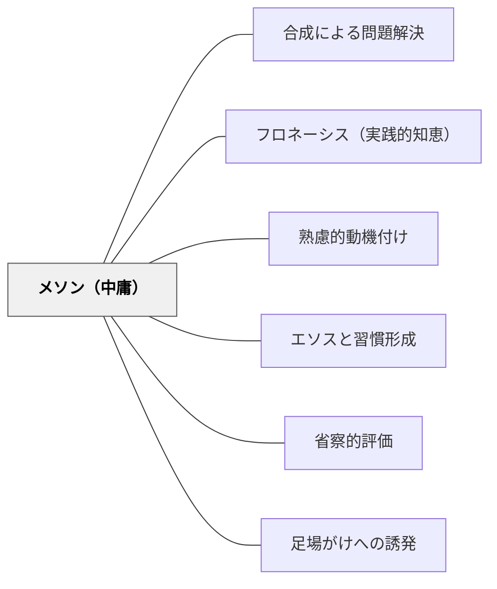

# メソン（中庸）

> 「実体と、『そもそも何であるか』ということ（本質）の定義という観点からいえば徳は中間性なのだが、最善のものと立派さという観点からいうと、徳は『頂点』なのである。」——アリストテレス（第二巻第六章）

## Pattern Connection

### アリストテレス（前335年頃）——ニコマコス倫理学 第二巻第六〜九章

アリストテレスは「中庸（メソン）」を単純な「ちょうど真ん中」として定義しない。重要な区別を立てる：

**数学的中間**：10と2の中間は6——誰にとっても同じ客観的な中点

**われわれにとっての中間**：超過でも不足でもないもの——人によって異なり、状況に依存する

> 「『われわれにとっての中間』とは、超過でも不足でもないもののことである。そしてこれはひとつではないし、全員にとって同一というわけでもない。」——第二巻第六章

ミロン（大食漢のレスリング選手）の例：彼にとって「ちょうどしかるべき量」の食事は、初心者にとっては多すぎる。中庸は文脈・人・状況に依存する。

中庸の完全な定義（第二巻第六章）：
> 「[人柄の]徳とは、選択を生む性向であり、それはわれわれにとっての中間性を示す性向である。そして、ここでの『中間性』とは、[その人の]分別によって中間性と定まり、かつ思慮深い人ならば中間性と定めるような定め方において定まるものである。」

「超過と不足は立派な性向を破壊してしまうのに対し、中間性のほうはこれを保ってくれる」（第二巻第二章）

- **既存パタンとの関連**：[[パタン/熟慮的動機付け]] の「動機付けの過不足」問題に、中庸の枠組みが診断ツールを提供する——動機付けが強すぎる（強制・プレッシャー）も弱すぎる（無関心）も徳を破壊する。「ちょうどしかるべき動機付け」がフロネーシスによって見極められる。
- **補強された点**：[[パタン/フロネーシス（実践的知恵）]] なしに中庸は実現できない——「何がちょうどしかるべきか」は規則では定まらず、思慮深い判断によってのみ定まる。
- **他のパタンへの波及**：[[パタン/フロネーシス（実践的知恵）|教師の判断]] 系統——中庸は教師の判断力の哲学的基盤となる

---

## 背景（Context）

「やりすぎ」と「やらなすぎ」が教育の問題を作る。叱り方・褒め方・干渉・自由の度合い・課題の難易度——あらゆる教育的行為に「多すぎ」と「少なすぎ」の失敗がある。しかし「ちょうど良い」は数値や規則では定まらない。

アリストテレスはこれを2400年前に哲学的に整理した。徳（卓越性）とは「ちょうどしかるべき中間」に習慣的に向かう性向であり、その「ちょうど」は実践的知恵（フロネーシス）によってしか定まらない。

## 問題（Problem）

「中庸」は「妥協点を探る」「極端を避ける」という消極的な意味に誤解されやすい。しかしアリストテレスの中庸は「頂点」である。また「平均値」に合わせることは中庸ではない——その人・その状況での「ちょうどしかるべき」は、数値では出せない。

## 力のかたち（Forces）

- 超過（やりすぎ）と不足（やらなすぎ）はどちらも徳を破壊する——褒めすぎも叱らなすぎも成長を妨げる
- 中間は人によって異なる——同じ「褒める量」がある子には適切でも別の子には過剰になる
- 中間を定めるのは規則や数値ではなく**フロネーシス（実践的知恵）**
- 中庸の習得自体が難しい：「円の中心を理解することは全員にできることではないように、[徳における中間]を把握することは難しい」（第二巻第九章）
- 自分の傾向性を知ることが中庸への第一歩——超過寄りの人は不足方向に自分を引っ張る必要がある

## 解決（Solution）

**「ちょうどしかるべき」を規則で定めようとするのではなく、思慮深い判断力（フロネーシス）を育てることを目指す。目の前の子ども・状況・関係性をよく観察し、「今・ここ・この子にとっての中間」を判断する習慣を作る。**

### 教師の中庸診断

| 教育行為 | 超過の失敗 | 不足の失敗 | 中庸 |
|---|---|---|---|
| フィードバック | 批判しすぎる | 承認しすぎる | 成長を見ながらちょうどしかるべき指摘と承認 |
| 課題の難易度 | 高すぎて挫折 | 低すぎて退屈 | その子の「ゾーン」（ZPD）に収まる難しさ |
| 介入・支援 | やりすぎて依存 | やらなすぎて放置 | 自力で解決できる最小の手がかり |
| 自由と制約 | 自由すぎて迷走 | 制約すぎて窒息 | 探索と安全の両立 |

### 自分の傾向性を知る

アリストテレスが第二巻第九章で示す方法論：

1. **自分の傾向性を診断する**——自分はどちら（超過・不足）に傾きやすいか？
2. **逆方向に自分を引っ張る**——超過寄りの教師は意識的に「引く」、不足寄りは「押す」
3. **快楽（心地よさ）に引っ張られないよう注意する**——自分が楽な方向は中庸でないことが多い

### 子どもの中庸を育てる

中庸は教師だけが使うものではなく、子どもに育てたい性向でもある：

- 「勇気」は「臆病（不足）」でも「無謀（超過）」でもない中間
- 「気前良さ」は「吝嗇（不足）」でも「湯水のように使う（超過）」でもない中間
- 各場面で「ちょうどしかるべき」を選択する経験の積み重ねがフロネーシスを育てる

## 結果（Consequences）

- 「正解は一つ」ではなく「この文脈でのちょうどしかるべき」を問う判断力が育つ
- 教師の「べき論」の硬直が和らぐ——「いつも厳しくすべき」でも「いつも優しくすべき」でもなく、「今これに対してちょうどしかるべき」
- 「平均」や「妥協」ではなく「その人・その状況での最善」という教育観が生まれる
- フロネーシスの育成を教育目標として意識できるようになる

## 関連パタン
- [[パタン/合成による問題解決]]

- [[パタン/フロネーシス（実践的知恵）]] — 中庸を見極める能力の担い手
- [[パタン/熟慮的動機付け]] — 動機付けの過不足診断としての中庸
- [[パタン/エソスと習慣形成]] — 中庸を習慣的に選択できる性向の形成
- [[パタン/省察的評価]] — 自分の傾向性を振り返る実践
- [[パタン/足場がけへの誘発]] — ZPD（最近接発達領域）は「この子にとってのちょうどしかるべき難しさ」の認知科学的版
- [[文献/ニコマコス倫理学（上）（アリストテレス）]] — 本パタンの出典

## クラスター図

## Actionable Insight

- 今週の授業で「叱りすぎ・褒めすぎ・干渉しすぎ・任せすぎ」のどれかに偏っていないか一問する
- 「ちょうどしかるべき」を外から決めるのではなく、子どもの反応を観察しながら調整する——中庸は規則ではなく判断
- 自分が「つい」してしまう方向（超過か不足か）を把握し、逆方向への意識的な引きずりを練習する
- 子どもに「やりすぎ・やらなすぎ」という枠組みを教える——「勇気は無謀とも臆病とも違う」という話を6年生とする

## 出典

- アリストテレス（渡辺邦夫・立花幸司訳）（2015/2018）『ニコマコス倫理学（上）』光文社古典新訳文庫（第二巻第六〜九章）
- [[文献/ニコマコス倫理学（上）（アリストテレス）]]
