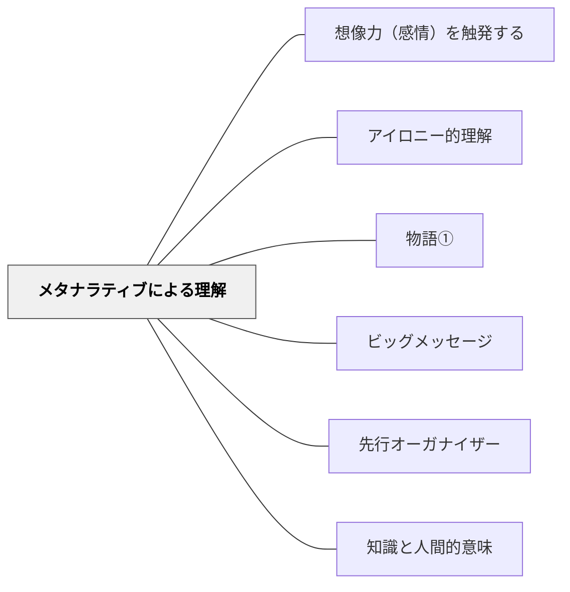

# メタナラティブによる理解

> 授業や単元の全体を貫く「大きな物語」が、個別の学びに意味と文脈を与える

## 背景（Context）

人は個別の事実や知識を、より大きな物語の枠組みの中で理解しようとする。9.11テロ事件が、西洋では「自由への攻撃」として、一部のイスラム世界では「西洋帝国主義への抵抗（ジハード）」として、あるいは「十字軍の延長」として解釈されたように、同じ出来事もそれを包む「メタナラティブ」によって意味が変わる。

## 問題（Problem）

個別の知識・技能・概念を断片的に教えても、学習者はそれらを統合した意味として受け取れない。授業や単元の終わりに「何を学んだのか」「なぜこれを学んだのか」が学習者に残らない。

## 力のかたち（Forces）

- 人間は本来、物語的に世界を理解する生き物である
- 個別の知識はメタナラティブの中に位置づけられて初めて意味をもつ
- 良いメタナラティブは記憶・転移・応用を助ける
- しかし特定のメタナラティブに縛られることは、アイロニー的理解（別の解釈の可能性）を閉ざすリスクもある

## 解決（Solution）

授業・単元・学期を設計する際に、全体を貫くメタナラティブを意識的に構築する。算数の授業であれば「数学は世界の秩序を記述する言語である」というような大きな物語を持ち、個々の計算練習や概念学習がその物語の一部として意味をもつように配置する。

授業の終わりには、学んだことを「今日の学びは、この大きな問いにこう答えている」という形でまとめ、メタナラティブとしての意味づけを行う。複数の解釈枠組みを提示することで、メタナラティブの複数性・相対性への気づきも促す。

## 結果（Consequences）

学習者は個別の学びが「なぜ意味があるのか」を感じやすくなる。記憶の統合と転移が促される。ただし、固定されたメタナラティブだけを提示すると、異なる解釈を排除するイデオロギー的偏りを生む危険がある。

## 関連パタン

- [[パタン/想像力（感情）を触発する]]
- [[パタン/アイロニー的理解]]
- [[パタン/物語①]]
- [[パタン/ビッグメッセージ]]
- [[パタン/先行オーガナイザー]]
- [[パタン/知識と人間的意味]]

## クラスター図

## Actionable Insight

- 単元の最初に「この単元全体を貫く大きな問い（物語）」を一文で提示する——個々の授業が「この物語の一場面」として意味をもつようになる
- 授業の終わりに「今日学んだことは、この単元の大きな問いにどう答えているか」を一文でまとめさせる——メタナラティブへの位置づけが個別の学びに意味を与える
- 同じ出来事を複数の「大きな物語（解釈の枠組み）」で読み直す活動をする——メタナラティブの複数性への気づきが批判的・多元的思考を育てる

## 出典

キアラン・イーガン（2010）『想像力を触発する教育――認知的道具を活かした授業づくり』北大路書房
