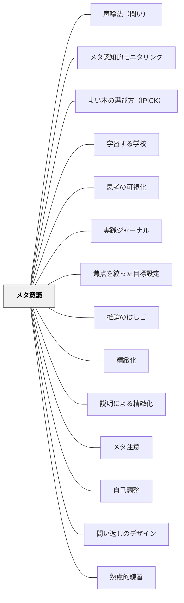

# メタ意識

---

## Pattern Connection

**Senge et al.（2000/2012）統合（2026-05-14）：**

*Schools That Learn* のメンタル・モデル（Mental Models）ディシプリンは、本パタンの実践的拡張として機能する。

- **補強された点**：本パタンが「自分の状態・思考・感情を観察する構え」を扱うのに対し、メンタル・モデルのディシプリンはより具体的に「無意識の仮定・前提・信念を表面化し検討する」ことを目的とする。メタ意識は「気づくこと」を、メンタル・モデルは「気づいた後に検討・修正すること」を強調する。
- **接続した概念**：[[パタン/推論のはしご]] — 推論のはしごは「自分のメタ意識を可視化する最も具体的なツール」。はしごを描くこと自体がメタ意識の練習になる。Left-Hand Column演習は「自分が話したこと」と「考えていたこと」のギャップを書き出す形でメタ意識を構造化する。
- **他のパタンへの波及**：[[パタン/ダイアログ]] では「仮定を宙吊りにする」実践が、集団レベルでのメタ意識として機能する。

---

## 背景（Context）

学習者が活動や思考を進める中で、**自分が何をしているのか・どんな状態にあるのか**を把握できないと、誤った理解や学びの停滞が生じやすい。教員にとっても、子どもの思考や感情の動きに気づくには、**自身の思考や指導の在り方を客観視する力**が必要である。

## 問題（Problem）

思考や行動に夢中になるあまり、**自分の状態・視点・前提・目的**に気づかずに活動が流れてしまう。その結果、学びが自己目的化したり、感情が置き去りになったりする。

## 力のかたち（Forces）

- 学びの場では、活動の没入と客観的な内省が同時に求められる
- 「自分の内面を見る」ことは訓練なしには困難
- 教師と子ども、子ども同士の相互関係の中で、"いま起きていること"をことばにする力が重要

## 解決（Solution）

自分の状態（思考・感情・身体・関係）を観察し、「気づき直す」構え＝**メタ意識**を育てる。

「いま、自分は○○しているな」「これって、〜だからかもしれない」と、**自分の認知・情動・行動を一歩引いて捉える**言語化の場面や問いを意図的に設ける。

**実践例：**
- 授業後のふりかえりカードに「今日の自分はどんなことに気づいた？」と問いを設ける
- 子どものつぶやきを拾い上げて「今のって、どんなことに気づいたの？」と返す
- 教師自身が「このとき、私はこう考えてたんだ」と自らメタ意識を言語化して見せる（モデリング）

## 結果（Consequences）

- 学習が「ただの活動」ではなく、「意味づけされた経験」になる
- 子どもが自己理解と他者理解の回路を持ち始める
- 教師も実践に対する自覚的な立場を持てるようになる
- メタ意識の共有によって、教室が「気づきの交差点」になる

## 注記

[[パタン/メタ注意]] は「注意に注意を払う」という実践的な操作面に焦点を当てたパタン。メタ意識はその上位の構えとして、自己の状態全体を俯瞰する視座を指す。

## 関連パタン
- [[パタン/声喩法（問い）]]
- [[特別支援/特別支援級の算数指導]]
- [[パタン/メタ認知的モニタリング]]
- [[パタン/よい本の選び方（IPICK）]]
- [[パタン/学習する学校]]
- [[パタン/思考の可視化]]
- [[パタン/実践ジャーナル]]
- [[パタン/焦点を絞った目標設定]]
- [[パタン/推論のはしご]]
- [[パタン/精緻化]]
- [[パタン/説明による精緻化]]

- [[パタン/メタ注意]] — 注意に注意を払うことで集中力を育む（実践的操作版）
- [[パタン/自己調整]] — 学習者が自分の学習を調整する力
- [[パタン/問い返しのデザイン]] — 子どもの発言を深める問い返し
- [[パタン/熟慮的練習]] — 意図的な目標と振り返りをもった練習
- [[概念/メタパターン]] — 文脈依存的なパタン活用の視点
- [[概念/思考の三層（科学・論理・メタ）]] — メタの層の哲学的基盤

## クラスター図

## Actionable Insight

- 授業の振り返りで「今日気づいたこと」に加えて「自分が何を感じていたか」を1行書かせる——認知だけでなく情動も含めたメタ意識を育てる
- 教師自身が「今先生はこう考えていたんだ」と声に出してモデリングする——教師のメタ意識の言語化が子どもにとって最も強いモデルになる
- 子どものつぶやきに「今のって、どんなことに気づいたの？」と返す——発言を深める問い返しがメタ意識の芽を育てる

## 出典

- パタン集/メタ意識.md
