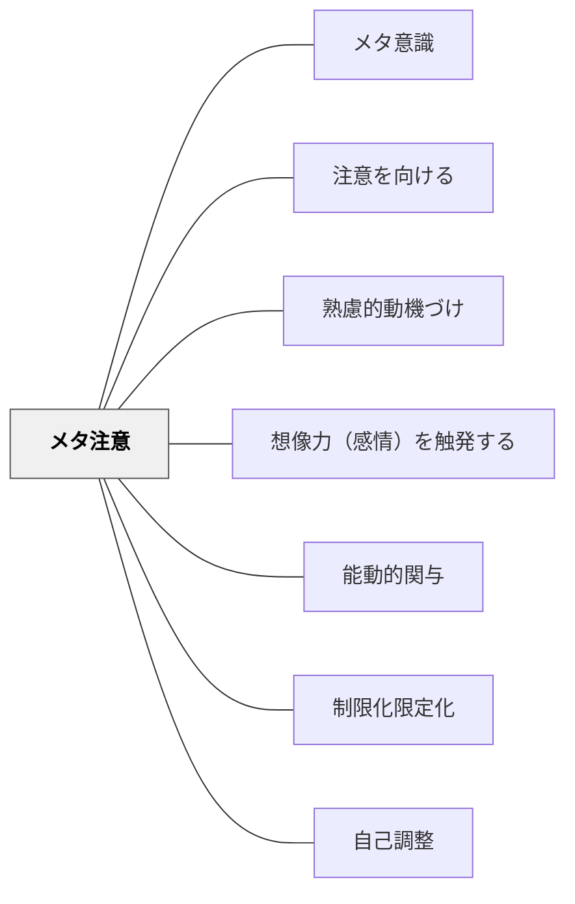

# メタ注意

> 注意がなければ、記憶も学習も成立しない。

## 背景（Context）

スタニスラス・ドゥアンヌ「脳はこうして学ぶ」（2021）は学習の4本柱を示した：①注意、②能動的関与、③誤りフィードバック、④定着。**注意は4本柱の第1番目**——注意が向いていないと、そもそも何も記憶されないし学習は成立しない。

このパタンは一度「熟慮的動機付け」の中に吸収して削除されたが、復活させた。理由は単純である：注意は学習の入り口であり、動機付けだけの問題ではなく、独立した介入ポイントとして捉える必要があるからだ。

## 問題（Problem）

学習者の注意がそれている、または途切れ途切れになっているとき、どれほど優れた内容を提供しても学習効果が上がらない。教育者も学習者も「注意」そのものを意識する習慣がない。

## 力のかたち（Forces）

- 注意は1つのことにしか向かないように脳ができている（マルチタスクは望ましくない）
- 動機付けが十分であれば注意は自然に持続するが、動機付けがなければ意図的な介入が必要
- 注意はメタ認知と深く結びついている——「自分が今何を知らないかを知っている」ことが好奇心と注意を生む

## 解決（Solution）

**メタ注意**とは、注意に注意を払うことだ。自分の注意がそれたことに気づく——それがメタ注意ができるということである。メタ注意が強くなれば、結果的に注意を持続できるようになる。それが集中力である。

教育者は2つの役割を持つ：

**学習者の注意を引き出す設計**
- 気が散る原因を取り除く（制限化された環境をつくる）
- ゴルディロックス原理——単純すぎず複雑すぎない「ちょうどいい刺激」を用意する
- 好奇心を引き出す問い・課題を設計する（「まだまだ発見すべきことがいくらもある」と感じさせる）
- 想像力を触発する（[[パタン/想像力（感情）を触発する]]）

**学習者自身がメタ注意できるよう促す**
- 「注意がそれたことに気づく」練習（マインドフルネス、呼吸法など）
- 学習の始まりに「今何を学ぶか」を明示し、自分の注意を向ける方向を意識させる

**注意に関するドゥアンヌの引用（p.237）**：
「学習条件の難度を上げて、生徒がさらに多くの認知的努力を投入しなければならなくすると、保持力を高めることになるものだ」——処理が深いほど良い学習である。

## 結果（Consequences）

- 注意の持続によって記憶への定着が高まる
- 自分の注意状態をモニタリングできる学習者は自律的に学習を調整できるようになる
- 教育者も「今この学習者の注意はどこにあるか」を観察する視点を持てる

## 関連パタン
- [[特別支援/特別支援で使えるパタン]]
- [[パタン/メタ意識]]
- [[パタン/注意を向ける]]

- [[パタン/熟慮的動機づけ]] — 動機があれば注意は自然に続く
- [[パタン/想像力（感情）を触発する]] — 注意を引き出す情動的アプローチ
- [[パタン/能動的関与]] — ドゥアンヌ4本柱の第2番目
- [[パタン/制限化限定化]] — 気が散る原因を取り除く環境設計
- [[パタン/自己調整]] — メタ注意→自己調整のつながり

## クラスター図

## Actionable Insight

- 授業の始めに「今日は○○を学びます。この10分間、ここに注意を向けていきましょう」と一言言う——注意を向ける方向を明示するだけで学習の定着が変わる
- 「気が散ったな、と気づいたら手を動かしてみよう」と伝える——メタ注意（気づき直し）の練習を30秒取り入れるだけで集中が戻りやすくなる
- 活動と活動の間に「今何に注意していたか」を1文言わせる——注意を意識化させることが自律的な集中力を育てる

## 出典
- [[文献/一つの教育のパタン・ランゲージ]]

Dehaene, S. (2020). *How We Learn: Why Brains Learn Better Than Any Machine for Now*. Viking.（邦訳：松浦俊輔訳（2021）『脳はこうして学ぶ』森北出版）  
Tan, C.-M. (2012). *Search Inside Yourself: The Unexpected Path to Achieving Success, Happiness (and World Peace)*. HarperOne.（邦訳（2016）『サーチ・インサイド・ユアセルフ』英治出版）  
岩井輝久「教育のパタン・ランゲージ図解バージョン変遷記録（動画記録）V7（2025/06/12）」
