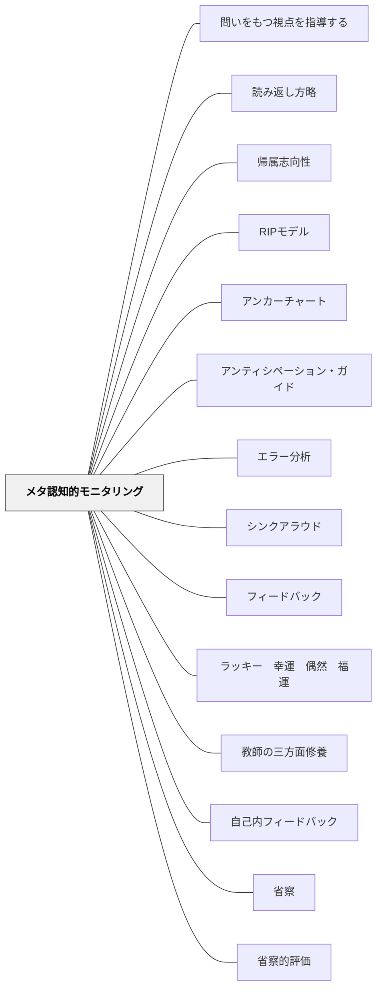

# メタ認知的モニタリング

> 「今どのくらいわかっているか」を知ることが、自己調整の出発点となる。

## [Pattern Connection]

Harvey & Goudvis（2007）の **Strategies That Work** は、読書における「モニタリング」を「Huh?」コードという具体的な実践ツールとして提供する。「自分の理解が崩れた瞬間に気づき、記録する」という行為そのものが、このパタンの解決策を読書指導の文脈で体現している。

- **補強点**：「わからない」を声に出す・記録することを教室文化として許可することの重要性。「先生も Huh? になる」とモデリングすることが最も効果的
- **拡張点**：モニタリングは「授業の終わりに理解度を問う」だけでなく、**読書中・活動中にリアルタイムで起きる**——混乱の瞬間を捉えることが鍵
- **他のパタンへの波及**：[[パタン/シンクアラウド]]・[[パタン/読みとつながる]]・[[実践/テキストコーディング]]

**Weinstein & Sumeracki（2018）統合（2026-05-20）：**

*Understanding How We Learn*（東京書籍, 2022）は、学習者のメタ認知失敗を3つの形で整理している。本パタンとの接続が特に強い。

- **マインドワンダリング（Mind-wandering）**：学習中、注意が課題から離れてさまよう現象。研究によれば**学習時間の30〜50%がこの状態**とされる。自分が「学んでいる」と思っていても注意が外れている——これはメタ認知的モニタリングの失敗の最も一般的な形。対策として「授業中に頻繁に問いを挟む（[[パタン/テストを繰り返す]]）」が有効。
- **流暢性の錯覚（Illusion of Fluency）**：再読・蛍光ペン・単語の反復書きは「わかった感」を生むが、実際の記憶定着には弱い。テキストを見ながら「これは知っている」と感じる流暢性が、記憶の強さと混同される。診断する問いは「**教科書を閉じて再現できるか？**」——[[パタン/テストを繰り返す]] の **フリーリコール** がこの錯覚を解除する最も効果的な手段。
- **フリーリコールとメタ認知**：何も見ずに白紙に書き出す自由再生は、単なる記憶練習を超えて「脳が何を知っていて何を知らないか」を正確に明示する——これは本パタンの「自己評価・振り返り」の最も強力な実装形式。「書けなかった部分＝まだ学んでいない部分」が一目で分かる。
- **WOOP戦略（Oettingen, 2014）との接続**：学習計画のメタ認知として **W**ish→**O**utcome→**O**bstacle→**P**lan の枠組みが有効。特に「障害の同定（O）」と「if-thenプラン（P）」が、自分の学習状態を現実的に評価するメタ認知能力を必要とする。単なるポジティブシンキング（「できる！」と思うだけ）では効果がなく、障害を想定した計画立案がカギ。
- **確証バイアス（confirmation bias）**：自分の学習法の選択も認知バイアスの影響を受ける——「自分は視覚型だから」という学習スタイル信念が反証を無視させ、非効率な方法を使い続けさせる。これもメタ認知失敗の一形態。

接続するパタン：[[パタン/テストを繰り返す]]（フリーリコール）、[[パタン/望ましい困難]]（困難感と実際の学習の乖離）、[[概念/認知負荷理論]]（マインドワンダリングへの対策）

---

**牧口常三郎（1931）——自覚と他覚：メタ認知には自己評価と他者評価の両方が必要**

*創価教育学体系 第2巻* の人格価値論は、自己の価値を正確に認識するには「自覚」と「他覚」の両方が不可欠だと論じる。これはメタ認知的モニタリングの原理を価値評価の文脈から補強する。

> 「正当の人格価値はこの自覚と他覚の両方を取捨選択し較べ合わせ、質を量に量を数に換算して、而して後に判断したものでなければならぬ」

| 評価の種類 | 内容 | 偏ると生じる問題 |
|---|---|---|
| **自覚** | 自己による自己の評価・反省 | 過大→自惚れ、過小→自己否定 |
| **他覚** | 他者による自己への評価の認識（他者の評判） | 追従・過剰同調、または他者評価の無視 |

**教育実践への含意**

この「自覚と他覚」の対は、現代の学習科学における「自己評価（self-assessment）」と「外部フィードバック」の必要性を先取りしている。

- 自覚のみ（自己評価だけ）では流暢性の錯覚（「わかった気がする」）が修正されない
- 他覚のみ（教師・仲間の評価だけ）では、自律的な学習者が育たない
- 両者を照合する習慣が、メタ認知的精度を高める

「教科書を閉じて再現できるか（自覚）」＋「仲間に説明できたか・教師からのフィードバック（他覚）」を組み合わせることが、牧口の原理とフリーリコールが合流する実践ポイントである。

- **他のパタンへの波及**：[[パタン/価値]]（評価作用の本質）・[[パタン/フィードバック]]（他覚の制度的実装）

---

**Harvey & Goudvis の「Huh?」コード：**
読書中に理解が崩れたとき、付箋に「Huh?」と書いてテキストに貼る。子どもが混乱したポイントを可視化することで：
- 混乱が「恥ずかしいこと」でなく「普通のこと」になる
- 後で戻って読み直すための「マーカー」になる
- 教師が「どこでつまずいているか」を見取れる

> 「Huh? の付箋が最も重要な情報を持っていることがある」——Harvey & Goudvis（2007）

**Fix-up Strategies（理解修復ストラテジー）：**

「Huh?」は理解崩壊の入口に過ぎない。その後「どうするか」——Fix-up Strategies が実質的な理解回復を担う：

| Fix-up Strategy | 使うとき |
|---|---|
| **読み直す（Reread）** | 早く読みすぎた・飛ばした可能性があるとき |
| **先を読む（Read ahead）** | 後で説明される可能性があるとき |
| **前後の文脈から推測する** | 知らない語・文章が出てきたとき |
| **図・グラフ・写真を見る** | ノンフィクションで文字だけでは分からないとき |
| **つながりをつくる（BK）** | 知っている経験・知識と結びつけるとき |
| **声に出して読む** | 黙読で意味が取れないとき |
| **背景知識を補給する** | 知識不足が原因の誤読のとき（Fix-up だけでは解決しない）|

**背景知識の欠落と誤読**：Fix-up Strategies の限界として Harvey & Goudvis が示す重要な指摘がある——語の意味を知らないまま読み進めると、理解が表面的に「成立している」ように見えて、実は根本から誤っていることがある。例えば "friar"（修道士）を知らずに読み続けると、読者は「何かを friar する人」として理解してしまい、その誤読の上に他の理解が積み重なる。こうした場合、Reread（読み直し）だけでは修復できない——語の意味・概念の背景知識を補給することが必要だ。これは [[パタン/背景知識]] と本パタンの交差点であり、「Huh?」の原因を見極める力が Fix-up 選択の前提になる。

### 牧口常三郎（1930）——「考え方を教えること」と認識先行モニタリング

牧口は *創価教育学体系 第4巻*（教育方法論）において、教育の中心課題を「what to think（何を考えるか）を教えること」ではなく「**how to think（どう考えるか）を教えること**」にあると主張した。これはメタ認知的モニタリングの教育的根拠を1930年代に独自に定式化したものとして読める。

**「考えよりは考え方を」**

牧口は、知識の量（内容知）より思考方法（方法知）を習得することが先決だと論じた。「何を学んだか」ではなく「どのように学び・考えたか」を意識させること——これはまさにメタ認知的モニタリングの日常化である。

**認識先行モニタリング：評価作用が「わかった気」を生む**

牧口が第4巻で示した「**認識作用と評価作用の区別**」（[[パタン/認識と評価の区別]]）は、メタ認知の精度に直接関わる重要な洞察を含んでいる。

学習者が自分の理解度をモニタリングするとき、「好き・嫌い」「難しい・簡単」「なんとなくわかった」という**評価的反応が先行すると**、実際の認識（何がわかっていて何がわかっていないか）が歪められる——これは **流暢性の錯覚（Illusion of Fluency）** と構造的に同じ問題である。

> 「あせりがちの評価作用を意力的に抑圧しておいて、飽くまで冷静着実なる科学的態度を以て臨む」——牧口常三郎

このことが実践に示すこと：「この単元はわかった（評価）」と思っていても、「どこが説明できるか・どこが言葉にならないか（認識）」を問うと実態が変わる。評価を保留して認識を先行させるモニタリングが精度を上げる。

**教師の研究への適用**

牧口はこの原則を授業観察にも適用した：授業参観で「あの授業はよかった・悪かった」という評価が先行すると、何が起きていたかの正確な認識が阻まれる。評価を後回しにして事実記述から始めることが「科学的態度」であると示した。これは教師自身のメタ認知的モニタリング（自分の授業観を観察する）を精度化する技法でもある。

- **他のパタンへの波及**：[[パタン/認識と評価の区別]]（このパタンのメタ認知応用として位置づく）・[[パタン/省察]]（認識先行の省察が「本当の省察」になる条件を共有）

---

## 背景（Context）
メタ認知的モニタリングとは、自分の学習状況・理解度・進み具合を観察・評価する能力。フラベルらのメタ認知研究に基づき、自己調整学習の中核的なプロセスの一つとされる。「わかった気がする」と「本当にわかっている」の差異を認識することが、効果的な学習の第一歩。

## 問題（Problem）
多くの学習者は自分の理解度を正確に把握していない（メタ認知的錯覚）。「わかった」と思って次に進むが、テストや応用場面でつまずく。自分の学習状態への気づきがないと、適切な自己調整もできない。

## 力のかたち（Forces）
- 理解度の自己評価は実際の理解度と一致しないことが多い
- モニタリングのスキルは明示的に教えることが有効
- 振り返りの時間と機会が設けられていないとモニタリングが起きにくい
- 外部からのフィードバックがモニタリングの精度を高める

## 解決（Solution）

**学習のプロセスに定期的な自己評価・振り返りの機会を組み込み、「今どのくらいわかっているか」を学習者が意識的に点検できるようにする。読書中はリアルタイムで「Huh?」を記録し、Fix-up Strategies で理解を修復する。**

「今日の授業の理解度を1〜5で評価すると？」「まだわからない点は？」などの問いを授業の末尾に設ける。交通信号カード（赤・黄・青）などの可視化ツールを使う。定期的な自己テスト（検索練習）もモニタリングを高める。

読書場面では：
1. 混乱した瞬間に「Huh?」と付箋に書いてテキストに貼る——混乱を記録することで後から戻れる
2. 混乱の「原因」を見極める——語の意味が分からない？前後がつながらない？背景知識がない？
3. 原因に合った Fix-up Strategy を使う——語の意味不足なら辞書・前後文脈推測、背景知識不足なら外部知識の補給
4. 修復できたか確認する——「今、意味が分かる？」と自分に問い直す

## 結果（Consequences）
- 自己の学習状態への正確な認識が高まる
- 「わからない」を早期に発見し、修正できるようになる
- 自律的な学習者の形成につながる

## クラスター図

## Actionable Insight

- 授業の末尾に「今日の理解度を1〜5で評価すると？まだわからない点は？」と問う——学習者が自己の学習状態を正確に把握できるようになる
- 交通信号カード（赤・黄・青）などで理解度を可視化させる——「わからない」を早期に発見し修正できるようになる
- 定期的な自己テスト（検索練習）を取り入れる——モニタリングの精度が上がり自律的な学習者が形成される

## 関連パタン
- [[パタン/問いをもつ視点を指導する]]
- [[パタン/読み返し方略]]
- [[実践/2列メモ（シンクシート）]]
- [[実践/カンファリング（読書会議）]]
- [[実践/リーダーズ・ノートの起動]]
- [[パタン/帰属志向性]]
- [[パタン/RIPモデル]]
- [[パタン/アンカーチャート]]
- [[パタン/アンティシペーション・ガイド]]
- [[パタン/エラー分析]]
- [[パタン/シンクアラウド]]
- [[パタン/フィードバック]]
- [[パタン/ラッキー　幸運　偶然　福運]]
- [[パタン/教師の三方面修養]]
- [[パタン/自己内フィードバック]]
- [[パタン/省察]]
- [[パタン/省察的評価]]
- [[パタン/推論する（インファリング）]]
- [[パタン/読みとつながる]]
- [[パタン/読解の7プロセス]]
- [[パタン/認識と評価の区別]]
- [[パタン/不思議を育てる]]
- [[パタン/問いを大切にする]]
- [[パタン/熟慮的動機付け]] — 親パタン
- [[パタン/自己教示（セルフトーク／自己説明／精緻化／体系化）]] — 自己説明を通じたモニタリング
- [[パタン/自己記録]] — モニタリング結果を記録するパタン
- [[パタン/メタ意識]] — メタ認知の広い枠組み
- [[パタン/背景知識]] — Fix-up で解決しない誤読の根本原因
- [[パタン/問いをもつ（クエスチョニング）]] — 「Huh?」と「I Wonder」は同じ根（混乱→問い）
- [[パタン/テストを繰り返す]] — フリーリコールが「知っていることと知らないこと」を明示する最良のメタ認知ツール
- [[パタン/望ましい困難]] — 「難しく感じる」と「学んでいない」の区別がメタ認知を必要とする
- [[概念/認知負荷理論]] — マインドワンダリングのメカニズムと対策
- [[実践/学習科学の6方略]] — 学習科学の文脈での位置づけ
- [[文献/認知心理学者が教える最適の学習法（Weinstein & Sumeracki）]] — 流暢性の錯覚・マインドワンダリングの一次資料

## 出典

Harvey, S., & Goudvis, A. (2007). *Strategies That Work: Teaching Comprehension for Understanding and Engagement* (2nd ed.). Stenhouse Publishers.

Flavell, J. H. (1979). Metacognition and cognitive monitoring. *American Psychologist*, 34(10), 906–911.
