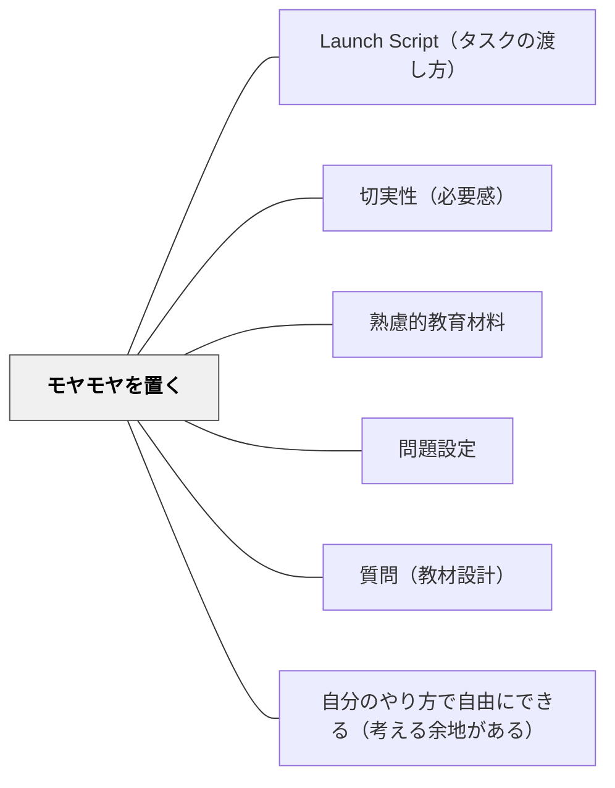

# モヤモヤを置く

> 学習の終わりに「解決されない問い」「引っかかり」を意図的に残し、学習者の継続的な思考を促す。

## 背景（Context）

ツァイガルニク効果（未完成課題の方が完成課題より記憶に残りやすい）の教育的応用。「まとめ」で完結させるのではなく、あえて「モヤモヤ」「問い」を残して終わることで、学習者がその後も自発的に考え続ける状態をつくる。問題設定における「切実な問い」の継続版。

## 問題（Problem）

きれいにまとめて終わる学習は閉じてしまい、学習者がその後に自発的に考え続けることが少ない。

## 力のかたち（Forces）

- 未解決の問いが記憶と思考への関与を持続させる
- モヤモヤを抱えることへの耐性が深い学びの前提
- 放置しすぎると不安になる学習者もいる

## 解決（Solution）

**学習の節目や終わりに「まだ解けていない問い」「引っかかり」「気になること」を意図的に残す。学習者自身がモヤモヤを言語化・記録できる余白を設ける。**

## 結果（Consequences）

- 学習後も思考が継続し、次の学習への動機が生まれる
- 深い問いへの耐性と姿勢が育つ

## 関連パタン
- [[パタン/Launch Script（タスクの渡し方）]]
- [[パタン/切実性（必要感）]]

- [[パタン/熟慮的教材教具]] — 親パタン
- [[パタン/問題設定]] — モヤモヤから問題へ
- [[パタン/質問（教材設計）]] — 問いの組み込み
- [[パタン/自分のやり方で自由にできる（考える余地がある）]] — 余白としてのモヤモヤ

## クラスター図

## Actionable Insight

- 授業の終わりに「まだ解決されていない問い」「引っかかり」を一文書かせて次回に持ち越す——未解決の問いがツァイガルニク効果によって記憶と思考への関与を持続させる
- 「今日学んで、まだモヤモヤしていることを一つ書こう」という問いを授業の最後に定番にする——モヤモヤを言語化する経験が深い問いへの耐性と姿勢を育てる
- 単元を「きれいにまとめて終わる」ことを意図的に避け「続きが気になる状態」で終わる授業を作る——閉じない授業が次の学習への自発的な動機をつくる

## 出典

- 鈴木克明（2002）『教材設計マニュアル――独学を支援するために』北大路書房
