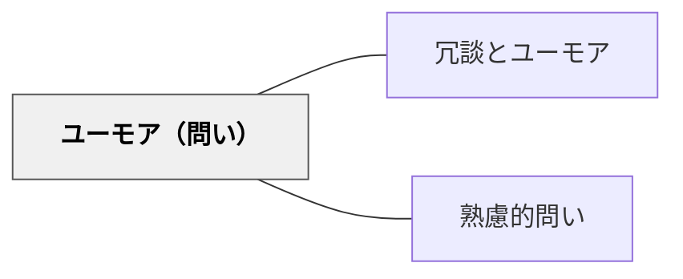

# ユーモア（問い）

> 笑いや意外性のある問いを通じて、固定観念が崩れ、創造的な発想への扉が開かれる。

## 背景（Context）

真剣な学習の場では、参加者が「正しいことを言わなければ」というプレッシャーに縛られやすい。そのような場では、思考が硬直化し、既存の枠を超えた発想が生まれにくい。ユーモアや意外性を含む問いは、その緊張を解きほぐし、心理的安全性を高める効果がある。

## 問題（Problem）

学びの場の緊張感が高いと、参加者は失敗を恐れて保守的な答えに留まる。固定観念や「こう答えるべき」という先入観があると、斬新な発想は出てこない。笑いや驚きのきっかけがないまま議論が進むと、思考は予定調和に落ち着いてしまう。

## 力のかたち（Forces）

- ユーモアは文化・個人差によって感じ方が異なり、誰もが同じように感じるとは限らない
- 笑いを目的にしすぎると、学習の焦点がぼやける
- 問い手のユーモアセンスが参加者に伝わらない場合、空回りするリスクがある
- 意外性のある問いは、参加者が「本気で考えていいんだ」と感じるきっかけになる

## 解決（Solution）

「もし猫が授業をデザインしたら？」「この問題を江戸時代の人に説明するなら？」「宇宙人にこの概念を説明するとしたら？」のように、非日常的・おかしみのある文脈を組み込んだ問いを使う。笑いを取ることが目的ではなく、固定観念を崩すきっかけとして問いにユーモアを組み込む。場の雰囲気が和むとともに、思考の柔軟性が高まる。

## 結果（Consequences）

- 場の緊張が和らぎ、参加者が自由に発言しやすくなる
- 意外な問いから予想外の視点や発想が生まれることがある
- 場の空気やタイミングによっては逆効果になることもあるため、使い所の見極めが重要

## 関連パタン
- [[パタン/冗談とユーモア]]

- [[パタン/熟慮的問い]] — 親パタン

## クラスター図

## Actionable Insight

- 「もし猫が授業をデザインしたら？」「宇宙人にこの概念を説明するとしたら？」という突拍子もない問いを一度試してみる——意外な文脈が固定観念を崩し場の緊張を和らげる
- ブレインストーミングの最初に「一番バカバカしいアイデアを出してください」と促す——笑えるアイデアの後に真剣なアイデアが出やすくなり思考の柔軟性が高まる
- 「江戸時代の人にスマートフォンを説明するなら？」のような時代錯誤な文脈で概念を説明させる——非日常的な文脈への変換が概念の本質を浮き彫りにする

## 出典

- [[文献/熟慮的問いのパターンリスト（動画記録）]]
