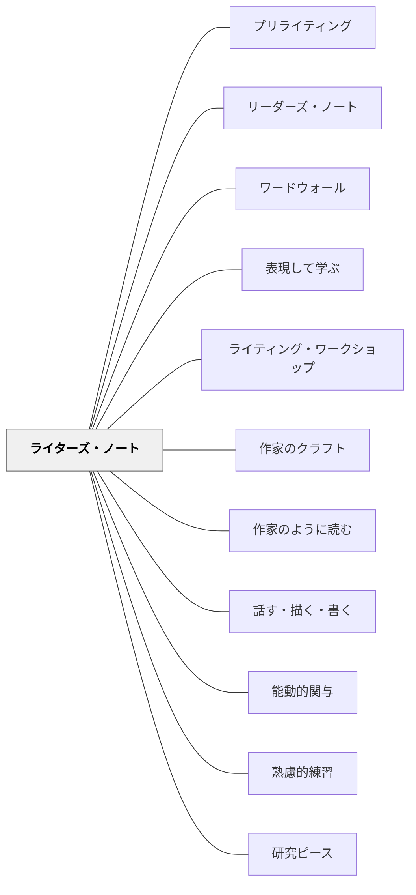

# ライターズ・ノート

> ノートは作家が持つ私的な貯蔵庫だ。作家はそこに見たもの、聞いたもの、感じたものを——書くに値するかどうかわからなくても——書き溜める。— Aimee Buckner（2005）

---

## Pattern Connection

**出典**: Buckner, A.（2005）*Notebook Know-How: Strategies for the Writer's Notebook*. Stenhouse Publishers.（OCR全文照合：2026-05-18）

- **既存パタンとの関連**：[[パタン/作家のように読む]] が「書き手として読む姿勢」を扱うのに対し、本パタンは「書き手が読んで得たものを日常的に蓄積する場所」を提供する。両パタンは一体として機能する。
- **補強された点**：Buckner の11種の起動・流暢さストラテジー、6種の展開ストラテジーを具体的に追記。「Daily Pages（毎日のページ）」「Lifting a Line（1行を引き上げる）」など、ノートを生きた道具にする名付けられたストラテジーが追加された。
- **修正・拡張された点**：「ドラフトはノートの外（黄色いリーガルパッド）」という Buckner の明示的な方針を追加。ノートの「前後2起点」組織法を追加。評価ルーブリック（Flexibility/Fluency・Thoughtfulness・Frequency・GUMS）を追加。
- **他のパタンへの波及**：[[パタン/作家のクラフト]] の Grabber Leads / Try Ten がノートの中で試されるという接続が明確化。[[実践/ライターズ・ノートの起動]] の Day 1〜10 の設計がより具体化される。

---

## 背景（Context）

ライティング・ワークショップでは、学習者が自分のトピックを選んで書く。しかし「書きたいことが何もない」という状態が繰り返されるとき、問題はワークショップの構造でなく、アイデアを集める場所がないことにある。

プロの作家は「書くためのノート」を持っている。ラルフ・フレッチャー、ナンシー・アトウェル、ルーシー・カルキンスら、ライティング・ワークショップの実践者がこぞって強調するのは、「作家は書く前に貯蔵庫を持っている」という事実だ。Aimee Buckner（2005）*Notebook Know-How* は、この「作家の貯蔵庫」を小学生が持ち、使い続けるための実践体系を提供する。

> 「It is an illusion that writers live more significant lives than nonwriters; the truth is, writers are just more in the habit of finding the significance that there is in their lives.」—Vicki Vinton（Calkins 1988 引用）

## 問題（Problem）

「今日は何を書きますか」と問うたびに手が止まる学習者がいる。また、何かを書き始めても毎回「昨日〇〇をしました」という出来事の記録（生活日記）に終わり、作家としての技法・声・工夫が生まれない。ライティング・ワークショップの生産性は、書くための素材がどれだけ蓄積されているかに大きく左右される。

## 力のかたち（Forces）

- アイデアは「書こうとするとき」ではなく「日常の観察や経験の中」で生まれる
- しかし記録しなければアイデアは消える——貯蔵庫が必要
- ノートが「評価される作品を書く場所」になると、低リスクな実験の場が失われる
- ノートが「何でも日記」になると、作家としての発展が起きない（bed-to-bed entry 問題）
- 「書く流暢さ（writing fluency）」は量を積み重ねることで育つ——最初は浅い書き方でよい
- 教師自身がライターズ・ノートを持ちモデリングすることが、最も強力な文化形成手段になる

## 解決（Solution）

**正式な作品とは別に、低リスク・高頻度のアイデア貯蔵ノートを持ち、日常的に書き溜める。**

ライターズ・ノートは「生活作文帳」でも「原稿用紙」でもなく、**作家の素材置き場**だ。

---

### ノートの物理的組織（前後2起点方式）

Buckner（2005）が提唱する整理方法：

| 起点 | 内容 | 使い方 |
|---|---|---|
| **前から書く** | 日常エントリー（自由選択・日付・タイトル） | 起動・流暢さストラテジー、観察・記憶・リストなど |
| **後ろから書く** | 文法ノート・リビジョン戦略・編集メモ | Try Ten / Grabber Leads のノート、段落メモなど |

「ノートの中身は生活のようなもの——機能するだけの整理と、面白さを保てるだけの柔軟さ」

**ドラフトはノートの外**：Buckner のクラスでは、ドラフトは黄色いリーガルパッド（yellow legal pad）に書く。ノートはあくまで種の貯蔵庫であり、ドラフトの場所は分ける。

---

### ノートに書くもの（エントリーのタイプ）

| タイプ | 内容 | 目的 |
|---|---|---|
| **リスト書き** | 好きなもの・嫌いなもの・不思議なものを箇条書き | トピックの種を蓄積する |
| **観察メモ** | 今日見た・聞いた・感じたことを短く書く | 感覚とことばをつなぐ |
| **記憶** | 強く残っている場面・経験を断片的に | 過去の経験を素材に変える |
| **言葉遊び** | 気になる言葉・聞こえた会話・面白いフレーズを集める | 語の感覚を育てる |
| **人物スケッチ** | 知っている人・架空の人物の特徴を書く | 物語のキャラクターの素材に |
| **もしも〜（Wonderings）** | 「もしこうなったら」「なぜ〜なんだろう」 | 問いから書き始める練習 |
| **ジャンル試し書き** | 詩・物語の書き出し・対話を短く試す | 技法の実験室として使う |
| **読書への反応** | 読んでいる本の言葉を引用し自分の考えを添える | 読書と書くことをつなぐ |

---

### 起動ストラテジー（Launch Strategies）——Year 1

**① History of a Name（名前の歴史）**
メンター絵本 *Chrysanthemum*（Kevin Henkes, 1996）から。自分の名前・ニックネームの由来・好き嫌いを書く。「名前の命名は作家にとって重要」という視点を育てる。

**② Writing from a List（リスト書き）**
「ベスト10」「ワースト7」などのテーマでリストを作り、★印をつけ、そこから1つ選んでエントリーに展開する。誰でも書けるが、深く書ける可能性を持つ。

**③ Questions / Questioning（問いのエントリー）**
「ずっと不思議に思っていること」を1つ選んでエントリーに。Erin の「アダムとイブにはへそがあったか」、Mac の「猫のニャーは何を意味するのか」——答えより思考の過程を書く。

---

### 流暢さ構築ストラテジー（Fluency Strategies）

**① Daily Pages（毎日のページ）**
Julia Cameron *The Artist's Way*（1992）から採用。毎日1ページ、何でもよいから書く。「ゴミ出し」として頭を空にする。最初は浅い書き方でよい——量を積み重ねることで深さへの道が開ける。

**② Writing off Literature（文学から書く）**
読み語りを2回する（1回目：純粋に聴く、2回目：書き始める）。読み終わったら何も言わず、無音でノートを開く。「良い文学は人を考えさせ続ける——その余韻をノートに」

**③ Observations（観察）**
「作家は普通の人が気づかないことに気づく」。5感を使った観察をリスト・ナラティブで書く。
- Kelsey の例：「キャンドルが夜に興奮したように揺れている。葉が木からパリパリと死んで落ちる」

**④ Writing from a Word（一語から書く）**
名詞を1つ選び、20分書き続ける（テーマから離れてよい）。Judy Eggemeier から Tom Romano の授業で学んだストラテジー。

**⑤ Rereading and Highlighting（読み返してハイライト）**
蛍光ペンで「面白い・もっと書きたい」行を印。余白に疑問やコメントを書く。「種は詩のように隠れている」——定期的に読み返すことで見えてくる。

**⑥ Lifting a Line（1行を引き上げる）**
ハイライトした行から1つを選び、次のページ冒頭に書き写す。その行を「書き出し（lead）」として新しいエントリーを書く。
- Christopher の例：「We walked onto the field bold and confident」→ プレイオフゲームの記憶が展開する

---

### トピックを深めるストラテジー（Expanding Topics）

種が見つかったら、そのトピックを「こねる（kneading）」段階：

**① Three-Word Phrases in Three Minutes（3語・3分）**
テーマに関する3語フレーズをできるだけ多く書く。焦点化・詳細化のクイックエクササイズ。

**② Writing from Another Point of View（別の視点から書く）**
同じ出来事を別の人物の視点で書き直す。「Mikey and the Muffin」の2バージョン（母の視点 vs 息子の想像上の視点）。

**③ Favorite Collection（お気に入りコレクション）**
「自分についての博物館の展示があったら何が置かれるか」。キャラクターにも応用できる。

**④ Interviews（インタビュー）**
家族・知人にインタビューして知らなかった詳細を集める。フィクションのキャラクター開発にも。

**⑤ K-N-T Chart（知る・知る必要がある・考える）**
Know / Need to Know / Think の3列。K-W-L の拡張版（Think 列が独自思考を捉える）。

**⑥ Listing the Possibilities（可能性のリスト）**
大きなトピックを具体的な記憶・エピソードのリストに分解。どれを書くかを絞る。

---

### ノートから正式な作品へ

ライターズ・ノートとライティング・ワークショップのドラフトは**場所を分ける**。

```
ノート（集める・試す）
    ↓
種を選ぶ（気になるエントリーに★をつける）
    ↓
種を育てる（ノートでそのトピックをさらに書く・展開ストラテジー）
    ↓
ドラフト（黄色いリーガルパッド等、ノートの外）
    ↓
リビジョン（ノートに戻って Try Ten など試す）
    ↓
編集・最終稿
```

「ノートに書いた」＝「ドラフト完成」ではない。ノートはあくまで素材置き場と試し場。

---

### 書き詰まりへの対処

「何を書けばいいかわからない」が続く学習者には：

- **種探しミニレッスン**：特定のエントリータイプをクラス全員で5分試す（「今日は観察メモだけ書こう」）
- **ノートを振り返る**：過去のエントリーを読み直し「もっと書きたい」ものに★をつける
- **Lifting a Line**：ハイライトした行から新しいエントリーを始める
- **ペアで読み合う**：お互いのノートの好きなエントリーを1つ選んで伝える——他者の目が種になることがある
- **短い対話**：「最近、何かが気になったこと・モヤモヤしたことはある？」と教師が聞く

---

### 評価（Buckner の3軸ルーブリック）

ノートの評価は「正しい文章か」ではなく：

| 軸 | 内容 |
|---|---|
| **Flexibility & Fluency**（柔軟性と流暢さ） | 多様なエントリータイプを試しているか。ほとんど完成しているか |
| **Thoughtfulness**（思慮深さ） | 省察的思考があるか。bed-to-bed entry を超えているか |
| **Frequency**（頻度） | 必要なエントリー数を書いているか |
| **GUMS** | Grammar / Usage / Mechanics / Spelling——知っていることを実践しているか |

「このノートは生きているか？」が評価の根本の問い。

---

## 具体例①：Chance のポケットノート（Ch.1）

新学期、Chance がポケットサイズのスパイラルノートを出した。「Ms. B. は大きさを指定しなかった。小さい方が1ページ書くのが早くてラク。」→ この経験から Buckner は「ノートのサイズより、何を書くか・なぜ書くかの指導が大切」と気づく。

---

## 具体例②：Meredith の「私は作家」（Ch.7）

年度末、Meredith は自分のノートの1エントリーを引用して自己評価に添えた：
> 「There is one thing I will never forget. My friend told me her grandmother had cancer and was dying. ... That evening, as my mom and I drove home, I thought about what she had said.」

その下に Meredith が書き添えた言葉：
> 「Some people would not pay attention if someone they knew said this. I did, because I'm a writer.」

ノートが「私は作家だ」という自己認識を育てた証拠。

---

## 結果（Consequences）

- 「何を書けばいいかわからない」が減り、書く準備ができた状態でワークショップに入れる
- 日常の観察・経験が書くことに結びつき、作家としての目が育つ
- 低リスクな試し書きの経験が、正式な作品への自信を育てる
- 教師がノートの内容を読むことで、一人ひとりの書き手の関心・強み・課題が見えてくる
- 「私は作家だ」という self-identity が積み重なる（Meredith の例）

## 関連パタン
- [[パタン/プリライティング]]
- [[パタン/リーダーズ・ノート]]
- [[パタン/ワードウォール]]
- [[パタン/表現して学ぶ]]

- [[パタン/ライティング・ワークショップ]] — ノートが機能するワークショップの構造
- [[パタン/作家のクラフト]] — ノートで試す技芸の具体例（Grabber Leads・Try Ten・Mapping the Text）
- [[パタン/作家のように読む]] — 読み手として読んだものをノートに蓄積する
- [[パタン/話す・描く・書く]] — 書く前の足場（話すことで種が見つかる）
- [[パタン/能動的関与]] — 日常の観察・経験への関与がノートの素材になる
- [[パタン/熟慮的練習]] — 低リスク・高頻度の書き実践としての日次エントリー
- [[実践/ライターズ・ノートの起動]] — 年度初めの起動実践
- [[教材/ライターズ・ノートの道具棚]] — エントリータイプと詰まったときの道具
- [[文献/Notebook Know-How（Buckner）]] — 一次資料
- [[パタン/研究ピース]] — 感動詞のある読書がピース生成の前工程になる

## クラスター図



## Actionable Insight

- 来週から授業の最初5分を「ノートを開く時間」にする——エントリーのタイプを一つ指定する（今日は観察メモ）だけで始められる
- 「先生のノートにはこんなことが書いてある」と教師自身のエントリーを週1回共有する——教師のモデリングが文化をつくる最短距離
- ノートと作品フォルダを物理的に別の場所に置く——「ノートは低リスクな場所」という感覚が育ちやすい
- **Lifting a Line を試す**：次の授業でノートを読み返し「一番好きな行に印をつけて、次のページの冒頭に書いてそこから書き続けてみよう」と言うだけ。試し書きへの抵抗が下がる
- **Daily Pages を Morning Pages として導入**：毎日の朝の時間に1ページ書く——うまく書こうとしないことが鍵

## 出典

Buckner, A. (2005). *Notebook Know-How: Strategies for the Writer's Notebook*. Stenhouse Publishers. (ISBN 1-57110-413-5)
Fletcher, R. (1996). *Breathing In, Breathing Out: Keeping a Writer's Notebook*. Heinemann.
Calkins, L. (1988). *The Art of Teaching Writing*. Heinemann.
Cameron, J. (1992). *The Artist's Way*. Jeremy P. Tarcher Books.
Ray, K. W. (1996). *Wondrous Words*. NCTE.

> 「significance cannot be found, it must be grown」—Lucy Calkins（1988, p.4）
