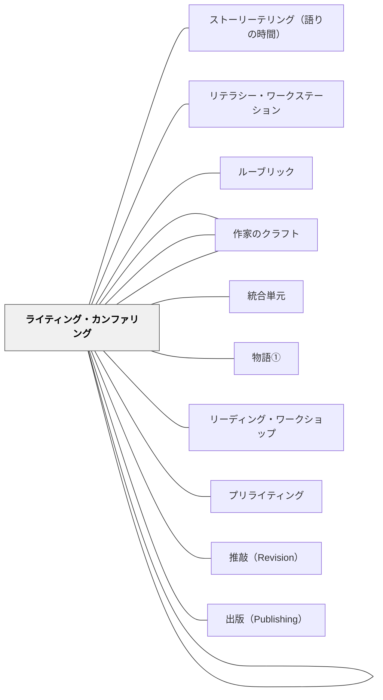

# ライティング・ワークショップ

> 書く時間・選択・カンファリング・共有を一つの授業構造にまとめ、学習者が「書くことを愛し、習慣として書き続ける人」へ育つ場をつくる。

---

## Pattern Connection

**出典**: Horn, M. & Giacobbe, M. E.（2007）*Talking, Drawing, Writing: Lessons for Our Youngest Writers*. Stenhouse Publishers.（統合：2026-05-14）

- **既存パタンとの関連**：[[パタン/リーディング・ワークショップ]] の「書く」版として機能する対称的なパタン。読む時間（RW）と書く時間（WW）が週に並ぶとき、学習者はリテラシーをより統合的に経験する
- **補強された点**：Horn & Giacobbe（2007）の最年少版（K-2年生）の実践から、「話す→描く→書く」の足場が書く前の準備として決定的に重要であることが明確になった。[[パタン/話す・描く・書く]] として独立したパタンに
- **修正・拡張された点**：カンファリングの目的を「作品を直す」から「作家として一つ渡す（Teach the writer, not the writing）」に明確化。Atwell（1998）・Calkins（1994）の原典もこの原則を共有する
- **他のパタンへの波及**：[[パタン/読み書きの文化]] に書く文化の具体的な仕組みとしてライティング・ワークショップが追加された

**Buckner（2005）統合（2026-05-14）：**

*Notebook Know-How* は、ライティング・ワークショップの「書く材料の準備（Writers Notebook）」の項目を、体系的な実践として大幅に拡張する。

- **補強された点**：本パタンで簡単に触れていた「作家のノート（Writers Notebook）」が、独立した体系として整備された。ノートは「貯蔵庫」であり、正式な作品の場所と**物理的に分ける**ことが低リスクな実験の場を保証するという具体的な指針が加わった。
- **拡張された点**：エントリーの8タイプ（リスト書き・観察メモ・記憶・言葉遊び・人物スケッチ・もしも〜・ジャンル試し書き・読書への反応）が整理され、「書き詰まり（writing rut）」への対処と、ノートから正式な作品への橋渡し方法が明確になった。
- **他のパタンへの波及**：[[パタン/ライターズ・ノート]] として独立したパタンに。[[教材/ライターズ・ノートの道具棚]] と [[実践/ライターズ・ノートの起動]] を新規作成。

**Muschla（2006）統合（2026-05-14、拡張：2026-05-19）：**
*Writing Workshop Survival Kit* は5〜12年生向けに100本超のミニレッスンを **「作文タイプ・技芸・メカニクス」の3層** で整理した。この分類がライティング・ワークショップのミニレッスン計画に具体的な骨格を与える。特に「技芸（Art of Writing）」層——書き出し・見せる描写・視点・声・語選択・比喩・フィクション要素——は日本の作文指導で最も手薄な部分であり、[[パタン/作家のクラフト]]（新規作成）として独立したパタンになった。

| 層 | Muschlaの分類 | 本数 | Wikiのパタン |
|----|-------------|------|------------|
| タイプ | Types of Writing（ジャンル） | 16本 | [[パタン/読むことから書くことへ]] |
| **技芸** | **Art of Writing（書き出し・視点・声・比喩・フィクション要素等）** | **29本** | **[[パタン/作家のクラフト]]** |
| メカニクス | Mechanics of Writing（文法・段落等） | 55本 | （既存の文法指導） |

2026-05-19 の拡張で追加された点：
- プリライティング13戦略（フリーライティング・クラスタリング・リハーサルなど）→ [[パタン/プリライティング]]（新規作成）
- 授業サイクルの具体的な時間配分：ミニレッスン5〜10分・独立書き20〜25分・共有10〜15分
- デイリーログ（P/D/PC/TC/R/F/NC コード）と5基準評価（焦点20%・内容25%・構成25%・文体15%・メカニクス15%）
- 技芸層の拡張：トーン・比喩三形態・擬音語・頭韻・クリシェ回避・フィクション要素（対立・登場人物描写・対話・場面設定・フラッシュバック・伏線・クライマックス・視点の種類）

- [[パタン/作家のクラフト]] — 技芸層のパタン（Muschla, 2006 / Calkins, 1994より）
- [[パタン/プリライティング]] — 書く前の準備を13戦略で体系化（Muschla, 2006）
- [[実践/書き出しのクラフト]] — 技芸層の最初のミニレッスン実践

---

## 背景（Context）

ライティング・ワークショップ（Writing Workshop）は、Nancie Atwell（1987, 1998）・Lucy Calkins（1986, 1994）らによって開発された作文指導の実践システムである。その中核にあるのは、「作家は書くことで作家になる（Writers learn to write by writing）」という信念——技法や文法を教わってから書くのではなく、書きながら技法を身につけるというアプローチである。

Horn & Giacobbe（2007）はこれを幼稚園から2年生向けに実践化した。「まだ字が書けない」「書くことが少ない」子どもたちを「書き手として扱わない」のではなく、**話すこと・描くことを含めた「書くこと」として扱う**ことで、最年少の学習者からライティング・ワークショップが始まる。

リーディング・ワークショップと並行して使うとき（読む時間と書く時間が週に共存するとき）、読み書きが相互に支え合い、読者として・作家として二つのアイデンティティが育つ。

## 問題（Problem）

作文指導が「書き方の技法を教える」授業になると、次の問題が起きる：

- 何を書くか（トピック）を教師が与えるため、書くことが「やらされる課題」になる
- 書く量・書く形式が決まっているため、「自分はこれを言いたい」という動機が消える
- 作文が評価のためだけの活動になり、書くことを楽しんだり生活に持ち込む経験が生まれない
- 発達段階のまだ早い子（描くことで表現している子）が「書けない子」として扱われる

## 力のかたち（Forces）

- 作家は書きたいことがあるから書く——動機は外から与えるものでなく内から生まれる
- 書く力はフィードバックのある書く経験の積み重ねによって育つ
- 学習者が自分のトピックを選ぶことは書くことへのオーナーシップを生む
- しかし自由に書かせるだけでは、書き続ける戦略・技法・読者意識が育たない
- 書くことを見てもらえる相手（教師のカンファリング・仲間の共有）がないと孤立した作業になる
- 評価が「文章の正しさ」だけに向かうと、内容・意図・作家の声が消える

## 解決（Solution）

**ミニレッスン・独立書き・カンファリング・共有の時間を組み合わせ、学習者が自分のトピックを選び・書き・共有するワークショップを設計する。**

---

### 基本的な授業サイクル

| 時間 | 内容 | 役割 |
|------|------|------|
| ミニレッスン（5〜10分） | 短い全体指導 | 「作家がすること」を一つだけモデリングする |
| 独立書き（20〜25分） | 自律的な書く時間 | 自分のトピックで話す・描く・書くを自律的に進める |
| カンファリング（独立書きの中で） | 1対1の会議、1日3〜5人 | 作家として一つだけ渡す教示をする |
| 共有の時間（10〜15分） | 作家の椅子・共有 | 1〜2人が書いたものを読み聞かせ、クラスが反応する |

45分授業の例：ミニレッスン8分＋独立書き22分＋共有15分。独立書きの時間を削らないことが文化形成の要。

---

### 独立書きを支える3つの仕組み

| 仕組み | 核心 |
|--------|------|
| **自分のトピックを選ぶ** | 「作家は自分が知っていること・関心があることを書く」——書く内容の決定権を学習者に渡す |
| **白紙の冊子（Blank Booklets）** | 罫線のない折り畳み紙の「本」が書く場所になる。描くことも書くことも同じ場所でできる |
| **書く材料の準備（Writers Notebook）** | 日頃から「書きたいこと」「気になったこと」をメモしておくノートを持つ |

---

### ミニレッスンで扱うこと（Muschlaの3層＋コミュニティ）

Muschla（2005）の3層分類をもとに、年間計画のバランスを意識する：

| 層 | 内容例 | 年間目安 |
|----|--------|---------|
| **タイプ（ジャンル）** | 物語・説明文・詩・意見文・報告文の書き方 | 3〜5本 |
| **技芸（Art）** | 書き出し・見せる描写・視点・声・語選択・文の多様性 | 5〜7本 |
| **メカニクス** | 文法・段落・句読点・接続詞・常体敬体 | 8〜10本 |
| **プロセス** | リハーサル（話す）・リビジョン・編集・出版 | 3〜5本 |
| **コミュニティ** | 作家の椅子・ピアカンファレンス・作家ノート | 2〜4本 |

技芸層のミニレッスン例（[[パタン/作家のクラフト]] 参照）：
- 書き出しの5パターン
- Show, don't tell（見せる描写）
- 語の選択（「大きい」→「山のような」）
- 声（Voice）——この文章、誰が書いたかわかるか

---

### カンファリングの原則

> **「作品ではなく作家を教える（Teach the writer, not the writing）」**

カンファリングは作文を添削する時間ではなく、この作家が次に試せることを一つ渡す時間である。

**典型的な会議の流れ**：
1. **聞く**——「今何を書いていますか」「これはどんな話ですか」と聞き、子どもに話させる
2. **読む**——書いたもの・描いたものを一緒に見る（批評しない）
3. **一つ渡す**——「〜を試してみると、もっと読む人に伝わるかもしれない」と一つだけ教示する
4. **確認する**——「今日書く時間に試してみますか」と確認する

**避けること**：複数の修正を同時に指摘する・文法の誤りを全て直す・「よくできました」で終わる

---

### 作家の椅子（Author's Chair）

共有の時間に使う「特別な椅子」。完成した本・書いたものを読み聞かせる場所として儀式化する。

- 書く動機を「本物のオーディエンス（聞いてくれる人）」として具体化する
- 「書いたものを誰かに読んでもらう」という経験が書き手のアイデンティティを育てる
- 聴衆は内容への反応（「私も同じことがある」「もっと知りたい」）をする——褒めるだけにしない

---

### 書く材料の収集（Writers Notebook）

Calkins（1994）・Atwell（1998）が強調する「作家のノート」。日頃から気づいたこと・見たこと・疑問に思ったことを書き留める習慣が、書くためのトピックの貯蔵庫になる。

- 日次ノート（5分書く）の習慣化
- 「観察メモ」「会話の断片」「面白いと思ったこと」を書き留める
- トピック探しのミニレッスンでノートを開く

---

### 話す・描く・書くの足場（特に低学年）

最年少の書き手（K〜2年生）には、話すこと・描くことが「書くことの一部」として機能する。この足場については [[パタン/話す・描く・書く]] を参照。

---

### よくある失敗と対処

| 起きやすいこと | 対処 |
|----------------|------|
| 「何を書けばいいか分からない」が続く | 書く前に「声に出して話す」時間を30秒置く／トピックリストを事前に作る |
| カンファリングが添削になる | 「一つだけ渡す」原則を守る。修正リストを作らない |
| 共有が「感想発表」だけになる | 聴衆に「一番心に残ったこと」「もっと聞きたいこと」を問う |
| ミニレッスンが長くなりすぎる | 10分を超えたら切る。ミニレッスンは「示す」だけで「練習」は独立書きで行う |
| 書く時間が短く孤立した活動になる | 20〜30分を守る。静かに書く時間を文化にする |

## 結果（Consequences）

- 学習者が「自分は書く人だ」というアイデンティティを持ちやすくなる
- 自分のトピックを選ぶことで、書く内容に「声（Voice）」が生まれる
- カンファリングを通じて、教師が一人ひとりの書き手としての成長を見取れる
- 作家の椅子・共有の時間で、書くことが個人の作業から教室の文化になる
- ただし、時間・環境・トピックの自由・教師のカンファリングの質が揃わないと、単なる自由作文に近づく

## このパタンが働く実践

| 実践 | どのように働くか |
|------|------------------|
| [[実践/ライティング・ワークショップ年度初め]] | 書く時間・白紙の冊子・作家の椅子を起動し、書く文化を立ち上げる |
| [[実践/ライターズ・ノートの起動]] | 書く材料を集める場所を作り、独立書きの前提を整える |
| [[実践/書き出しのクラフト]] | ミニレッスンで作家の技芸を一つ渡し、独立書きで試す |
| [[実践/ローベルみたいな物語を書こう]] | 物語創作を通して、構想・交流・推敲・共有の流れを具体化する |
| [[実践/詩を紹介する・詩を創作する]] | 詩を読み、選び、紹介し、自分でも書くことで、読むことから書くことへ橋を架ける |
| [[実践/言葉をよりすぐって俳句を作ろう]] | 俳句の型と推敲を通して、短い言葉を選び抜く書く実践にする |

## 関連パタン
- [[パタン/ストーリーテリング（語りの時間）]]
- [[パタン/ライターズ・ノート]]
- [[パタン/リテラシー・ワークステーション]]
- [[パタン/ルーブリック]]
- [[パタン/作家のように読む]]
- [[パタン/作家の椅子（Author's Chair）]]
- [[パタン/統合単元]]
- [[パタン/物語①]]

- [[パタン/リーディング・ワークショップ]] — 対になる読む時間の授業構造
- [[パタン/プリライティング]] — 書く前の13戦略（フリーライティング・クラスタリング・リハーサルなど）
- [[パタン/推敲（Revision）]] — Unity/Order/Conciseness の3原則で推敲を教える
- [[パタン/出版（Publishing）]] — 本物の読者への届け方が推敲の動機を生む
- [[パタン/ライティング・カンファリング]] — 書く文脈の1対1会議（Teach the writer, not the writing）
- [[パタン/作家のクラフト]] — 技芸層（書き出し・見せる描写・比喩・フィクション要素）のパタン
- [[パタン/話す・描く・書く]] — 幼い書き手のための書く前の足場
- [[パタン/シンクアラウド]] — ミニレッスンでの教師のモデリング
- [[パタン/アンカーチャート]] — ミニレッスンを通じて育つ作家の知恵の地図
- [[パタン/ミニレッスン・サイクル]] — ライティング・ワークショップのミニレッスンをサイクルで計画する
- [[パタン/1対1の面談]] — カンファリングの基本構造
- [[パタン/読み書きの文化]] — 書く人のアイデンティティを育てる文化
- [[パタン/自己選択自己決定]] — トピック選択と書く目的のオーナーシップ
- [[パタン/ポートフォリオファイル]] — 書いた作品の蓄積と成長の可視化
- [[パタン/ロールモデル]] — 教師が書く人として示すモデリング
- [[実践/ライティング・ワークショップ年度初め]] — 最初の1〜2週間の具体的実践
- [[文献/Talking, Drawing, Writing（Horn & Giacobbe）]] — 最年少版の一次資料
- [[パタン/コーヒーハウス詩の日]] — メンタル・イメージ指導の終着点。ライティングが保護者を招いた詩の祭典として共有される
- [[パタン/研究動機の先行執筆]] — ライターズ・ノートに動機を書きためる実践の文脈として接続

---

## クラスター図

## Actionable Insight

- **まず1回「書く時間20分」を試す**——ミニレッスンなしでよい。「今日は自分の書きたいことを書く時間です」と言って20分取る。子どもたちが何を書くかを観察することがカンファリングの起点になる
- **「何を書けばいいかわからない」子には「声に出して話してみて」と言う**——「書けない」子の多くは「話す機会がなかった」だけ。30秒話させると書けることが多い
- **作家の椅子を1脚用意する**——週に1回、書いたものを1人が読み聞かせる5分を授業の最後に置く。形式は最小限でよい。聞く側も「一番心に残ったこと」を一言だけ言う

---

## 出典

Horn, M., & Giacobbe, M. E. (2007). *Talking, Drawing, Writing: Lessons for Our Youngest Writers*. Stenhouse Publishers.

Atwell, N. (1998). *In the Middle: New Understandings About Writing, Reading, and Learning* (2nd ed.). Heinemann.

Calkins, L. (1994). *The Art of Teaching Writing* (2nd ed.). Heinemann.

> "Writers learn to write by writing, not by being told about writing." —Lucy Calkins

[[文献/Notebook Know-How（Buckner）]]
