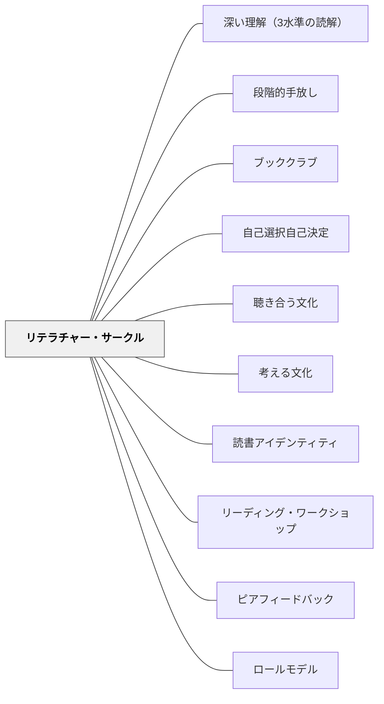

# リテラチャー・サークル

> 役割シートは補助輪だ——ペダルをこぐことを学んだら、取り外す。役割は本についての本音の対話を育てるための足場であり、目的ではない。

---

## Pattern Connection

**出典**: Daniels, H.（2002）*Literature Circles: Voice and Choice in Book Clubs & Reading Groups*（2nd ed.）. Stenhouse. / Daniels, H., & Bizar, M.（2005）*Teaching the Best Practice Way*. Stenhouse.

- **既存パタンとの関連**: [[パタン/ブッククラブ]] の具体的な実装形式として位置づける。ブッククラブが「本を読んで語り合う学習活動の総体」を扱うのに対して、リテラチャー・サークルは「生徒主導・役割の段階的消去・本の自由選択」という3つの固有の特徴を持つ特定の設計を指す。岩井（2018）のブッククラブが「パタンの重なり」を中心に論じるのに対して、Daniels はその重なりを実現するための具体的な管理システムを提供する
- **補強された点**: [[パタン/ブッククラブ]] の「よくある失敗と対処」（あらすじ確認で終わる・発言が偏る）に対して、役割シートによる足場かけが構造的な解決策を提供する。特に「どの子も準備して来る」という個人的アカウンタビリティが役割によって保証される
- **修正・拡張された点**: 役割シートを「永続的な構造」として使うと討議が表面化するというDanielsの警告——「役割を消す」という段階的消去のプロセスが、[[パタン/自己調整]] と [[パタン/読書アイデンティティ]] の視点を加える
- **他のパタンへの波及**: [[パタン/自己選択自己決定]] — 本の選択が生徒主導読書の前提。[[パタン/段階的手放し]] — I Do → We Do → You Do モデルを役割消去に適用。[[パタン/聴き合う文化]] — 役割が消えた後の自然な対話を支える文化

---

## 背景（Context）

Harvey Daniels（1994/2002）が体系化したリテラチャー・サークルは、小学校〜高校で広く実践されている協同読書活動だ。生徒が自分で選んだ本を小グループで読み、それぞれが役割を担って討議を準備し、生徒主導の対話を行う。

Daniels の核心的な問い：**なぜ読書会の対話は浅くなるのか？**

答えは単純だ——子どもたちは「本について本音で話す」経験が少なすぎる。教師が問いを提供し、教師が評価する読書指導では、生徒は「先生が求める正解を探す読み」になる。リテラチャー・サークルはこの構造を逆転させる：生徒が問いを立て、生徒が対話を導き、教師はコーチとして観察する。

役割シートはその「逆転」を支える足場だ——「次に何を言えばいいか分からない」という読書会の詰まりを防ぎながら、本についての準備と責任を個人に持たせる。

## 問題（Problem）

小グループでの読書会が機能しない原因：

- 役割のない討議は「誰かが話して、他は聴く」になりやすい
- 準備なしに集まると「何について話せばいいか分からない」が続く
- 教師主導の発問があると生徒は「正解探し」に戻る
- 全員が「考えを持ち寄る」個人的アカウンタビリティの仕組みがない

逆に、役割シートを使い続けすぎる失敗もある——役割の填充が目的化し、「本について本音で話す」という本質が失われる。

## 力のかたち（Forces）

- 役割は足場——生徒が討議スキルを内面化したら消すべきもの
- 本の自由選択が「自分のものとして読む」動機の源泉になる
- 準備（役割シートへの記録）が個人の責任と討議の質を保証する
- 生徒主導の対話は教師が場の外に出ることで初めて成立する
- 役割は「平等な参加」を構造的に保証する（誰もが貢献する役割を持つ）

## 解決（Solution）

**4〜6人の小グループが同じ本を選んで読み、役割シートで準備し、生徒主導の対話を繰り返す。役割を足場かけとして使い、生徒の対話力が育つにつれて段階的に消していく。**

---

### 基本構造

1. **本の選択**：同じ本を選んだ4〜6人が自然にグループを形成する（先に本を紹介し、生徒が選ぶ）
2. **読む範囲の決定**：グループで次の会合までに読む範囲（章・ページ数）を決める
3. **役割の割り当て**：グループ内で役割を分担する（毎回ローテーション）
4. **独立して読み、役割シートに記録する**：各自が自分の役割の視点から読みながらメモを残す
5. **生徒主導の対話**：教師は外に出て観察。生徒が討議をリードする
6. **振り返りと次のサイクルへ**：「対話で読みが変わったことは？」を振り返り、次の範囲を決める

---

### 6つの役割

| 役割 | 担当する仕事 | 起動に役立つ問い |
|---|---|---|
| **討議リーダー** | 今日の話し合いのための問いを3〜5問作る | 「今日、みんなで話したいことは何ですか？」 |
| **コネクター** | 本と自分の経験・他の本・世界のつながりを見つける | 「このシーンで思い出したことは何ですか？」 |
| **イラストレーター** | 印象的な場面・アイデアを絵で表現する（描いて発表） | 「この場面を絵にするとどうなりますか？」 |
| **言葉の達人** | 印象的・重要・難しい言葉や文を5か所選ぶ | 「特に印象に残った言葉や文はどこですか？」 |
| **要約者** | 今日読んだ部分の重要な流れをまとめる | 「今日はどんなことが起きましたか？」 |
| **調査員** | 背景知識・作者情報・関連資料を調べる | 「この話を深く理解するために、何を調べましたか？」 |

**役割は毎回ローテーションする**：全員が全ての役割を経験することで、対話の多様な視点が内面化される。

---

### 役割の段階的消去

Daniels の最重要の原則：**役割シートは永続的な構造ではない**。

| 段階 | 時期の目安 | 役割の状態 |
|---|---|---|
| **導入期** | 最初の3〜5回 | 全役割シートを使用。役割の方法を全体で教える |
| **練習期** | 5〜10回 | 役割の数を減らす。一部を「自由選択」にする |
| **移行期** | 10〜15回 | 役割シートなし。ただし「準備メモ」（自由形式）は残す |
| **自律期** | 15回以降 | 完全な生徒主導の対話。役割なしで深い討議ができる |

**消去の判断基準**：
- グループが役割なしでも自然に対話を始められるか？
- 全員が「自分の考え」を持って来るアカウンタビリティが育っているか？
- 教師の発問なしに討議が展開するか？

役割が消えた後に残るのが「本についての本音の対話」——これがリテラチャー・サークルの真の目的だ。

---

### 教師の役割：コーチとして外に出る

リテラチャー・サークルで最も難しいのは「教師が対話に参加しないこと」だ。

教師は：
- 各グループを巡回し、観察メモを取る（介入しない）
- 詰まったグループには「今どんな問いがありますか？」と問い返して外に出る
- 役割シートのフィードバックを事後に個別に行う
- 全体シェアで各グループの発見を繋ぐ

**「先生がいると正解を探す」**——この構造を崩すためには、教師が物理的に対話の場から出ることが必要だ。

---

### 本の選択プロセス

生徒が本を選ぶことがリテラチャー・サークルの前提：

1. 教師が3〜6冊の候補本を「ブック・トーク」（1〜2分の熱烈な紹介）で提示
2. 生徒が「読んでみたい本」を第1〜第3希望で選ぶ
3. 希望が近い4〜6人が自然にグループを形成する
4. 全員が読みたい本に入れない場合は、第2希望で調整する

**全員が同じ本を読む必要はない**——複数のグループが異なる本を同時に読み進める。これが通常の「一斉読書」と最大の違いだ。

---

## 結果（Consequences）

- 生徒が「準備して来る」個人的アカウンタビリティが役割によって保証される
- 生徒主導の対話により、教師への依存が減り、自分で読みを深める力が育つ
- 役割のローテーションにより、対話の多様な視点（問い・つながり・視覚化・語彙等）が身体化される
- 役割を消した後の自律的な対話が、本物の読書共同体を作る
- ただし、役割を消すタイミングを間違えると討議が崩壊する——段階的消去には慎重な判断が必要
- 本の選択の自由が「自分のものとして読む」動機を生む——義務的な課題図書読みとは質が違う

## 関連パタン
- [[実践/リテラチャー・サークルの起動]]
- [[実践/文学討論グループの設計]]
- [[パタン/深い理解（3水準の読解）]]
- [[パタン/段階的手放し]]

- [[パタン/ブッククラブ]] — リテラチャー・サークルの上位パタン（本を読んで語り合う学習活動）
- [[パタン/自己選択自己決定]] — 本の選択が生徒主導の前提
- [[パタン/聴き合う文化]] — 役割が消えた後の自然な対話を支える文化
- [[パタン/考える文化]] — 役割の準備が「考えを持ち寄る」文化を作る
- [[パタン/読書アイデンティティ]] — 生徒主導の読書会が「自分は読む人間だ」を強化する
- [[パタン/リーディング・ワークショップ]] — リテラチャー・サークルはRWの小グループコンポーネントとして機能する
- [[パタン/ピアフィードバック]] — 役割から生まれる対話的フィードバック
- [[パタン/ロールモデル]] — 教師が「読む人」として対話に参加するモデリング

---

## クラスター図

## Actionable Insight

- 最初の1回は「役割なし」で試してみる——「一番心に残った場面は？」だけで始め、何が詰まるかを観察する。その詰まりが役割シートが解決する問題だ
- 討議中に教師が椅子を引いて「外に出る」練習をする——物理的に場を離れることで生徒の発言量が変わる
- 3〜4回続けたら「今日、役割シートがなくてもできる部分はどこ？」とグループに聞く——消去のタイミングを生徒と一緒に考える

---

## 出典

Daniels, H. (2002). *Literature Circles: Voice and Choice in Book Clubs & Reading Groups* (2nd ed.). Stenhouse Publishers.
Daniels, H., & Bizar, M. (2005). *Teaching the Best Practice Way: Methods That Matter, K-12*. Stenhouse Publishers.

> 「役割シートは補助輪のようなものだ。ペダルをこぐことを学んだら、取り外す。」——Daniels
