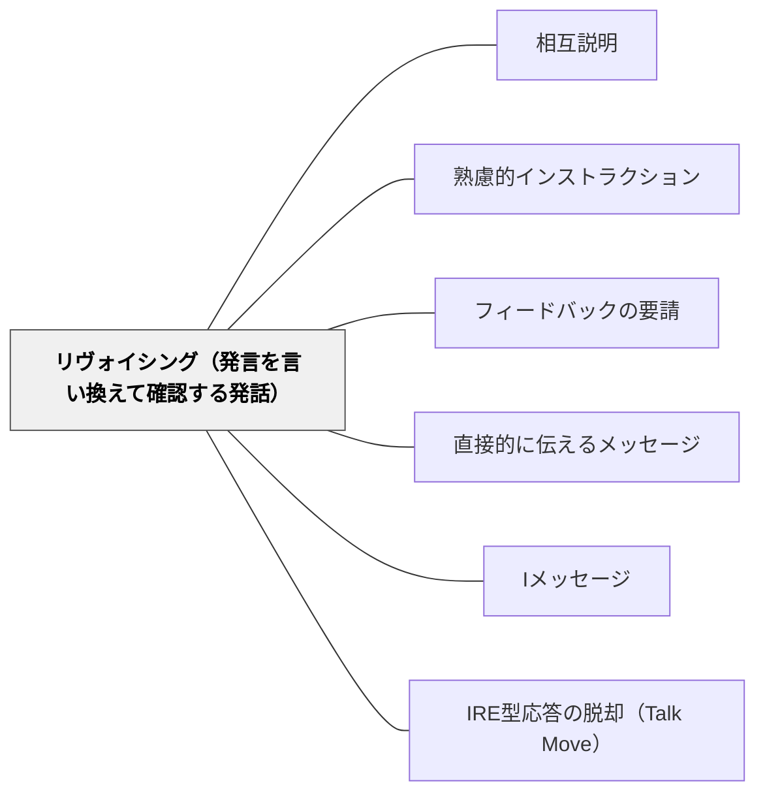

# リヴォイシング（発言を言い換えて確認する発話）

> 学習者の発言を言い換えて確認することで、理解を可視化し、教室全体に共有する。

## 背景（Context）
教室の対話では、学習者の発言が不明瞭だったり、他の学習者に届いていなかったりすることがある。教師が発言を受け取ったうえで何らかの応答をする際、その応答の形式が後続の学習に大きく影響する。リヴォイシングは、発言者の意図を確認しながら全体に共有するための発話技術である。

## 問題（Problem）
学習者の発言をそのまま繰り返すだけでは確認にならず、意味を付け加えすぎると学習者の考えを上書きしてしまう。「分かりましたか」という確認は形式的になりやすく、本当に理解が共有されているかどうかが把握できない。発言者と教師・学級全体の間で理解の齟齬が生じやすい。

## 力のかたち（Forces）
- 言い換えは理解の確認に有効だが、元の発言の意味を歪めるリスクがある
- 「つまり〇〇ということ？」という確認は発言者に意図の修正機会を与える
- 発言の言い換えにより、他の学習者も発言内容を再処理するきっかけになる
- 過剰なリヴォイシングは対話のテンポを損なう

## 解決（Solution）
**学習者の発言を「つまり○○ということ？」「○○と言いたいのかな」という形で言い換え、発言者に確認を求める。**

発言が不明瞭なとき、教師は発言者の言葉を自分なりに解釈して言い換え、発言者が「そうです」「少し違って…」と応答できる余地を作る。確認が取れた後に「○○さんは△△と言っています」と全体に向けて伝えることで、一部の発言を学級の共有知識にする。グループ活動でも、メンバーの発言を他者がリヴォイシングする練習として取り入れられる。

## 結果（Consequences）
- 発言の意図が確認され、理解の齟齬が修正される
- 発言が全体に共有されることで、議論の基盤が形成される
- 教師や他者が必ずしも意図どおりに言い換えられるわけではなく、誤解が固定されるリスクもある

## クラスター図

## Actionable Insight

- 学習者の発言が不明瞭なとき「つまり○○ということ？」と言い換えて確認を求める——発言の意図が確認され理解の齟齬が修正される
- 確認が取れた後「○○さんは△△と言っています」と全体に向けて伝える——一部の発言が学級の共有知識になる
- グループ活動でメンバーの発言を他者がリヴォイシングする練習を取り入れる——対話の質が高まり全員が発言の意味を再処理する

## 出典

- 一つの教育のパタン・ランゲージ（岩井輝久）

## 関連パタン
- [[学級経営/心理的安全性]]
- [[パタン/相互説明]]
- [[パタン/熟慮的インストラクション]] — 親パタン
- [[パタン/フィードバックの要請]] — 理解確認の関連技法
- [[パタン/直接的に伝えるメッセージ]] — 対比的なコミュニケーション形式
- [[パタン/Iメッセージ]] — 発話者を主体とするメッセージ形式
- [[パタン/IRE型応答の脱却（Talk Move）]] — リヴォイシングを含むTalk Move群を「第3ターンを評価から外す」設計思想で束ねる構造パタン
