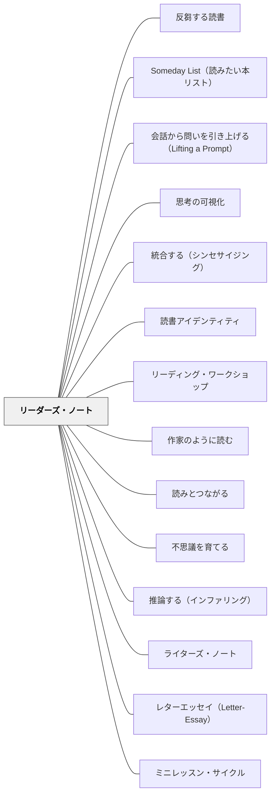

# リーダーズ・ノート

> ノートが問うのは「何を読んだか」ではなく「どう考えたか」「どんな読者になりつつあるか」だ。— Aimee Buckner（2009）

---

## Pattern Connection

### Buckner（2009）再統合（2026-05-18 OCR全文照合）

**補強された点**

- 年度初めの「読者の自分史（History of a Reader）」が最重要エントリーとして確認された。アンカーテキストには Ellen Senisi *Reading Grows*（1999）を使い、年度末に書き直す循環性がある
- ノート起動の具体的ストラテジー群が明確化された（What I Know to Be True / What Keeps You Reading? / Finding the Spark / Sticky Notes and Thinkmarks）
- 視覚化（Visualizing）を3段階に分解した進度指標が追加された

**修正・拡張された点**

- 「読解ストラテジーの記録」だけでなく、「要約とリテリングの中間訓練（Fab Five / Summarizing Questions）」が第3章の核心として確認された
- 第5章の「Lifting a Prompt」が重要な指導技術として追加——事前に用意したプロンプトでなく、授業の対話から有機的に生まれる問いをノートに移す

**他のパタンへの波及**

---

## 背景（Context）

リーディング・ワークショップでは、独立読書の時間に学習者が何を考えているかが見えにくい。読書が「個人の活動」のまま終わると、教師は読書の量しか把握できず、カンファリングで何を問えばよいかが分からなくなる。

Aimee Buckner（2009）*Notebook Connections* は、**リーダーズ・ノートを読者の思考を可視化する道具**として定義する。前書の*Notebook Know-How*（2005）がライターズ・ノートを「書く素材の貯蔵庫」として位置づけたように、リーダーズ・ノートは「読む思考の記録と発展の場」として機能する。

## 問題（Problem）

読書記録（reading log）は本のタイトルと読了ページを管理するが、「どう読んだか」が見えない。感想日記は「面白かった」「悲しかった」で終わりやすく、読解の深化につながらない。このような記録ツールでは、子どもが「読者として成長している」かどうかが教師にも本人にも見えない。

## 力のかたち（Forces）

- 読書は内側の活動であり、外から見えない——可視化しなければ何が起きているか分からない
- しかし「評価される」ものを書かせると、本当の思考でなく「正解に見える文章」を書く
- 低リスクの記録場所があると、表面的な反応より深い思考が生まれやすい
- 読書アイデンティティは意識的に問わないと育たない——「自分はどんな読者か」を問う場が必要
- カンファリングはノートなしでは「今何を読んでいますか」に終わりやすい

## 解決（Solution）

**評価しない低リスクな思考の記録場所として、リーダーズ・ノートを設計する。**

リーダーズ・ノートは「読んだことの証明」ではなく「読むことについての思考の場所」。エントリーは多様な形でよく、教師はノートを採点しない。

---

### エントリーのタイプ

| タイプ | 内容 | 対応するパタン |
|---|---|---|
| **読者の自分史** | 自分の読書経験を振り返る。最初の記憶・好きだった本・得意/苦手だった時期 | 読書アイデンティティの基盤 |
| **つながりの記録** | TS（自分）・TT（別のテキスト）・TW（世界）のつながりを書く | [[パタン/読みとつながる]] |
| **疑問と不思議** | 「なぜ？」「次は？」「どういう意味？」という問いを書き留める | [[パタン/不思議を育てる]] |
| **推論の記録** | 「書いていないが、こうだと思う——なぜなら……」 | [[パタン/推論する（インファリング）]] |
| **作家のように読む** | 著者のクラフトを観察し「何をしているか・なぜ効くか」を書く | [[パタン/作家のように読む]] |
| **物語の深層** | 「このテキストが本当に言っていることは？」テーマ・象徴を掘り下げる | [[パタン/精緻化]] |
| **読書中の思考** | 読んでいる途中に止まって書く短いメモ（付箋でも可） | [[実践/テキストコーディング]] |

---

### 読者の自分史（History of a Reader）

リーダーズ・ノートで最も重要な年度初めのエントリー。

問いの例：
- 「一番最初に覚えている読書の記憶は何ですか？」
- 「本当に好きだった本はどれですか？なぜですか？」
- 「読むのが得意だと感じたのはどんなときですか？」
- 「読むのが難しかったり嫌だったりした時期はありましたか？」
- 「今の自分はどんな読者ですか？」

教師が同じエントリーを書いて共有する。年度末に読み直し、「自分の読者像がどう変わったか」を追記する。

---

### ノートの起動

リーダーズ・ノートもライターズ・ノートと同じく、「低リスクな場所」として立ち上げる必要がある。

1. **最初のメッセージ**：「このノートは点数をつけません。正しい文章を書かなくていい。読んで考えたことを書く場所です」
2. **教師のモデリング**：教師が自分のノートを見せ、「先生はこんなことを書いている」を共有する
3. **最初のエントリー**（読者の自分史）から始める
4. 最初の2週間は毎授業5〜10分ノートを開く時間をとる

詳細は [[実践/リーダーズ・ノートの起動]] を参照。

---

### 具体的なストラテジー群（Buckner, 2009, Ch.2-3）

**具体例①：What I Know to Be True About Reading**

「読書について本当に思うこと」を自由に書くエントリー。「正解」はない。Emma「眼鏡がないと読めない（地獄）」のような個人的事実も含まれる。読者の自分への気づきを言語化する出発点。

---

**具体例②：What Keeps You Reading?**

「あなたを読み続けさせるものは何か」を言語化する。Bucknerのクラスでは「3年生まで1冊も読み終えたことがなかった」Deniseが、このストラテジーを通じて「主人公が自分に似ているとき」という自分の条件を発見した。自分の読書の「燃料」を知ることが、より適切な本選びにつながる。

---

**具体例③：Finding the Spark（火花を見つける）**

読んだ本を「引き込まれた・普通・脱出したかった」の3つの山に分類する。夏に読んだ*Night of the Twisters*（Ruckman 1986）がある子にとって「引き込んだもの」は何かを考え、それが今読む本を選ぶ基準になる。

---

**具体例④：Sticky Notes and Thinkmarks（付箋としおり）**

Stephanie Harvey の提案。読書中に考えたことを付箋やしおりの上に書き、後でノートに転記する。「fire marshalの話」——本に書き込みができない子でも、付箋を道具として使えば読書中の思考を止めずに記録できる。

---

**具体例⑤：Visualizing（視覚化）の3段階**

Buckner（Ch.3）が視覚化を3レベルで分解：

| レベル | 名称 | 内容 |
|---|---|---|
| I | **Still Pictures**（静止画） | 場面が絵として頭に浮かぶ |
| II | **At the Movies**（映画） | 登場人物が動き、声・音がある |
| III | **Experience the Story**（物語の中にいる） | 感覚・におい・感情まで感じる。深い没入の印 |

カンファリングで「今読んでいる本で、どのレベルまでいける？」と聞くことで、その子の関与の深さと本の適切さを素早く見取れる。

---

**具体例⑥：Leaning In（寄りかかる）**

書かれていない感情・感覚に「もたれかかって」、登場人物が感じているかもしれないことをノートに書く。*Sisters Grimm*（Buckley 2007）のシーンで「サブリナがおばあちゃんに抱きしめられているとき、何を感じているか？」と問いかけ、その想像を書くことで「書いていないことを読む」推論の習慣が育つ。

---

**具体例⑦：Fab Five → Summarizing Questions（要約の階段）**

リテリングと要約の中間として **Fab Five**（5文制限）を導入。

> "Less is more ... less writing, more thinking." ——Drew（Bucknerの生徒）

Fab Fiveの後、**Summarizing Questions**（5つの問い）へ移行：
1. **Who?**（主人公は誰か）
2. **Wants What?**（何を望んでいるか）
3. **But?**（何が邪魔するか）
4. **So?**（キャラクターは何をするか）
5. **Then?**（どう解決するか）

→ ライターズ・ノートでも同じ5問を使い「自分の原稿の弱いところを発見する」ツールとして機能する（Writing Connection）。

---

### カンファリングの道具として

リーダーズ・ノートはカンファリングの最も重要な資料になる。

カンファリング前に教師がノートを読むと：
- その子が何に関心を持っているか
- どのエントリータイプを使っているか（使っていないか）
- 表面的な反応にとどまっているか、深い思考があるか

がわかる。「今何を読んでいますか」に加えて「ノートにどんなことを書きましたか」を問うことで、カンファリングの質が上がる。

---

### 評価

ノートは採点しない。教師は次の視点で観察する：

| 視点 | 見ること |
|---|---|
| **関与** | 読んでいることと書いていることがつながっているか |
| **多様性** | 複数のエントリータイプを使っているか |
| **深さ** | 表面的な反応か、思考が広がっているか |
| **成長** | 年度初めと比べて「読者の自分史」はどう変わったか |

## 結果（Consequences）

- 読書が「個人の活動」から「見取れる思考のプロセス」になる
- カンファリングで「どこを支援するか」が見えやすくなる
- 読書アイデンティティを年度を通して育てることができる
- ライターズ・ノートと連携することで、読書が書くことの引き出しになる

## このパタンが働く実践・教材

| 実践・教材 | どのように働くか |
|------------|------------------|
| [[実践/リーダーズ・ノートの起動]] | 年度初めにノートの目的・書き方・低リスクな使い方を立ち上げる |
| [[実践/カンファリング（読書会議）]] | ノートを読者の思考の窓として使い、個別支援の焦点を決める |
| [[実践/テキストコーディング]] | 読書中の付箋を、後でノートへ移す前段として使う |
| [[実践/2列メモ（シンクシート）]] | 付箋や気づきを整理し、話し合い前の個人記録にする |
| [[教材/読むことの振り返り]] | ノートを読み返し、読者としての変化や次の目標を言語化する |

## 関連パタン
- [[パタン/反芻する読書]]
- [[パタン/Someday List（読みたい本リスト）]]
- [[パタン/会話から問いを引き上げる（Lifting a Prompt）]]
- [[パタン/思考の可視化]]
- [[パタン/統合する（シンセサイジング）]]
- [[パタン/読書アイデンティティ]]

- [[パタン/リーディング・ワークショップ]] — ノートが機能するワークショップの構造
- [[パタン/作家のように読む]] — リーダーズ・ノートとライターズ・ノートをつなぐエントリータイプ
- [[パタン/読みとつながる]] — TS/TT/TW記録の理論的基盤
- [[パタン/不思議を育てる]] — 疑問を書くことで問いの習慣を育てる
- [[パタン/推論する（インファリング）]] — 推論の記録
- [[実践/カンファリング（読書会議）]] — ノートを使ったカンファリング
- [[実践/リーダーズ・ノートの起動]] — 年度初めの起動実践
- [[パタン/ライターズ・ノート]] — 姉妹パタン（書くための貯蔵庫）
- [[パタン/レターエッセイ（Letter-Essay）]] — 差分：リーダーズ・ノートが読書中の思考記録（内側）であるのに対し、レターエッセイは読後に誰かへ書く手紙（外へ向かう対話）。両者は補完的に機能する（Atwell, 2016）
- [[文献/Notebook Connections（Buckner）]] — 一次資料

- [[パタン/ミニレッスン・サイクル]] ← テーマ追跡キーワード法（Ch.5）が「深い思考への足場」として関連
## クラスター図

## Actionable Insight

- 次の読書カンファリングの前に「そのページに何か書いてある？」と聞く——ノートが「読書中の思考の記録」として機能しているかが見える最初の問い
- 年度初めに「あなたはどんな読者ですか？」という問いを出し、教師も自分のことを書いて共有する——読者の自分史エントリーが読書指導の出発点になる
- ノートに「このエントリーは評価しません」と明記する——低リスクの宣言がないと、子どもは正解に見える文章を書こうとする
- 「今読んでいる本、静止画が浮かぶ？それとも映画みたいに動いてる？」と聞く——視覚化3段階でその子の没入度と本の適切さが1問でわかる
- 要約の授業で「5文だけ書く」制約を与えてみる（Fab Five）——「少なく書いて、もっと考える（Less is more）」体験を積むことで、要約とリテリングの違いが身体感覚で分かる
- 読書の感想を書かせる前に「あなたをこの本に引き込んでいるものは何？」と問う（What Keeps You Reading?）——「面白かった」止まりの感想から「なぜ面白いか」への移行が起きる

## 出典

Buckner, A. (2009). *Notebook Connections: Strategies for the Reader's Notebook*. Stenhouse Publishers.
Atwell, N. (1998). *In the Middle*. Heinemann.
Smith, F. (1988). *Joining the Literacy Club*. Heinemann.
Vygotsky, L. S. (1978). *Mind in Society*. Harvard University Press.
Rushton, S. P., Eitelgeorge, J., & Zickafoose, R. (2003). "Connecting Brian Cambourne's Conditions of Learning Theory to Brain/Mind Principles." *Early Childhood Education Journal*, 31(1), 11–21.
