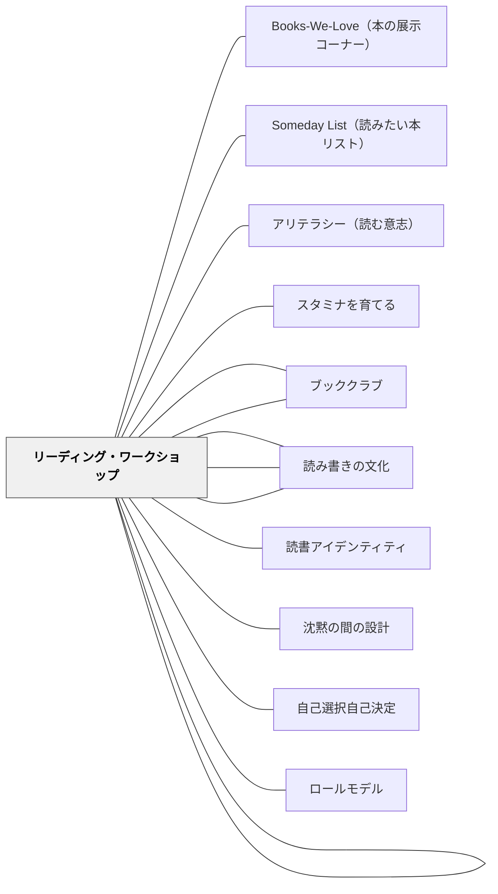

# リーディング・ゾーン

> 本の世界に完全に入り込み、時間の感覚を忘れる没入状態——この「ゾーン」体験を繰り返すことで、子どもは読書を義務ではなく喜びとして内面化する。

---

## Pattern Connection

**出典**: Atwell, N.（2007）*The Reading Zone*. Scholastic. / Willingham, D. T.（2015）*Raising Kids Who Read*. Jossey-Bass.（追記：2026-05-15）

- **既存パタンとの関連**：[[パタン/リーディング・ワークショップ]] の核に「なぜ没入読書の時間が必要なのか」という心理的根拠を与える。[[パタン/沈黙の間の設計]] の「連続した静かな時間」が何を育てるかの説明になる
- **補強された点**：読書家が育つ理由を「練習量」ではなく「ゾーン体験の累積」として説明できるようになった。「30分確保せよ」という実践指針の背後にある原理が明確になった
- **Willingham との接続**（2026-05-15追記）：Willingham（2015）の認知科学的分析が Atwell の直観を理論で支える。「自分が選んだ本でなければゾーンに入りにくい」は Willingham の「動機づけが最重要」と直結する。「ゾーン体験の累積」は Willingham の言う「読書アイデンティティ」の形成そのものであり、[[パタン/読書アイデンティティ]] に接続する。また Willingham が強調する「聴解力→読解力」の経路（[[パタン/読み聞かせ]]）は、ゾーンへの入口を下げる——知識と語彙があるほどゾーンに入りやすくなる
- **修正・拡張された点**：「読む時間の確保」を授業管理上の要請として捉える見方から、「ゾーンへの入口を守る」という学習心理上の必然として捉え直す
- **他のパタンへの波及**：[[パタン/ロールモデル]]（教師が読む）、[[パタン/読み書きの文化]]（共同体）、[[パタン/自己選択自己決定]]（選択）に直接波及する

**Atwell 2016 第2版の追記**（2026-05-17）：

- **語源と神経科学**：「ゾーン」という語は生徒 Jed が授業中に自分の体験を語る中で生まれた（Newkirk 2000 の "reading state" と接続）。Fair et al.（2009）の神経科学的研究が子どもの読書体験の固有性を示す——子どもはゾーンに入ると近接した脳領域が「浸透（soak）」し、大人は遠隔ネットワークで「潜る（dip）」。子ども期のゾーン体験が「読書家を育てる」一生に一度の窓である可能性が神経学的に支持された
- **紙 vs eBook の問題**：Mangan et al.（2013, 2014）が示す——紙の本はeBookより物語構造の読解成績が有意に高い。「めくる」「重さを感じる」という物理的体験が物語の構造を身体で記憶させる。タブレット・eBook 環境がゾーン体験に与える影響を問い直す必要がある
- **ゾーン条件の数値**：生徒調査でゾーンに入るための条件の第1位がブック・トーク（88%）——「次に何を読むか知っていること」がゾーン体験の前提になっており、[[パタン/ブック・トーク]] の重要性を定量的に裏付けた
- **実践の接続**：ゾーンを毎日確認する手段として [[パタン/チェックイン（Checking In）]] が整備された。ゾーン体験を言語化する手段として [[パタン/レターエッセイ（Letter-Essay）]] が機能する

---

## 背景（Context）

ナンシー・アトウェル（2007）は、「Reading Zone」（リーディング・ゾーン）という概念をリーディング・ワークショップの中心に置いた。ゾーンとは、本の世界に完全に引き込まれ、周囲の音が消え、時間を忘れる没入状態である。チクセントミハイのフロー（Flow）概念と構造的に重なる——課題と能力が適切にマッチした状態で生まれる深い没入体験である。

アトウェルは、すべての子どもがこのゾーンに入る可能性を持つと主張する。ゾーン体験は偶然に起きるものではなく、4つの条件——時間（Time）、選択（Choice）、反応（Response）、共同体（Community）——を整えることで保証できる。

「読書家になる」とは、知識・技能の習得ではなく、ゾーン体験を繰り返すことでできあがるアイデンティティである。

## 問題（Problem）

読む時間があっても、学習者がゾーンに入れないことがある。断片的な発問・短い時間・教師が指定した本・評価のための読書——これらはゾーン体験を妨げる。

ゾーン体験のない読書指導は「読む習慣」を育てにくい。読書が完了すべき課題になると、本の世界に入る前に本を閉じる学習者が現れ、読書嫌いが固定化する。

## 力のかたち（Forces）

- ゾーン体験は累積する——一度ゾーンに入れた読者は次のゾーンにも入りやすい
- しかしゾーンに入るには「入口の敷居」を越えるまとまった時間（最低15〜20分）が必要
- 自分が選んだ本でなければ、ゾーンに入りにくい
- 読書中の外部からの中断（発問、評価確認）はゾーンを壊す
- ゾーン体験は共同体の中で増幅する——周りに読書家がいると、読書への没入が文化になる
- 教師が読む姿は、最も強力なゾーン体験のモデルである

## 解決（Solution）

**ゾーン体験を保証するために、4条件（時間・選択・反応・共同体）を意図的に整える。**

---

### 条件①：時間（Time）

まとまった連続した読書時間を死守する。断片的な5分・10分ではゾーンに入れない。最初は20分から始め、慣れれば30〜40分を確保する。読む時間の間は、教師からの呼びかけ・確認・指示を最小化する。

読む時間は「活動」ではなく「文化」として定着させる——毎日同じ時間・同じリズムで行われることが、ゾーンへの入り方を体で覚えさせる。

---

### 条件②：選択（Choice）

学習者が自分で本を選ぶことがゾーン体験の前提になる。自分が選んだ本への愛着は、没入の動力である。

選書を支援するための環境：
- カゴを使った学級文庫（シリーズ別・ジャンル別・おすすめ別）
- ブック・トーク（教師・クラスメイトによる1〜2分の熱烈な本の紹介）
- 「下読み」（最初の数ページを読んで、自分に合うか確かめる）
- 読書記録（過去に読んで良かった本のリスト）

> 「本を選ぶ自由こそが、読書ゾーンへの扉を開く」——Atwell

---

### 条件③：反応（Response）

読んだことを誰かに伝える行為が、ゾーン体験を言語化し定着させる。

**読書ノート（レターエッセイ）**：
- 「○○先生へ」という書き出しで始まる手紙形式の読書記録
- 内容：考えたこと、気になる点、疑問、キャラクターへの思い、テーマへの反応
- 評価シートではなく対話の記録——教師が手紙を返すことで往復する
- ゾーン体験を言葉にする習慣が、読書をメタ認知の対象にする

**ブック・トーク**：
- 1〜2分で「この本のここが好き」を伝える口頭推薦
- 全員が定期的に行い、教室の読書文化を可視化する

---

### 条件④：共同体（Community）

読書は孤独な行為であると同時に、共同体の中で深まる行為でもある。

**教師が読む**：
- ワークショップ中に教師が自分の本を読む場面を意図的につくる
- 「先生は今何を読んでいますか？なぜその本を選びましたか？」という会話が文化をつくる
- 教師の読書が最も強力なモデルになる

**読書共同体の形成**：
- ブッククラブ（同じ本を読む仲間との対話）
- ブック・バズ（本の魅力を短時間で伝え合う）
- 読書記録の交換・掲示

---

### ゾーンへの入り方を教える

ゾーンの存在を学習者に言語化して伝えることも重要である：

1. 「本の世界に引き込まれて、時間を忘れたことはありますか？」と問う
2. 「それがゾーンです。今日は全員がゾーンに入ることを目指します」と宣言する
3. 読んだ後「ゾーンに入れましたか？それはどんな感じでしたか？」を聞く
4. ゾーンに入れなかったときは「何が邪魔しましたか？」と一緒に考える

---

### 最初のゾーン体験を作る

ゾーン体験がない学習者には、最初の体験を意図的に設計する：
- 読み聞かせ中に「今ゾーンに入っていますか？」と静かに確認する
- 既読の本を再読させる（知っているストーリーはゾーンに入りやすい）
- 連続した読む時間の最初の3〜5日は、教師が毎回「ゾーンに入れましたか」と一人ひとりに確認する

## 結果（Consequences）

- ゾーン体験を繰り返した学習者は、読書を「課題」ではなく「喜び」として内面化していく
- 「自分は読書が好きだ」というアイデンティティが育ちやすくなる
- 読書量・語彙・テキスト理解力が向上するが、それは目標ではなくゾーン体験の副産物である
- 教師が読む文化は教室全体の読書へのモチベーションを高める
- ただし、条件が整わない環境——断片的な時間、指定読書、評価優先——では、ゾーン体験は生まれにくい

## 関連パタン
- [[パタン/Books-We-Love（本の展示コーナー）]]
- [[パタン/Someday List（読みたい本リスト）]]
- [[パタン/アリテラシー（読む意志）]]
- [[パタン/スタミナを育てる]]
- [[パタン/ブック・トーク]]
- [[パタン/読みとつながる]]
- [[パタン/読み聞かせ]]
- [[パタン/読書アイデンティティ]]

- [[パタン/リーディング・ワークショップ]] — ゾーン体験を保証する実践システム全体
- [[パタン/沈黙の間の設計]] — まとまった静かな読書時間を守る
- [[パタン/自己選択自己決定]] — 選択のオーナーシップがゾーンの前提
- [[パタン/読み書きの文化]] — 共同体条件：読書が教室の文化になる
- [[パタン/ロールモデル]] — 教師が読む姿のモデリング効果
- [[パタン/ブッククラブ]] — 共同体の中でゾーン体験を言語化する
- [[パタン/オンボーディング]] — 最初のゾーン体験を設計する
- [[パタン/アイデンティティの複数性]] — 「読書家としての自分」というアイデンティティの形成
- [[パタン/チェックイン（Checking In）]] — 毎日の独立読書中に全員のゾーン状態を確認する実践
- [[パタン/レターエッセイ（Letter-Essay）]] — ゾーン体験を言語化・定着させる手紙形式の読書記録
- [[パタン/教室図書館]] — ゾーン体験の前提：すぐ手が届くところに自分の本がある環境

---

## クラスター図

## Actionable Insight

- 今週の読む時間に「今日はゾーンに入れましたか？」と最後に一言だけ聞いてみる——「ゾーン」という言葉を子どもたちと共有することが、読書体験のメタ認知の入口になる
- 教師自身が読む時間に一冊の本を持ち込み、子どもと同じ部屋で5〜10分読んでみる——読書共同体の一員としての教師の姿が、読書への最も強力なモデルになる
- 読書ノートの書き出しを「○○先生へ」に変えてみる——評価用の記録から対話への変換だけで、学習者の書き方の質が変わることがある

---

## 出典

Atwell, N.（2007）*The Reading Zone: How to Help Kids Become Skilled, Passionate, Habitual, Critical Readers*. Scholastic.  
Atwell, N., & Atwell Merkel, A.（2016）*The Reading Zone*（2nd ed.）. Scholastic.

Fair, D. A., Cohen, A. L., Power, J. D., et al. (2009). Functional brain networks develop from a "local to distributed" organization. *PLOS Computational Biology, 5*(5), e1000381.

Mangan, A., Walgermo, B. R., & Brønnick, K. (2013). Reading linear texts on paper versus computer screen: Effects on reading comprehension. *International Journal of Educational Research, 58*, 61–68.

Newkirk, T. (2000). *Misreading Masculinity: Boys, Literacy, and Popular Culture.* Heinemann.

[[文献/The Reading Zone（Atwell）]]

> 「読書ゾーンにいる子どもたちは、本の外の世界が存在しないかのように読む。時間の経過に気づかない。」——Nancie Atwell
