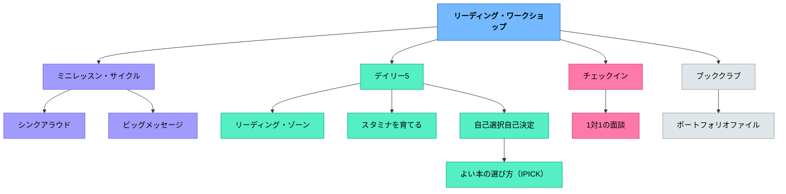

# リーディング・ワークショップ

> 読む時間、選書、カンファランス、共有を一つの授業構造にまとめ、学習者が「熟練した・情熱的・習慣的・批評的な読書家」へ育つ場をつくる。

---

## Pattern Connection

**出典**: Atwell, N.（2007）*The Reading Zone*. Scholastic.（原典統合：2026-05-13）

- **既存パタンとの関連**：アトウェルの原典（2007）を岩井（2014）が日本文脈に翻案したものが本パタンの基盤。今回の統合で、実践システム（RW）の背後にある心理的概念——「リーディング・ゾーン」——を明示的に位置づけた
- **補強された点**：「30分の読む時間を死守する」「自分で本を選ばせる」という実践指針に、**ゾーン体験（没入読書）の保証**という心理学的根拠が加わった。「なぜ短時間ではだめか」の説明が「ゾーンに入るまでの時間が必要だから」として明確になる
- **修正・拡張された点**：①**教師が読む（Teacher as Reader）**という条件を新たに追記。②**読書ノートをレターエッセイ形式**（教師への手紙）として位置づけることで、評価ツールから対話のツールへ転換する視点を追加。③4条件に**共同体（Community）**を独立項目として加えた
- **他のパタンへの波及**：[[パタン/リーディング・ゾーン]]（新規作成）に没入読書の条件論を分節化。[[パタン/ロールモデル]] に「教師が読む」という具体例が加わる

**Buckner（2009）統合（2026-05-15）：**

*Notebook Connections* は、リーディング・ワークショップの「読書ノート」を、量の管理ツールから**読者の思考を可視化する道具**へと再定義する。

- **補強された点**：本パタンの評価ツール一覧に「読書ノート」が挙がっていたが、その中身が「読者の自分史・TS/TT/TW記録・作家のように読む・物語の深層」という具体的なエントリータイプとして整備された。「読書ノート = 感想文の代替」という理解から「読書ノート = カンファリングの最重要資料」への転換。
- **拡張された点**：**読者の自分史（History of a Reader）**が年度初めの最重要エントリーとして位置づけられ、年度末に読み直すことで読書アイデンティティの成長を可視化する手法が加わった。
- **他のパタンへの波及**：[[パタン/リーダーズ・ノート]] として独立したパタンに。[[パタン/作家のように読む]] として、読書と作文指導をつなぐ新規パタンを生成。[[実践/リーダーズ・ノートの起動]] として年度初めの実践を整備。

**Miller（2002）統合（2026-05-18）：**

*Reading with Meaning* はリーディング・ワークショップの具体的な時間配分と9月の文化づくりを詳細に示す。

- **ワークショップの時間配分**：ミニレッスン（15〜20分）＋ 読書・カンファリング・反応（45〜50分）＋ 共有（15〜20分）≈ 90分。この構造が「予測できる枠組み」として子どもの安心感を支える
- **9月の優先事項**：最初の2週間はストラテジー指導より「思考の文化（culture for thinking）」（Perkins, 1993）と信頼関係を育てることを優先。「読者のふるまい」（どこに座って読むか・どう本を選ぶか等）をミニレッスンで教え、観察結果をドアに貼る
- **作業活動の時間（Work Activity Time）**：一日の最後の40分。子どもたちが自分でテーマを決めて研究・作成・演じる自由時間——オリビアが Oliver Button のブック・クラブをリード、クリスがポンペイ火山を製作、犬研究グループが毛のサンプルを比較、セイドが JFK の授業を行う。「時間・選択・多様な素材・予測できる構造を与えると、予測できないことが起きる」
- **補強された点**：本パタンの「独立読書・独立練習の時間」に「子ども主体の学びが生まれる作業時間」という概念が加わった。ワークショップは授業時間だけでなく、一日の最後の時間にも延伸できる
- **他のパタンへの波及**：[[パタン/思考の可視化]] に読書ノート・付箋・ベン図等の具体的ツールリストが加わる

**Dorn & Soffos（2005）統合（2026-05-19 全文照合）：**

*Teaching for Deep Comprehension* はリーディング・ワークショップを**5コンポーネント構造**として設計し、スケール・オブ・ヘルプ（高・中・低支援）による動的な足場調整を導入する。

- **補強された点（5コンポーネント）**：本パタンの「ミニ・レッスン→読む時間→カンファランス→共有」という4部構造に対して、Dorn & Soffosは「小グループ指導（ガイデッド・リーディング＋文学討論グループ）」を独立コンポーネントとして明示する。「独立練習・ペア活動」も「1対1・小グループ・カンファリング」も独立している
- **拡張された点（2フェーズ運営）**：ワークショップを**フェーズ1（90〜95分：ガイデッド・リーディング・文学討論グループ中心）**と**フェーズ2（40〜45分：言語研究・著者研究・ジャンル研究中心）**に分けることで、読むことと言語を学ぶことが有機的に連動する
- **拡張された点（スケール・オブ・ヘルプ）**：教師の支援は「常に同じレベル」ではなく、子どもの処理の状態に合わせて高支援→中支援→低支援と動的に調整する。ガイデッド・リーディング・共有読書・カンファリング全てに適用
- **拡張された点（読書の4形態）**：独立読書（Independent）・ペア読書（Paired）・バディ読書（Buddy）・録音読書（Recorded）の4形態が読書ワークショップの独立練習の選択肢として体系化される。Option Board（選択ボード）で子どもが選ぶ
- **他のパタンへの波及**：[[パタン/共有読書（Shared Reading）]]（新規）——ワークショップのミニレッスン形態として機能。[[パタン/文学討論グループ]]（新規）——小グループ指導の中心的活動

**Harvey & Goudvis（2007）統合（2026-05-09）：**
*Strategies That Work* は「ミニ・レッスンで教える内容」の具体的な枠組みを提供する。6つの読解ストラテジー（つながりをつくる・問いをもつ・視覚化・推論・重要性判断・統合）はリーディング・ワークショップのミニ・レッスンの柱になる。段階的手放しモデル（Gradual Release）はリーディング・ワークショップの授業サイクルと完全に対応する。

- [[パタン/シンクアラウド]] — ミニ・レッスンの指導形態
- [[パタン/読みとつながる]] — ミニ・レッスンの最初に教えるストラテジー
- [[パタン/推論する（インファリング）]] — ミニ・レッスンの中盤で扱うストラテジー
- [[実践/テキストコーディング]] — 独立読書中の思考記録ツール

**Diller（2005）統合（2026-05-15）：**

*Practice with Purpose* は「小グループ指導中に残りの子どもたちがどう過ごすか」という問いに、**リテラシー・ワークステーション**という体系的な答えを提供する。

- **補強された点**：本パタンの「独立読書・独立練習の時間」に「目的のある複数のリテラシー活動が同時並行で起きる管理システム」が加わった。読書ステーションだけでなく、ライティング・ワードスタディ・詩・ドラマ等のステーションが小グループ指導と並行稼働できる
- **重要な知見**：「教えていないことはステーションに入れない」——ミニレッスンで先に指導した活動だけをステーションに組み込む。この順序が独立した練習の質を保証する
- **拡張された点**：I Can リスト（子どもと一緒に作る3〜4択の選択メニュー）がワークショップ中の子どもの自律性を構造化する。2人組（パートナー）がアカウンタビリティの単位となり、教師不在でも機能する
- [[パタン/リテラシー・ワークステーション]] — ワークステーションをパタンとして独立整備
- [[実践/リテラシー・ワークステーションの起動]] — 3〜4週間の段階的起動ガイド

**Sibberson（2012）統合（2026-05-13）：**
*The Joy of Planning* はリーディング・ワークショップのミニレッスンを**サイクルとして計画する**方法を提供する。個々の授業ではなく3〜6時間を「傘テーマ」で束ねることで、「本を教える」から「読者を育てる」への転換が計画の段階から実現する。Sibberson の10の信念（teach the reader, not the book / interactive / teacher-designed など）は、本パタンの解決（Solution）に記述している方針を深化・体系化する。

- [[パタン/ミニレッスン・サイクル]] — ミニレッスンをサイクルとして計画するパタン（Sibberson, 2012より）
- [[実践/思考の記録サイクル]] — 年度初めの4時間サイクルの具体的実践

**Boushey & Moser（2014）統合（2026-05-15）：**

*The Daily 5* はリーディング・ワークショップの「独立読書・独立練習の時間」を「5つの選択肢・ラウンド制・スタミナ構築」という具体的な管理構造へと拡張する。

- **補強された点**：本パタンの独立読書時間に「スタミナを体系的に育てる」という視点が加わった——**「30分の独立読書を確保する」という目標は正しいが、最初から30分を要求すると崩壊する**。Daily 5 の「短く・成功させる」原則（1〜3分から始め、毎日スタミナチャートに記録して延ばす）が、独立読書時間の起動に直接使える
- **修正された点**：「独立性は指示すればできる」という前提から「**独立性は教えるもの**」という前提への転換——I-チャート・10ステップ・スタミナ構築がその方法論を提供する
- **拡張された点**：Read to Self（自分で読む）以外に「誰かに読む・聴いて読む・書く・言葉の仕事」という4択が加わることで、独立読書だけでなく読み書きの多様な実践が同時に起きる教室が実現する。IPICK（よい本の選び方）がミニレッスンのコンテンツとして選書指導を具体化する
- [[パタン/デイリー5]] — RWの独立実践時間を管理するサブシステム
- [[パタン/スタミナを育てる]] — 独立読書時間を起動するための「短く・成功」原則
- [[パタン/よい本の選び方（IPICK）]] — 選書ミニレッスンの具体的コンテンツ
- [[実践/デイリー5の起動]] — 4週間でスタミナを育てる起動実践ガイド

**Collins（2004）統合（2026-05-24）：**

*Growing Readers* はリーディング・ワークショップの**年間カリキュラム設計**と**二重の使命**という哲学的根拠を提供する。本書はMillerやAtwell以前のCollinsの実践であり、1年生担任として「ワークショップを最初から育てる」視点で書かれている。

- **補強された点（二重の使命）**：本パタンの目的を「熟練した読者を育てる」から「読み方を教えながら読書を愛することを教える」という**双方向の目標**へと精緻化した。技術的目標と情意的目標を分離せず、同時に追う構造
- **補強された点（年間単元設計）**：Units of Study（単元学習）の概念——読書指導の1年を「9月：習慣づくり → 10月：語彙戦略 → 11〜12月：思考と対話 → 1〜5月：興味追求 → 6月：読書生活の計画」という章立てで設計する視点を追加した。ポップコーン型（場当たり的）指導との対比として機能する
- **新規追加（4部構造）**：ミニレッスン→私読み（Private Reading Time）→パートナー読み（Partner Reading Time）→ティーチングシェア（Teaching Share Time）という毎日の構造。MillerとSibbersonの構造と対応する
- **新規追加（Bottom-Line Habits）**：9月に確立する4つの底線習慣が、その後の全ての指導の土台になる
- **他のパタンへの波及**：[[パタン/読書パートナーシップ]]（新規）——能力別・長期パートナーシップの設計理論。[[パタン/読書の底線習慣]]（新規）——9月に確立する4つの読み手としての必須習慣。[[パタン/著者研究]]（新規）——Chapter 7のReading Centers実践

---

## 背景（Context）

リーディング・ワークショップ（Reading Workshop）は、読むことをワークショップ形式で学ぶ実践である。ナンシー・アトウェル、ルーシー・カルキンズ、フランキー・スィベーソンらの実践に学びながら、日本の学校文脈に合わせて翻案されてきた。

岩井輝久（2014）の研究・実践では、リーディング・ワークショップの目的は、単に読書量を増やすことではなく、学習者が「熟練した・情熱的・習慣的・批評的な読書家」になることとして整理されている。

そのために、授業は **ミニ・レッスン → 読む時間 → 共有の時間** という予測できる枠組みで進む。学習者は自分で本を選び、読み、教師とのカンファランスや仲間との共有を通して、自分の読書を見つめ直していく。

岩井（2014）の第5版では、リーディング・ワークショップを授業方法だけでなく、学習環境、ミニ・レッスン、独立読書、カンファランス、共有、評価を含む実践システムとして扱っている。特に評価の章が追加され、読書記録やブックレビューなどを通して、読書の質と成長をどう見取るかが重要な論点になっている。

## 問題（Problem）

国語の読書指導は、教師が選んだ教材を全員で読み、発問に答え、内容理解を確認する形になりやすい。その形だけでは、学習者が「自分で本を選び、読み続け、読書について考える人」になる経験が不足する。

また、読書が苦手な子ほど、短い読書時間では本の世界に入りにくい。選書の仕方、読み続ける環境、読書について語る相手がなければ、読書は「やらされる課題」になってしまう。

## 力のかたち（Forces）

- 読書家は、読む時間の積み重ねによって育つ
- 学習者が自分で本を選ぶことは、読書へのオーナーシップを生む
- しかし、自由に選ばせるだけでは、自分に合う本を選べないこともある
- 読書には一人で深く読む時間と、他者と共有する時間の両方が必要である
- 全体指導だけでは、一人ひとりの読書状態を見取りにくい
- 日本の学校では、教科書・学習指導要領・授業時数との調整が必要になる

## 解決（Solution）

**ミニ・レッスン、独立読書、カンファランス、共有の時間を組み合わせ、学習者が自分の読書を選び、続け、振り返るワークショップを設計する。**

リーディング・ワークショップをそのまま移植するのではなく、教科書や学習指導要領の目標を押さえながら、発展・応用・活用の場として位置づける。

---

### 基本的な授業サイクル

| 時間 | 内容 | 役割 |
|------|------|------|
| ミニ・レッスン | 5〜15分の短い全体指導 | 読み方、選書、読書ノート、価値観を共有する |
| 読む時間 | まとまった独立読書 | 自分で選んだ本を読み、読書家としての経験を積む |
| カンファランス | 教師と学習者の1対1の対話 | 読書状態を見取り、次の一歩を支援する |
| 共有の時間 | ペア・小グループ・全体で共有 | 読みを言葉にし、仲間の読書から学ぶ |

読む時間は、可能であれば30分前後を確保する。短すぎると、選書や読み始めで時間が終わり、本の世界に入るところまで届きにくい。特に読むことが苦手な学習者ほど、まとまった時間が必要になる。

---

### 4つの必須要素

| 要素 | 核心 |
|------|------|
| 読む時間の確保 | 読書に没入できるまとまった時間を守る |
| 予測できる枠組み | ミニ・レッスン、読む時間、共有の時間という安定したリズムをつくる |
| 学習のオーナーシップ | 選書、計画、読書目標を学習者自身が持つ |
| 本への反応 | 読んだことを話す・書く・記録することで読みを深める |

### 読書サイクル

リーディング・ワークショップでは、読書を一回限りの活動ではなく、次のサイクルとして回す。

1. **選書・計画**——自分に合う本を選び、読む見通しを持つ
2. **読書**——まとまった時間で読み進める
3. **反応**——心のつぶやき、付箋、読書ノートなどで考えを残す
4. **共有**——ペア、全体、ブッククラブ、ブック・バズなどで読書を開く
5. **次の選書へ**——読書記録や仲間の紹介を、次の本選びに生かす

### 学習環境のデザイン

リーディング・ワークショップでは、図書コーナーが学習環境の中核になる。シリーズ別、著者別、ジャンル別、新着本、クラスメイトのおすすめなど、カゴを使って本を見つけやすくする。

本棚は単なる保管場所ではなく、選書を助けるインターフェースである。表紙が見えること、動かしやすいこと、分類の意図が分かることが、学習者の「自分に合う本を選ぶ」行為を支える。

学習環境には、図書コーナーだけでなく、詩のカード、読書箱、優れた読み手が使っている読み方の掲示、シリーズのキャラクター紹介、学習者像、ウォールポケットなども含まれる。これらは装飾ではなく、学習者が「次に何を読めばよいか」「どう読めばよいか」「自分はどんな読み手になりたいか」を判断するための手がかりになる。

### ミニ・レッスンで扱うこと

ミニ・レッスンでは、読む前・読んでいる途中・読んだ後に使える短い方略や、読書家としての価値観を扱う。

| 領域 | 例 |
|------|----|
| 選書 | 自分にぴったりの本の選び方、下読み、試し読み、プレビューイング |
| 理解方略 | 関連付ける、順番を推測する、分からない言葉の意味を推測する |
| 読書の道具 | [[教材/読書の道具棚]]、[[教材/リーディング・ワークショップの小さい付箋]]、[[教材/読書反応の書き出しの手引き]]、[[教材/読書会の質問（テーマ）集]]、[[教材/ブック・バズ・ノート]]、読書ノートのリード文、読み書きハンドブック |
| 文学の見方 | キャラクターについて知っていることを使う、主題を考える |
| 読書観 | 読書のサラダ、スキーマ・ローラーなど、読書中に何が起きているかを見える形にする |

ミニ・レッスンは長い説明ではなく、その日の読む時間に試せる「小さな道具」を渡す時間である。

### 最初の1回の台本

初回は、リーディング・ワークショップが「読書の時間」ではなく「読書家になる時間」であることを伝える。

1. 「この時間は、みんなが読書家として育つための時間です」
2. 「先生が全部の本を決めるのではなく、自分に合う本を探します」
3. 「読んでいる間に考えたこと、迷ったこと、面白かったことも大切にします」
4. 「先生は一人ずつ、今読んでいる本や困っていることを聞きに行きます」
5. 「最後に、読んだことや気づいたことを少しだけ共有します」

### よくある失敗と対処

| 起きやすいこと | 対処 |
|----------------|------|
| 自由読書だけになり、指導が消える | 短いミニ・レッスンで読み方や価値観を明確にする |
| 本を選べず時間が過ぎる | カゴ分類、おすすめカード、下読みで選書を支援する |
| 読む時間が短く没入できない | 可能な範囲でまとまった読む時間を確保する |
| 読書記録が作業化する | 記録を評価のためだけでなく、次の選書や共有に使う |
| 教師が全員を見取れない | カンファランス記録を簡単に残し、継続的に見る |
| 共有が感想発表だけになる | 「読んで考えが変わったこと」「次に読みたい本」など焦点を絞る |

### カンファランスと共有で見取ること

読む時間の中で教師は、読んでいる本の内容だけでなく、学習者が読み手として何をしているかを見る。どのように本を選んだか、途中で読むのをやめた理由は何か、分からないところをどう扱ったか、次に何を読みたいかを聞くことで、読み手としての状態が見えてくる。

共有の時間では、本の内容を発表するだけでなく、読み方、気づき、付箋を貼った箇所、読書ノート、読みたい本リストなどを共有する。共有は、読書を個人の活動で終わらせず、教室の読みの文化へ開いていく時間である。

### 発展パターン

| 発展 | 進め方 | つながるパタン |
|------|--------|----------------|
| ブッククラブ | 同じ本を読む仲間で語り合う | [[パタン/ブッククラブ]] |
| ブック・バズ | 短時間で本の魅力を紹介し合う | [[パタン/ビッグメッセージ]]、[[パタン/読み書きの文化]] |
| 読書カンファランス | 教師が一人ひとりの読書状態を聞く | [[パタン/1対1の面談]] |
| 読書ポートフォリオ | 読書記録、レビュー、目標を蓄積する | [[パタン/ポートフォリオファイル]] |
| ジャンル学習 | 複数の作品を読み比べ、ジャンルの特徴を見出す | [[パタン/類推的学習①]] |

### 評価と記録

リーディング・ワークショップの評価は、読書量だけを見るのではなく、読書の質、選書の変化、読書家としての成長を見取る。

| ツール | 見取れること |
|--------|--------------|
| 心のつぶやきシート | 読んでいる途中の思考・反応 |
| [[教材/読書の道具棚]] | 読む前・途中・友だちと読む・読んだ後の教材の配置 |
| [[教材/20冊チャレンジ]] | 長期的な読書量とジャンルの広がり |
| [[教材/1週間の読書目標]] | 短期の計画と自己調整 |
| ブックレビュー | 本を評価し、次の読者に紹介する力 |
| レターエッセイ | 読書について相手に向けて書く力 |
| 読書ノート | 気づき、疑問、読みの変化の蓄積 |
| [[教材/読むことの振り返り]] | 読書への好意、得意感、成長、有効だった支援 |

## 結果（Consequences）

- 学習者が「自分は読む人だ」というアイデンティティを持ちやすくなる
- 選書、計画、読書目標を自分で持つことで、読書が自分のものになる
- 教師はカンファランスを通して、一人ひとりの読書状態を見取りやすくなる
- 本への反応を話す・書くことで、読みが深まり、読書が共同体の文化になる
- 図書コーナーや読書記録が、次の読書を支える環境になる
- ただし、時間・環境・本の量・教師の見取りの設計が弱いと、単なる自由読書に近づく

## パタンのつながり
- [[パタン/Someday List（読みたい本リスト）]]
- [[パタン/チェックイン（Checking In）]]
- [[パタン/リーディング・ゾーン]]
- [[パタン/自己選択自己決定]]
- [[パタン/RIPモデル]]
- [[パタン/アンカーチャート]]
- [[パタン/シグニファイア]]
- [[パタン/シンクアラウド]]
- [[パタン/スタミナを育てる]]
- [[パタン/ティーチングシェア]]
- [[パタン/デイリー5]]
- [[パタン/ドキュメンテーション]]
- [[パタン/フィードバック]]
- [[パタン/ミニレッスン・サイクル]]
- [[パタン/よい本の選び方（IPICK）]]
- [[パタン/ライティング・ワークショップ]]
- [[パタン/リーダーズ・ノート]]
- [[パタン/リテラシー・ワークステーション]]
- [[パタン/リテラチャー・サークル]]
- [[パタン/共有読書（Shared Reading）]]
- [[パタン/教室図書館]]
- [[パタン/語彙指導]]
- [[パタン/作家のように読む]]
- [[パタン/作業活動の時間]]
- [[パタン/段階的手放し]]
- [[パタン/著者研究]]
- [[パタン/読み聞かせ]]
- [[パタン/読者のツールボックス]]
- [[パタン/読書センター]]
- [[パタン/読書の底線習慣]]
- [[パタン/読書パートナーシップ]]
- [[パタン/不思議を育てる]]
- [[パタン/文学討論グループ]]

### 圧縮されているパタン

リーディング・ワークショップは、読書指導の一技法というより、複数のパタンが組み合わさった実践システムである。読む時間、選書、カンファランス、共有、評価、環境デザインが重なって、読書家を育てる場になる。

| リーディング・ワークショップの場面 | 圧縮されているパタン | 何が起きているか |
|----------------------------------|----------------------|------------------|
| 自分で本を選ぶ | [[パタン/自己選択自己決定]] | 読書が「やらされるもの」ではなく、自分の選択になる |
| ミニ・レッスンで価値観を伝える | [[パタン/ビッグメッセージ]] | 読むことの意味や読み手としての構えが共有される |
| まとまった読む時間を守る | [[パタン/沈黙の間の設計]]、[[パタン/読み書きの文化]] | 読書に沈潜する時間が、教室の文化として保障される |
| 図書コーナーを整える | [[パタン/オンボーディング]]、[[パタン/シグニファイア]] | 学習者が自分に合う本を見つけやすくなる |
| 教師がチェックインする | [[パタン/チェックイン（Checking In）]]、[[パタン/1対1の面談]]、[[パタン/フィードバック]] | 毎日2〜3分・全員にゾーン確認を行い取り残しを防ぐ（「カンファランス」から「チェックイン」への第2版での用語変更：正式面談感をなくし日常化を促す） |
| 読書記録を蓄積する | [[パタン/ポートフォリオファイル]]、[[パタン/可視化]] | 読書の軌跡と成長が見えるようになる |
| 共有の時間を持つ | [[パタン/ブッククラブ]]、[[パタン/聴き合う文化]] | 本への反応が他者との対話で深まる |
| 目標と振り返りを持つ | [[パタン/自己調整]] | 読書を計画し、続け、振り返る力が育つ |
| 評価ツールを使う | [[パタン/ドキュメンテーション]]、[[パタン/到達レベルの自己評価]] | 読書の質と成長を、教師と学習者が共に見取れる |

この意味で、リーディング・ワークショップは「読書の授業方法」であると同時に、読書家としてのアイデンティティ、自己選択、個別支援、読書共同体を圧縮した実践パタンである。

### このパタンが働く実践

| 実践 | どのように働くか |
|------|------------------|
| [[実践/デイリー5の起動]] | 独立読書・ペア読書・書く活動を起動し、ワークショップの自立時間を成立させる |
| [[実践/カンファリング（読書会議）]] | 独立読書中に一人ひとりの読みを見取り、次の一手を返す |
| [[実践/リーダーズ・ノートの起動]] | 読書中の思考を記録し、カンファリングや共有の材料にする |
| [[実践/テキストコーディング]] | 独立読書中の気づき・問い・つながりを付箋で見えるようにする |
| [[実践/リテラチャー・サークルの起動]] | 共有の時間を小集団の読書対話へ発展させる |
| [[実践/文学討論グループの設計]] | 深い理解を狙う小グループ討論として、ワークショップの読後活動を厚くする |

### 関連パタン

- [[パタン/リーディング・ゾーン]] — ゾーン体験（没入読書）の条件論：なぜ30分が必要かの心理学的根拠
- [[パタン/チェックイン（Checking In）]] — 毎日全員に行うゾーン確認（Atwell 2016: 「カンファランス」から「チェックイン」への改称）
- [[パタン/レターエッセイ（Letter-Essay）]] — 3週ごとの手紙形式の読書記録：読書と書くことをつなぐ
- [[パタン/Books-We-Love（本の展示コーナー）]] — クラスで愛された本の表紙展示：選書文化を空間に可視化する
- [[パタン/Someday List（読みたい本リスト）]] — 読みたい本リストを常に育てる：次が決まっている読者を作る
- [[パタン/ブッククラブ]] — 共有の時間を深める読書会
- [[パタン/1対1の面談]] — カンファランスの基本構造
- [[パタン/自己選択自己決定]] — 選書と読書目標のオーナーシップ
- [[パタン/読み書きの文化]] — 読む人・書く人としてのアイデンティティ
- [[パタン/ビッグメッセージ]] — ミニ・レッスンで届ける価値観
- [[パタン/ポートフォリオファイル]] — 読書記録と成長の蓄積
- [[パタン/オンボーディング]] — 本を選び、読み始めるための支援
- [[パタン/ロールモデル]] — 教師が読む姿：読書共同体のモデリング
- [[教材/読書の道具棚]] — リーディング・ワークショップで使う教材の入口
- [[教材/実践で使う教材]] — 実践と教材の対応表
- [[文献/リーディング・ワークショップの研究と実践（第５版）]] — 一次資料（日本語実践）
- [[文献/The Reading Zone（Atwell）]] — 原典（アトウェル2007）
- [[パタン/作業活動の時間]] — ワークショップで学んだことを子どもが自律的に使う拡張時間
- [[パタン/読書センター]] — ワークショップに組み込む探究型読書グループ（週数回）
- [[パタン/ティーチングシェア]] — ワークショップの最終パート（5〜10分）：実践を全体に広げる
- [[パタン/教室図書館]] — 独立読書を支える物的基盤：書店式の陳列と Book Baggie システム
- [[パタン/ライティング・ワークショップ]] — 読むことと書くことをつなぐ相補的なシステム
- [[パタン/段階的手放し]] — 独立読書へと徐々に手放す Gradual Release の全体設計
- [[パタン/読み聞かせ]] — 読書コミュニティの入口、教師のモデリング
- [[パタン/語彙指導]] — 独立読書中に出会う未知語の指導と支援
- [[パタン/リテラチャー・サークル]] — 共有読書を小グループ対話に発展させる構造
- [[パタン/不思議を育てる]] — 読書への好奇心を育てる問いの文化
- [[パタン/読者のツールボックス]] — 独立読書中に学習者が使える読解ストラテジーの総称

## クラスター図
<!-- cluster: manual -->

## Actionable Insight

- まず1回、ミニ・レッスン5分、読む時間20〜30分、共有5分の形で試してみる——授業サイクルを固定すると、読書が活動ではなく文化になり始める
- 図書コーナーをカゴで3分類だけ作る——シリーズ別・おすすめ・読み聞かせ関連など、選びやすさを先に整える
- カンファランスでは「今何を読んでいますか」「今難しいことはありますか」を聞き、一つだけ次の助言をする——短くても個別支援の質が上がる

## 出典
- [[文献/Teaching for Deep Comprehension（Dorn & Soffos）]]

岩井輝久（2014）『リーディング・ワークショップの研究と実践（第５版）』  
[[文献/リーディング・ワークショップの研究と実践（第５版）]]

Atwell, N.（2007）*The Reading Zone: How to Help Kids Become Skilled, Passionate, Habitual, Critical Readers*. Scholastic.  
[[文献/The Reading Zone（Atwell）]]
