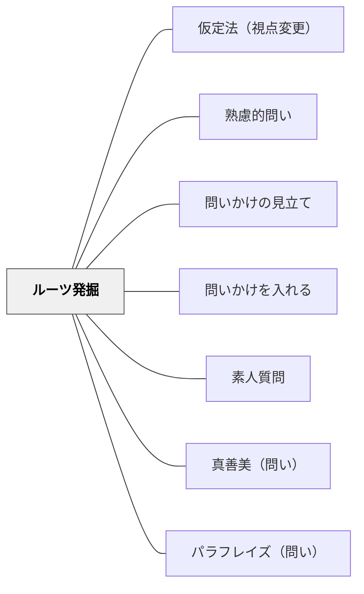

# ルーツ発掘

> 相手のこだわりや価値観の源泉・背景を聞き込む深掘り質問。

## Pattern Connection（安斎勇樹, 2021）

**位置づけの補強**：安斎（2021）は本パタンを「フカボリモード」（こだわりを深掘りする問い）の中核技法として位置づけ、「こだわりの発現しやすい6ポイント」を体系化している。「いつから？」「どんなきっかけで？」という時間軸の問いに加え、人のこだわりが表に出やすい6つの文脈が分類されている。

**こだわりの発現しやすい6ポイント**

| ポイント | 観察のしどころ |
|---|---|
| ①基準の高さ | 他の人が気にしないところにこだわる場面 |
| ②過剰な投資 | 時間・エネルギー・お金を異常にかけている場面 |
| ③違いの識別 | 微細な差異を敏感に見分ける場面 |
| ④怒りのツボ | 特定のことに対して強く反応する場面 |
| ⑤偏愛対象 | 特定のものへの強い愛着を示す場面 |
| ⑥違和感 | 「なんかおかしい」「これじゃない」と感じている場面 |

これらはいずれも「その人のこだわりが表に出た瞬間」である。教師としては、子どもの授業中の反応・つぶやき・日記の記述などにこの6ポイントが現れていないかを観察することで、ルーツ発掘の問いを立てるタイミングが分かる。

**他のパタンへの波及**：ルーツ発掘で引き出したこだわりを深めるには [[パタン/素人質問]] でさらに前提を問い直すか、[[パタン/真善美（問い）]] でこだわりの根底にある価値観（美しい・正しい・よい）を問う連続技が有効。

---

## 背景（Context）
人がある考えや行動に強くこだわるとき、そこには必ず固有の体験・歴史・人との出会いがある。
その背景を知らずに表面的な意見だけを扱うと、対話は深まらない。
「なぜあなたはそれを大切にするのか」という問いは、相手の価値観の地層を掘り起こす。
教育の場でも、学習者がなぜある問いや題材に惹かれるかを問うことで、学びの動機が可視化される。

## 問題（Problem）
対話や議論がアイデアの表面だけをなぞり、なぜその人がその立場をとるのかに踏み込めない。
価値観の違いが衝突として現れたとき、その違いの源泉を問わないままでは相互理解に限界がある。
学習者自身も、なぜ自分がある問いに関心をもつのか言語化できていないことが多い。

## 力のかたち（Forces）
- 価値観には必ず個人史的な文脈がある。
- 過去の経験を問われることで、相手は自己開示しやすくなる。
- 「いつから？」「どんなきっかけで？」という時間軸の問いは答えやすい。
- プライベートな領域に踏み込む可能性があるため、信頼関係の構築が前提となる。

## 解決（Solution）
「それっていつから大切にしているの？」「どんな経験がそう思わせてくれたの？」という問いを丁寧に投げかける。
相手の語りをさえぎらず、ルーツに関わる言葉が出たときに「もう少し聞かせて」と続ける。
対話の早い段階で信頼関係を築いてから、この問いを使うよう設計する。
学習者には「自分がこの問いに興味をもったきっかけは何か」を振り返るジャーナリングを組み込む。

## 結果（Consequences）
相手の価値観の根拠が明示され、対話が一段深いレベルに移行する。
異なる立場の間にある違いが「対立」ではなく「異なる歴史」として理解されやすくなる。
学習者が自分の関心の源泉を自覚し、学びへの内発的動機が高まる。
個人史に触れるため、場の安心感づくりが不十分だと対話が閉じる危険がある。

## 関連パタン
- [[パタン/仮定法（視点変更）]]
- [[パタン/熟慮的問い]] — 親パタン
- [[パタン/問いかけの見立て]] — フカボリ（こだわり）が必要かどうかを判断する前段
- [[パタン/問いかけを入れる]] — ルーツ発掘をフカボリモードとして体系的に位置づける
- [[パタン/素人質問]] — ルーツ発掘で引き出した後の前提の問い直し
- [[パタン/真善美（問い）]] — こだわりの根底にある価値観（美しい・正しい）を問う
- [[パタン/パラフレイズ（問い）]] — 語られた内容を別の言葉で確認する

## クラスター図

## Actionable Insight

- 学習者が「これが好き・これが気になる」と言ったとき「いつからそう思うようになった？」とルーツを聞く——価値観の源泉を問うことが対話を深め内発的動機の可視化につながる
- 探究学習の開始時に「自分がこの問いに興味をもったきっかけは何か」をジャーナルに書かせる——ルーツの言語化が学びへの当事者意識と内発的動機を高める
- 価値観の衝突が起きたとき「なぜそれを大切にしているのか」と相手のルーツへの関心を持つ——違いを「対立」でなく「異なる歴史」として理解する視点が対話の質を変える

## 出典
- [[文献/熟慮的問いのパターンリスト（動画記録）]]
