# ルーブリック

**一文でいうと**：よい出来を基準として言語化し、学習者が自己評価・改善できるようにする。

## 使いどころ・使いすぎ注意

| 観点         | 内容                                       |
| ------------ | ------------------------------------------ |
| 使いどころ   | よい出来の基準を共有したいとき。           |
| 使いすぎ注意 | 基準が細かすぎると、表現の自由度が下がる。 |

> 「何が求められているか」を全員が知っていれば、学習はそこへ向かって動き出す。

---

## Pattern Connection

**出典**: Muschla, G. R.（2006）_Writing Workshop Survival Kit_ (2nd ed.). Jossey-Bass.（統合：2026-05-19）

- **既存パタンとの関連**：本パタンの「評価観点ごとのレベル記述」という核心に対して、Muschlaは作文評価の5基準（焦点・内容・構成・文体・メカニクス）を具体的な割合とともに提示する。「書くルーブリック」の具体的な実例として機能する
- **補強された点**：ルーブリックを **推敲の指針として使う** という視点が加わった。書き終えた後に「ルーブリックで自分の作品をチェックする」自己評価が、[[パタン/推敲（Revision）]] の観点を与える具体的な使い方になる。「提出前にルーブリックを見て1点だけ改善する」という設計が、形成的評価と推敲を一体化させる
- **拡張された点**：ルーブリックを単元の最初に渡す（「何が評価されるか」を書き始める前に知る）ことと、ルーブリックをピアカンファリングの問いの枠組みとして使うことが、書く文脈での具体的な使い方として追加される
- **他のパタンへの波及**：[[パタン/ライティング・カンファリング]] で「一つ渡す」内容を選ぶ際に、ルーブリックの観点が引き出しとして機能する。[[パタン/出版（Publishing）]] における自己評価・相互評価の基準としても使える

---

## 背景（Context）

学習の目標や達成の基準が暗黙知のままでは、学習者は「何を目指せばよいのか」がわからないまま学ぶことになる。ルーブリックは、達成の規準を複数の次元（評価観点）とレベル（達成段階）で明示した評価表であり、学習者と教師が共通の基準を共有するためのツールだ。

ルーブリックは評価のためだけでなく、学習の目標を具体化し、自己評価・ピアフィードバック・教師フィードバックを可能にするための基盤として機能する。

## 問題（Problem）

評価の基準が教師の頭の中にのみ存在している場合、学習者は評価に対して「なぜこの点数なのか」がわからず、不満や不安を感じやすい。また、フィードバックの根拠も明確でないため、改善の方向性も見えにくい。

一方的に与えられたルーブリックも、学習者が意味を理解していなければ有効に機能しない。学習者が「レベル3はどういう状態か」をイメージできない場合、ルーブリックは単なる書式に終わる。

## 力のかたち（Forces）

- 詳細なルーブリックは公正さを高めるが、記述が複雑になりすぎると学習者が使いこなせない
- 学習者と共にルーブリックを構築すると理解が深まるが、時間と教授上の工夫が必要
- ルーブリックの各レベルに具体的な作品例（アンカー作品）を添えることで、基準が格段に明確になる

## 解決（Solution）

ルーブリックを設計する際は、評価観点（例：論理性・独創性・表現力）ごとに3〜4段階のレベルを記述し、各レベルで「どのような状態がそのレベルか」を具体的に描写する。可能であれば、学習者と共にルーブリックの記述を議論・構築する（共同構築ルーブリック）。

また、各レベルに対応する実際の作品例（アンカー作品）を蓄積し、学習者が照らし合わせられるようにする。ルーブリックは授業の最初に学習者に渡し、課題と一緒に常に参照できる状態にする。形成的評価・自己評価・ピアフィードバックの場面でも、ルーブリックを基準として一貫して使うことで、評価の言語が共有される。

---

### 作文評価ルーブリックの実例——Muschla（2006）の5基準

作文評価に特化したルーブリックの設計例。5つの観点と配点を明示することで、子どもたちが「何をどの程度大切にすればよいか」を書き始める前から知ることができる。

| 評価基準                    | 配点 | 評価する内容                                                                      |
| --------------------------- | ---- | --------------------------------------------------------------------------------- |
| **焦点（Focus）**           | 20%  | 作品に明確なメインアイデアがあるか。全ての文がそのアイデアを支えているか（Unity） |
| **内容（Content）**         | 25%  | 具体的な詳細・例・証拠が十分あるか。トピックが深く掘り下げられているか            |
| **構成（Organization）**    | 25%  | 書き出し・展開・終わりが論理的に流れているか。段落の順序は適切か（Order）         |
| **文体（Style）**           | 15%  | 書き手の声（Voice）があるか。語の選択・文の多様性・技芸が感じられるか             |
| **メカニクス（Mechanics）** | 15%  | 文法・句読点・誤字・段落の使い方は適切か                                          |

**設計上の注意点**：

- 内容（25%）と構成（25%）の合計が50%——「何を書くか・どう組み立てるか」が最も重要
- 文体（15%）はメカニクス（15%）と同じ重みを持つ——「うまく書くこと」と「正しく書くこと」を等価に扱う
- 焦点（20%）は内容・構成に先立つメタ基準——テーマが定まっていないと内容も構成も評価できない

**ルーブリックの使い方（書くプロセスとの対応）**：

| タイミング           | 使い方                                                                                |
| -------------------- | ------------------------------------------------------------------------------------- |
| プリライティング前   | ルーブリックを渡して「何が評価されるか」を知ってから書き始める                        |
| 推敲（Revision）時   | 「焦点・内容・構成・文体」の4観点を自己チェックリストとして使う（メカニクスは推敲後） |
| ピアカンファリング時 | 「このルーブリックのどの観点で一番良かったか」を聞き合う                              |
| 仕上げ・編集時       | 「メカニクス」の観点だけを確認する（表記・文法）                                      |
| 提出前の自己評価     | 5基準を再確認し、「一番弱い観点をもう一度見直す」                                     |

---

## 結果（Consequences）

- 学習者が目標と達成基準を明確に理解し、学習方向が定まる
- フィードバックがルーブリックの言語に基づいて行われ、一貫性と透明性が高まる
- 自己評価・ピアフィードバックの精度が向上し、メタ認知が育まれる

## 関連パタン
- [[実践/ノート指導（読み書きハンドブック・ノート検定）]]
- [[パタン/おきまりの学習のねらい]]
- [[パタン/ゴールと実際のパフォーマンスレベルを比べる]]
- [[パタン/一つ又はそれ以上の成功規準に焦点化し最も良い学習物を探し改善案を示す]]
- [[パタン/最終イメージ（目指す具体の姿）]]
- [[パタン/自己内フィードバック]]
- [[パタン/授業中に学習パートナーが協働して成功を確認し改善案を示す]]
- [[パタン/省察的評価]]
- [[パタン/総括的評価]]
- [[パタン/達成規準の共同構築]]

- [[パタン/フィードバック]] — 親パタン
- [[パタン/達成レベルの役割]] — ルーブリックの各段階を学習者が内面化する実践
- [[パタン/到達レベルの自己評価]] — ルーブリックを使った自己評価
- [[パタン/作品例を集める]] — ルーブリックのアンカー作品として機能する
- [[パタン/推敲（Revision）]] — ルーブリックの焦点・内容・構成・文体が推敲の観点になる
- [[パタン/ライティング・カンファリング]] — 会議で「一つ渡す」内容をルーブリックの観点から選ぶ
- [[パタン/出版（Publishing）]] — 出版前の自己評価・ピア評価の基準としてルーブリックを使う
- [[パタン/ライティング・ワークショップ]] — 書くプロセスの各段階でルーブリックを使い分ける
- [[パタン/再提出を許す（リトライ・サイクル）]] — 再提出時の自己評価・教師評価の共通言語として機能する

## クラスター図

```mermaid
flowchart LR
    ne383abe383bce38396e383aae38383e382af["ルーブリック"]
    ne3818ae3818de381bee3828ae381aee5ada6e7bf92e381aee381ade38289e38184["おきまりの学習のねらい"]
    ne382b4e383bce383abe381a8e5ae9fe99a9be381aee38391e38395e382a9e383bce3839ee383b3e382b9e383ace38399e383abe38292e6af94e381b9e3828b["ゴールと実際のパフォーマンスレベルを比べる"]
    ne4b880e381a4e58f88e381afe3819de3828ce4bba5e4b88ae381aee68890e58a9fe8a68fe6ba96e381abe784a6e782b9e58c96e38197e69c80e38282e889afe38184e5ada6e7bf92e789a9e38292e68ea2e38197e694b9e59684e6a188e38292e7a4bae38199["一つ又はそれ以上の成功規準に焦点化し最も良い学習物を探し改善案を示す"]
    ne69c80e7b582e382a4e383a1e383bce382b8efbc88e79baee68c87e38199e585b7e4bd93e381aee5a7bfefbc89["最終イメージ（目指す具体の姿）"]
    ne887aae5b7b1e58685e38395e382a3e383bce38389e38390e38383e382af["自己内フィードバック"]
    ne68e88e6a5ade4b8ade381abe5ada6e7bf92e38391e383bce38388e3838ae383bce3818ce58d94e5838de38197e381a6e68890e58a9fe38292e7a2bae8aa8de38197e694b9e59684e6a188e38292e7a4bae38199["授業中に学習パートナーが協働して成功を確認し改善案を示す"]
    ne79c81e5af9fe79a84e8a995e4bea1["省察的評価"]
    ne7b78fe68bace79a84e8a995e4bea1["総括的評価"]
    ne98194e68890e8a68fe6ba96e381aee585b1e5908ce6a78be7af89["達成規準の共同構築"]
    ne38395e382a3e383bce38389e38390e38383e382af["フィードバック"]
    ne98194e68890e383ace38399e383abe381aee5bdb9e589b2["達成レベルの役割"]
    ne588b0e98194e383ace38399e383abe381aee887aae5b7b1e8a995e4bea1["到達レベルの自己評価"]
    ne4bd9ce59381e4be8be38292e99b86e38281e3828b["作品例を集める"]
    ne68ea8e695b2efbc885265766973696f6eefbc89["推敲（Revision）"]

    ne383abe383bce38396e383aae38383e382af --- ne3818ae3818de381bee3828ae381aee5ada6e7bf92e381aee381ade38289e38184
    ne383abe383bce38396e383aae38383e382af --- ne382b4e383bce383abe381a8e5ae9fe99a9be381aee38391e38395e382a9e383bce3839ee383b3e382b9e383ace38399e383abe38292e6af94e381b9e3828b
    ne383abe383bce38396e383aae38383e382af --- ne4b880e381a4e58f88e381afe3819de3828ce4bba5e4b88ae381aee68890e58a9fe8a68fe6ba96e381abe784a6e782b9e58c96e38197e69c80e38282e889afe38184e5ada6e7bf92e789a9e38292e68ea2e38197e694b9e59684e6a188e38292e7a4bae38199
    ne383abe383bce38396e383aae38383e382af --- ne69c80e7b582e382a4e383a1e383bce382b8efbc88e79baee68c87e38199e585b7e4bd93e381aee5a7bfefbc89
    ne383abe383bce38396e383aae38383e382af --- ne887aae5b7b1e58685e38395e382a3e383bce38389e38390e38383e382af
    ne383abe383bce38396e383aae38383e382af --- ne68e88e6a5ade4b8ade381abe5ada6e7bf92e38391e383bce38388e3838ae383bce3818ce58d94e5838de38197e381a6e68890e58a9fe38292e7a2bae8aa8de38197e694b9e59684e6a188e38292e7a4bae38199
    ne383abe383bce38396e383aae38383e382af --- ne79c81e5af9fe79a84e8a995e4bea1
    ne383abe383bce38396e383aae38383e382af --- ne7b78fe68bace79a84e8a995e4bea1
    ne383abe383bce38396e383aae38383e382af --- ne98194e68890e8a68fe6ba96e381aee585b1e5908ce6a78be7af89
    ne383abe383bce38396e383aae38383e382af --- ne38395e382a3e383bce38389e38390e38383e382af
    ne383abe383bce38396e383aae38383e382af --- ne98194e68890e383ace38399e383abe381aee5bdb9e589b2
    ne383abe383bce38396e383aae38383e382af --- ne588b0e98194e383ace38399e383abe381aee887aae5b7b1e8a995e4bea1
    ne383abe383bce38396e383aae38383e382af --- ne4bd9ce59381e4be8be38292e99b86e38281e3828b
    ne383abe383bce38396e383aae38383e382af --- ne68ea8e695b2efbc885265766973696f6eefbc89

    classDef hub fill:#f0f0f0,stroke:#555,color:#000,font-weight:bold
    class ne383abe383bce38396e383aae38383e382af hub
```

## Actionable Insight

- 課題を渡すときにルーブリックを必ず一緒に渡し、常に参照できる状態にする——基準が見える場所にあることで学習者が自律的に目標へ向かえる
- 単元の最初に学習者と「良い作品とはどういうものか」を話し合いルーブリックの言葉を一緒に作る——共同構築によってルーブリックが自分たちのものになる
- 各レベルに対応する実際の作品例（アンカー作品）を蓄積してルーブリックと並べて見せる——言葉だけの基準より具体例との照合が評価の精度を格段に高める
- **作文ルーブリックを「推敲の前」に渡す**——「提出前にこの5つを見直してください」と言うだけで、自己評価が推敲の最後のステップになる。特に「焦点・内容・構成・文体」の4観点をまず見て、メカニクスは最後に確認する順序を伝える
- **5基準のうち「一つだけ」で今日の授業の焦点を決める**——「今日は構成（Organization）に注目して書きましょう」という制約が、書き手の注意を一点に集める。5基準すべてを毎回意識させなくてよい

## 出典

Andrade, H. G. (2000). Using Rubrics to Promote Thinking and Learning. _Educational Leadership_, 57(5), 13–18.
Stevens, D. D. & Levi, A. J. (2005). _Introduction to Rubrics_. Stylus Publishing.
Muschla, G. R. (2006). _Writing Workshop Survival Kit_ (2nd ed.). Jossey-Bass.
