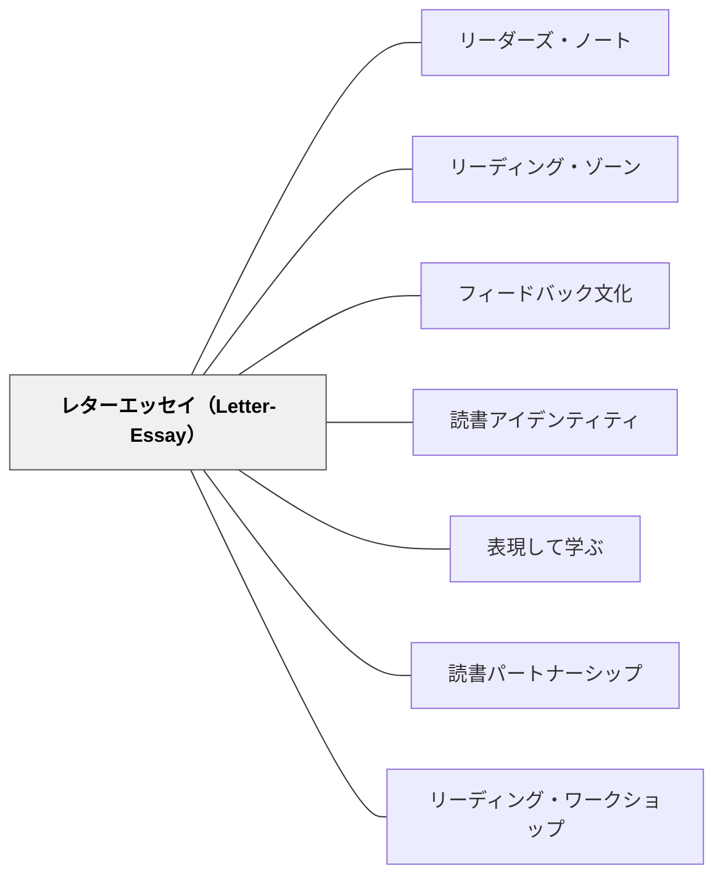

# レターエッセイ（Letter-Essay）

> 「感想文」ではなく「手紙」——読んでいる本について教師や友人に書くことで、読むことと書くことが一つの体験になる。

---

## Pattern Connection

**出典**: Atwell, N., & Atwell Merkel, A. (2016). *The Reading Zone* (2nd ed.). Scholastic.

- **既存パタンとの関連**：[[パタン/リーダーズ・ノート]]（Buckner, 2009ベース）との差分を明確にする。リーダーズ・ノートが読書中の思考を記録するツールであるのに対し、レターエッセイは読み終えた後（または読んでいる途中）に「誰か宛に書く手紙」として機能する。往復書簡の形式が、評価用記録を対話の場に変える。
- **補強された点**：Graham & Herbert（2010）の研究——「読書について書くことが読解を深める」——が実証的根拠として機能する。書くことが読みを整理し深める経路が、アトウェルの直観を理論で支える。[[パタン/表現して学ぶ]] と直結する。
- **修正・拡張された点**：教師だけでなくクラスメイトへの往復書簡（ピア・コレスポンデンス）も可能とすることで、読書コミュニティとしての広がりが生まれる。
- **他のパタンへの波及**：[[パタン/フィードバック文化]]（教師が返事を書くことで往復する）、[[パタン/読書アイデンティティ]]（書くことで読者としての自己像が言語化される）に波及する。

---

## 背景（Context）

アトウェルが最も重視する「読むことと書くことをつなぐ実践」がレターエッセイである。3年生以上を対象に、3週ごとに1通（最低3段落）書くことを原則とする。

形式は日記や読書感想文ではない。「○○先生へ」という書き出しで始まり、今読んでいる（または読み終えた）本について、考えたこと・批評・疑問・驚き・著者への注目を書く。教師はそれに対して手紙を返す——この往復が対話の場をつくる。

批評ジャーナル（marble composition notebook）を使用し、学習者は一冊のノートに往復書簡を積み重ねていく。学年を通じてこのノートが「読書者としての自分の歴史」になる。

## 問題（Problem）

読書記録は「書かされるもの」になりやすい。教師が評価するための記録シート・感想文・あらすじ要約——これらは読書体験から切り離された義務として学習者に受け取られる。

書くことが読む喜びを妨げる道具になると、読書時間が終わった瞬間に「あとで感想書かなきゃ」という負荷が生まれ、ゾーン体験を事後的に破壊する。

## 力のかたち（Forces）

- 「誰かに伝えたい」という動機は、「評価のために書く」動機より深い書きを引き出す
- 手紙という形式は「正解のある課題」ではなく「対話への招待」として受け取られやすい
- 教師が返事を書くことで、学習者の言葉が「読まれている」という実感が生まれる
- Writing-off-the-page（書き始める前の自由な走り書き）は、白紙への恐怖を下げる
- 段落スターター（I noticed... / I wonder... など）は、書き出しを提供することで書き始めを助ける
- ピア・コレスポンデンス（仲間への往復書簡）は、教師だけでなく読書コミュニティ全体を対話の相手にする
- Graham & Herbert（2010）の研究：読書について書くことが読解力を実証的に高める

## 解決（Solution）

**3週ごとに1通、今読んでいる（または読み終えた）本について、教師または友人宛の手紙を書く。評価シートではなく対話の記録として機能させる。**

---

### Writing-off-the-page：書く前の準備

レターエッセイを書く前に「Writing-off-the-page」（書き走り）を行う。

1. 白紙を用意し、制限時間（3〜5分）を設ける
2. 「この本について思ったこと・気になること・疑問・好きな場面」を何でも走り書きする
3. 文章として整える必要はない——断片的なメモ・箇条書き・落書きでよい
4. 走り書きをもとに、手紙の骨格を選ぶ

この「白紙への走り書き」が、レターエッセイを書く前の思考整理と書き始めへの恐怖除去を同時に行う。

---

### 段落スターター一覧

アトウェルが提示する書き出しの例：

- "I noticed..."（気づいたこと）
- "I wonder..."（疑問・問い）
- "I was confused when..."（混乱した場面）
- "My favorite part was..."（好きな場面）
- "This reminded me of..."（思い出したこと・比較）
- "I think the author..."（著者の意図・技法への注目）
- "The main character..."（登場人物への反応）
- "Something important I noticed about the writing..."（文体・語り口への気づき）

これらは「書き出し」であり、書いた後にどこへでも展開してよい。学習者はこのリストから自分の書きたいことに最も近い書き出しを選ぶ。

---

### 実際のやりとり例

**Sydneyが詩集について書いたレターエッセイ（抜粋・意訳）：**

「○○先生へ。今週は詩集を読みました。最初は詩って難しいと思っていたけど、ヒューズの詩を読んで『言葉ってこんなに少ないのに、こんなに多くを言えるんだ』と思いました。特に——という詩の『——』という一行が頭から離れません。なぜこの言葉を選んだのか、著者に聞いてみたいです。」

教師の返信：「Sydneyへ。ヒューズのあの一行に気づいてくれたことが嬉しい。あの詩には——という背景があって……。次はヒューズの——を読んでみて。」

---

### ピア・コレスポンデンス

教師だけでなく、クラスメイトへの往復書簡も行う。

- 同じジャンルを読んでいる友人に手紙を書く
- 手紙を受け取った友人が返事を書く
- 複数の往復が重なることで「読書について話し合う共同体」が自然に形成される

---

### 頻度と量

- 3年生以上：3週ごとに1通
- 最低3段落
- 形式：「○○先生へ」または「○○へ」で始まり、署名で終わる
- 教師は1週間以内に返信を書く（遅れると対話感が失われる）

## 結果（Consequences）

- 書くことで読みが整理され、ゾーン体験が言語化・定着する
- 教師が返事を書くことで、学習者の言葉が「読まれている」実感が生まれる
- 学年を通じてノートに蓄積された往復書簡が、読書者としての成長の記録になる
- 「評価のために書く」から「伝えたいから書く」への転換が、書くことへの抵抗を下げる
- ただし、教師が返信を続けることへの負荷があるため、ピア・コレスポンデンスとの組み合わせが現実的なバランスをとる

## 関連パタン

- [[パタン/リーダーズ・ノート]] — 読書中の思考記録 vs. 読後の対話という差分で整理する
- [[パタン/リーディング・ゾーン]] — ゾーン体験を言語化・定着させる道具
- [[パタン/フィードバック文化]] — 教師が手紙を返すことで往復する対話の場
- [[パタン/読書アイデンティティ]] — 書くことで読者としての自己像が言語化される
- [[パタン/表現して学ぶ]] — 読みを書きに変換することで理解が深まる
- [[パタン/読書パートナーシップ]] — 前提: 口頭で本について語り合う経験が、手紙で読書を対話する土台になる
- [[パタン/リーディング・ワークショップ]] — 前提: 継続的な読む時間・選書・共有があることで、手紙に書く読書体験が蓄積される

---

## クラスター図

## Actionable Insight

- 今週の読書記録の書き出しを「○○先生へ」に変えてみる——形式だけ変えても、学習者の書き方に「誰かに伝える」感覚が生まれる
- 「書く前に3分だけ何でも書きなぐる」（Writing-off-the-page）を一度試させる——「白紙が怖い」という状態を崩す最初の一手になる
- 段落スターターのリスト（"I noticed..."/"I wonder..."など）を印刷して配る——書き出しの選択肢があるだけで、最初の一文を書くハードルが大幅に下がる
- 教師自身がモデルとして一通書いてみせる——「先生も書く」という姿が、書くことへの招待になる

---

## 出典

Atwell, N., & Atwell Merkel, A. (2016). *The Reading Zone* (2nd ed.). Scholastic.

Graham, S., & Herbert, M. (2010). *Writing to read: Evidence for how writing can improve reading*. Carnegie Corporation of New York.

> 「読書について書くことは、読解力を高める最も確実な方法のひとつである。」——Graham & Herbert（2010）

[[文献/The Reading Zone（Atwell）]]
