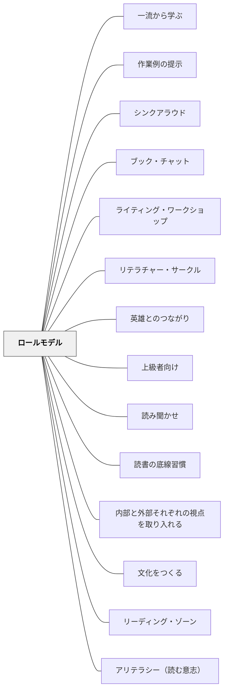

# ロールモデル

> 「高い人間とは、自分より高いものを自分の上に持っている人間にほかならぬ。

---

## Pattern Connection

**出典**: Atwell, N., & Atwell Merkel, A. (2016). *The Reading Zone* (2nd ed.). Scholastic.（統合：2026-05-17）

- **既存パタンとの関連**：本パタンの「手本となる人物」という核心は変わらないが、Atwell（2016）は読書指導の文脈で最も実証的なロールモデル実践の形を提示する——独立読書の時間に教師が自分の本を読む、という「同じ空間・同じ時間・同じ行為」のモデリング。歴史上の人物への精神的接続とは異なる、即時的で具体的な影響力を持つ
- **補強された点**：Atwell の生徒調査でゾーン条件の上位に「Teacher reads（先生が読む姿）」が挙がっている。「言葉で読書の価値を語る」よりも「実際に読んでいる姿を見せる」ことのほうが、学習者の読書意欲に直接働くことが実践で確認されている。Layne（2009）も「教師自身が読者であることを隠さないことが、アリテラシーへの最も強力な処方箋だ」と述べている
- **修正・拡張された点**：ロールモデルは「遠くにいる偉人・著名人」への接続だけでなく、「今・この教室で・先生が実際にやっている」という同時代・同空間のリアルなモデルとして機能する。読書指導では後者が前者より直接的に効く——「先生も今読んでいる本がある」「先生も読み終わった本を薦める」という日常の姿が積み重なることで、「読書は大人もやること」という文化的な常識が形成される
- **他のパタンへの波及**：[[パタン/アリテラシー（読む意志）]] — WILLを育てる最も強力な手立てとして「教師が読む姿」が位置づけられている。[[パタン/リーディング・ゾーン]] — ゾーン体験を共有する共同体の中で、教師のゾーン体験が最も力強いモデルになる

---

## 背景（Context）

「高い人間とは、自分より高いものを自分の上に持っている人間にほかならぬ。自分より

高いものを自分の上に持たぬという意味で絶対的なのは、ただ低い人間だけである」

（ジンメル『愛の断想・日々の断想』清水幾太郎訳、岩波文庫）

「理想を高くせよ、敢て野心大ならしめよとは云はず、理想なきものの言語動作を見よ、

醜陋の極なり、理想低き者の挙止容儀を観よ、美なる所なし、理想は見識より出づ、見識

は学問より生ず、学問をして人間が上等にならぬ位なら、初から無学で居る方がよし」夏

目漱石

ただ現実に追従する理想なき人生も世界も酷いものです。わたしたちは、自分の中にロー

ルモデルをもつことによって、ただ現実に流されていく儚い生き方ではなく、理想に向

かって生きることができるようになります。

## 問題（Problem）

学習者が学習の土台に乗れず、本来の教育の価値が届かない。

## 力のかたち（Forces）

- 教育者の意図と学習者の実態のギャップ
- 個々の状況に応じた柔軟な対応の必要性
- 経済性（無駄なコスト・苦しみを省く）の原理

## 解決（Solution）

理想がない。学ぶ意欲もない。人生の意味もわからない。

ロールモデルとは、手本となる人物のことだ。ロールモデルとなる人物は、身近な人物で
も、歴史上の人物でも、空想上の人物でも良い。例えば、身近な先輩がロールモデルとな
るかもしれない。または、イチローがロールモデルとなる人物かもしれないし、スヌー
ピーがロールモデルとなる人物かもしれない。自分で創り出したキャラクターがロールモ
デルとなることもあるだろう。

キエラン・イーガンの想像力を触発する教育には、「英雄とのつながり」という認知的道
具がある。英雄は、物事に意味を与え、被教育者の発達を促すものだ。英雄の中には、暴
力を体現している人物もいるが、ここで取り上げたい英雄は、優れた人間的特質を並外れ
てもっている人物のことだ。学問の世界でも、医療の世界でも、どのようなテーマの世界
でも英雄を見出すことができる。

フィンランドキッズスキルには、「味方になってくれるヒーローを選ぶ」というステップ
がある。ヒーローは、学習のさまざまな局面で励まし、自信や勇気を与えてくれる存在と
なる。

ロールモデルに導く伴侶となれ

♡♡♡

ロールモデルがあることによって、ただ現実に流される人生になってしまうリスクを少な
くすることができる。

参考文献
キエラン・イーガン（２０１０）『想像力を触発する教育　認知的道具を活かした授業づ
くり』北大路書房

ベン・ファーマン（２００８）『フィンランド式キッズスキル親子で楽しく問題解決』ダ
イアモンド社

## 結果（Consequences）

- 学習者の力能（なしうる力）が増大する
- パタンの圧縮による教育の経済性が実現する
- 関連パタンと重ね合わせることで効果が高まる

## 関連パタン
- [[実践/ローベルみたいな物語を書こう]]
- [[実践/言葉をよりすぐって俳句を作ろう]]
- [[実践/俳句と短歌を楽しもう]]
- [[パタン/一流から学ぶ]]
- [[パタン/作業例の提示]]
- [[パタン/シンクアラウド]]
- [[パタン/ブック・チャット]]
- [[パタン/ライティング・ワークショップ]]
- [[パタン/リテラチャー・サークル]]
- [[パタン/英雄とのつながり]]
- [[パタン/上級者向け]]
- [[パタン/読み聞かせ]]
- [[パタン/読書の底線習慣]]
- [[パタン/内部と外部それぞれの視点を取り入れる]]
- [[パタン/文化をつくる]]

- [[概念/パタン・ランゲージ概論]]
- [[パタン/リーディング・ゾーン]] — 読書ゾーン条件の上位に「Teacher reads（先生が読む姿）」——最も強力な読書ロールモデル
- [[パタン/アリテラシー（読む意志）]] — 読む意志（WILL）を育てる最も強力な手立ては、教師が読書を楽しんでいる姿を見せること（Layne, 2009 / Atwell, 2016）
- [[パタン/読書アイデンティティ]] — 「読書が楽しそうな大人のモデル」が学習者の読書アイデンティティに直接影響する（Willingham, 2015）

## クラスター図

## Actionable Insight

- 今の学習内容に関わる「この人なら何というか」という問いを立てる——歴史上の人物や著名人を媒介にすることで学習内容に感情的なつながりが生まれる
- クラスの子どもの中で「○○が上手な子」を毎週1人、具体的な行動で紹介する——身近な仲間がロールモデルになる
- 「あなたのロールモデルは誰？なぜ？」を書く機会を年度初めに設ける——子どもたちが自分の価値観を言語化する起点になる
- **読書ロールモデルとして**：独立読書の時間に採点や会議資料の整理ではなく自分の本を読む——「先生も今楽しく読んでいる」という姿が、読書への最も強力なモデルになる（Atwell, 2016）

## 出典
- [[文献/一つの教育のパタン・ランゲージ]]

岩井輝久「岩井輝久『一つの教育のパタン・ランゲージ』」（2026-04-29 vault収録）

Atwell, N., & Atwell Merkel, A. (2016). *The Reading Zone* (2nd ed.). Scholastic.

Layne, S. L. (2009). *Igniting a Passion for Reading*. Stenhouse Publishers.

[[文献/The Reading Zone（Atwell）]]
