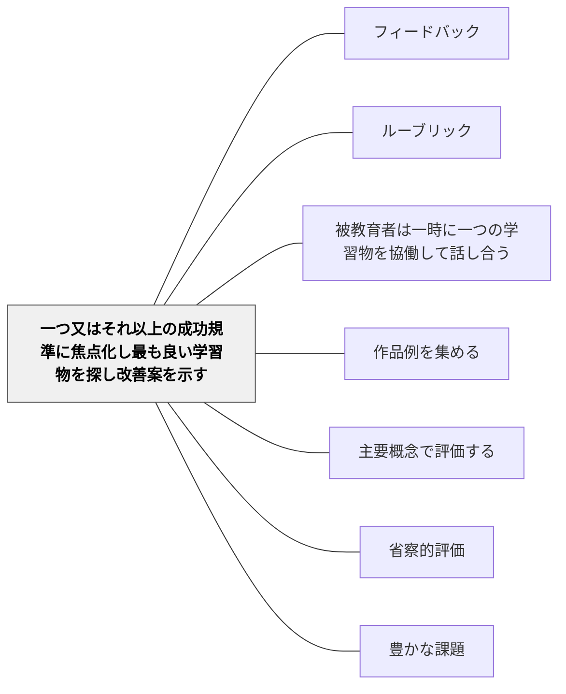

# 一つ又はそれ以上の成功規準に焦点化し最も良い学習物を探し改善案を示す

> すべてを同時に見ようとすると、何も見えない。一つに絞ることで、本質が見えてくる。

## 背景（Context）

学習物の批評において、「全体的に何が良いか」という漠然とした視点よりも、「この成功規準においてどれが最もよく達成されているか」という焦点化した視点の方が、学習者に具体的な気づきをもたらす。一つの規準に絞ることで、学習者は「この点に関して最高水準とはどういうものか」を深く理解できる。

シャーリー・クラークは、特定の成功規準に焦点を当てた批評を通じて、学習者全員が同じ観点から学習物を見る経験を積むことを重視している。これは評価の「眼」を育てる実践でもある。

## 問題（Problem）

学習物の批評が「全体的な良し悪し」の議論に終始すると、何を基準にして評価しているのかが曖昧になる。学習者は「なんとなく良い」「なんとなく悪い」という感覚的な評価しかできず、自分の作品の改善に具体的に活かせない。

また、一度にすべての成功規準を評価しようとすると、各規準への注意が浅くなり、フィードバックの焦点が定まらない。

## 力のかたち（Forces）

- 一つの規準に焦点化すると深い議論が生まれるが、他の側面が見えなくなる
- 「最も良い」を選ぶ活動は競争を生むリスクがあるが、適切に枠組めば全員が学びの参加者になる
- 規準の数と具体性のバランスが、活動の実現可能性を左右する

## 解決（Solution）

事前にルーブリックや成功規準リストを学習者に示した上で、「今日はこの一つの規準に集中して見る」と宣言する。全員がその規準を念頭に置きながら複数の学習物を見渡し、「この規準において最も達成されている作品」を選ぶ。

選ばれた作品を全体に示し、「なぜこれが最も規準を満たしているか」を具体的に分析する。さらに「この作品がもっと良くなるとしたら」という改善案も全員で考え、成功規準を高いレベルで満たすために何が必要かを議論する。最後に、各自が自分の作品をその規準で見直し、改善する時間を設ける。

## 結果（Consequences）

- 成功規準についての具体的な共通理解がクラス全体で育まれる
- 学習者が「良い」の内実を言語化できるようになり、自己評価の精度が高まる
- 特定の規準における最高水準のイメージが共有され、全体の質が底上げされる

## 関連パタン

- [[パタン/フィードバック]] — 親パタン
- [[パタン/ルーブリック]] — 成功規準の体系的な記述として機能する
- [[パタン/被教育者は一時に一つの学習物を協働して話し合う]] — 一つの学習物への集中という原則を共有
- [[パタン/作品例を集める]] — 各規準における優れた作品例がアンカーとして機能する

- [[パタン/主要概念で評価する]] — 成功規準の焦点化が主要概念の評価と連動する
- [[パタン/省察的評価]] — 最良作品の分析が省察的な学習評価を生む
- [[パタン/豊かな課題]] — 成功規準が豊かな課題のゴール設計になる
## クラスター図

## Actionable Insight

- 「今日は論理の明確さという一つの規準だけで見る」と宣言してから批評を始める——一点に絞ることで議論の深さが増し全員が共通の眼を育てる
- その規準において「最も達成されている作品」をクラスで選び「なぜ」を分析する——「良さ」を言語化するプロセスが評価リテラシーを育てる
- 批評の最後に「この規準で自分の作品を見直して1点改善する」時間を3分設ける——集合的な学びを個人の改善に着地させる

## 出典

Clarke, S. (2014). *Outstanding Formative Assessment*. Hodder Education.
Clarke, S. (2005). *Formative Assessment in Action*. Hodder Murray.
