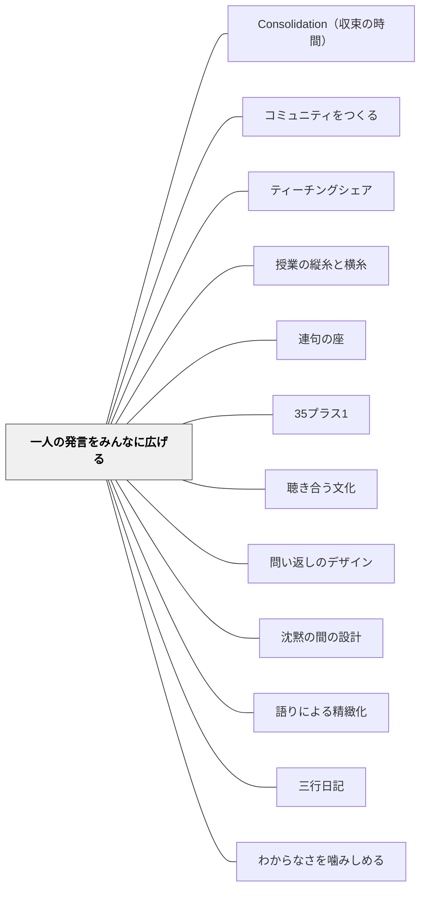

# 一人の発言をみんなに広げる

> 一人の言葉を、35人の思考材料にする。

## [Pattern Connection]

**小倉勝登（2020）全文再統合（2026-05-21）——対角線の立ち位置・4問い返しパターン・わからないフリ技：**

全文 OCR により、「立ち位置の変え方」と「問い返しの型」の具体的な根拠と応用が明らかになった。

**対角線の立ち位置（より具体的な根拠）**：発言者の**対角線上・最も遠い位置**に立つのは「私に聞こえるように言ってね」という一言と組み合わせることで機能する。教師が遠くにいることで、子どもは自然と声量を上げて全体に届く声で話す。さらに、対角線上に立つと**話し手と聞き手を含む全員を視野に収められる**——黒板正面に立っていると廊下側でうなずいたり首を振っている子に気づけない。

**日常的に使う問い返し4パターン**（授業中・休み時間を問わず）：
1. 「**ほかには、どう？**」——子どもの視野を広げる
2. 「**たとえば、どういうこと？**」——イメージを具体化する
3. 「**どこから、そう思ったの？**」——根拠を求める・話題を焦点化する
4. 「**つまり、どういうこと？**」——掘り下げる

**「子どもの言葉を子どもに解説してもらう」技**：
- 教師がわかった（つもりで）説明してしまうと、教師一人限りの理解になる
- 「よくわからなかったから、もう一度教えてもらえる？」と発言者に返す
- それでもわからなければ「Aさんが何が言いたかったのか、わかる人いる？」と全体に振る
- 代弁者が出たら「Aさん、そういうことでいいのかな？」と確認する

**「わからないフリ」技（応用）**：本当はわかっていても**わからないフリをする**——「（本当はわかっているけど）よくわからなかったので、もっと詳しくみんなに教えてくれない？」。説明力向上・相手意識が高まる。教師がわからないフリをすることで、「先生に説明する」から「全員に伝わるように話す」へと意図が変わる。

- **補強された点**：「立ち位置の対角線」は単なるポジション論でなく「全員を視野に収める」という観察設計の根拠があった。「わからないフリ」は高度な応用技術——信頼関係が前提。
- **他のパタンへの波及**：[[パタン/授業の縦糸と横糸]] — 「かかわり合いながら学ぶ」場面での話し言葉の型（つまり/たとえば/なぜなら/Aさんと関連して）と連動する。[[パタン/非可視の教師]] — 「子どもの言葉は子どもに解説してもらう」技は、教師が唯一の情報源でなくなるパタンの実践形。

---

## 背景（Context）

教室での発言は、本来、学級全員にとっての材料になりうる。しかし教師の立ち位置・視線・問い返しによっては、発言した子どもと教師の1対1の会話として終わり、他の子どもは「観客」になる。授業が「答え合わせ」になるとき、この傾向が強まる。

小倉勝登は「発問と発言は解答のやりとりではなく、教師と子どもの会話である」という認識から、1×1（教師と一人の子どもの対話）を1×35（学級全員の思考）に広げる技術を実践している。

## 問題（Problem）

一人の子どもが発言しても、その内容が他の子どもに届かないままになる。教師が「正解か不正解か」で発言を処理するとき、他の子どもは自分が当たっているかを確認するだけで、仲間の考えを受け取らない。発言が重なっていかず、対話が生まれない。

## 力のかたち（Forces）

- 教師の視線・体の向きは子どもの視線を誘導する：教師が発言者に向かったまま話すと、全員が発言者ではなく教師を見る
- 「正解か否か」の確認が主目的になると、発言は競争の道具になり、仲間の考えを真剣に聞く動機が薄れる
- 一人の発言を全体化するには、発言の後に「みんなはどう思う？」という問いと沈黙の間が必要で、時間の余裕がないと省略されやすい
- 子どもが「自分の発言がクラス全体の思考を動かした」と感じると、発言する意義が変わる

## 解決（Solution）

**教師の立ち位置を変えることで、発言者への視線をクラス全体に分散させる。**

小倉の実践：

1. **立ち位置の移動**：子どもが発言しているとき、教師はその子どもの横か斜め後ろに移動する。こうすると、他の子どもの視線は「発言者」に向かい、教師は「受け取る側」になる。
2. **問い返しの向き先を変える**：「○○さんが言ってくれたこと、聞こえた？」「○○さんの考え、どう思う？」と発言を他の全員への問いにする。教師が「合ってる・違う」と言う前に、全体に問いを投げる。
3. **沈黙を待つ**：全体への問いかけの後、少なくとも3〜5秒待つ。この沈黙が他の子どもの思考を動かす。
4. **つなぎことば**：「なるほど、○○さんはそう考えた。この考えについて、付け足したいこと・別の見方がある人は？」という言葉で、発言を「みんなの素材」に変える。

**発問は「解答を求める行為」でなく「対話の入り口」として設計する：**

朝のスピーチにおいても同様。日直の子が1分間話した後、教師が「なぜ？」「どうして？」と問い続けることで、スピーチが「報告」でなく「対話」になる。この日常的な練習が、授業中の発問・発言を対話として機能させる下地になる。

## 結果（Consequences）

- 発言が「教師に向けた解答」でなく「学級全体への提案」として機能するようになる
- 子どもが仲間の発言を聞く理由ができ、傾聴の質が上がる
- 「一人の発言でクラスが動いた」という体験が、発言する意義と勇気を育てる
- 教師が「正解確認者」から「対話の促進者」に変わり、授業の空気が変わる

## クラスター図

## Actionable Insight

- 子どもが発言したとき、その子の横か斜め後ろに移動する——立ち位置を変えるだけで、他の全員の視線が発言者に向かい「クラス全員が聴く」状態が生まれる
- 「○○さんが言ってくれたこと、みんなはどう思う？」を発言の後に必ず挟む——教師が評価する前に全体に問うことで、発言が「解答の確認」ではなく「みんなの素材」になる
- 朝のスピーチで日直に「なぜ？」と3回問い続ける——これを習慣にすると、子どもは「問いを返してもらえる」ことを学び、授業中の発言を対話として構えるようになる

## 関連パタン
- [[実践/詩歌の授業（詩を書く・詩を読む）]]
- [[パタン/Consolidation（収束の時間）]]
- [[パタン/コミュニティをつくる]]
- [[パタン/ティーチングシェア]]
- [[パタン/授業の縦糸と横糸]]
- [[パタン/連句の座]]

- [[パタン/35プラス1]] — 全員参加の前提としての学級観
- [[パタン/聴き合う文化]] — 発言が届く前提としての傾聴の文化
- [[パタン/問い返しのデザイン]] — 発言を全体に広げる問いの技術
- [[パタン/沈黙の間の設計]] — 全体への問いかけの後に待つ時間の設計
- [[パタン/語りによる精緻化]] — 発言を言葉で深める
- [[パタン/三行日記]] — 日常の対話ルートが授業の発言に波及する
- [[パタン/わからなさを噛みしめる]] — 「ひとりの気づきをクラスみんなのものにする」技術が詩の読みでも機能する（近藤真）。一人が「てふてふ」の感触をつかんだとき、教師はその気づきを全体への問いに変える

## 出典
- [[文献/社会科教師の授業・学級づくり「仕掛け学」（小倉勝登）]]

小倉勝登（2020）『社会科教師の授業・学級づくり「仕掛け学」』東洋館出版社
