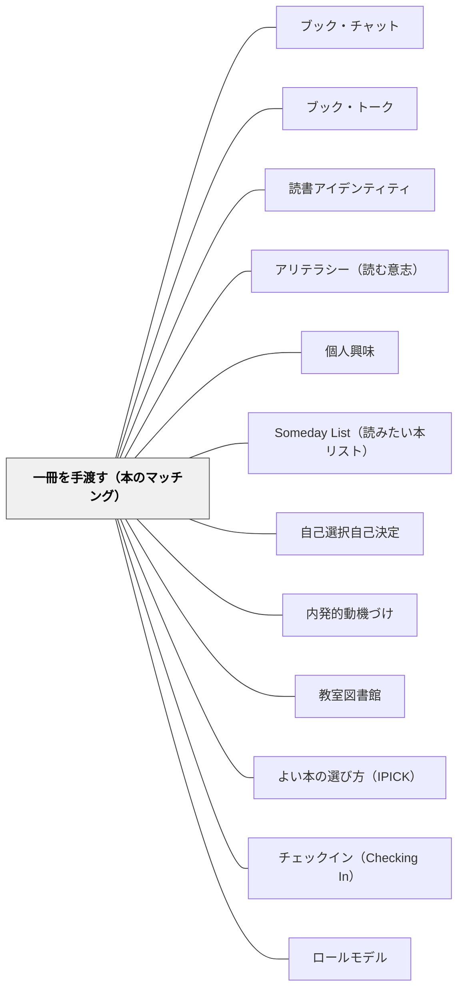

# 一冊を手渡す（本のマッチング）

> 「この本、あなたに合いそう」。一人の子に、その子のことを思って選んだ本を手渡す。評価はしない。感想の報告も求めない。

---

## Pattern Connection

**出典**: Layne, S. L.（2009）*Igniting a Passion for Reading*. Stenhouse. Chapter 2 "Coaches Who Know Their Players Win More Games"・Chapter 3・Chapter 6

- **既存パタンとの関連**：[[パタン/読書アイデンティティ]] の選書支援に挙がる「Book Matching（本のマッチング）」を、教師の行為として独立させたパタン。[[パタン/ブック・トーク]] と [[パタン/ブック・チャット]] がクラス全体の前での紹介であるのに対し、こちらは教師と一人の子のあいだで起きる
- **Layne の言い方**：Layne は、読み手と本を合わせることを、Lesesne（2003）のことばを借りて "match 'the right reader with the right book'" と書く。そして、本から遠ざかっている子に届く四語として "I thought of you." を挙げる
- **補強された点**：選書支援を「本を並べて待つ」環境づくりから、「その子の興味を知り、その子のために本を探して届ける」行為へ広げる。手がかりは本の好みより、年度はじめに聞いておく生活全体の興味である
- **他のパタンへの波及**：[[パタン/アリテラシー（読む意志）]] — 読めるのに読まない子への、いちばん個別の手立て。[[パタン/個人興味]] — その子の中にすでにある興味に、本をつなぐ

---

## 背景（Context）

教室には、読めるのに読まない子がいる（[[パタン/アリテラシー（読む意志）]]）。本棚を充実させても、クラス全体に本を紹介しても、「自分には関係ない」と感じている子は手を伸ばさない。

Layne（2009）は、子どもが聞く必要のある四つの語として "I thought of you."（あなたのことを思い出した）を挙げる。

> "But I'll tell you the four most important words that I think kids—our own and our students—need to hear. They are 'I thought of you.' Those words, supported with tangible evidence, can work miracles in the life of a disengaged reader."

Layne の例では、前の担任から「何にも興味がない」「読むことが大嫌い」と引き継がれた男の子が、実はオートバイに興味を持っていた。Layne はオートバイの雑誌、オートバイのノンフィクション、Beverly Cleary の *The Mouse and the Motorcycle* を持っていき、「これを見て、きみのことを思い出した。見てみる？」と差し出した。その子は束ごと受け取って居心地のいい場所を見つけて読みはじめ、図書館から二冊を借り、雑誌は何週間も「借りて」いった。Layne は、その日に二人の関係が固まったと書いている。

Layne がその子の興味を知っていたのは、年度の初日に興味調べ（interest inventory）をしていたからである（"I had given my students an interest inventory on the first day of school to find out a little bit about each one of them."）。

## 問題（Problem）

クラス全体への本の紹介（[[パタン/ブック・トーク]]、[[パタン/ブック・チャット]]）は、クラスの誰かに届けばよい。けれども、本から遠ざかっている子ほど、全体への紹介を自分に向けた話として聞かないことがある。

一方、個別に本を薦めると、それがすぐに「読んだら感想を書いてね」という課題に変わりやすい。課題になった贈りものは、読む気持ちに水をかける。

その子のために選んだことが伝わり、しかも課題にならない本の届け方をどうつくるか。

## 力のかたち（Forces）

- 選ばれたことそのものが伝わる——手渡された本が、教師がその子のために時間を使った証拠になる（"supported with tangible evidence"）
- 手がかりは本の好みより生活全体の興味にある——本が嫌いな子は、好きな本を聞かれても答えられない
- 本に限らない——雑誌やノンフィクションも、最初の一冊になりうる
- 感想や報告を求めると、贈りものが課題になる
- 全員には届けられない——教師の時間には限りがある
- 押しつけと紙一重——受け取らなくてもいい、合わなければ返していい、という余地が要る
- 教師が本を知らなければ手渡せない——子ども向けの本を読んでおく必要がある

## 解決（Solution）

**年度はじめに、本に限らず生活全体の興味を聞いておく。本から遠ざかっている子を見つけたら、その子の興味に合う本（雑誌やノンフィクションも含めて）を探し、「あなたのことを思い出した」と一人に手渡す。評価はしない。感想の報告も求めない。**

---

### 1. 興味を聞く（年度はじめ）

Layne は年度の初日に興味調べを配る。授業時間は数分しか使わない。型は二つある。

- **選択肢からしるしをつける型**：動物・スポーツ・音楽・ダンス・コンピュータ・昆虫・宇宙・探偵……の中から、好きなもの、もっと知りたいものにしるしをつける。幼い子には、同じ用紙を投影して一つずつ読み上げ、しるしのつけ方を助ける
- **質問に答える型**：「ひまなとき何をしている？」「どんな映画が好き？」「好きなスポーツは？」「生きている人でも昔の人でも、会えるなら誰に会いたい？」など。子どもには本と関係なさそうに見えるが、Layne はどの問いも本につながると言う。会いたい人の答えがあれば、その人の伝記を探しに行ける

---

### 2. 手渡す相手を決める

Layne は、興味調べの用紙をファイルにしまい、それから数週間、本からいちばん遠ざかっている子を観察して見つける。全員には手が回らないので、助けがいちばん要る子を選び、学校司書と一緒に、その子の興味に合う読みもの（本に限らない）をできるだけ集める。四半期ごとに少なくとも二人を目標にしている。

---

### 3. 手渡す

Layne は、ことばと行いの両方で "I thought of you." を伝えるという（"deliver the message in both word and deed: I (We) thought of you."）。なぜその子に渡すのかという理由が、ことばと、手渡す本そのものの両方で伝わる。

場面は決めなくていい。たとえば廊下で、休み時間に、朝の準備中に、会話の流れで数十秒。かける言葉は、たとえばこうである。

```
「この本、あなたに合いそうだと思って」
「サッカーの話が出てくるの。好きだったよね」
「最初の三ページだけ読んでみて。合わなかったら返してくれていいよ」
```

---

### 4. 感想を求めない

手渡しは、渡したところで完結する。「どうだった？」とこちらから聞かない。記録や評価に結びつけない。

ただし、子どものほうから「面白かった」と言いに来たら、全力で受け取る。「じゃあ次はこれ」と、次の一冊につながる。

---

### 5. 手渡せる本を増やしておく

Layne は、子ども向けの本を一冊読むたびに、それがいつ出会うかもしれない誰かにとっての「ちょうどいい本」になりうると考えている（"I know that each one I read could be the 'just right book' for a boy or girl who could cross my path at any moment, and I want to be ready."）。担任でなくても、子どもが本のおすすめを聞きに来る大人の一人になることを、目標に挙げている。

「この本はどんな子に合うだろう」と考えながら読み、薦められる本の手持ちを増やしておく。

---

### 手渡しが届きにくいとき

| 起きていること | 手当て |
|---|---|
| その子の興味を知らずに薦めている | まず興味調べか雑談で「この子は何が好きか」を知る |
| 薦めたあとに感想を求めている | 感想なし・評価なしを徹底する |
| 教師自身が、その本を楽しんでいない | 自分が本当に面白いと思った本しか薦めない |
| 毎回同じ子にしか薦めていない | 「今週、まだ薦めていないのは誰か」を意識する。名簿にしるしをつけて見る |
| 手渡せる本が手元にない | 学校司書に相談する。小さくてもいいので教室に本の置き場を作る |

---

### 全体への紹介との違い

| | 全体への紹介（[[パタン/ブック・トーク]]・[[パタン/ブック・チャット]]） | 一冊を手渡す |
|---|---|---|
| 誰が誰に | 教師（または子ども）→ クラス全体 | 教師 → 一人の子 |
| 形 | 決まった組み立てがある | 決まった形はない |
| 選ぶ基準 | 紹介する人が薦めたい本 | その子の興味 |
| その後 | 聞いた子が自分で選ぶ | 評価なし・報告なし |

## 結果（Consequences）

- 本から遠ざかっていた子にとって、最初の一歩になる。Layne の例では、本を受け取った日に教師と子どもの関係が固まった
- 「先生は自分のことを知っている」という感覚が、次の本を受け取る下地になる
- 子どものほうから「次の本」を求めに来るようになると、手渡しが続いていく
- 興味調べで知ったことは、ほかの指導の場面でも使える
- **注意**：毎回うまくいくわけではない。Layne も、選んだ本をどの子も全部読むとは言えない、と断っている（"I won't make the claim that every kid will read everything you select."）。それでも、誰かに届くたびに、何もしないよりは多くのことをしている、と Layne は書く
- **注意**：薦めやすい子に偏りやすい。薦めにくい子ほど、薦められた経験が少ない
- **注意**：感想や記録を求めた瞬間に、手渡しは課題に変わる

## 関連パタン

- [[パタン/ブック・チャット]] — クラス全体の前での6〜8分の本の紹介（Layne）。手渡しはその個別版ではなく、一人のための別の手立て
- [[パタン/ブック・トーク]] — クラス全体の前での1〜2分の本の紹介（Atwell）。全体への出会いと、一人への接続を組み合わせる
- [[パタン/読書アイデンティティ]] — 選書支援の「Book Matching」を行為にしたもの。合う本との出会いの累積が「自分は読む人だ」を育てる
- [[パタン/アリテラシー（読む意志）]] — 読めるのに読まない子への、いちばん個別の手立て
- [[パタン/個人興味]] — その子の中にすでにある興味（オートバイ、スポーツ……）に本をつなぐ
- [[パタン/Someday List（読みたい本リスト）]] — 手渡された本を今すぐ読まなくても、リストに書いておける
- [[パタン/自己選択自己決定]] — 手渡しは選択を奪わない。受け取るか、読むかは子どもが決める
- [[パタン/内発的動機づけ]] — 評価や報告を求めないことで、読む理由を本そのものに残す
- [[パタン/教室図書館]] — 手渡す本の在庫。手元に本がなければ手渡せない
- [[パタン/よい本の選び方（IPICK）]] — 自分で合う本を選ぶ力と、教師が一冊を差し出す支えが補い合う
- [[パタン/チェックイン（Checking In）]] — 毎日の短い確認で、読む本がない子・本から離れている子に気づく
- [[パタン/ロールモデル]] — 教師自身が子ども向けの本を読んでいることが、手渡しの前提になる
- [[実践/読書への情熱を育てる実践集]] — 年度はじめの興味調べから手渡しまでを年間計画に位置づける

## クラスター図



## Actionable Insight

- **年度はじめに、本に限らない興味調べを配る**——ひまなときにすること、好きなスポーツ、好きな映画、会ってみたい人。数分で済む
- **興味調べの用紙をファイルにしまい、数週間、本から遠ざかっている子を見る**——全員でなくていい。まず二人を選ぶ
- **その子の興味に合う本・雑誌を、学校司書と一緒に探す**
- **「これを見て、あなたのことを思い出した」と一人に手渡す**——感想も、読んだかどうかも聞かない
- **名簿に、今週だれに手渡したかのしるしをつける**——薦めにくい子が抜けていないかを見る

---

## 出典

Layne, S. L. (2009). *Igniting a Passion for Reading: Successful Strategies for Building Lifetime Readers*. Stenhouse Publishers.

> "As you have read in the earlier chapters, I advocate putting a lot of things in place to help match 'the right reader with the right book' (Lesesne 2003). One way to all but guarantee stronger discussions about independent reading choices is by doing everything we can to get kids the right books in the first place."
> — Layne（2009）Chapter 6

> "I think it's actually what has happened again and again when I've put the right book in the hands of the right reader, or when I've known just the right book to recommend to a student who's convinced there's nothing she'd like to read."
> — Layne（2009）Chapter 3

Lesesne, T. (2003). *Making the Match: The Right Book for the Right Reader at the Right Time, Grades 4–12*. Stenhouse.

[[文献/Igniting a Passion for Reading（Layne）]]
